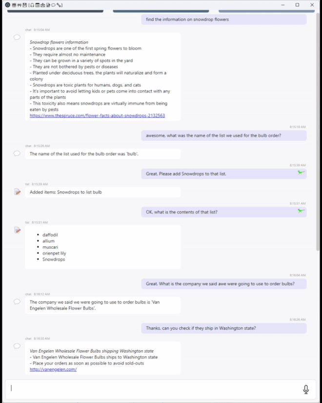

TypeAgent is sample code that explores an architecture for building a single personal agent with natural language interfaces leveraging current advances in LLM technology.

The goal of the TypeAgent team is to explore how to get work done by safely and efficiently combining stochastic systems like language models with traditional software components.  Three principles have emerged during this investigation.  They are listed below along with examples of how the principles apply to actions, memory and plans.

- **Principle:** distilling models into logical structures
  
  - Actions: find translation patterns and replace some model calls by applying patterns
  - Memory: build ontologies from text
  - Plans: people, programs and models collaborate using “tree of thought”
- **Principle:** control information density
  
  - Actions: applications define discrete categories with dense descriptions of action sets
  - Memory: tight semantic structures fit into attention budget
  - Plans: each search tree node defines a focused sub-problem
- **Principle:** use logical structures to enable collaboration
  
  - Actions: humans decide how to disambiguate action requests
  - Memory: simple models extract logical structure from text
  - Plans: quality models, advantage models, language models, humans and programs collaborate to expand each best-first-search node

We are trying to build a single personal agent that can apply to any application.  To apply agent interfaces to all applications, we need to map user requests to actions at much lower cost and latency than current systems.  To make this possible, we have created a system that can distill language models into logical systems that can handle most user requests.

*Figure 1: The TypeAgent shell example navigating a visually rich [paleodb](https://aka.ms/labs/typeagent/paleodb) website.*

We use LLMS with structured prompts to extract a logical representation of actions on a page (e.g. buy product). This logical schema is the same across multiple sites, even if the sites have different HTML and JS implementations. We demonstrate the power of this approach by building automation to interact with multiple crossword sites and multiple e-commerce sites using consistent logical schema.

We are trying to create human-like memory with super-human precision and recall for agent conversations.  We are using a new indexing and query processing called **Structured RAG** as the basis for agent memory.  Structured RAG does substantially better than Classic RAG at answering questions about past conversations such as "what were the books we talked about?" and "what step were we on in building the photo montage?"

*Figure 2: Here using the experimental TypeAgent Shell a user can have conversations with the agent about events and entities that were extracted months ago. Entities are pulled from long-term memory into the conversation memory and user can then take actions on the entities.*

Actions and memories flow together.  Actions like "add to my calendar pickleball game 2-3pm on Friday" yield memories that can become parameters of future actions like "put in an hour of recovery time after my pickleball game."  We are working on an architecture, **AMP**, that enables this natural information flow by integrating actions, memories, and plans. We are applying AMP to the web by creating a browser that enables web sites to register actions through a JavaScript interface.

## Getting Started

To get started with TypeAgent, check out the [Getting Started](/getting-started/) guide.

## Examples

TypeAgent includes several example agents:

- **List Agent**: A simple agent for managing lists
- **Calendar Agent**: An agent for managing calendar events
- **Email Agent**: An agent for composing and sending emails

Check out the [Examples](/examples/) section for more information.
