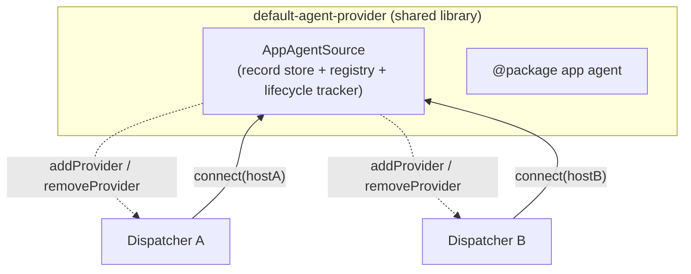

# Agent lifecycle — going live, propagating, and updating

> **Scope:** This document describes how an _acquired_ agent becomes runnable in
> a live dispatcher session: the `AppAgentSource` connection model, live
> registration, cross-session propagation, per-session enable policy, and the
> coordinated update/uninstall restart. For how an agent is discovered and
> acquired in the first place (sources, the registry, `agents.json`, feeds), see
> [Agent sources](./agent-sources.md). For the user-facing `@package` commands,
> see the
> [TypeAgent command reference](../../overview/command-reference.md#package-list---list-installed-agents).

## Overview

The set of agents a dispatcher can run is split by **how it changes**:

- The **static** set (bundled agents, MCP) is injected as plain
  `AppAgentProvider`s and never changes for the life of the session.
- The **dynamic** set (installed agents) is owned by a host-side
  `AppAgentSource`. A dispatcher _connects_ to the source; `connect()` returns the
  shared provider instances to register and hands the source a small callback
  (`AppAgentHost`) it uses to register/unregister agents as the set changes.



| Package                                                                                                              | Role                                                                                                                                                                                              |
| -------------------------------------------------------------------------------------------------------------------- | ------------------------------------------------------------------------------------------------------------------------------------------------------------------------------------------------- |
| [`agent-dispatcher`](https://github.com/microsoft/TypeAgent/blob/main/ts/packages/dispatcher/dispatcher)             | Defines `AppAgentSource`, `AppAgentConnection`, `AppAgentHost`; implements the dispatcher-side host (the idle-gated applicator) and the low-level `AppAgentManager.addProvider`/`removeProvider`. |
| [`default-agent-provider`](https://github.com/microsoft/TypeAgent/blob/main/ts/packages/defaultAgentProvider)        | Implements `AppAgentSource`: record store, per-name lifecycle tracker, fan-out registry, the `@package` app agent, and the update/uninstall barrier.                                              |
| [`dispatcher-node-providers`](https://github.com/microsoft/TypeAgent/blob/main/ts/packages/dispatcher/nodeProviders) | Refcounted npm provider (`createNpmAppAgentProvider`) whose `isLoaded` the barrier reads to verify a version is fully released.                                                                   |

## Design goals and non-goals

**Goals**

- A live install must reach **every** connected dispatcher in the process, not
  just the one that issued the command.
- One interface owns the dynamic set. The `AppAgentSource` _owns_ the record
  store + mutation and _provides_ read providers — one owner, not a read-provider
  plus a separate write-installer describing the same agents.
- Reuse the existing hosting path (`addProvider`) rather than inventing a new
  registration mechanism.

**Non-goals**

- **No cross-process fan-out.** An instance dir (and its `agents.json`) is held
  by a single process at a time; propagation is in-process only.
- **No multi-version coexistence.** Agent storage is keyed by name, so an update
  is a _restart_ of one shared process, not an overlapping swap.
- **The dispatcher cannot drive an install.** It is handed only the narrow
  `connect()` view; `install`/`uninstall`/`update` live on the host object.

## Interfaces

The interfaces live in
[`agentProvider.ts`](https://github.com/microsoft/TypeAgent/blob/main/ts/packages/dispatcher/dispatcher/src/agentProvider/agentProvider.ts).

**`AppAgentProvider`** stays a pure **read** contract (`getAppAgentNames` /
`getAppAgentManifest` / `loadAppAgent` / `unloadAppAgent`, plus optional
`isLoaded`). Bundled and MCP providers implement only this — nothing more.

**`AppAgentSource`** is the dynamic set. Its dispatcher-facing interface is just:

```ts
connect(host: AppAgentHost): AppAgentConnection;
```

`connect()` returns a teardown handle plus a promise of the **shared** provider
instances to register (`AppAgentConnection` — `{ providers, dispose }`).
Providers are shared singletons: every `connect()` resolves with the same
instance, so a loaded `AppAgent` is refcounted across all sessions rather than
cloned per session.

**`AppAgentHost`** is the dispatcher-side callback the source uses to mutate one
session's live agent set. It is the _only_ interface the source touches — it never
reaches into grammars, collision detection, or the embedding cache:

- `addProvider(provider, notify?)` — register an agent into this session.
- `removeProvider(provider, notify?, dropConfig?)` — unload and drop an agent.
- `replaceProvider(oldProvider, resolveReplacement)` — the coordinated teardown/swap
  primitive both `@update` and `@uninstall` fan out through (see
  [Update coordination](#update-coordination)).

Every op is applied through an **idle-gated FIFO applicator** and resolves when
the op is _applied_ — the ack the source's lifecycle tracker waits on.

## The host ↔ source contract

The dispatcher and the source meet at exactly two interfaces — the dispatcher
implements `AppAgentHost`, the source implements `AppAgentSource` /
`AppAgentConnection` — and each side owes the other a small set of guarantees. A
custom source (an embedder not using `default-agent-provider`) must uphold the
right-hand column; the dispatcher upholds the left.

| Stage                | The dispatcher (`AppAgentHost`) guarantees                                                                                                                    | The source (`AppAgentSource` / `AppAgentConnection`) must                                                                                                                                      |
| -------------------- | ------------------------------------------------------------------------------------------------------------------------------------------------------------- | ---------------------------------------------------------------------------------------------------------------------------------------------------------------------------------------------- |
| **Connect**          | calls `connect(host)` once per session, awaits the returned connection's `providers` under its held command lock, then registers them before serving          | return **shared singleton** providers (the same instances on every connect) through `providers: Promise<...>` and an idempotent `dispose()`; record `host` for later fan-out                   |
| **Mutate**           | applies `addProvider` / `removeProvider` / `replaceProvider` in **FIFO** order, gated on session idle, resolving each promise only once the op is **applied** | mutate a session **only** through its `AppAgentHost`; never reach into grammars, collision detection, or the dispatcher's context                                                              |
| **Coordinated swap** | runs `replaceProvider` as **one command-lock-held section** (remove → park on the replacement promise → add) so no request interleaves the swap               | resolve `replaceProvider`'s replacement promise only after every host has quiesced **and** the old version's shared refcount is verified `0` (see [Update coordination](#update-coordination)) |
| **Leaf ops**         | runs the teardown and startup legs under the held command lock                                                                                                | keep those legs **leaf ops** — process teardown/launch only, never dispatching a command or reacquiring the lock                                                                               |
| **Teardown**         | unregisters the providers from its own `AppAgentManager` and calls `dispose()`                                                                                | stop fanning out to a host once its connection is disposed; a fan-out that raced `dispose()` must no-op                                                                                        |

The interface definitions in
[`agentProvider.ts`](https://github.com/microsoft/TypeAgent/blob/main/ts/packages/dispatcher/dispatcher/src/agentProvider/agentProvider.ts)
carry these same requirements as per-member implementor notes.

## `@package` runs as its own app agent

The host contributes the entire `@package` command set
(`install`/`uninstall`/`update`/`list`/`source`) as its **own app agent**, not as
a subtree of the built-in `system` agent
([`installSources/packageAgent.ts`](https://github.com/microsoft/TypeAgent/blob/main/ts/packages/defaultAgentProvider/src/installSources/packageAgent.ts)).

This isolates host handlers from dispatcher internals. Command routing binds every command to its
owning agent's context: `@package …` resolves to the package agent, so its
`ActionContext.sessionContext.agentContext` is the **host's own** context — never
the dispatcher's `CommandHandlerContext`. A host handler therefore cannot cast
its way into dispatcher internals. The one dispatcher capability these handlers
legitimately need — mutating the live session — arrives through the narrow
`AppAgentHost` on the package agent's own `agentContext`, which is per-dispatcher
by construction, so a handler automatically reaches _its_ session with no lookup.

The package agent registers under the name `package`, is command-only (no
schema), and declares `commandDefaultEnabled: true` but is **not** in
`alwaysEnabledAgents` — so, unlike `system`, it can be toggled off via `@config`.

## Install / uninstall / update flow

A mutation resolves and writes the record **once** (the commit point), then fans
out to every connected dispatcher:

1. The `@package` handler resolves the ref against the registry and writes the
   `InstalledAgentRecord` to `agents.json`. Name uniqueness is a property of the
   store, validated here — before materialize.
2. The **issuing** dispatcher's op is awaited, so a registration error (e.g. a
   collision) surfaces synchronously to the user who ran the command.
3. **Sibling** dispatchers are notified best-effort and asynchronously (applied at
   each session's next idle); a per-client failure is logged, never failing the
   command. Collision detection degrades to a warning so an install can never
   crash an active session.

The record write is durable regardless of fan-out: once `agents.json` is updated,
the agent exists on the next restart even if a live registration failed.

## Enable-state policy across sessions

An installed agent **honors its manifest default**, exactly like a bundled agent:
each session derives enabled state as `config[name] ?? manifestDefault` via the
existing `setAppAgentStates` path. There is no forcing agents off and no
disabled-by-default wrapper — an agent whose manifest ships enabled is on
everywhere unless a user turned it off in that session, and a per-session
`@config agent` override always wins.

"No surprise" is delivered by **notification**, not by forcing state:

| Recipient                         | State on add                 | How it surfaces                                      |
| --------------------------------- | ---------------------------- | ---------------------------------------------------- |
| **Issuing** conversation          | `config ?? manifest default` | inline command result                                |
| **Sibling** conversation open now | `config ?? manifest default` | system message: _"Agent 'foo' was added — enabled."_ |
| **Offline** conversation          | `config ?? manifest default` | system message on next load (reconciliation)         |
| **Brand-new** conversation        | `config ?? manifest default` | silent (part of the baseline)                        |

If the resulting state is disabled, the message says so and how to enable:
_"Agent 'foo' was added — disabled (`@config agent foo` to enable)."_

**Load-time reconciliation.** Each session persists the set of agent names it has
already seen (`knownAgents`, static + dynamic). On load and on session switch it
reconciles that set against what is available now — _available & not known_ is an
add (adopt manifest default + notify), _known & not available_ is a remove
(notify). Deltas are summarized in one message when several change at once. This
covers both an agent installed while the conversation was closed and a new build
that added/removed **static** agents. A brand-new session records a silent
baseline.

**Removal disposition:** a reconciliation-removal (the agent is simply no longer
provided) leaves the session's persisted enable preference dormant, so a reinstall
honors the user's prior choice; an explicit `@uninstall` **drops** the config
entry so a fresh reinstall starts clean from the manifest default.

## Connection lifecycle

Dispatchers are created and torn down dynamically (per conversation, with grace
timers). The source must never fan out to a disposed dispatcher.

- **Connect** at context init: the dispatcher calls `source.connect(host)` for
  each injected `AppAgentSource`, awaits `connection.providers` under its held
  command lock, and registers the resolved providers so it neither loads a
  doomed version nor processes a command while an upgrading agent is mid-swap.
- **Disconnect** at teardown: the dispatcher unregisters those providers from its
  own manager and calls `connection.dispose()`, which removes this host from the
  fan-out registry. `dispose()` never tears down the shared providers — other
  sessions still hold them.
- **Idempotency / races:** `dispose()` is safe to call once; a fan-out that began
  before `dispose()` but lands after no-ops.
- **Web vs. server:** the web API builds a fresh source per dispatcher (one
  client); the agent server shares one source across all conversation
  dispatchers. Same code, no host-specific branching.

The initial set comes from the returned `connection.providers` (the normal pull);
`connect()`'s fan-out then delivers only _subsequent_ add/remove deltas, so
first-run behavior is identical to a static provider.

## Update coordination

An `@update` swaps an installed agent `v1 → v2`. Because agent storage is keyed
by name and shared across dispatchers, **two versions of a name must never run at
once** — an update is fundamentally a _restart of one shared process_, not an
overlapping swap. The mechanism lives in the source barrier
([`defaultAgentProviders.ts`](https://github.com/microsoft/TypeAgent/blob/main/ts/packages/defaultAgentProvider/src/defaultAgentProviders.ts))
plus the `replaceProvider` primitive on `AppAgentHost`.

### What the swap must guarantee

Because agent storage is name-keyed and shared, a correct swap has to keep two
things true on every dispatcher at once:

1. **No request is processed while the name is absent.** If a request lands while
   the name is unregistered, it slips to the wrong place: a `@foo …` command falls
   back to the `system` agent, and a natural-language request — which is routed to
   an agent only _after_ translation — is misrouted to whichever agent is still
   registered.
2. **All dispatchers move `v1 → v2` in lockstep.** Grammars are used during
   translation, so a dispatcher still on v1 grammars talking to a v2 process would
   mismatch. Every update is therefore treated as potentially schema-changing and
   freezes all dispatchers together across the swap.

The slip happens if update is applied as two separate applicator operations:
`removeProvider(v1)` acquires and releases the command lock, then
`addProvider(v2)` acquires it later after the shared process has drained. Any
request that arrives in that released gap sees the name and schemas as absent.
Commands bind through `isAppAgentName` / `isCommandEnabled`; natural-language
requests bind through active schema candidacy before execution. Both routing
seams must therefore continue to see a consistent agent set during the swap, and
only the local execution/instance handoff may be parked.

### The design: one command-lock-held section

Both guarantees fall out of running the entire local swap as a **single
`commandLock`-held section** — `remove v1 → wait for shared v2 ready → add v2`,
all under one acquisition. The command lock already gates every request, so the
swap is mutually exclusive with request processing: no request can observe the
name mid-swap, and every dispatcher is frozen for the duration. Nothing extra is
needed — no per-name gate, no park machinery, no tombstone; the lock the
dispatcher already holds does the work.

This is deliberately a session-wide hold, not a lighter per-name gate. Natural
language routing does not know its target until translation, and translation uses
the agent grammars being swapped, so a per-name gate would still have to hold NL
traffic. The command lock is the existing request boundary and keeps the routing
seams (`isAppAgentName`, active schemas, and execution) consistent through one
atomic local swap.

Structurally the held section is **`uninstall(v1)` immediately followed by
`install(v2)`** under one lock, so update reuses the uninstall/install primitives
rather than a custom state machine. Both `@update` and `@uninstall` fan out
through the one `replaceProvider(oldProvider, resolveReplacement)` primitive —
one op is one lock acquisition, so the whole freeze is a single awaitable unit.

### Sequence

```
Source (v1 still serving):
  1. materialize v2 on disk into its own version-scoped root (v1 untouched;
     a corrupt v2 fails here, cleanly aborting with v1 intact)

Quiesce + restart (each dispatcher holds its command lock across this):
  2. each dispatcher: drain in-flight v1, remove v1 artifacts,
     unloadAppAgent(v1) → decrement the shared refcount, ACK quiesced
  3. once all ACKs are in AND the shared v1 refcount is VERIFIED 0:
     start v2 (never overlap — shared name-keyed storage)
  4. each dispatcher (still holding its lock) swaps in v2 artifacts, releases

Result: foo routes to v2 everywhere; no request ever observed foo absent.
Prune v1 from disk only after success.
```

### Verify-0 — v1 must actually terminate

The v1 provider is a shared refcounted singleton; its process teardown
(`close()`) runs only when the refcount reaches 0. So quiesce calls
`unloadAppAgent(v1)` to decrement the count, and the barrier **explicitly
verifies the count is 0** (via the provider's `isLoaded`) before starting v2 —
it never infers termination from the quiesce ACKs alone. A lingering ref (a
straggler mid-request, a racing loader) blocks the barrier until it drains or the
timeout fires. With version-scoped roots (below), v1 and v2 are separate provider
instances with separate refcounts, so "v1 → 0 → close" and "v2 first load →
start" are a clean handoff.

### Timeout and rollback

The held wait spans a process restart, so it is **time-bounded** (a short quiesce
timeout, default 15s, configurable). Ordering keeps rollback clean: v1 stays
fully intact and restartable until v2 is confirmed serving. If the timeout fires
first, the barrier restarts v1, swaps v1 artifacts back in, releases the lock,
and discards v2 — as if the update never happened.

The outcome is decided **before** the parked hosts release: each host does exactly
one lock-held remove→add, adding whatever the barrier decided via a single
post-barrier thunk — v2 (commit), the original v1 (rollback), or nothing (a
committed uninstall). There is no second swap round, so no session transiently
runs v2 on a rolled-back update. The `agents.json` record is mutated only on
commit (write v2 / delete on uninstall), never before — so a crash mid-swap
recovers cleanly to v1 and the orphaned v2 root is reclaimed by the startup sweep.

The only structural startability check happens **before** the barrier, while v1
is still serving: install/update materialization validates that the new record's
manifest can be resolved and read, regardless of source kind. A corrupt feed,
catalog, or path candidate fails there and leaves v1 untouched. The barrier does
not fork a start probe for v2; after verify-0 passes it commits directly. A v2
that reads a manifest but later throws during `instantiate()` surfaces as the
ordinary per-session load failure path rather than rolling back.

Rollback is currently timeout-driven. A future user-facing cancel must use an
out-of-band abort path, not a queued command, because the command lock is held
during the freeze and a typed cancel command would wait behind the operation it
is trying to cancel. It also needs a long-lived abort source keyed by the
in-flight agent update rather than the issuing command's short-lived abort
signal.

### Version-scoped install roots

Non-destructive materialize requires v2 to land without touching v1. `path` and
`catalog` are already non-destructive; `feed` is not, because `npm install` into
a shared package dir overwrites in place. So every feed agent materializes into a
**content-addressed, version-scoped root** keyed by `sanitize(module)@version`
(`installDir/agents/<module>@<version>/node_modules/…`):

- Two installs resolving to the same package+version share one root — the second
  materialize is an idempotent no-op, so a same-version update skips the
  disruptive swap entirely.
- A new version lands in its own root alongside the still-running old one; the old
  root is pruned only after a successful swap and only once no remaining
  `agents.json` record references it (refcounted GC; a startup orphan sweep
  reconciles crashed updates).
- The slow path installs into a unique temp root and atomically renames on
  success, so a crash never leaves a usable-looking partial root.

The record carries the `installRoot`, and the provider derives its require-root
from it. The trade-off is losing npm's cross-package dependency hoisting (each
package+version carries its own deps) in exchange for isolation, determinism, and
clean rollback.

### Async status

Because the swap spans a cross-session restart, `@update` and `@uninstall` cannot
block the command lock waiting on it. The issuing session enqueues the op like a
sibling and returns _"update started"_; the terminal outcome is delivered later
through a one-shot `onOutcome(status)` callback (`updated`/`reverted` for update,
`uninstalled`/`reverted` for uninstall) that the `@package` handler maps to a
follow-up status line. This removes the inline "immediate" apply path; every
op on every dispatcher now flows through the one idle-gated queue.

### Failure semantics and edge cases

- **Record write is the commit point.** Fan-out is best-effort notification after
  it.
- **Issuing client** is awaited; failure is reported but the record is still
  committed.
- **Sibling clients** each apply independently; a throw is caught and logged per
  client.
- **Leaf-op invariant:** teardown (`unload`/`close`) and startup (`load`/`init`)
  run under the held command lock and must be leaf ops — never dispatch a command
  or reacquire the lock, or the freeze would deadlock.
- **Disconnect mid-barrier:** the host is dropped from the barrier and its op
  auto-acks; a `dispose()` re-polls the verify-0 check so a clean disconnect
  commits instead of stalling to the timeout.
- **Close ordering matters:** dispatcher teardown first disposes the local
  applicator so queued operations auto-ack, then removes the connected providers
  from the local manager (dropping the shared v1 refcount), and only then disposes
  the source connection. That final source-side dispose re-polls verify-0, which
  closes the race where an auto-ack emptied the pending set before the local
  unload decremented the last v1 ref.
- **Name reuse during teardown:** a name that is mid-`removing` is off-limits to a
  new user op until the barrier completes.

## Implementation map

| Concern                                                             | File                                                                                                                                                                   |
| ------------------------------------------------------------------- | ---------------------------------------------------------------------------------------------------------------------------------------------------------------------- |
| `AppAgentHost` / `AppAgentSource` / `AppAgentConnection` interfaces | [`agentProvider.ts`](https://github.com/microsoft/TypeAgent/blob/main/ts/packages/dispatcher/dispatcher/src/agentProvider/agentProvider.ts)                            |
| Idle-gated FIFO applicator                                          | [`context/appAgentHost.ts`](https://github.com/microsoft/TypeAgent/blob/main/ts/packages/dispatcher/dispatcher/src/context/appAgentHost.ts)                            |
| Applicator wiring, `commandLock`, connect/teardown                  | [`context/commandHandlerContext.ts`](https://github.com/microsoft/TypeAgent/blob/main/ts/packages/dispatcher/dispatcher/src/context/commandHandlerContext.ts)          |
| `addProvider` / `removeProvider` / lazy load                        | [`context/appAgentManager.ts`](https://github.com/microsoft/TypeAgent/blob/main/ts/packages/dispatcher/dispatcher/src/context/appAgentManager.ts)                      |
| Refcounted npm provider (`isLoaded`, `close()`)                     | [`nodeProviders/.../npmAgentProvider.ts`](https://github.com/microsoft/TypeAgent/blob/main/ts/packages/dispatcher/nodeProviders/src/agentProvider/npmAgentProvider.ts) |
| Per-name lifecycle tracker + install/uninstall/update + barrier     | [`defaultAgentProviders.ts`](https://github.com/microsoft/TypeAgent/blob/main/ts/packages/defaultAgentProvider/src/defaultAgentProviders.ts)                           |
| `@package` app agent handlers                                       | [`installSources/packageAgent.ts`](https://github.com/microsoft/TypeAgent/blob/main/ts/packages/defaultAgentProvider/src/installSources/packageAgent.ts)               |
| Installed-agent provider building + `agents.json` store             | [`installSources/installedAgents.ts`](https://github.com/microsoft/TypeAgent/blob/main/ts/packages/defaultAgentProvider/src/installSources/installedAgents.ts)         |

## Related

- [Agent sources](./agent-sources.md) — discovering and acquiring the agent an
  installed record points at.
- [Embedding the dispatcher](../../guides/embedding-dispatcher.md) — wiring
  `appAgentProviders` and `appAgentSources` into a host.
- [Dispatcher](../core/dispatcher.md) — command routing and the `AppAgentManager`
  the applicator drives.
- [Agent-server conversations](../agents/agentServerConversations.md) — how one
  shared source serves many per-conversation dispatchers.
