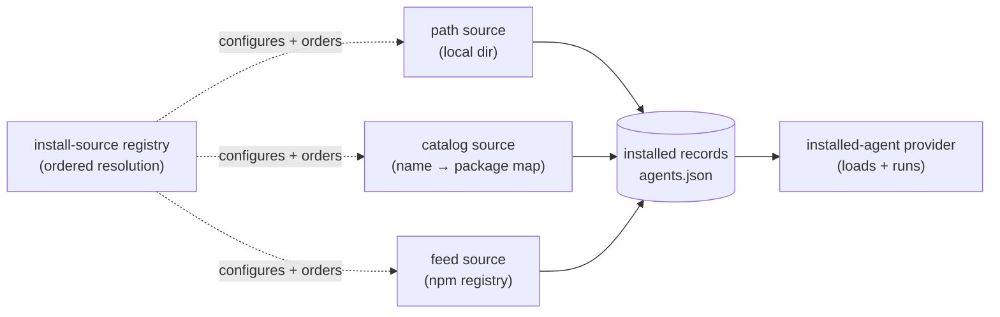

# Agent sources — where agents come from

> **Scope:** This document describes how the dispatcher **discovers and acquires**
> an application agent — the install-source model, ordered resolution, the
> `agents.json` record store, and the feed/npm plumbing. For how an acquired
> agent is registered into a live session, propagated across dispatchers, and
> updated, see [Agent lifecycle](./agent-lifecycle.md). For the user-facing
> `@package` command syntax, see the
> [Agent Install Sources reference](https://github.com/microsoft/TypeAgent/blob/main/docs/content/reference/install-sources.md).

## Overview

Everything an agent can come from is an **install source**. Every agent the
dispatcher runs — whether it shipped with the app, was installed from a local
directory, or was pulled from a package feed — is an **installed record** loaded
by a single provider. A source _acquires and records_ an agent once; a provider
_loads and runs_ it for the session lifetime. The two concerns are separate:
no source kind ever loads an agent, and the provider never reaches back into a
source.



| Package                                                                                                              | Role                                                                                                                                             |
| -------------------------------------------------------------------------------------------------------------------- | ------------------------------------------------------------------------------------------------------------------------------------------------ |
| [`agent-dispatcher`](https://github.com/microsoft/TypeAgent/blob/main/ts/packages/dispatcher/dispatcher)             | Defines the `AppAgentProvider` read contract and the `AppAgentSource` connection contract. Knows **nothing** about sources, feeds, npm, or `az`. |
| [`default-agent-provider`](https://github.com/microsoft/TypeAgent/blob/main/ts/packages/defaultAgentProvider)        | Owns the source kinds, the registry, the record store, feed auth/enumeration, and the `@package` commands.                                       |
| [`dispatcher-node-providers`](https://github.com/microsoft/TypeAgent/blob/main/ts/packages/dispatcher/nodeProviders) | The npm/path loading mechanism (`createNpmAppAgentProvider`) both bundled and installed agents resolve through.                                  |

This split is deliberate: the interfaces live in `agent-dispatcher`; the
feed/npm/Azure implementation lives in `default-agent-provider`. A host that does
not want the source machinery never pulls in Azure DevOps, npm, or `az`.

## Design goals and non-goals

**Goals**

- Make the install source **explicit and named** — every installed agent records
  where it came from, and an unqualified install resolves against a
  user-configurable, ordered list of sources.
- Handle "bundled vs. external" and "npm vs. path" with **one provider loading
  one record shape**, regardless of origin.
- Let a local development build **shadow** a published agent simply by ordering a
  `path`/`catalog` source ahead of a `feed`.

**Non-goals**

- **MCP agents are out of scope.** MCP servers are _configured_, not _installed_,
  and keep their own provider (`createMcpAppAgentProvider`).
- **No remote catalogs.** A `catalog` source points at a local JSON file, never a
  URL.
- **No blue-green / multi-version coexistence.** Agent storage is keyed by agent
  name, so only one version of a name runs at a time (see
  [Agent lifecycle › update coordination](./agent-lifecycle.md#update-coordination)).

## Source kinds

Three kinds. All resolve an agent into the same `InstalledAgentRecord`; they
differ only in how they acquire it and how cheaply they can answer _"can I
resolve this `ref`?"_.

| Kind      | Acquires by                                    | `ref` means          | `find` cost          | Enumerable  |
| --------- | ---------------------------------------------- | -------------------- | -------------------- | ----------- |
| `path`    | validating a filesystem path the user supplies | filesystem path      | stat (instant)       | no          |
| `catalog` | looking up a JSON list, recording a path       | agent short name     | map lookup (instant) | yes         |
| `feed`    | `npm install` against an Azure Artifacts feed  | npm specifier / name | registry metadata    | cached list |

There is **no separate `builtin` kind**. The agents the app ships with are a
static bundled provider ([`getDefaultAppAgentProviders`](https://github.com/microsoft/TypeAgent/blob/main/ts/packages/defaultAgentProvider/src/defaultAgentProviders.ts)),
never installed or uninstalled. Installed agents are the _dynamic_ set, and they
are what sources produce.

`path` is a regular ordered source, not a special case. A `path` source
placed early simply claims `ref`s that exist on disk before any later source is
probed.

A `catalog` source points at a JSON file that maps agent short names to
packages — it can live in a repo or anywhere on disk:

```jsonc
// e.g. agents.catalog.json
{
  "agents": {
    "echo": { "path": "../agents/echo" },
    "player": { "name": "@company/player-agent", "execMode": "separate" },
  },
}
```

Nothing in a catalog is installed automatically; a catalog only resolves a short
name to a record on an explicit `@package install`.

The source config types (`PathSourceConfig` / `CatalogSourceConfig` /
`FeedSourceConfig`) live entirely in
[`installSources/config.ts`](https://github.com/microsoft/TypeAgent/blob/main/ts/packages/defaultAgentProvider/src/installSources/config.ts).

## Ordered resolution

Source listing, **ordering**, and configuration live on a registry inside the
host ([`installSources/registry.ts`](https://github.com/microsoft/TypeAgent/blob/main/ts/packages/defaultAgentProvider/src/installSources/registry.ts)).
Each source implements a two-phase contract so the registry can probe cheaply
before doing any real work:

- `find(ref)` — can this source resolve `ref`? Returns a candidate or a
  **non-match** (no throw).
- `materialize(candidate)` — actually acquire it and produce an
  `InstalledAgentRecord`.

With no explicit `--source`, the registry walks the configured **order**
sequentially and the **first source whose `find` returns a candidate wins**; once
a source matches, later sources are never probed. A non-match just continues the
walk. The rule is narrow: once `find` matches, that source's `materialize`
must succeed or hard-error — there is no silent fall-through on a materialize
failure, which keeps failures easy to diagnose. With an explicit `--source`, a non-match
is itself a hard error, since you named the source.

**No ambient working directory.** An absolute (or `~`) `ref` resolves directly,
but a _relative_ `ref` only resolves when the source has an explicit `baseDir` —
otherwise it is a non-match and the walk continues. The host issuing an install
may run in a different process/CWD than the registry (e.g. the agent server
resolving for a remote client), so resolving against `process.cwd()` would be
silently wrong. Hosts with no usable local filesystem (the web API server) skip
`path` sources entirely via `excludePathSources`.

The order is **user-configurable at runtime** via `@package source order …` and
persisted to instance config. First-match-wins gives the shadowing behavior:
putting a `path`/`catalog` source ahead of a `feed` makes a
local agent shadow the published one automatically.

**Status and degrade reporting.** The walk names each source as it is probed
(surfaced through `@package install` and `@package source where`). A source that
cannot read its own backing store **degrades to a non-match** rather than
aborting the walk — an offline feed is skipped, a corrupt catalog file (or a
single malformed entry) is dropped. Every degrade is _reported_: once per process
to the server log, and once per command to the user who ran it, so a broken file
never silently hides the rest of the catalog or the other sources.

## The feed source

A `feed` resolves against an Azure Artifacts npm registry
([`installSources/feedSource.ts`](https://github.com/microsoft/TypeAgent/blob/main/ts/packages/defaultAgentProvider/src/installSources/feedSource.ts)).
Three details make it work without persistent credentials or a hot-path network
call.

**Auth — short-lived bearer token.** Both the metadata query and
`materialize`'s `npm install` authenticate with a token minted by the Azure CLI
(`az account get-access-token --resource <Azure DevOps GUID>`), injected into a
transient per-install `--userconfig` npm auth file scoped to the feed registry
([`installSources/feedAuth.ts`](https://github.com/microsoft/TypeAgent/blob/main/ts/packages/defaultAgentProvider/src/installSources/feedAuth.ts)).
No persistent `.npmrc`, no `vsts-npm-auth` state. The token is cached in memory
and re-minted on expiry. If `az` is missing or logged out, the install fails fast
with a clear `az login` hint.

**Enumeration — which packages are agents.** Azure Artifacts feeds do not support
`npm search`, so the source enumerates with the Azure DevOps Artifacts REST API
(same token), then narrows to real agents in two steps:

1. List packages in the feed, filtered to the source's configured `scopes`
   (paged to completion; on a REST error it falls back to the last cached list).
2. Keep only packages that declare the sentinel keyword `typeagent-agent` in
   their `package.json` `keywords`. Scope membership alone is not enough —
   support libraries live in the same scope. Agent authors add the keyword
   manually, and a repo policy check enforces it (see
   [Publishing an agent to a feed](../../contributing/add-an-agent.md#publishing-to-a-feed)).

The result is a **locally cached package list** (~1h TTL). `find` is a membership
check against that list, followed by a lightweight live registry lookup to pin a
concrete version — it never runs `npm install`. Offline, the cache is served
as-is and the feed is skipped in the walk. Because the walk stops at the first
match and cheap local sources answer first, the cold-cache cost is paid only when
nothing local resolves the ref — which is why feeds are typically ordered last.

**Env-backed registry.** A feed's `registry`/`scopes` are optional; when unset
they are read from `TYPEAGENT_FEED_REGISTRY` / `TYPEAGENT_FEED_SCOPES` at resolve
time. When neither config nor env supplies a registry the source resolves nothing
(a config-free "soft remove"). Populating those env values is a host
responsibility.

## The installed record and store

A source resolves an agent into a single `InstalledAgentRecord`
([`installSources/config.ts`](https://github.com/microsoft/TypeAgent/blob/main/ts/packages/defaultAgentProvider/src/installSources/config.ts)),
persisted to `agents.json` under the instance dir. A record carries **exactly one
resolution handle**:

- `module` (package name, npm-resolved) — a `feed` install or a bundled-catalog
  entry. The provider picks which `node_modules` root to resolve it against from
  the record's provenance.
- `path` (filesystem-resolved) — a `path` install or a `path`-style catalog
  entry. The package name is unused at load time.

The presence of `path` is the load-time discriminator. `agents.json` stores only
**user-installed** records; the bundled set is defined separately by the app's
`config.json` at runtime and is never written here.

**Feed install location.** A `feed` materialize installs into per-agent,
**version-scoped, content-addressed roots** under the instance dir
(`installDir/agents/<module>@<version>/node_modules/…`). Two installs that
resolve to the same package+version share one root (deduplicated, refcounted); a
new version lands alongside the old one non-destructively. This is what makes
update rollback and same-version no-op cheap — see
[Agent lifecycle › update coordination](./agent-lifecycle.md#update-coordination).
The root is always `<instanceDir>/installedAgents`, derived at runtime (not
persisted or configurable).

## The installed-agent provider

The runtime `AppAgentProvider` contract
(`getAppAgentNames` / `getAppAgentManifest` / `loadAppAgent` / `unloadAppAgent`,
[`agentProvider.ts`](https://github.com/microsoft/TypeAgent/blob/main/ts/packages/dispatcher/dispatcher/src/agentProvider/agentProvider.ts))
is unchanged from bundled agents. Each installed record becomes its **own
single-agent provider**, resolved to a single module-resolution root — feed
modules resolve from `installDir`, bundled-catalog modules from the app bundle,
and `path` records from their explicit `path`. Building providers per record
avoids a routing facade and lets the lifecycle layer move agents one provider at
a time (see [Agent lifecycle](./agent-lifecycle.md)).

Module resolution reads from **runtime roots, not the live source registry**, so
already-installed records keep loading even if a host's configured sources differ
or a source is later removed — only source-driven operations (`@package update`,
re-resolve) are affected.

## Configuration

The source list and its resolution order are configured through an
`installSources` block. It is seeded from app config and then editable at runtime
with `@package source …`; runtime edits persist to the instance `config.json`.

```jsonc
{
  "installSources": {
    // Sources in resolution order — the array order IS the resolution order
    // (first match wins); `@package source order` reprioritizes it.
    "sources": [
      { "kind": "path", "name": "path" },
      // Dev checkouts only: a workspace catalog, seeded when its
      // agents.catalog.json exists, so local agents install by short name.
      {
        "kind": "catalog",
        "name": "workspace",
        "catalog": "<checkout>/ts/packages/agents/agents.catalog.json",
      },
      // Env-backed: it carries no `registry`, so it reads TYPEAGENT_FEED_REGISTRY
      // / TYPEAGENT_FEED_SCOPES at resolve time and resolves nothing when unset.
      { "kind": "feed", "name": "typeagent" },
    ],
  },
}
```

A shipped build seeds `[path, typeagent]`; a dev checkout adds the `workspace`
catalog between them (only when its `agents.catalog.json` exists) so local agents
install by short name and shadow the published ones — switching between dev and
shipped behavior is one `@package source order` command or one config line, with
no code change. Bundled agents are **not** a source here: they are a separate
static provider that is always present without being installed, so there is no
`builtin` entry. The feed install root is always `<instanceDir>/installedAgents`,
derived at runtime — it is not persisted and not configurable. The shipped `typeagent` feed is
env-backed: its registry and scopes come from `TYPEAGENT_FEED_REGISTRY` /
`TYPEAGENT_FEED_SCOPES`, which the host supplies; until they are set the feed
stays in the list but resolves nothing. A persisted entry may still pin an
explicit `registry`/`scopes` to override the env values.

**`excludePathSources` is a runtime filter, not a config edit.** A host with no
usable local file system for the user (the web API server, whose client runs in a
different process or machine) builds its registry with `excludePathSources`. This
skips `path` sources during resolution — a relative or absolute `ref` never
resolves against the server's own disk — but leaves the seeded and persisted
source lists untouched, so `path` still appears in `@package source list` and the
same config stays portable to a host that does have a local file system.

> **Use one instance dir in one context.** The `workspace` catalog is seeded
> only when its checkout-local `agents.catalog.json` exists, and the seed is
> recomputed from the current file system on every launch until something is
> persisted. So the same instance dir opened from a dev checkout versus a shipped
> build gives a different effective source list — `workspace` appears and
> disappears with no `@package source` edit. The first `@package source` edit
> then freezes the list, including that checkout-specific catalog path, which
> resolves to a stale path if the instance dir is later opened elsewhere. Sharing
> one instance dir across dev and shipped contexts is not supported; pin sources
> explicitly (persisted config) if you need cross-context portability.

## Edge cases and invariants

- **A relative `ref` with no `baseDir` is a non-match**, not an error — so bare
  catalog/feed names fall through to the next source instead of throwing.
- **A malformed catalog entry** (neither `path` nor package `name`) is dropped
  and reported; the rest of the catalog still resolves.
- **A feed served offline** is skipped in the walk, not failed — the cached list
  answers `find`, and `materialize` is only reached after a match.
- **Two feeds publishing the same package name** is last-writer-wins on disk
  (rare — scopes are normally feed-exclusive) and never ambiguous at the
  dispatcher level because dispatcher agent names are unique.
- **`uninstall` drops the record** but does not prune the package from the shared
  install root; disk cruft is reclaimed by GC/startup sweep, not synchronously.

## Related

- [Agent lifecycle](./agent-lifecycle.md) — registering, propagating, and
  updating an installed agent in a live session.
- [Embedding the dispatcher](../../guides/embedding-dispatcher.md) — how a
  host wires sources and providers into `createDispatcher`.
- [Add an agent](../../contributing/add-an-agent.md) — publishing an agent to a
  catalog or feed.
- [Dispatcher](../core/dispatcher.md) — the routing engine sources feed into.
