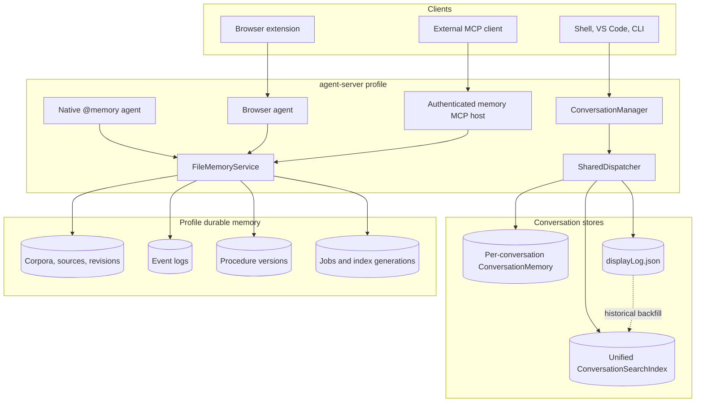
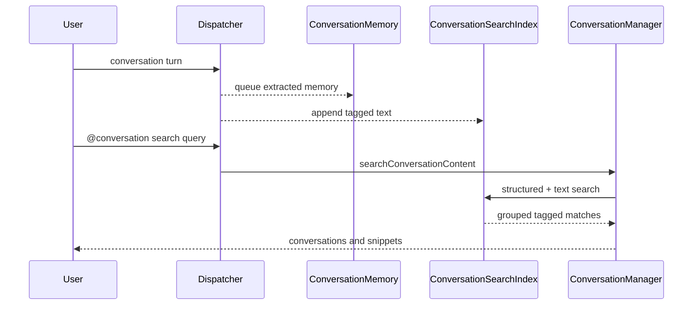
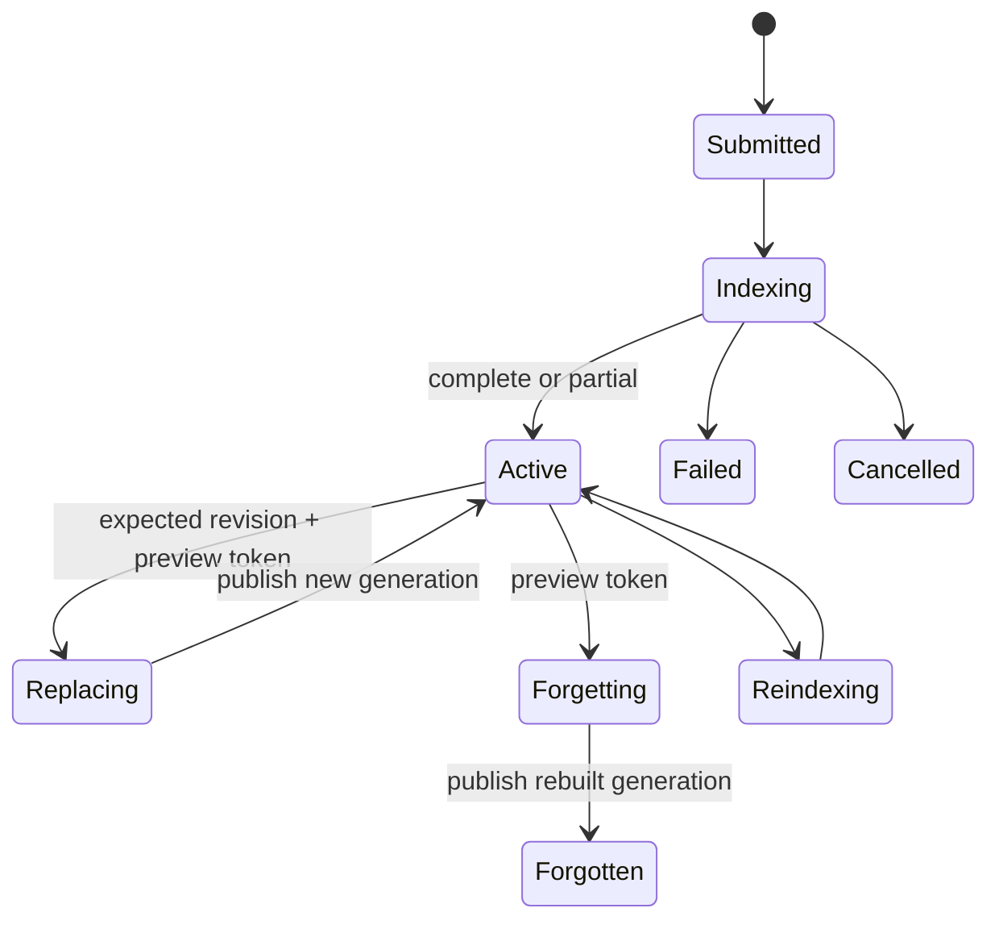

# TypeAgent memory: current system

**Audience:** TypeAgent maintainers, agent authors, and engineers debugging
memory behavior.

This page maps the memory implementation as of September 2026. For the
Structured RAG concepts, see [Memory architecture](memory.md). For supported
user journeys, see [Memory scenarios](scenarios.md).

## Runtime topology

The agent server creates one durable service under `<instanceDir>/memory`,
starts an authenticated loopback MCP host, and injects an in-process RPC facade
into the browser and memory agents. The native agent and MCP endpoint are two
interfaces to the same service.

## Memory models

### 1. Per-conversation structured memory

`initializeMemory` creates a `ConversationMemory` beneath each conversation's
persist directory. Messages and extracted semantic references are persisted;
transient indexes are rebuilt when the store opens. Connected mode currently
queues knowledge extraction for user requests and action results.

This path answers questions about the active conversation. It is isolated by
conversation and is not the cross-conversation routing index.

Primary code:

- `packages/dispatcher/dispatcher/src/context/memory.ts`
- `packages/memory/conversation/src/conversationMemory.ts`
- `packages/memory/conversation/src/memory.ts`
- `packages/knowPro/src/`

### 2. Unified cross-conversation index

`ConversationManager` owns one derived index at
`<instanceDir>/conversations/_unified`. Live user and assistant messages enter
through a host-provided content sink and carry `conv:<conversationId>` and turn
tags. Copilot imports append imported user and assistant messages directly.

Search combines structured natural-language search with message-text
similarity, resolves names from the live registry, and groups matches by
conversation. Deletion tombstones a conversation so results are filtered
immediately. Physical compaction is not implemented.

Primary code:

- `packages/agentServer/server/src/conversationSearchIndex.ts`
- `packages/agentServer/server/src/conversationManager.ts`
- `packages/dispatcher/dispatcher/src/context/system/handlers/conversationCommandHandlers.ts`
- `packages/cli/src/commands/conversations/search.ts`

### 3. Durable corpus memory

`FileMemoryService` is the profile-level managed memory implementation. It
owns source content and revisions, extraction, chunks, indexes, event logs,
jobs, grounded evidence, correction, forgetting, and personal procedures.

Document ingestion modes:

| Mode      | Extraction                                 | Intended use                            |
| --------- | ------------------------------------------ | --------------------------------------- |
| `basic`   | Model-free exact-search evidence           | Fast imports and deterministic fallback |
| `content` | Content indexing and structured extraction | Default managed-memory workflow         |
| `full`    | Deeper structured indexing                 | High-detail imports                     |

The native agent maps these to `fast`, `balanced`, and `deep` import profiles.
Effective mode and chunk size are stored with the revision.

Primary code:

- `packages/memory/service/src/fileMemoryService.ts`
- `packages/memory/service/src/knowProCorpusIndex.ts`
- `packages/memory/service/src/types.ts`
- `packages/memory/client/src/memoryClient.ts`
- `packages/memory/mcp-server/src/memoryMcpServer.ts`
- `packages/agents/memory/src/memoryAgent.ts`

## Producers and consumers

| Producer or consumer | Data written or read                                                                 | Boundary                                                                      |
| -------------------- | ------------------------------------------------------------------------------------ | ----------------------------------------------------------------------------- |
| Dispatcher           | Conversation turns, assistant evidence, verified action results, decisions, outcomes | Fixed profile corpus; no caller-selected cross-profile corpus                 |
| Browser agent        | Web sources plus visited, bookmarked, captured, and imported events                  | Browser captures and normalizes; service chunks and extracts                  |
| Native memory agent  | Markdown files/folders, corpus and source management, search and answers             | Host validates local paths; service never receives arbitrary filesystem paths |
| MCP clients          | Content-oriented ingestion and complete management APIs                              | Authenticated loopback transport                                              |
| Procedure clients    | Candidates, immutable versions, settings, search, archive                            | Procedures persist independently from source manifests                        |

## Source and event lifecycle

Sources are authoritative evidence. Entities, topics, relationships, chunks,
and summaries are derived and rebuilt from the active source revision.
Replacement rejects stale expected revisions. Forget confirmation survives a
service restart and removes source-derived artifacts together.

Events are append-only records with producer identity, idempotency key,
observed and event times, and optional conversation, run, turn, sender, action,
and linked-source provenance. Events can be filtered or forgotten without
rebuilding the document index. Linked sources are retained unless deletion is
explicit and no retained event references them.

## Search and answer semantics

| Surface                          | Search unit                                                | Result contract                       |
| -------------------------------- | ---------------------------------------------------------- | ------------------------------------- |
| Current conversation             | KnowPro entities, topics, and messages                     | Conversation-local evidence or answer |
| `@conversation search`           | Tagged messages in unified index                           | Ranked conversations with snippets    |
| Durable `search`                 | Corpus evidence constrained by source and metadata filters | Source-linked evidence matches        |
| Durable `answer` / `@memory ask` | Bounded durable evidence                                   | Extractive answer with citations      |
| Event search                     | Event content and provenance filters                       | Ranked typed events                   |
| Procedure search                 | Saved procedure versions                                   | Versioned procedural guidance         |

Assistant prose in durable conversation events is evidence-only. User
assertions, explicit decisions, tool results, and task outcomes carry stronger
authority metadata; retrieval does not turn unsupported assistant text into a
verified fact.

## Degraded behavior and failure modes

- Unified conversation search becomes inert if its model dependencies cannot
  initialize. Conversation CRUD and chat continue.
- Durable `basic` ingestion and exact search do not require a model. Richer
  modes require configured extraction and embedding models.
- Jobs interrupted by service restart are marked failed instead of remaining
  permanently active.
- Native import batch manifests persist durable job IDs. Local abort
  controllers do not persist, and closing an agent does not cancel accepted
  service jobs.
- The per-conversation queue and unified content sink are independent. Failure
  of one indexing path must not block a user turn or imply success in the
  other.

## Verification map

Focused automated coverage lives in:

- `packages/agentServer/server/test/conversationSearchIndex.spec.ts`
- `packages/agentServer/server/test/conversationSummary.spec.ts`
- `packages/agentServer/server/test/copilotImport.spec.ts`
- `packages/dispatcher/dispatcher/test/conversationDurableMemory.spec.ts`
- `packages/memory/service/test/fileMemoryService.spec.ts`
- `packages/memory/mcp-server/test/memoryMcpServer.spec.ts`
- `packages/agents/memory/test/memoryAgent.spec.ts`
- `packages/agents/browser/test/browserMemoryService.test.ts`
- `packages/agents/browser/test/websiteMemoryImport.test.ts`

The remaining risk is integration acceptance, especially live browser import,
cancelled-content visibility, restart recovery across the full UI, and
conversation-event parity.
