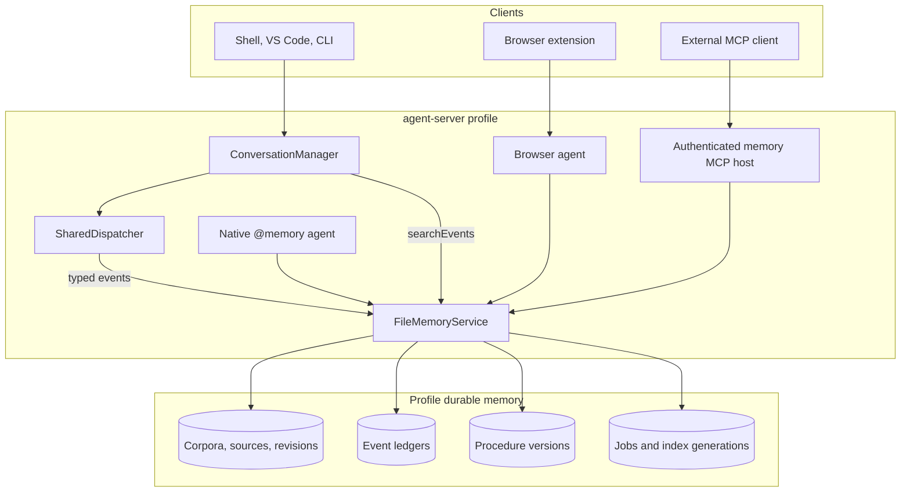
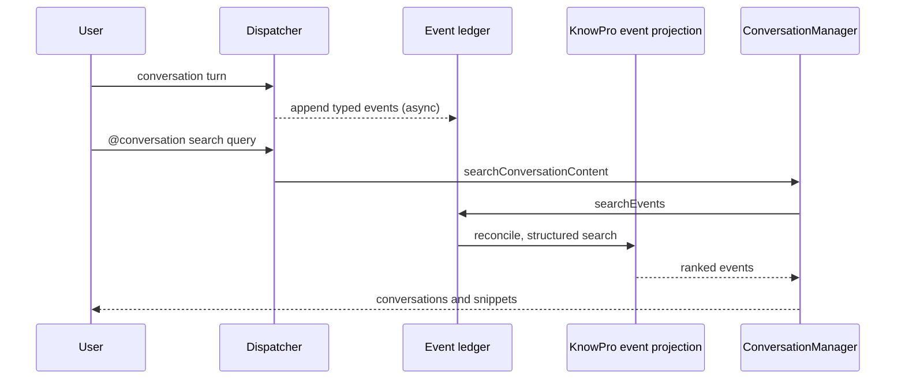
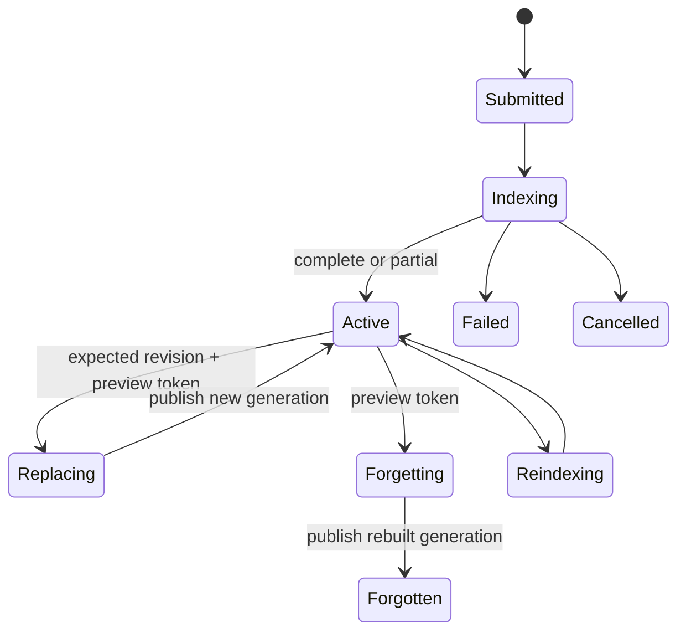

# TypeAgent memory: current system

**Audience:** TypeAgent maintainers, agent authors, and engineers debugging
memory behavior.

This page maps the memory implementation as of October 2026. For the
Structured RAG concepts, see [Memory architecture](memory.md). For supported
user journeys, see [Memory scenarios](scenarios.md).

## Design rules

1. **KnowPro is the only retrieval engine.** Documents, conversations and
   approved how-tos are searched through KnowPro: structured search first, with
   KnowPro's own embedding fallback. No component may add a lexical, substring
   or separate vector search.
2. **One model-driven `content` pipeline.** There are no basic, fast, balanced
   or deep modes and no import presets. The only tuning option is chunk size.
3. **Canonical data is kept, derived data is disposable.** Source revisions,
   event ledgers, procedure versions and forget tombstones are canonical. Every
   index is derived and is rebuilt, not migrated, when its schema marker is
   missing or older.
4. **Producers capture, the service indexes.** The browser, dispatcher and
   agents supply content and provenance. Chunking, extraction, indexing and
   answer generation belong to the memory service.

## Runtime topology

```mermaid
flowchart TB
    subgraph Clients
        CHAT[Shell, VS Code, CLI]
        EXT[Browser extension]
        MCPCLIENT[External MCP client]
    end

    subgraph AgentServer[agent-server profile]
        CM[ConversationManager]
        DISP[SharedDispatcher]
        MEMORYAGENT[Native @memory agent]
        BROWSER[Browser agent]
        MCPHOST[Authenticated memory MCP host]
        SERVICE[FileMemoryService]
    end

    subgraph DurableStore[Profile durable memory]
        SOURCES[(Corpora, sources, revisions)]
        EVENTS[(Event ledgers)]
        PROCEDURES[(Procedure versions)]
        JOBS[(Jobs and index generations)]
    end

    CHAT --> CM --> DISP
    DISP -->|typed events| SERVICE
    MEMORYAGENT --> SERVICE
    BROWSER --> SERVICE
    EXT --> BROWSER
    CM -->|searchEvents| SERVICE
    MCPCLIENT --> MCPHOST --> SERVICE
    SERVICE --> SOURCES
    SERVICE --> EVENTS
    SERVICE --> PROCEDURES
    SERVICE --> JOBS
```

The agent server (and the in-process host used by the Shell and CLI) creates
one durable service under `<instanceDir>/memory`, starts an authenticated
loopback MCP host, and injects an in-process RPC facade into the browser and
memory agents. The native agent and MCP endpoint are two interfaces to the
same service.

## Conversation memory

When a durable service is injected, conversation memory is the **event
ledger**: the dispatcher is the only live producer. There is no separate
per-conversation `ConversationMemory` and no separate unified index. At
start, `initializeMemory` removes any old per-conversation `conversationMemory`
data and creates a `ConversationDurableMemory` for the conversation.

| Event type               | Sender    | Authority label                         |
| ------------------------ | --------- | --------------------------------------- |
| `user-turn`              | user      | `user-assertion`                        |
| `assistant-evidence`     | assistant | `evidence-only`                         |
| `verified-action-result` | tool      | `verified-observation` (with `outcome`) |
| `explicit-decision`      | agent     | `explicit`                              |
| `task-outcome`           | agent     | `evidence-only`                         |

All events go to the profile corpus `typeagent-profile-conversations`.
`@conversation search` calls `searchEvents` on that corpus and groups the
KnowPro-ranked events by conversation. `@conversation index` imports
historical user turns from display logs as `user-assertion` events.
Deleting a conversation purges its ledger events and records a tombstone. The
design record is `packages/agentServer/server/docs/conversation-memory.md`.

A host without a durable service falls back to the older
`knowledge-processor` conversation manager plus a KnowPro `ConversationMemory`
(`execution.memory.legacy`). Content indexing and search in such a host fail
explicitly instead of reporting success.

The Copilot CLI memory plugin (`packages/copilot-memory-plugin`) keeps its own
workspace-scoped `ConversationMemory` and is intentionally not connected to the
durable service. It is one arm of an experiment comparing a self-contained
plugin with the service-backed MCP path as an externally consumable package.

Primary code:

- `packages/dispatcher/dispatcher/src/context/conversationDurableMemory.ts`
- `packages/dispatcher/dispatcher/src/context/memory.ts`
- `packages/dispatcher/dispatcher/src/context/personalMemorySearch.ts`
- `packages/agentServer/server/src/conversationManager.ts`
- `packages/agentServer/server/src/conversationSearchIndex.ts` (a facade over
  the ledger projection plus replay state)

```mermaid
sequenceDiagram
    participant User
    participant Dispatcher
    participant Ledger as Event ledger
    participant Index as KnowPro event projection
    participant Manager as ConversationManager

    User->>Dispatcher: conversation turn
    Dispatcher-->>Ledger: append typed events (async)
    User->>Dispatcher: @conversation search query
    Dispatcher->>Manager: searchConversationContent
    Manager->>Ledger: searchEvents
    Ledger->>Index: reconcile, structured search
    Index-->>Manager: ranked events
    Manager-->>User: conversations and snippets
```

## Durable corpus memory

`FileMemoryService` owns source content and revisions, extraction, chunks,
index generations, event ledgers, jobs, grounded evidence, correction,
forgetting, and personal procedures.

Ingestion accepts only `content` mode. Revisions record their pipeline
settings, but the stored mode is not used to choose behavior: a legacy
revision is reported as `content` and rebuilt with the current pipeline.

Each derived index generation (`documents`, `conversation-events`,
`procedures`) contains `index-schema.json` (`indexSchemaVersion` 1, engine
`knowpro`). A missing or older descriptor, or a current generation without
valid semantic data, triggers a scoped reset and a rebuild from canonical
records. A malformed descriptor or a newer version is an explicit error and
the generation is left in place.

Primary code:

- `packages/memory/service/src/fileMemoryService.ts`
- `packages/memory/service/src/knowProCorpusIndex.ts`
- `packages/memory/service/src/indexSchema.ts`
- `packages/memory/service/src/types.ts`
- `packages/memory/client/src/memoryClient.ts`
- `packages/memory/mcp-server/src/memoryMcpServer.ts`
- `packages/agents/memory/src/memoryAgent.ts`

## Producers and consumers

| Producer or consumer | Data written or read                                                                     | Boundary                                                                      |
| -------------------- | ---------------------------------------------------------------------------------------- | ----------------------------------------------------------------------------- |
| Dispatcher           | Conversation turns, assistant evidence, verified action results, decisions, outcomes     | Fixed profile corpus; no caller-selected cross-profile corpus                 |
| Browser agent        | Web sources plus visited, bookmarked, captured, imported events                          | Browser captures and normalizes; service chunks and extracts                  |
| Native memory agent  | Markdown files and folders, corpus and source management, search and answers             | Host validates local paths; service never receives arbitrary filesystem paths |
| MCP clients          | Content-oriented ingestion and management APIs                                           | Authenticated loopback transport                                              |
| Procedure clients    | Candidates, immutable versions, settings, search, archive                                | Procedures persist independently from source manifests                        |
| Reasoning agents     | `search_memory` over conversation events, all non-conversation corpora, saved procedures | Read only; evidence is untrusted text                                         |

## Source and event lifecycle

```mermaid
stateDiagram-v2
    [*] --> Submitted
    Submitted --> Indexing
    Indexing --> Active: complete or partial
    Indexing --> Failed
    Indexing --> Cancelled
    Active --> Replacing: expected revision + preview token
    Replacing --> Active: publish new generation
    Active --> Forgetting: preview token
    Forgetting --> Forgotten: publish rebuilt generation
    Active --> Reindexing
    Reindexing --> Active
```

Sources are authoritative evidence. Entities, topics, relationships, chunks,
and summaries are derived and rebuilt from the active source revision.
Replacement rejects stale expected revisions. Forget confirmation survives a
service restart and removes source-derived artifacts together.

Events are append-only records with producer identity, idempotency key,
observed and event times, and optional conversation, run, turn, sender, action,
and linked-source provenance. Events can be filtered or forgotten without
rebuilding the document index. Forgetting writes suppression tombstones that
survive restart. Linked sources are retained unless deletion is explicit and no
retained event references them.

## Search and answer semantics

| Surface                          | Search unit                                                         | Result contract                                                                                                                                                                                |
| -------------------------------- | ------------------------------------------------------------------- | ---------------------------------------------------------------------------------------------------------------------------------------------------------------------------------------------- |
| `@conversation search`           | Ledger events (KnowPro projection)                                  | Ranked conversations with snippets                                                                                                                                                             |
| Reasoning `search_memory`        | Conversation events, corpus evidence, saved procedures, in parallel | Cited evidence sections                                                                                                                                                                        |
| Durable `search`                 | Corpus evidence constrained by source and tag filters               | Source-linked evidence matches                                                                                                                                                                 |
| Durable `answer` / `@memory ask` | KnowPro evidence for the question                                   | **Synthesized** answer by default, generated by KnowPro's answer generator over the evidence, with citations. `answerMode: "extractive"` (`--extractive`) returns the ranked snippets verbatim |
| Event search                     | Event content and provenance filters                                | Ranked typed events                                                                                                                                                                            |
| Procedure search                 | Saved procedure versions                                            | Versioned procedural guidance                                                                                                                                                                  |

Synthesized answers can be scoped with `sourceIds`; the answer context is then
built only from matched messages of those sources. A failure to generate an
answer is an error, not a silent switch to extractive output. Index
implementations without answer support (test fakes) return extractive answers
unless synthesis is requested explicitly.

The browser page Q&A path uses the same service answer, scoped to the matching
page sources.

Assistant prose in conversation events is evidence-only. User assertions,
explicit decisions, and verified tool results carry stronger authority labels;
retrieval presents the label with each snippet and does not turn unsupported
assistant text into a verified fact.

## Degraded behavior and failure modes

- Searching and answering need the configured extraction and query models.
  Events are appended without a model, but nothing becomes searchable until the
  projection can be built. There is no model-free fallback search.
- Jobs interrupted by service restart are marked failed instead of remaining
  permanently active.
- Native import batch manifests (version 2) persist durable job IDs. Local abort
  controllers do not persist, and closing an agent does not cancel accepted
  service jobs.
- Append failures for conversation events surface on the next `flush()` and do
  not block the user turn.
- A host without a durable service can manage conversations, but content
  indexing and search fail explicitly.

## Legacy and separate packages

| Package                                                      | Status                                                                                                                                                                      |
| ------------------------------------------------------------ | --------------------------------------------------------------------------------------------------------------------------------------------------------------------------- |
| `packages/memory/website`                                    | Browser import helpers and HTML content extraction only. Its collection, graph, indexing service and batch processor were removed; `@index create website` no longer exists |
| `packages/knowledgeProcessor`                                | Early Structured RAG sample, still used by the no-service dispatcher fallback and a few agents                                                                              |
| `packages/memory/image`, `packages/memory/storage`           | Image memory for `@index` and montage; separate from the durable service                                                                                                    |
| `packages/kp`                                                | Lightweight keyword index used by the email agent                                                                                                                           |
| Email and podcast memories in `packages/memory/conversation` | Used by the sample chat app only                                                                                                                                            |

## Verification map

Focused automated coverage lives in:

- `packages/memory/service/test/*.spec.ts` (including `indexSchema.spec.ts`,
  `answerKnowPro.spec.ts` for real KnowPro answer synthesis)
- `packages/memory/mcp-server/test/memoryMcpServer.spec.ts`
- `packages/agents/memory/test/memoryAgent.spec.ts`
- `packages/agentServer/server/test/conversationSearchIndex.spec.ts`,
  `conversationSummary.spec.ts`, `copilotImport.spec.ts`
- `packages/dispatcher/dispatcher/test/conversationDurableMemory.spec.ts`,
  `personalMemorySearch.spec.ts`, `conversationMemoryIntegration.spec.ts`
- `packages/agents/browser/test/browserMemoryService.test.ts`,
  `websiteMemoryImport.test.ts`

The remaining risk is integration acceptance, especially live browser import,
cancelled-content visibility, restart recovery across the full UI, live model
answer quality, and conversation-event parity. See
[the status ledger](../../plans/memory-system/STATUS.md).
