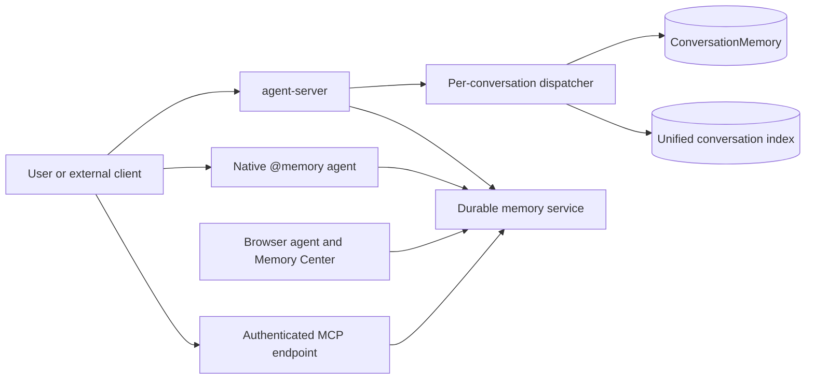

# Memory architecture

TypeAgent currently has three cooperating memory paths. They share KnowPro
building blocks, but they serve different scopes and have different lifecycle
semantics.

| Path                       | Scope                                                  | Primary purpose                                                         | Runtime state                                                               |
| -------------------------- | ------------------------------------------------------ | ----------------------------------------------------------------------- | --------------------------------------------------------------------------- |
| Per-conversation memory    | One conversation                                       | Structured recall and question answering within the active conversation | Enabled in connected mode; knowledge extraction is queued in the background |
| Unified conversation index | All conversations in one profile                       | Find, summarize, and backfill conversations by content                  | Enabled in agent-server mode; unavailable when model initialization fails   |
| Durable memory service     | Profile-level corpora, sources, events, and procedures | Managed document, browser, event, and procedural memory                 | Started by agent-server and exposed to native agents and MCP clients        |

These paths are complementary. The per-conversation store preserves detailed
conversation-local context. The unified index is a derived, rebuildable search
surface. The durable service provides source revisions, provenance, jobs,
correction, forgetting, and interfaces shared by several producers.

## Views by audience

| Audience                                       | Document                                                     |
| ---------------------------------------------- | ------------------------------------------------------------ |
| Maintainers and agent authors                  | [Current system](current-system.md)                          |
| Product engineers, evaluators, and demo owners | [Memory scenarios](scenarios.md)                             |
| Feature owners and release planners            | [Implementation status](../../plans/memory-system/STATUS.md) |
| Structured RAG readers                         | [Structured RAG](#structured-rag) on this page               |



## Current capabilities

### Conversation recall and discovery

- User and assistant turns can be indexed in a per-conversation
  `ConversationMemory` with extracted entities, topics, relationships, and
  message text.
- The unified index tags content by conversation and supports
  `@conversation search`, `@conversation summarize`, and historical backfill
  through `@conversation index`.
- Conversation names support hybrid lexical and embedding-based lookup through
  `@conversation find`.
- Connected-mode conversation turns and verified action outcomes also produce
  durable events. Event search distinguishes user assertions and verified
  observations from assistant prose.

### Managed document memory

- The native `@memory` agent creates and selects corpora, imports Markdown
  files or folders, searches sources, returns extractive grounded answers, and
  manages jobs.
- Sources retain revisions, ingestion settings, bounded content, and derived
  entities, topics, and relationships.
- Replacement uses optimistic revision checks. Forgetting and corpus clearing
  use preview-and-confirm tokens and rebuild the published index atomically.
- Import profiles cover model-free exact indexing (`fast`), content indexing
  (`balanced`), and deeper structured extraction (`deep`).

### Browser and web-activity memory

- Browser capture, bookmark/history import, and HTML-folder import submit
  normalized source content to the durable service.
- Visited, bookmarked, captured, and imported activity is stored as events
  linked to page sources, with domain, page type, source, and time filters.
- The browser Memory Center exposes corpus, source, revision, knowledge, job,
  replacement, forgetting, and reindex operations.

### Procedural memory

- The durable service stores immutable, versioned personal procedures with
  source-revision citations and stale-version tracking.
- It supports candidate detection, drafting, rejection, saving, searching,
  archiving, and optimistic personal-how-to settings.
- Procedure retrieval is implemented as guidance. Automatic execution,
  feedback-driven promotion, and workflow or macro approval remain future
  product work.

## Enablement and maturity

| Capability                               | Availability            | Notes                                                                                    |
| ---------------------------------------- | ----------------------- | ---------------------------------------------------------------------------------------- |
| Per-conversation extraction              | Enabled by agent-server | Runs asynchronously and requires configured models                                       |
| Unified live indexing                    | Enabled by agent-server | User and assistant turns are tagged with conversation and turn identifiers               |
| Historical conversation backfill         | Command-driven          | `@conversation index` indexes historical user turns from display logs                    |
| Native durable-memory agent              | Shipped provider        | `@memory` is the preferred TypeAgent UX                                                  |
| Memory MCP endpoint                      | Enabled by agent-server | Authenticated loopback endpoint for external clients; not a second memory implementation |
| Browser durable memory and Memory Center | Implemented             | Live browser acceptance and performance validation remain pending                        |
| Durable conversation events              | Implemented             | Parity and end-to-end acceptance remain pending                                          |
| Procedural service APIs                  | Implemented             | Grounded editing and approved execution are not complete                                 |

## Storage and ownership

In connected mode, memory is rooted under the active TypeAgent profile:

```text
<instanceDir>/
  memory/                         durable service corpora and event stores
  conversations/
    conversations.json           conversation registry
    _unified/                     derived cross-conversation index
    <conversationId>/
      conversationMemory*        conversation-local KnowPro data
      displayLog.json             source for historical backfill
```

The durable memory service owns extraction, chunking, indexing, revisions,
jobs, search, correction, and forgetting for its corpora. Producers such as
the browser and dispatcher capture source material and provenance; they do not
maintain parallel durable extraction pipelines.

## Known boundaries

- The unified conversation index is append-only. Deleted conversations are
  tombstoned and filtered immediately, but physical compaction is still
  pending.
- Historical backfill indexes user turns, while live indexing includes user
  and assistant turns.
- Durable grounded answers are extractive and citation-bearing; model-backed
  synthesis is not currently part of the contract.
- The Memory Center and newer event paths have focused automated coverage, but
  their live end-to-end acceptance checklists are not complete.
- Temporal claims, bitemporal validity, contradiction resolution, entity
  merge/split, remote synchronization, and enterprise governance are planned
  rather than current capabilities.

## Structured RAG

TypeAgent memory uses a method called **Structured RAG** for indexing and querying agent conversations.

Classic RAG is defined as embedding each conversation turn into a vector, and then for each user request embedding the user request and then placing into the answer generation prompt the top conversation turns by cosine similarity to the user request.

Structured RAG is defined as the following steps:

- For each conversation turn (message):
  - Extract short topic sentences and tree-structured entity and relationship information.
  - Extract key terms from the entities and topics.
  - Add these terms to the primary index that maps terms to entities and topics which in turn point back to messages. Structured information may accompany a message, for example to/from information for an e-mail thread or location information from an image description.  Add any structured information to a relational table associated with the conversation.
- For each user request:
  - Convert the user request into a query expression.  If the user request refers to structured information, the query expression will include a relational query to be joined with the unstructured data query result.  The relational query may include comparison operators.
  - For the unstructured data, the query expression consists of two parts: scope expressions and tree-pattern expressions.
    - Scope expressions, such as time range, restrict search results to a subset of the conversation.  Scope expressions can include topic descriptions, which specify the subset of the conversation that matches the description.
    - Tree-pattern expressions match specific trees extracted from the conversation and can be connected by logical operators.
  - Execute the query, yielding lists of entities and topics, ordered by relevance score
  - Select the top entities and topics and add them to the answer prompt
  - If the topics and entities do not use all of the token budget, add to the prompt the messages referenced by the top entities and topics.
  - Submit the answer prompt to a language model to generate the final answer.

Structured RAG can use simple language models to extract entities and topics.  This enables Structured RAG to index large conversations, like sets of meeting transcripts.  With fine tuning, simple models deliver indices with only a small loss of precision and recall relative to indices built with large language models.

The current Structured RAG implementation in the [KnowPro](https://github.com/microsoft/TypeAgent/blob/main/ts/packages/knowPro/README.md) package uses secondary indices for scope expressions such as document range and time range.  The implementation also uses secondary indices for related terms, such as "novel" for "book".  During query, the memory system discovers related terms and caches them.  Models also offer related terms during information extraction.

Structured RAG has the following advantages over state-of-the-art memory using classic RAG:

1. **Size**:  Structured RAG can retain all of the information extracted from every conversation with the agent.  Structured RAG uses a standard inverted index to map terms to entities, topics and messages.  This choice benefits from the 30 plus years of perfecting inverted indices for Internet search, in libraries like Lucene and services like Azure AI Search.  These indices are a fraction of the size of the vector databases used to index conversations in classic RAG.  For example, using current embedding models yields for each message a 4K vector of semantic information.  In contrast, structured RAG stores only the dense information extracted for each turn, and a back-pointer to the message. Consequently, structured RAG indices can often remain resident in RAM and use a single VM, whereas classic RAG can often require disk operations distributed over a set of VM instances.  For these reasons, on a large scale, Structured RAG is substantially faster at finding relevant information and requires substantially less cost to operate. Most importantly, while systems based on classic RAG will forget information over time and overlook information as more of it is crammed into a token window, Structured RAG retains all of its information, increases the density of that information, and uses a small prompt, increasing the probability that the model generating the answer can give attention to the most relevant information.
2. **Structure**:  Structured RAG extracts structured information from each conversation turn.  On average, this information is much denser than the text of the conversation turn, containing only the essential entities and relationships in the turn, plus a short topic sentence.  This information density enables Structured RAG to put more relevant information into the answer generation prompt.  The retention of structured semantics from each conversation turn enables higher specificity in queries, for example "what e-mail did Kevin send to Satya about new AI models?" or "who won the match where Messi used the crimson soccer ball?"  By relying on a single cosine similarity score, Classic RAG will include for example crimson t-shirts and blue soccer balls for the latter query, reducing the relevance of the information provided for answer generation.
3. **Inference**:  Because Structured RAG has dense, structured information, it can apply further inference to memories, expanding the number of queries it can handle.  For example, if the original index contains an entity such as "artist(Paul Simon)", inference can add additional type information to that entity such as "person(Paul Simon)", which will help in answering a question like "what people did we talk about yesterday?"
4. **Diverse knowledge sources**:  Structured RAG can combine extracted structure with pre-existing structure, for example the sender, receiver and subject of an e-mail message, or the location information provided with an image description.  This enables Structured RAG to return useful answers for queries that reference both the provided and extracted structure such as "what was the cactus I saw on my Arizona hike last month?"
5. **Associative memory**:  Structured RAG can support pre-fetching associations as a user types their request.  For example, if the user types "what was the cactus...", the agent can begin fetching memories associated with cactus even before the user finishes typing their request.  Having discrete index terms also enables agents to use completion hints when a user is typing or speaking a request.  For example a user may type or say "play walk..." and the agent can supply completions "walk this way", "walk on the wild side" etc.
6. **Tools for memory exploration and management**:  When memories are stored as embeddings, little can be done to manage the memories.  Structured indices and tables on the other hand can be explored and managed using additional tools that employ direct query languages or even natural language query coupled with a set of management and exploration tools.

## Implementations and interfaces

- [KnowPro](../../../packages/knowPro/README.md) implements the structured
  conversation indexes and search primitives.
- [Conversation memory](../../../packages/memory/conversation/README.md) wraps
  KnowPro for persisted conversations and document import.
- [Memory service](../../../packages/memory/service/README.md) provides durable
  corpora, sources, revisions, jobs, events, procedures, and management
  semantics.
- [Memory MCP server](../../../packages/memory/mcp-server/README.md) exposes the
  service contract to external MCP clients.
- [Memory agent](../../../packages/agents/memory/README.md) provides the native
  `@memory` command and action experience over the same service.

## Demos

- [One minute demo](https://youtu.be/jTHOt4O7YuM): A command-line test of Structured RAG vs Classic RAG recall.  With 3K input tokens, Structured RAG recalls all 63 books discussed in 25 Behind the Tech podcasts, while Classic RAG recalls 15 books using twice as many input tokens.  Not shown, at 128K input tokens, Classic RAG recalls 31 books.
- [Ninety second demo](https://youtu.be/CWgrAEK123U): Agent memory implemented using Structured RAG.
