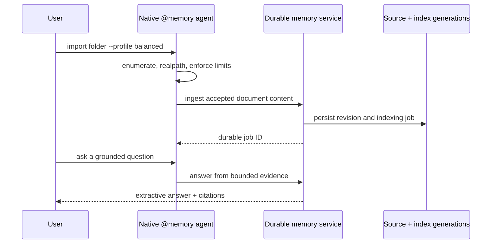
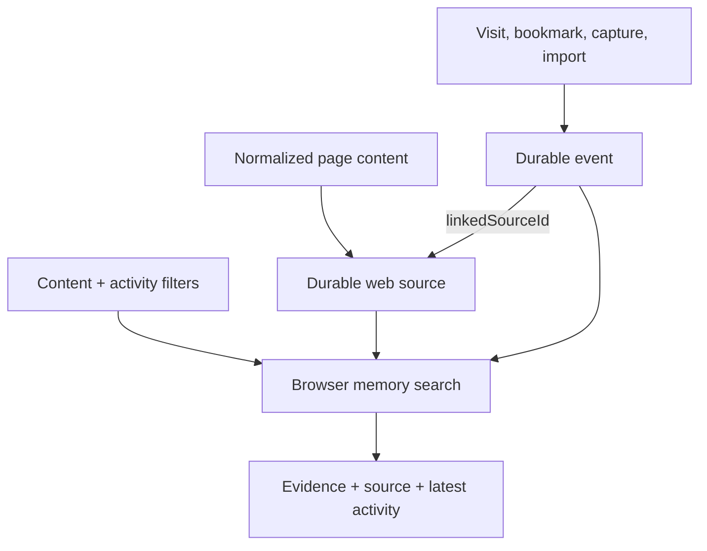

# TypeAgent memory scenarios

**Audience:** product engineers, application-agent authors, evaluators, and
demo owners.

This guide describes what a user can do today, which memory path serves the
scenario, and where the current boundary lies.

## Capability map

| Scenario                              | User surface                                             | Memory path                        | State                                                              |
| ------------------------------------- | -------------------------------------------------------- | ---------------------------------- | ------------------------------------------------------------------ |
| Recall the active conversation        | `@conversation-memory` and conversational lookup         | Per-conversation structured memory | Available                                                          |
| Find an earlier conversation          | `@conversation find`, `search`, `summarize`, and `index` | Unified conversation index         | Available in connected mode                                        |
| Build a local Markdown knowledge base | Native `@memory` commands                                | Durable source memory              | Available; end-to-end acceptance pending                           |
| Remember and inspect web activity     | Browser actions and Memory Center                        | Durable sources and events         | Implemented; live browser validation pending                       |
| Reuse a personal procedure            | Memory service and MCP procedure tools                   | Durable procedure versions         | Storage and retrieval available; automatic execution not available |
| Connect another application           | Memory MCP endpoint                                      | Same durable service               | Available through authenticated loopback MCP                       |

## Scenario 1: Find a previous conversation

**Example:** “Find the conversation where we planned the browser memory
migration.”

```mermaid
flowchart LR
    Q[Content query] --> CMD[@conversation search]
    CMD --> IDX[(Unified tagged index)]
    IDX --> GROUP[Group by conversation ID]
    GROUP --> REG[Resolve current names]
    REG --> RESULT[Ranked conversations and snippets]
```

Use `@conversation find` when the name is approximately known. Use
`@conversation search` when only the discussed content is known. Use
`@conversation index` to backfill historical display logs; live turns are
indexed automatically.

Current boundary: deleted conversations are hidden by tombstones, but their
bytes remain in the append-only unified index until compaction is implemented.

## Scenario 2: Build and manage a Markdown knowledge base

**Example:** import a project wiki, ask “What are the release gates?”, inspect
the cited source, replace an outdated page, and forget a retired page.

Typical flow:

1. `@memory corpus create` and `@memory corpus use` select the durable corpus.
2. `@memory import folder` submits Markdown files with a chosen import profile.
3. `@memory import status` and job commands report durable progress.
4. `@memory search` returns evidence; `@memory ask` returns a bounded extractive
   answer with citations; `@memory explain` reopens the latest citations.
5. Source commands show content, revisions, and derived knowledge.
6. Replacement and forgetting require a preview followed by explicit
   confirmation.



The host, not the service, reads local paths. Symlink and junction escapes are
rejected, and folder imports enforce file count, byte, glob, and concurrency
limits.

## Scenario 3: Remember web pages and activity

**Example:** “Find the browser page about Luna indexing that I bookmarked last
week.”

The browser stores captured page content as a durable web source and records
activity separately as `visited`, `bookmarked`, `captured`, or `imported`
events. Searches can combine content with URL, domain, page type, source,
activity type, and time filters. The latest matching activity is returned with
source evidence.



The Memory Center can inspect and manage corpora, sources, revisions, derived
knowledge, jobs, replacement, forgetting, and reindexing. Live acceptance for
browser capture/import, cancellation, and performance remains pending.

## Scenario 4: Carry verified outcomes across conversations

The dispatcher writes typed durable events for user turns, assistant evidence,
verified action results, explicit decisions, and task outcomes. Retrieval can
search the current conversation first and then the profile corpus.

This model lets consumers distinguish evidence classes:

- assistant text is non-authoritative evidence;
- user statements are assertions;
- tool results and task outcomes are verified observations;
- explicit decisions are marked as explicit.

Current boundary: the event substrate, inspection, search, and forgetting are
implemented, but parity acceptance with older conversation-memory behavior is
not complete.

## Scenario 5: Preserve personal procedures

**Example:** retain a reviewed troubleshooting guide with citations to the
documents from which it was derived.

The durable service can detect procedure candidates during eligible Markdown
or text ingestion, then draft, reject, save, list, search, retrieve, archive,
and version procedures. Saved versions are immutable and include canonical
JSON, deterministic Markdown, hashes, lineage, and source-revision citations.
Replacing or forgetting a cited source creates a new stale procedure version
without rewriting history.

Current boundary: a retrieved procedure is guidance, not permission to execute
actions. Feedback collection, promotion into approved workflows or macros, and
automatic execution remain planned.

## Scenario 6: Integrate an external client

The agent server publishes an authenticated loopback MCP endpoint for the
durable memory service. External clients receive the same corpus, ingestion,
search, answer, event, management, and procedure semantics as the native
agent. They do not receive TypeAgent-host-only local-folder access; the client
must enumerate its own files and submit content.

Avoid presenting the dynamic `@memory-mcp` agent beside native `@memory` as a
second user-facing product. MCP is the interoperability interface; native
`@memory` is the preferred TypeAgent interaction.

## Evaluation checklist

For demos and acceptance runs, verify evidence rather than only command
success:

- search results resolve to the expected source or conversation;
- grounded answers include resolvable citations;
- replacement creates a new active revision and rejects stale confirmation;
- forgotten content no longer appears in search or derived knowledge;
- cancellation has one terminal result and cancelled content is not
  searchable;
- restart restores corpus selection, import status, jobs, sources, and
  retrieval;
- event results expose producer, type, time, and source or conversation
  provenance.
