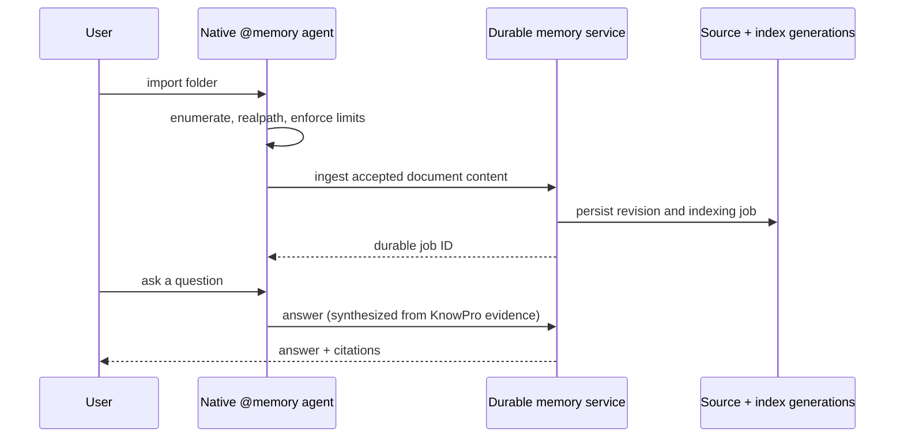
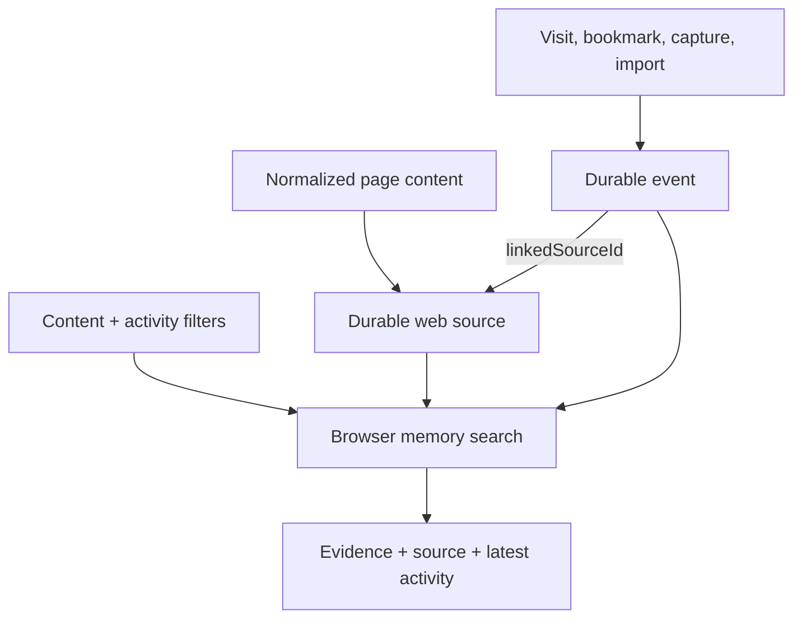

# TypeAgent memory scenarios

**Audience:** product engineers, application-agent authors, evaluators, and
demo owners.

This guide describes what a user can do today, which memory content serves the
scenario, and where the current boundary lies. All scenarios use the durable
memory service and KnowPro retrieval; see [Memory architecture](memory.md).

## Capability map

| Scenario                              | User surface                                                             | Memory content              | State                                                                                |
| ------------------------------------- | ------------------------------------------------------------------------ | --------------------------- | ------------------------------------------------------------------------------------ |
| Recall earlier conversation content   | Conversational lookup, `@conversation-memory`, reasoning `search_memory` | Conversation events         | Available; parity acceptance pending                                                 |
| Find an earlier conversation          | `@conversation find`, `search`, `summarize`, and `index`                 | Conversation events         | Available                                                                            |
| Build a local Markdown knowledge base | Native `@memory` commands                                                | Durable sources             | Available; end-to-end acceptance pending                                             |
| Remember and inspect web activity     | Browser actions, "Save this page", Memory Center                         | Durable sources and events  | Implemented; live browser validation pending                                         |
| Ask about a saved page in chat        | Reasoning `search_memory`                                                | Sources, events, procedures | Implemented; live check pending                                                      |
| Reuse a personal procedure            | Memory Center, memory service and MCP procedure tools                    | Procedure versions          | Storage, retrieval and promotion API available; no promotion UI or feedback loop     |
| Connect another application           | Memory MCP endpoint                                                      | Same durable service        | Available through authenticated loopback MCP; discovery for external clients pending |

## Scenario 1: Find a previous conversation

**Example:** "Find the conversation where we planned the browser memory
migration."

```mermaid
flowchart LR
    Q[Content query] --> CMD[@conversation search]
    CMD --> SEARCH[searchEvents on the profile conversation corpus]
    SEARCH --> GROUP[Group KnowPro-ranked events by conversation ID]
    GROUP --> REG[Resolve current names]
    REG --> RESULT[Ranked conversations and snippets]
```

Use `@conversation find` when the name is approximately known. Use
`@conversation search` when only the discussed content is known. Use
`@conversation index` to backfill historical display logs (user turns); live
turns are recorded automatically as typed events.

Current boundary: deleting a conversation purges its ledger events and writes a
tombstone, but physical compaction of derived projections is not implemented.

## Scenario 2: Build and manage a Markdown knowledge base

**Example:** import a project wiki, ask "What are the release gates?", inspect
the cited source, replace an outdated page, and forget a retired page.

Typical flow:

1. `@memory corpus create` and `@memory corpus use` select the durable corpus.
2. `@memory import folder` submits Markdown files. There are no import
   profiles; every import uses the `content` pipeline.
3. `@memory import status` and job commands report durable progress.
4. `@memory search` returns evidence; `@memory ask` returns an answer
   synthesized by KnowPro from the evidence, with citations (`--extractive`
   returns the ranked snippets verbatim); `@memory explain` reopens the latest
   citations.
5. Source commands show content, revisions, and derived knowledge.
6. Replacement and forgetting require a preview followed by explicit
   confirmation.

```mermaid
sequenceDiagram
    participant User
    participant Agent as Native @memory agent
    participant Service as Durable memory service
    participant Store as Source + index generations

    User->>Agent: import folder
    Agent->>Agent: enumerate, realpath, enforce limits
    Agent->>Service: ingest accepted document content
    Service->>Store: persist revision and indexing job
    Service-->>Agent: durable job ID
    User->>Agent: ask a question
    Agent->>Service: answer (synthesized from KnowPro evidence)
    Service-->>User: answer + citations
```

The host, not the service, reads local paths. Symlink and junction escapes are
rejected, and folder imports enforce file count, byte, glob, and concurrency
limits.

## Scenario 3: Remember web pages and activity

**Example:** "Find the browser page about Luna indexing that I bookmarked last
week."

The browser stores captured page content as a durable web source and records
activity separately as `visited`, `bookmarked`, `captured`, or `imported`
events. Searches can combine content with URL, domain, page type, source,
activity type, and time filters. The latest matching activity is returned with
source evidence. A page-level question is answered by the service from the
matching page sources.

```mermaid
flowchart TB
    PAGE[Normalized page content] --> SOURCE[Durable web source]
    ACTIVITY[Visit, bookmark, capture, import] --> EVENT[Durable event]
    EVENT -->|linkedSourceId| SOURCE
    QUERY[Content + activity filters] --> SEARCH[Browser memory search]
    SOURCE --> SEARCH
    EVENT --> SEARCH
    SEARCH --> MATCH[Evidence + source + latest activity]
```

"Save this page" in the browser context menu captures the clicked tab, indexes
it, and runs how-to candidate detection on the same revision. The Memory Center
can inspect and manage corpora, sources, revisions, derived knowledge, jobs,
replacement, forgetting, curation, and reindexing. Live acceptance for browser
capture/import, cancellation, and performance remains pending.

Browser history and bookmark enumeration is not indexing: imported URLs are
fetched and their original content is submitted to the service.

## Scenario 4: Carry verified outcomes across conversations

The dispatcher writes typed durable events for user turns, assistant evidence,
verified action results, explicit decisions, and task outcomes. Retrieval
searches the current conversation first and then the profile corpus.

The authority labels let consumers distinguish evidence classes:

- assistant text is evidence only and non-authoritative;
- user statements are assertions;
- tool results are verified observations (a failed result is a verified
  observation of failure, with `outcome: failed`);
- explicit decisions are marked explicit;
- task outcomes recorded by the reasoning agent are evidence only.

Current boundary: the event substrate, inspection, search, and forgetting are
implemented, but parity acceptance with older conversation-memory behavior is
not complete, and recorded turns can be inspected and forgotten but not
corrected.

## Scenario 5: Preserve personal procedures

**Example:** retain a reviewed troubleshooting guide with citations to the
documents from which it was derived.

The durable service can detect procedure candidates during eligible Markdown
or text ingestion, then draft, reject, save, list, search, retrieve, archive,
and version procedures. Saved versions are immutable and include canonical
JSON, deterministic Markdown, hashes, lineage, and source-revision citations.
Replacing or forgetting a cited source creates a new stale procedure version
without rewriting history.

Current boundary: a retrieved procedure is guidance, not permission to execute
actions. A saved procedure can be previewed and promoted to an Agent Skill or
macro draft through RPC and the Copilot plugin tools; there is no promotion UI,
feedback collection, or automatic execution.

## Scenario 6: Integrate an external client

The agent server publishes an authenticated loopback MCP endpoint for the
durable memory service. External clients receive the same corpus, ingestion,
search, answer, event, management, and procedure semantics as the native
agent. They do not receive TypeAgent-host-only local-folder access; the client
must enumerate its own files and submit content.

Current boundary: the endpoint address and token are not yet published to
external clients, and the standalone stdio server opens its own store.

The dynamic `@memory-mcp` agent beside native `@memory`, and the Copilot CLI
memory plugin with its own store, are deliberate parallel experiments to learn
which path makes an externally consumable MCP package easier. Native `@memory`
remains the preferred TypeAgent interaction.

## Evaluation checklist

For demos and acceptance runs, verify evidence rather than only command
success:

- search results resolve to the expected source or conversation;
- answers include resolvable citations, and `--extractive` shows the same
  evidence verbatim;
- replacement creates a new active revision and rejects stale confirmation;
- forgotten content no longer appears in search or derived knowledge;
- cancellation has one terminal result and cancelled content is not
  searchable;
- restart restores corpus selection, import status, jobs, sources, and
  retrieval;
- event results expose producer, type, time, authority, and source or
  conversation provenance.
