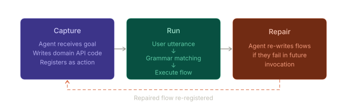
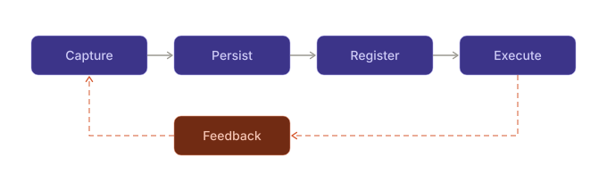

# Workflows — Architecture & Design

> **Scope:** This document is the architecture reference for TypeAgent's
> user-defined workflow system — PowerShell scripts, WebFlows, and TaskFlows
> — covering definition formats, execution sandboxes, storage, the dynamic
> schema/grammar API, and self-repair. For the grammar language and matching
> algorithms that route user input to workflow actions, see `actionGrammar.md`.
> For how matched completions propagate through the shell, see `completion.md`.

## Overview

TypeAgent's action system is developer-authored: developers write actions,
schemas, and grammar rules; natural-language requests dispatch reliably
against that fixed surface. It works, but **every new capability requires
a developer**.

Workflows change this by enabling **end users to extend the system
themselves**. A user demonstrates a task or describes it in their own words;
a reasoning agent generalizes what it observed into a reusable script with
parameters and grammar rules; and the resulting workflow becomes a first-class
action that anyone can invoke.

### The core insight: saved workflows win

Once a task is captured as a workflow, execution is **deterministic and fast**
— milliseconds instead of seconds. The LLM is used once to _create_ the
workflow, not on every invocation. This is the fundamental value proposition:
trade one-time LLM reasoning for unlimited fast reuse.

### Three-phase lifecycle



The user-facing model is simple:

| Phase       | What happens                                                                                                                          |
| ----------- | ------------------------------------------------------------------------------------------------------------------------------------- |
| **Capture** | User demonstrates or describes a task; reasoning agent writes code against a domain API; workflow registers via `reloadAgentSchema()` |
| **Run**     | User utterance matches grammar; workflow executes deterministically                                                                   |
| **Repair**  | If execution fails, reasoning agent rewrites the workflow in place                                                                    |

See [Common lifecycle](#common-lifecycle) for implementation details
(five phases: Capture → Persist → Register → Execute → Feedback).

### Where workflows apply

| Domain                    | Example                                          | Status      |
| ------------------------- | ------------------------------------------------ | ----------- |
| PowerShell scripts        | _"Show my running processes"_                    | Implemented |
| Web browser automation    | _"Buy AAA batteries on Amazon"_                  | Implemented |
| Cross-agent workflows     | _"Get top 10 K-pop songs and create a playlist"_ | Implemented |
| Office macros             | _"Format this spreadsheet for quarterly review"_ | Planned     |
| Knowledge-base automation | _"Run the network troubleshooting guide"_        | Planned     |

### Key concepts

| Term                | Meaning                                                                                                                        |
| ------------------- | ------------------------------------------------------------------------------------------------------------------------------ |
| **Workflow**        | A parameterized, reusable automation definition that registers as a dispatchable action with grammar patterns for NL matching. |
| **Workflow store**  | Per-agent instance storage that persists workflow definitions, scripts, and an index file across sessions.                     |
| **Dynamic schema**  | A runtime-generated TypeScript type definition that constrains LLM-translated parameter values to valid workflow names.        |
| **Dynamic grammar** | Runtime-generated `.agr` rules that enable grammar matching for registered workflows.                                          |
| **Script executor** | The type- and mode-specific execution environment for a workflow.                                                              |
| **Script host**     | The process or runtime that executes code; the name does not imply OS containment.                                             |
| **Self-repair**     | Fallback to LLM reasoning when a workflow execution fails, with context about the failure to guide correction.                 |

### Workflow types



| Aspect        | PowerShell                                            | WebFlow                                           | TaskFlow                                           | ExcelFlow                                        | ...            |
| ------------- | ----------------------------------------------------- | ------------------------------------------------- | -------------------------------------------------- | ------------------------------------------------ | -------------- |
| **Domain**    | OS / filesystem / processes                           | Web page interaction                              | Cross-agent workflows                              | Excel / spreadsheet automation                   | _User-defined_ |
| **Language**  | PowerShell                                            | TypeScript                                        | TypeScript                                         | TypeScript                                       | —              |
| **Sandbox**   | Restricted mode only; approved-local is not sandboxed | Frozen API + blocked identifiers (server-side)    | `new Function()` + frozen API + blocked globals    | `new Function()` + OfficeJS bridge               | —              |
| **Execution** | `scriptHost.ps1` via child process                    | `new Function()` in Node.js with frozen API proxy | `executeTaskFlowScript()` with `TaskFlowScriptAPI` | `new Function()` in Node.js with OfficeJS bridge | —              |
| **Scope**     | System-wide                                           | Per-site or global                                | Any agent combination                              | Per-workbook or global                           | —              |
| **Platform**  | Windows only                                          | Any (browser required)                            | Any                                                | Any (Excel required)                             | Any            |
|               |

> **Design trade-off — why separate workflow types instead of one?**
>
> We could have a single unified workflow format that handles all domains.
> We chose separate types because:
>
> 1. **Sandbox requirements differ** — PowerShell needs OS-level isolation
>    (constrained runspace); browser scripts need DOM access prevention;
>    cross-agent flows need dispatcher validation.
> 2. **Capture mechanisms differ** — PowerShell imports existing `.ps1` files;
>    WebFlows record browser interactions; TaskFlows capture reasoning traces.
> 3. **Execution substrates differ** — PowerShell runs in a child process;
>    WebFlows proxy to the browser; TaskFlows call the dispatcher.
>
> We derive common building blocks to handle storage, dynamic schema,
> and grammar generation.

---

## Common lifecycle

All workflow types share a five-phase lifecycle:



### Phase 1 — Capture

How workflows are created depends on the workflow type and trigger:

| Flow type  | Trigger                       | Pipeline                                                                                                    |
| ---------- | ----------------------------- | ----------------------------------------------------------------------------------------------------------- |
| PowerShell | `@powershell import file.ps1` | `ScriptAnalyzer` sends script to LLM (Claude Sonnet), generates recipe                                      |
| PowerShell | `createPowerShellFlow` action | User or LLM provides script, parameters, patterns, sandbox directly                                         |
| WebFlow    | `startGoalDrivenTask` action  | `BrowserReasoningAgent` navigates autonomously, trace captured, `scriptGenerator` produces parameterized JS |
| WebFlow    | Extension recording           | User demonstrates task, `recordingNormalizer` + LLM generalizes to script                                   |
| TaskFlow   | Manual authoring              | Developer writes `.recipe.json` files with embedded TypeScript scripts                                      |
| TaskFlow   | Seed samples                  | Bundled `.recipe.json` files loaded on first activation                                                     |

> **Note:** Automatic capture from reasoning traces is **fully implemented**.
> The `ReasoningRecipeGenerator` extracts multi-agent action sequences
> from successful reasoning traces and generates TaskFlow recipes. The
> `ScriptRecipeGenerator` watches for PowerShell commands executed via
> Bash during reasoning and generates PowerShell recipes. Both generators
> run automatically after successful reasoning if enabled in config
> (`execution.scriptReuse`). Users can trigger explicit recording with
> `learn: [task]` or `remember how to [task]` prefixes.

### Phase 2 — Persist

All workflows use **instance storage** (`~/.typeagent/profiles/<profile>/`) for
cross-session persistence. See [Storage and persistence](#storage-and-persistence)
for the full layout.

### Phase 3 — Register

Workflows become matchable through dynamic grammar and schema registration.
On agent activation (or after a workflow mutation), the agent calls
`reloadAgentSchema()` and the dispatcher queries `getDynamicGrammar()` and
`getDynamicSchema()` to pick up new patterns and type constraints. See
[Dynamic schema and grammar API](#dynamic-schema-and-grammar-api) for details.

### Phase 4 — Execute

Each workflow type has a domain-specific execution and authorization model. See the per-type
sections ([PowerShell](#powershell), [WebFlow](#webflow),
[TaskFlow](#taskflow)) for architecture details.

### Phase 5 — Feedback and self-repair

When execution fails, the system can fall back to LLM reasoning with
context about the failure. See [Self-repair and reasoning fallback](#self-repair-and-reasoning-fallback).
PowerShell script failures do not automatically enter that fallback; an explicit
repair still requires fresh execution authorization.

---

## Workflow definition formats

### PowerShell recipe (`ScriptRecipe`)

```typescript
interface ScriptRecipe {
  version: 1;
  actionName: string;
  description: string;
  displayName: string;
  parameters: ScriptParameter[];
  script: {
    language: "powershell";
    body: string;
    expectedOutputFormat: "text" | "json" | "objects" | "table";
  };
  grammarPatterns: GrammarPattern[];
  sandbox: SandboxPolicy;
  source?: {
    type: "reasoning" | "manual";
    requestId?: string;
    timestamp: string;
    originalRequest?: string;
  };
}

interface ScriptParameter {
  name: string;
  type: "string" | "number" | "boolean" | "path";
  required: boolean;
  description: string;
  default?: unknown;
  validation?: {
    pattern?: string;
    allowedValues?: string[];
    pathMustExist?: boolean;
  };
}

interface GrammarPattern {
  pattern: string;
  isAlias: boolean;
  examples: string[];
}

interface SandboxPolicy {
  maxExecutionTime: number;
}
```

Recipes also accept `requiredModules?: string[]`. Old permission fields remain
readable for compatibility; they are not containment.

Persisted as a `.flow.json` (metadata, parameters, dependencies, timeout and
grammar), a `.ps1` (script body), and a `revisions/<name>.json` fingerprint.
The fingerprint records a candidate version, not permission to execute it.

### WebFlow definition (`WebFlowDefinition`)

```typescript
interface WebFlowDefinition {
  name: string;
  description: string;
  version: number;
  parameters: Record<string, WebFlowParameter>;
  script: string;
  grammarPatterns: string[];
  scope: WebFlowScope;
  source: WebFlowSource;
}

interface WebFlowParameter {
  type: "string" | "number" | "boolean";
  required: boolean;
  description: string;
  default?: unknown;
  valueOptions?: string[];
}

interface WebFlowScope {
  type: "site" | "global";
  domains?: string[];
  urlPatterns?: string[];
}

interface WebFlowSource {
  type: "goal-driven" | "recording" | "discovered" | "manual";
  traceId?: string;
  timestamp: string;
  originUrl?: string;
}
```

Persisted as two files per workflow: a `.json` (metadata without script) and
a `.js` (script body). Scope determines the storage path — global workflows
go to `flows/global/`, site-scoped workflows go to `flows/sites/{domain}/`.

### TaskFlow recipe (`ScriptRecipe`)

```typescript
interface ScriptRecipe {
  name: string;
  description: string;
  parameters: RecipeParameter[];
  script: string; // TypeScript code as a string
  grammarPatterns: string[];
  source?: {
    type: "reasoning" | "manual" | "seed";
    timestamp: string;
  };
}

interface RecipeParameter {
  name: string;
  type: "string" | "number" | "boolean";
  required: boolean;
  description: string;
  default?: unknown;
}
```

Persisted as two files per workflow: a `.flow.json` (metadata without script)
and a `.ts` (TypeScript script body). Scripts execute via
`executeTaskFlowScript()` with access to `TaskFlowScriptAPI` for calling
other agents.

### Format comparison

| Field                 | PowerShell                             | WebFlow                                                   | TaskFlow                               |
| --------------------- | -------------------------------------- | --------------------------------------------------------- | -------------------------------------- |
| **Action identifier** | `actionName`                           | `name`                                                    | `name`                                 |
| **Parameters**        | `ScriptParameter[]`                    | `Record<string, WebFlowParameter>`                        | `RecipeParameter[]`                    |
| **Execution payload** | `script.body` (PowerShell)             | `script` (JavaScript)                                     | `script` (TypeScript)                  |
| **Grammar patterns**  | `GrammarPattern[]` (with `isAlias`)    | `string[]`                                                | `string[]`                             |
| **Sandbox policy**    | Explicit `SandboxPolicy` object        | Implicit (frozen API + validator)                         | Frozen API + blocked globals           |
| **Scope**             | System-wide (no scope field)           | `WebFlowScope` (site/global)                              | System-wide (no scope field)           |
| **Source tracking**   | `source.type`: reasoning, manual, seed | `source.type`: goal-driven, recording, discovered, manual | `source.type`: reasoning, manual, seed |

Note: The type names (`WebFlow`, `TaskFlow`, `PowerShell`) are product/code identifiers.
Throughout this document, "workflow" refers to the general concept; the specific
type names are preserved where they match code.

---

## PowerShell

PowerShell manages parameterized scripts. It runs explicitly authorized code
with the current user's privileges, subject to OS policy, without execution
feature flags. This is not an arbitrary-code sandbox.

### Capture paths

PowerShell supports two creation paths:

**Import** (`importPowerShellFlow` action or `@powershell import file.ps1`):

```
  User: "@powershell import ./cleanup.ps1"
     |
     v  ScriptAnalyzer reads .ps1 file (max 100 KB)
     v  LLM (Claude Sonnet) analyzes script:
     v    - Infers parameters from param() block or hardcoded values
     v    - Generates grammar patterns (2-4 patterns)
     v    - Records module dependencies (not execution approval)
     v  Saved to instance storage as active workflow
     v  reloadAgentSchema() -> grammar + schema updated
```

**Explicit creation** (`createPowerShellFlow` action, typically from LLM reasoning):

```
  LLM reasoning generates: createPowerShellFlow {
      actionName, description, script, scriptParameters,
      grammarPatterns, requiredModules
  }
     |
     v  actionHandler builds ScriptRecipe from provided fields
     v  Saved to instance storage as active workflow
     v  reloadAgentSchema() -> grammar + schema updated
```

> **Note:** Automatic capture from successful reasoning traces is implemented
> on Windows when `execution.scriptReuse` is enabled. `ScriptRecipeGenerator`
> detects PowerShell commands in the trace, generalizes them, saves active
> flows, and reloads the PowerShell schema. Explicit import,
> `createPowerShellFlow`, and seed samples remain available.

### Execution architecture

```
  Flow or candidate -> central powershellRunner
    -> trusted UI authorization and version/invocation verification
    -> Windows broker (bounded JSON over stdin)
    -> private request file and scriptHost.ps1
    -> structured parameters, output, timeouts, owned-process cleanup
```

Dynamic flows require trusted user authorization and the Windows execution
broker without execution feature flags. The former
`powershell.dynamicExecution.enabled` and `powershell.brokerExecution.enabled`
settings are ignored, including explicit false values, and can be removed from
existing configuration. Missing authorization or an unavailable broker prevents
execution.

Reviewed package-owned namespace actions remain a separate trusted path.
Mutable flow metadata cannot select that reviewed-static API.

### Legacy broker compatibility

The native broker retains restricted protocol v1, its AST/command checks and
AppContainer behavior for compatibility. It is not a selectable flow mode.
Current flow execution always uses the authorization-guarded local path and
never falls back to protocol v1 or another tool after a denied approval.

### Approved-local execution

Every new or changed script requires authorization before execution, including
generated tests, drafts, and repairs. Import and
registration do not confer approval.

The initial trusted UI shows a compact flow/working-directory/arguments summary
and an ordinary-user authority warning. Long fields are explicitly marked as
truncated, and changed versions are flagged. **Review script and details** exposes
the full code, definition, arguments, previous remembered script when changed,
account, runtime, timeout, and hash. Reviewing or returning to the summary never
authorizes execution. Cancel is the default in both views. Direct
connected-client invocations may remember an exact invocation for the active
session. Reasoning-loop, draft, test, repair, and background calls require fresh
consent.

Security approvals use a dedicated, connection-targeted ClientIO/agent-RPC
callback. They are not structured continuation questions or replayable shared
interactions. Only interactive clients implement that callback; model-only MCP
clients fail closed. Remembered approvals use host-issued session lifetime IDs,
not transient RPC object identity, and are restricted to direct-user origin.

SHA-256 binds the root script and definition; an invocation hash binds arguments,
working directory, and timeout. The authoritative records are in application
memory, not recipe fields. Changed content or context asks again. Restarting
clears approval; persistent approvals are not implemented. `@powershell revoke`
clears session records and `@powershell show <name>` displays the mode and status.

Approved code can use Git, native programs, modules, .NET, files, and networking
under the current user's OS rights. This path does not impose AppContainer,
forced CLM, a command catalogue, or a one-process limit. The launcher does not
elevate or specify an execution-policy bypass. Legacy `allowed*` and
`networkAccess` fields are descriptive, not security restrictions.
Old `allowedModules` metadata is interpreted as module dependencies. New recipes
use `requiredModules`; loading occurs after authorization and failure stops the
root script. Module names are reviewed, but their file contents are not pinned.

Imports, edits, seeds and reasoning capture use the same validated store.
Persistent candidate fingerprints cover exact code, parameter definitions and
defaults, dependencies, timeout and provenance. Old flows missing a fingerprint
remain available for review, with no automatic baseline on load. An explicit
authorization establishes that version; unexpected later edits are shown as
changed and cannot silently advance the record. These records do not authorize
execution or resist replacement by an attacker controlling the same user account.

The broker retains private request transport, explicit inherited handles,
operational output/time limits, and job-based cleanup of its owned process tree.
Parameters are bound as data, not interpolated into commands. The default working
directory is the TypeAgent process directory; profiles are not loaded.

Root-script hashing does not pin loaded files, modules, or executables. The
application and approval authority must remain trusted. It does not protect
against a compromised local account or malicious already-approved code replacing
user-owned application files. Independent shell/MCP tools have separate
authorization requirements.

### Parameters and failures

`ScriptParameter.validation` handles patterns, allowed values, and required
paths. Path/executable parameters expand only explicit USERPROFILE, HOME, TEMP,
TMP, and PWD aliases, not arbitrary parent environment variables. Ordinary
strings remain literal.

Script, policy, and authorization failures do not automatically enter reasoning
or switch to a more privileged tool. Deliberate repair produces a new candidate
requiring authorization. Nonterminating script errors are failures; native stderr
with a successful exit is a warning. A nonzero final native exit code fails
execution. Cancellation and timeouts do not roll back side effects.

### Execution result

```typescript
interface ScriptExecutionResult {
  success: boolean;
  stdout: string;
  stderr: string;
  exitCode: number;
  duration: number;
  truncated: boolean; // true if stdout exceeded 1 MB limit
}
```

---

## WebFlow

WebFlow captures browser automation scripts and executes them
server-side in Node.js with a frozen API sandbox. Browser operations
are delegated through the `WebFlowBrowserAPI` proxy, which translates
calls to actual browser actions via the extension.

### Capture modes

| Mode            | Trigger                               | Pipeline                                                                                                             | Status                     |
| --------------- | ------------------------------------- | -------------------------------------------------------------------------------------------------------------------- | -------------------------- |
| **Goal-driven** | `startGoalDrivenTask` action          | `BrowserReasoningAgent` (Claude) navigates autonomously, trace captured, `scriptGenerator` produces parameterized JS | Implemented                |
| **Recording**   | `generateWebFlowFromRecording` action | User actions recorded by extension, `recordingNormalizer` + LLM generalizes to parameterized script                  | Implemented                |
| **Manual**      | Developer authoring                   | Write `.json` definition + `.js` script directly                                                                     | Implemented (sample flows) |
| **Discovery**   | (defined in type system)              | Listed as a source type but not actively implemented as a capture mode                                               | Type only                  |

### Execution architecture

Scripts execute **server-side in Node.js**, not in the browser's MAIN
world. The `WebFlowBrowserAPI` acts as a proxy — each method call
translates to a browser operation via the extension.

```
  Node.js (TypeAgent server)          Browser (via extension)
  +---------------------------+       +---------------------------+
  | scriptExecutor.mts        |       | Browser extension         |
  | - Object.freeze(api)      |       |                           |
  | - Object.freeze(params)   |       |                           |
  | - new Function(script)    |--RPC->| - DOM operations          |
  | - "use strict" mode       |       | - page navigation         |
  | - timeout enforcement     |       | - element interaction     |
  |                           |<-RPC--|                           |
  +---------------------------+       +---------------------------+
```

The `new Function()` constructor creates an isolated scope with only
three named bindings: `browser` (frozen API proxy), `params` (frozen
parameter object), and `console` (logging-only stub). The script has
no access to `window`, `document`, `global`, `require`, or any other
Node.js or browser globals.

### Script executor

The `executeWebFlowScript()` function in `scriptExecutor.mts` creates a
restricted execution environment:

```typescript
async function executeWebFlowScript(
  scriptSource: string,
  browserApi: WebFlowBrowserAPI,
  params: Record<string, unknown>,
  options: ScriptExecutionOptions,
): Promise<WebFlowResult>;
```

1. `Object.freeze()` is applied to the browser API, params, and a
   logging-only console stub.
2. A `new Function()` is constructed with `browser`, `params`, and
   `console` as the only accessible bindings:
   ```typescript
   const fn = new Function(
     ...Object.keys(sandbox),
     `"use strict"; return (${scriptSource})(browser, params);`,
   );
   ```
3. The function is invoked with the frozen sandbox values as arguments.
4. A `Promise.race` enforces the timeout (default 180 seconds).

### Script validation

Before execution, `scriptValidator.mts` performs TypeScript-compiler-based
validation with an AST security walker:

- Parses script through the TypeScript compiler
- Walks AST to detect 27+ blocked identifiers:
  ```
  eval, Function, require, import, fetch, XMLHttpRequest, WebSocket,
  window, document, globalThis, self, setTimeout, setInterval,
  clearTimeout, clearInterval, chrome, process, Buffer,
  __dirname, __filename
  ```
- Validates function signature: `async function execute(browser, params)`
- Blocks dangerous patterns: `new Function()`, dynamic `import()`,
  `with` statements, `__proto__`, `constructor.constructor` chains

> **Design trade-off — why AST validation instead of true sandboxing?**
>
> True sandboxing (e.g., V8 isolates, WebAssembly) would provide stronger
> guarantees. We chose AST-based validation because:
>
> 1. **Performance** — Creating V8 isolates has ~50ms overhead per
>    execution; AST scanning is <5ms.
> 2. **API access** — Scripts need to call `browser.*` methods that cross
>    the sandbox boundary; true isolation would require complex serialization.
> 3. **Debuggability** — `new Function()` errors include stack traces;
>    isolated contexts obscure failure locations.
>
> We mitigate bypass risk by freezing the API object and running in
> strict mode. The validation catches common dangerous patterns; the
> frozen API limits what escaped code could do.

### Browser API contract

Scripts interact with the browser through `WebFlowBrowserAPI`:

| Category            | Methods                                                                                                                                                                                          |
| ------------------- | ------------------------------------------------------------------------------------------------------------------------------------------------------------------------------------------------ |
| **Navigation**      | `navigateTo(url)`, `goBack()`, `waitForNavigation(timeout?)`, `awaitPageLoad(timeout?)`, `awaitPageInteraction(timeout?)`                                                                        |
| **Page state**      | `getCurrentUrl()`, `getPageText()`, `captureScreenshot()`                                                                                                                                        |
| **DOM interaction** | `click(css)`, `clickAndWait(css, timeout?)`, `followLink(css)`, `enterText(css, text)`, `enterTextOnPage(text, submit?)`, `clearAndType(css, text)`, `pressKey(key)`, `selectOption(css, value)` |
| **LLM extraction**  | `extractComponent<T>(componentDef, userRequest?)`                                                                                                                                                |
| **State checking**  | `checkPageState(expectedState)`, `queryContent(question)`                                                                                                                                        |

The `extractComponent()` method is the bridge between scripts and LLM
reasoning — it uses an LLM to find a UI component on the page by
semantic description rather than hard-coded CSS selector, making scripts
resilient to page layout changes.

### Scope enforcement

WebFlows can be scoped to specific domains:

```typescript
interface WebFlowScope {
  type: "site" | "global";
  domains?: string[];
  urlPatterns?: string[];
}
```

When `scope.type === "site"`, domain matching is enforced at two points:

1. **Pre-execution** in `actionHandler.mts`: checks the current page
   URL before running the script.
2. **Runtime** in `WebFlowBrowserAPIImpl.navigateTo()`: checks
   navigation targets during script execution.

Domain matching uses `String.endsWith()`:

```typescript
const allowed = scope.domains.some((d) => targetDomain.endsWith(d));
```

This means `amazon.com` matches `www.amazon.com` and `api.amazon.com`
but does not match `notamazon.com`. Dots in domains are replaced with
underscores for storage paths (e.g., `amazon.com` → `amazon_com/`).

### Execution result

```typescript
interface WebFlowResult {
  success: boolean;
  message?: string;
  data?: unknown;
  error?: string;
}
```

---

## TaskFlow

TaskFlow orchestrates multi-agent workflows through TypeScript scripts
that call other TypeAgent actions via a sandboxed API. Unlike PowerShell
(PS scripts) and WebFlow (browser JavaScript), TaskFlow scripts execute
server-side in Node.js with access to all TypeAgent agents.

### Capture paths

TaskFlow recipes are created through:

1. **Automatic capture**: The `ReasoningRecipeGenerator` extracts multi-agent
   action sequences from successful reasoning traces and generates recipes
   automatically. Triggered by `learn: [task]` prefix or runs automatically
   after successful reasoning.
2. **Seed samples**: Bundled `.recipe.json` files in the `samples/`
   directory are loaded on first activation.
3. **Manual authoring**: Developers write `.recipe.json` files with
   embedded TypeScript scripts.

### Recipe format

Example recipe from `samples/createTopSongsPlaylist.recipe.json`:

```json
{
  "name": "createTopSongsPlaylist",
  "description": "Find top streaming songs and create a Spotify playlist",
  "parameters": [
    {
      "name": "genre",
      "type": "string",
      "required": true,
      "description": "Music genre (e.g. bluegrass, jazz, rock)"
    },
    {
      "name": "quantity",
      "type": "number",
      "required": false,
      "default": 10,
      "description": "Number of songs"
    }
  ],
  "script": "async function execute(api, params) { ... }",
  "grammarPatterns": [
    "create (a)? $(genre:wildcard) playlist (with)? $(quantity:number) (songs)?"
  ]
}
```

### Script signature

TaskFlow scripts are TypeScript functions with this signature:

```typescript
async function execute(
  api: TaskFlowScriptAPI,
  params: FlowParams,
): Promise<TaskFlowScriptResult>;
```

### TaskFlowScriptAPI

The `api` parameter provides methods for calling other agents:

| Method                                       | Description                                 | Returns            |
| -------------------------------------------- | ------------------------------------------- | ------------------ |
| `callAction(schemaName, actionName, params)` | Execute any TypeAgent action via dispatcher | `ActionStepResult` |
| `queryLLM(prompt, options?)`                 | Call utility.llmTransform for LLM reasoning | `ActionStepResult` |
| `webSearch(query)`                           | Search the web via utility.webSearch        | `ActionStepResult` |
| `webFetch(url)`                              | Fetch URL content via utility.webFetch      | `ActionStepResult` |

All methods return `Promise<ActionStepResult>` with `{ text: string, data: unknown, error?: string }`.

The script must return `TaskFlowScriptResult`:

```typescript
interface TaskFlowScriptResult {
  success: boolean;
  message?: string;
  data?: unknown;
  error?: string;
}
```

### Execution architecture

```
  Node.js (TypeAgent server)
  +---------------------------+
  | taskFlowScriptExecutor    |
  | - validate script         |
  | - transpile TS -> JS      |
  | - new Function() sandbox  |
  | - frozen TaskFlowScriptAPI|
  | - timeout (300s default)  |
  |                           |
  | TaskFlowScriptAPI         |
  | - callAction()            |
  |   ↓                       |
  | Dispatcher                |
  | - routes to agents        |
  +---------------------------+
```

The `executeTaskFlowScript()` function in `taskFlowScriptExecutor.mts`
creates a restricted execution environment:

1. **Validation**: Script is checked for blocked identifiers (eval, require, import, etc.)
2. **Transpilation**: TypeScript script is transpiled to JavaScript
3. **Sandbox creation**: `new Function()` is constructed with only three bindings:
   - `api`: Frozen TaskFlowScriptAPI instance
   - `params`: Frozen parameter object
   - `console`: Log-only stub
4. **Global shadowing**: All Node.js/browser globals are shadowed with `undefined`
5. **Execution**: Function is invoked with timeout enforcement (300s default)

### Sandbox: blocked globals

TaskFlow scripts execute with these restrictions:

- **Blocked identifiers** (shadowed with `undefined`): `eval`, `Function`, `require`,
  `import`, `fetch`, `XMLHttpRequest`, `process`, `Buffer`, `__dirname`, `__filename`,
  `window`, `document`, `globalThis`, and others
- **Available bindings**: Only `api`, `params`, and `console`
- **Strict mode**: All code runs in `"use strict"`
- **Frozen objects**: `api` and `params` are `Object.freeze()`d

The validation performs regex-based scanning (not full AST parsing) for approximately
20+ blocked identifiers.

### Script example

```typescript
async function execute(
  api: TaskFlowScriptAPI,
  params: FlowParams,
): Promise<TaskFlowScriptResult> {
  // Fetch chart page
  const chartPage = await api.webFetch(
    `https://www.chosic.com/genre-chart/${params.genre}/tracks/2025/`,
  );

  // Extract songs using LLM
  const songs = await api.queryLLM(
    `Extract song titles and artists. Return JSON array with "trackName" and "artist".`,
    { input: chartPage.text, parseJson: true },
  );

  if (!Array.isArray(songs.data) || songs.data.length === 0) {
    return { success: false, error: "Could not extract songs" };
  }

  // Create playlist via player agent
  const result = await api.callAction("player", "createPlaylist", {
    name: `Top ${params.quantity} ${params.genre}`,
    songs: songs.data,
  });

  return { success: true, message: result.text };
}
```

### Storage layout

```
taskflow/
  index.json                         # TaskFlowIndex
  flows/
    createTopSongsPlaylist.flow.json # Workflow metadata (without script)
    weeklyEmailDigest.flow.json
  scripts/
    createTopSongsPlaylist.ts        # TypeScript script (separate file)
    weeklyEmailDigest.ts
```

### Execution result

```typescript
interface TaskFlowScriptResult {
  success: boolean;
  message?: string;
  data?: unknown;
  error?: string;
}
```

If the script returns a value without a `success` field, the executor wraps it:

```typescript
{
  success: true,
  message: String(returnValue),
  data: returnValue
}
```

---

---

## Dynamic schema and grammar API

The dynamic schema mechanism allows any agent to update its action
types and grammar rules at runtime. This is the generic extension point
that all three workflow systems use to register their workflows with the
dispatcher.

### Why this matters

Three properties make this system valuable:

1. **The LLM is constrained** — The translator sees TypeScript union types
   generated at runtime, so it can only produce valid workflow names and
   parameter types. Hallucinated workflow names fail type validation.

2. **Pickup is instant** — When a workflow is added or removed, the grammar
   matcher absorbs new patterns immediately — no restart required. The
   user can invoke a newly-captured workflow in the same session.

3. **It's pluggable** — New domains (Excel, VS Code, database queries)
   slot in without dispatcher changes. PowerShell, WebFlow, and TaskFlow
   are just the first three implementations of this extension point.

### Agent-side callbacks

```typescript
// Defined on AppAgent (optional)
getDynamicSchema?(
    context: SessionContext,
    schemaName: string,
): Promise<SchemaContent | undefined>;

getDynamicGrammar?(
    context: SessionContext,
    schemaName: string,
): Promise<GrammarContent | undefined>;
```

### Refresh trigger

```typescript
// Defined on SessionContext
reloadAgentSchema(): Promise<void>;
```

### Data flow

```
  Agent starts up / workflow mutated
       |
       v
  Agent calls reloadAgentSchema()
       |
       v
  Dispatcher calls getDynamicSchema(ctx, schemaName)
       |  -> Agent returns SchemaContent with constrained types
       |  -> Dispatcher replaces cached schema
       |  -> Dispatcher clears translator cache
       v
  Dispatcher calls getDynamicGrammar(ctx, schemaName)
       |  -> Agent returns GrammarContent with NL patterns
       |  -> Dispatcher merges with static grammar rules
       |  -> Grammar matcher picks up new patterns immediately
       v
  Next user request uses updated schema + grammar
```

### Schema content formats

| Format  | Type                   | Usage                                                                                 |
| ------- | ---------------------- | ------------------------------------------------------------------------------------- |
| `"ts"`  | TypeScript source text | Returned by `getDynamicSchema()`. Sent directly to LLM as the action type definition. |
| `"pas"` | Pre-parsed JSON        | Used for static schemas from `.pas.json` files (build-time compiled).                 |

### Grammar content formats

| Format  | Type                  | Usage                                                                      |
| ------- | --------------------- | -------------------------------------------------------------------------- |
| `"agr"` | Raw grammar rule text | Returned by `getDynamicGrammar()`. Parsed via `loadGrammarRulesNoThrow()`. |
| `"ag"`  | Compiled grammar JSON | Parsed via `grammarFromJson()`.                                            |

### Example: PowerShell dynamic schema

PowerShell generates a **per-workflow action type** for each registered
workflow, plus the built-in management actions. With workflows `listFiles` and
`findLargeFiles` registered, the dynamic schema is:

```typescript
// Per-workflow action types (generated at runtime)
export type ListFilesAction = {
    actionName: "listFiles";
    parameters: {
        path?: string;
        filter?: string;
    };
};

export type FindLargeFilesAction = {
    actionName: "findLargeFiles";
    parameters: {
        path?: string;
        minSizeMB?: number;
    };
};

// Built-in management actions (always present)
export type ListPowerShellFlows = { actionName: "listPowerShellFlows"; };
export type DeletePowerShellFlow = { actionName: "deletePowerShellFlow"; parameters: { name: string; }; };
export type CreatePowerShellFlow = { actionName: "createPowerShellFlow"; parameters: { ... }; };
export type EditPowerShellFlow = { actionName: "editPowerShellFlow"; parameters: { ... }; };
export type ImportPowerShellFlow = { actionName: "importPowerShellFlow"; parameters: { ... }; };

// Union of all
export type PowerShellActions =
    | ListFilesAction
    | FindLargeFilesAction
    | ListPowerShellFlows
    | DeletePowerShellFlow
    | CreatePowerShellFlow
    | EditPowerShellFlow
    | ImportPowerShellFlow;
```

The LLM translator sees the full union and can only generate valid
action names with correctly typed parameters. The static schema also
includes `ExecutePowerShellFlow` (with a `flowName` string) as a fallback
for grammar matching.

### Key components

| Component               | File                                                  | Role                                                         |
| ----------------------- | ----------------------------------------------------- | ------------------------------------------------------------ |
| `AppAgent` interface    | `agentSdk/src/agentInterface.ts`                      | Defines `getDynamicSchema` and `getDynamicGrammar`           |
| `SessionContext`        | `agentSdk/src/agentInterface.ts`                      | Defines `reloadAgentSchema()` trigger                        |
| `AppAgentManager`       | `dispatcher/src/context/appAgentManager.ts`           | Calls callbacks, updates schema/grammar, clears caches       |
| `ActionSchemaFileCache` | `dispatcher/src/translation/actionSchemaFileCache.ts` | Caches parsed schema; `unloadActionSchemaFile()` invalidates |
| Translator cache        | `dispatcher/src/context/commandHandlerContext.ts`     | Caches LLM translators; `.clear()` forces re-creation        |

---

## Storage and persistence

All workflow stores use the `Storage` interface from `@typeagent/agent-sdk`
backed by instance storage at `~/.typeagent/profiles/<profile>/`.

### PowerShell storage layout

```
powershell/
  index.json                        # PowerShellIndex
  flows/
    listFiles.flow.json             # PowerShellDefinition (metadata + sandbox)
    findLargeFiles.flow.json
  scripts/
    listFiles.ps1                   # PowerShell script body (separate file)
    findLargeFiles.ps1
  pending/
    *.recipe.json                   # Captured from reasoning, not yet promoted
```

### WebFlow storage layout

```
browser/webflows/
  registry/
    webflow-index.json              # WebFlowIndex
  flows/
    global/
      searchForProduct.json         # WebFlowDefinition metadata (no script)
    sites/
      amazon_com/
        searchAmazon.json
  scripts/
    searchForProduct.js             # JavaScript script body (separate file)
    searchAmazon.js
```

### TaskFlow storage layout

```
taskflow/
  index.json                         # TaskFlowIndex
  flows/
    createTopSongsPlaylist.flow.json # Workflow metadata (without script)
    weeklyEmailDigest.flow.json
  scripts/
    createTopSongsPlaylist.ts        # TypeScript script (separate file)
    weeklyEmailDigest.ts
```

### Index structures

All three index types share a common pattern:

| Field            | PowerShellIndex                        | TaskFlowIndex                        | WebFlowIndex                        |
| ---------------- | -------------------------------------- | ------------------------------------ | ----------------------------------- |
| `version`        | 1                                      | 1                                    | number                              |
| `flows`          | `Record<string, PowerShellIndexEntry>` | `Record<string, TaskFlowIndexEntry>` | `Record<string, WebFlowIndexEntry>` |
| `deletedSamples` | `string[]`                             | `string[]`                           | (not present)                       |
| `lastModified`   | ISO timestamp                          | ISO timestamp                        | `lastUpdated`                       |

### Index entry common fields

| Field                       | PowerShell                          | TaskFlow                            | WebFlow                  |
| --------------------------- | ----------------------------------- | ----------------------------------- | ------------------------ |
| `actionName` / key          | yes                                 | yes                                 | key = name               |
| `description`               | yes                                 | yes                                 | yes                      |
| `flowPath`                  | yes                                 | yes                                 | `flowFile`               |
| `grammarRuleText`           | yes                                 | yes                                 | yes (optional)           |
| `parameters`                | `PowerShellParameterMeta[]`         | `FlowParameterMeta[]`               | `WebFlowParameterMeta[]` |
| `source`                    | `"reasoning" \| "manual" \| "seed"` | `"reasoning" \| "manual" \| "seed"` | `WebFlowSource["type"]`  |
| `usageCount`                | yes                                 | yes                                 | (not present)            |
| `lastUsed`                  | optional                            | optional                            | (not present)            |
| `enabled`                   | yes                                 | yes                                 | (not present)            |
| `created`                   | yes                                 | yes                                 | yes                      |
| `scriptPath` / `scriptFile` | yes                                 | (not applicable)                    | yes                      |

### Sample seeding

All three workflow types ship bundled sample recipes that are loaded on
first activation:

| Flow type  | Sample location                    | Seeding behavior                                                      |
| ---------- | ---------------------------------- | --------------------------------------------------------------------- |
| PowerShell | `samples/*.recipe.json` in package | Copied to instance storage; skipped if workflow exists or was deleted |
| TaskFlow   | `samples/*.recipe.json` in package | Same behavior                                                         |
| WebFlow    | `samples/*.json` in package        | Same; discovered placeholders upgraded to real samples                |

Deleted sample tracking (`deletedSamples[]` in PowerShell/TaskFlow
indexes) prevents re-seeding flows the user has intentionally removed.

---

## Self-repair and reasoning fallback

When a workflow execution fails, the action handler can signal the dispatcher
to retry via LLM reasoning with context about the failure.

### PowerShell self-repair

PowerShell failures return non-retryable errors without automatic reasoning
fallback. A user can explicitly request an edit or repair. In approved-local
mode the replacement is a candidate: the UI must authorize its exact content
before any test or repair execution. Rejection leaves the old stored flow
unchanged. A successful repair may update the stored script, but it cannot
silently inherit a remembered approval for the previous version.

### TaskFlow self-repair

TaskFlow steps execute through the dispatcher's `executeAction()`, so
individual step failures produce standard `ActionResult` errors. The
workflow interpreter aborts at the failing step and propagates the error.
The TaskFlow action handler can set `fallbackToReasoning: true` on the
outer result.

### WebFlow self-repair

WebFlow scripts use `try/catch` internally and return a `WebFlowResult`
with `success: false` and an error message. When execution fails, the
WebFlow action handler sets `fallbackToReasoning: true` on the result,
enabling automatic self-repair via LLM reasoning.

The fallback context includes:

- Failed workflow name
- Error message from script execution
- Hint to use `editWebFlow` to fix the script

This mirrors PowerShell's self-repair mechanism, providing a consistent
error recovery experience across all workflow types.

> **Design trade-off — why in-place editing instead of creating new workflows?**
>
> When a workflow fails, the LLM could create a new workflow with a fixed script.
> We chose in-place editing because:
>
> 1. **Preserves grammar** — The user's mental model ("list files") maps to
>    a single workflow. Creating duplicates ("listFiles2") is confusing.
> 2. **Avoids clutter** — Failed experiments don't accumulate in the index.
> 3. **Enables iteration** — The LLM can refine the same workflow across multiple
>    repair attempts without namespace pollution.
>
> The cost is potential regression if the edit makes things worse. Future
> work could add versioning/undo capability (see [Future directions](#future-directions)).

---

## Invariants

### Workflow registration invariants

**#1 — Unique action names.**
Each workflow within an agent must have a unique `actionName` / `name`. Duplicate
names cause the second workflow to overwrite the first in the index.
_Impact:_ Lost workflows, grammar collisions.

**#2 — Grammar pattern validity.**
Every grammar pattern in `grammarPatterns` must be syntactically valid `.agr`
and must not conflict with existing static grammar rules.
_Impact:_ Grammar compilation failure breaks all matching for the agent.

**#3 — Dynamic schema consistency.**
After `reloadAgentSchema()`, the schema returned by `getDynamicSchema()` must
include action types for all enabled workflows in the index.
_Impact:_ LLM can't translate requests for workflows missing from schema.

### Execution invariants

**#4 — Execution authorization.**
Dynamic PowerShell requires trusted user authorization for the exact invocation.
There is no product cmdlet catalogue or arbitrary-code sandbox on this path.
_Impact:_ Model-supplied confirmation is insufficient; approved code has the
current user's permissions, subject to OS policy.

**#5 — Frozen API immutability.**
WebFlow and TaskFlow scripts receive `Object.freeze()`d API and params objects.
Scripts cannot modify these objects or add properties.
_Impact:_ Mutations silently fail (strict mode) or are ignored.

**#6 — Single-threaded script execution.**
Only one workflow script executes at a time per agent instance. Concurrent
invocations are queued.
_Impact:_ Long-running scripts block subsequent requests.

### Self-repair invariants

**#7 — No duplicates on repair.**
When a workflow fails and self-repair succeeds, the existing workflow is edited
in place. A new workflow with a different name is never created.
_Impact:_ User's mental model and grammar patterns are preserved.

**#8 — Failure context propagation.**
The `fallbackContext` object must include the failed workflow name, error message,
and an actionable hint (e.g., "Use editPowerShellFlow to fix").
_Impact:_ Without context, the LLM may generate an unrelated fix.

---

## Key types

### TaskFlow types

```typescript
// Recipe format (packages/agents/taskflow/src/types/recipe.ts)
interface ScriptRecipe {
  name: string;
  description: string;
  parameters: RecipeParameter[];
  script: string;
  grammarPatterns: string[];
  source?: {
    type: "reasoning" | "manual" | "seed";
    timestamp: string;
  };
}

interface RecipeParameter {
  name: string;
  type: "string" | "number" | "boolean";
  required: boolean;
  description: string;
  default?: unknown;
}

// Script API (packages/agents/taskflow/src/script/taskFlowScriptApi.mts)
interface TaskFlowScriptAPI {
  callAction(
    schemaName: string,
    actionName: string,
    params: Record<string, unknown>,
  ): Promise<ActionStepResult>;
  queryLLM(
    prompt: string,
    options?: { input?: string; parseJson?: boolean; model?: string },
  ): Promise<ActionStepResult>;
  webSearch(query: string): Promise<ActionStepResult>;
  webFetch(url: string): Promise<ActionStepResult>;
}

interface ActionStepResult {
  text: string;
  data: unknown;
  error?: string;
}

interface TaskFlowScriptResult {
  success: boolean;
  message?: string;
  data?: unknown;
  error?: string;
}
```

### Browser API types (`webFlowBrowserApi.mts`)

```typescript
interface ComponentDefinition {
  typeName: string;
  schema: string;
}

interface WebFlowBrowserAPI {
  navigateTo(url: string): Promise<void>;
  goBack(): Promise<void>;
  awaitPageLoad(timeout?: number): Promise<void>;
  awaitPageInteraction(timeout?: number): Promise<void>;
  getCurrentUrl(): Promise<string>;

  click(cssSelector: string): Promise<void>;
  clickAndWait(cssSelector: string, timeout?: number): Promise<void>;
  followLink(cssSelector: string): Promise<void>;

  enterText(cssSelector: string, text: string): Promise<void>;
  enterTextOnPage(text: string, submitForm?: boolean): Promise<void>;
  clearAndType(cssSelector: string, text: string): Promise<void>;
  pressKey(key: string): Promise<void>;
  selectOption(cssSelector: string, value: string): Promise<void>;

  getPageText(): Promise<string>;
  captureScreenshot(): Promise<string>;
  waitForNavigation(timeout?: number): Promise<void>;

  extractComponent<T>(
    componentDef: ComponentDefinition,
    userRequest?: string,
  ): Promise<T>;

  checkPageState(expectedStateDescription: string): Promise<{
    matched: boolean;
    explanation: string;
  }>;

  queryContent(question: string): Promise<{
    answered: boolean;
    answerText?: string;
    confidence?: number;
  }>;
}
```

### Script execution types (`powershellRunner.mts`)

```typescript
interface ScriptExecutionRequest {
  script: string;
  parameters: Record<string, unknown>;
  sandbox: {
    maxExecutionTime: number;
  };
  requiredModules?: string[];
  workingDirectory?: string;
}

interface ScriptExecutionResult {
  success: boolean;
  stdout: string;
  stderr: string;
  exitCode: number;
  duration: number;
  truncated: boolean;
}
```

### Dynamic schema types (`agentInterface.ts`)

```typescript
interface SchemaContent {
  format: "ts" | "pas";
  content: string;
}

interface GrammarContent {
  format: "agr" | "ag";
  content: string;
}
```

---

## End-to-end scenarios

### Scenario 1 — PowerShell: first use to instant reuse

```
  === First request (no existing workflow) ===

  User: "list the files in my downloads"
    |
    v Grammar: MATCH (seed sample "listFiles" was loaded on activation)
    v Direct execution: scriptHost.ps1 runs Get-ChildItem with Path param
    v Display: "Here are your files..." (~500ms, no reasoning)

  Alternatively, if no seed workflow exists:
    |
    v Grammar: no match
    v LLM translation: routes to powershell or utility
    v Reasoning: uses createPowerShellFlow to define a workflow with
    v   script body, parameters, grammar patterns, sandbox policy
    v Flow saved, reloadAgentSchema() called
    v Display: "Here are your files..." + "PowerShell workflow registered: listFiles"

  === Second request (workflow exists) ===

  User: "list the files in c:\users\me\documents"
    |
    v Grammar: MATCH -> executePowerShellFlow { flowName: "listFiles", ... }
    v Direct execution: scriptHost.ps1 runs Get-ChildItem with Path param
    v Display: "Here are your files..." (~500ms, no reasoning)
```

### Scenario 2 — WebFlow: browser automation

```
  === Goal-driven capture ===

  User: "search for wireless headphones on Amazon"
    |
    v Grammar: no match
    v Dispatcher routes to browser agent
    v startGoalDrivenTask: BrowserReasoningAgent navigates
    v   - navigateTo("https://amazon.com")
    v   - extractComponent("SearchInput") -> LLM finds #twotabsearchtextbox
    v   - enterText("#twotabsearchtextbox", "wireless headphones")
    v   - pressKey("Enter")
    v Trace captured -> generateWebFlowFromTrace() -> parameterized script
    v Saved as "searchAmazon" with scope: { type: "site", domains: ["amazon.com"] }

  === Reuse ===

  User: "search Amazon for running shoes"
    |
    v Grammar: MATCH -> executeWebFlow { flowName: "searchAmazon", ... }
    v Script executes server-side with frozen API proxy to browser
    v Display: search results page loaded (~2.5s, dominated by page load)
```

### Scenario 3 — TaskFlow: cross-agent workflow

```
  === Seed workflow loaded on activation ===

  Sample recipe "createTopSongsPlaylist.recipe.json" contains:
    - TypeScript script that:
      1. await api.webFetch(`https://example.com/${params.genre}`)
      2. await api.queryLLM("Extract song titles", { input, parseJson: true })
      3. await api.callAction("player", "createPlaylist", { name, songs })
    - Grammar: "create (a)? $(genre:wildcard) playlist (with)? $(quantity:number) (songs)?"

  === Reuse ===

  User: "create a blues playlist with 10 songs"
    |
    v Grammar: MATCH -> createTopSongsPlaylist { genre: "blues", quantity: 10 }
    v executeTaskFlowScript() validates and transpiles TypeScript
    v Script executes in sandbox with frozen TaskFlowScriptAPI
    v   - api.webFetch() calls utility agent via dispatcher
    v   - api.queryLLM() calls utility agent for extraction
    v   - api.callAction() calls player agent to create playlist
    v Display: "Created playlist 'Top 10 Blues' with 10 songs"
```

### Scenario 4 — PowerShell failure and explicit repair

```
  User: "list node processes"
    |
    v Grammar: MATCH -> executePowerShellFlow { flowName: "listNodeProcesses" }
    v scriptHost.ps1 executes: Get-CimInstance Win32_Process | Where-Object ...
    v Error: "Get-CimInstance: The term is not recognized"
    v actionHandler returns a non-retryable failure, no automatic reasoning fallback
    v User explicitly requests a repair
    v LLM proposes: repairAndExecutePowerShellFlow {
    v   flowName: "listNodeProcesses",
    v   script: "Get-Process | Where-Object { $_.ProcessName -match 'node' }",
    v   requiredModules: ["Microsoft.PowerShell.Management"]
    v }
    v
    v Approved-local mode shows the replacement and asks for fresh authorization
    v Cancel -> no replacement execution or persistence
    v Approve -> execute the exact reviewed candidate under user privileges
    v Success -> save the repaired workflow, grammar unchanged
```

---

## Design principles

1. **Saved workflows win** — Once a task is captured as a workflow,
   execution is deterministic and fast — milliseconds instead of seconds.
   The LLM is used once to _create_ the workflow, not on every invocation.
   This is the fundamental value proposition: trade one-time reasoning for
   unlimited fast reuse.

2. **Capture once, reuse forever** — Scripts discovered during reasoning
   become instantly available for future grammar matching, eliminating
   repeated LLM calls for the same task.

3. **Match the execution contract** — Each domain has its own
   security model. PowerShell approved-local execution uses authorization and
   version verification, not an arbitrary-code sandbox. The native broker's
   restricted protocol remains only for compatibility. Other workflow types use their
   documented validation and execution mechanisms.

4. **Repair without bypassing authorization** — Where supported, failures may
   enter reasoning with context. PowerShell does not automatically do so.
   The LLM can propose edits to the broken script
   in-place rather than creating duplicates, preserving the grammar
   registration and user's mental model. Two properties matter:

   - **No duplicates** — the broken workflow is repaired, not replaced
   - **Failure context guides the LLM** — error message and hint
     converge it on a targeted fix

5. **Dynamic schema keeps LLM honest** — Runtime-generated TypeScript
   type unions prevent the LLM from hallucinating non-existent workflow
   names or invalid parameter values. When workflows are added or removed,
   `reloadAgentSchema()` immediately updates the translator's view.

6. **Generic extension points** — `getDynamicSchema()`,
   `getDynamicGrammar()`, and `reloadAgentSchema()` work for any agent,
   not just workflow agents. Future domains (Excel, VS Code, etc.) can
   plug into the same infrastructure to support user-defined composite
   actions.

---

## Future directions

### New execution domains

The dynamic schema API is designed to support additional workflow types:

| Domain                        | Use case                                         | Sandbox approach                                   |
| ----------------------------- | ------------------------------------------------ | -------------------------------------------------- |
| **Excel automation**          | _"Format this spreadsheet for quarterly review"_ | Office.js API with cell-range restrictions         |
| **VS Code extensions**        | _"Run the TypeScript build and show errors"_     | VS Code extension API with workspace-scoped access |
| **Database queries**          | _"Show customers who ordered last week"_         | Parameterized SQL with read-only connections       |
| **Kubernetes management**     | _"Scale the frontend deployment to 3 replicas"_  | kubectl commands with namespace restrictions       |
| **Knowledge-base automation** | _"Run the network troubleshooting guide"_        | Step-by-step decision tree execution               |

### Capability roadmap

| Capability                    | Description                                                                         | Status  |
| ----------------------------- | ----------------------------------------------------------------------------------- | ------- |
| **Workflow namespaces**       | Group workflows into named collections for better organization as the system scales | Planned |
| **Confirmation gates**        | Require user confirmation before destructive operations (delete files, send emails) | Planned |
| **Grammar overlap detection** | Detect when new workflow patterns conflict with existing rules before registration  | Planned |
| **Workflow sharing**          | Export/import workflows between users or teams                                      | Planned |
| **Version history**           | Track workflow edits with undo capability                                           | Planned |
