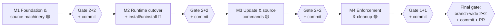

# AppAgent Install Sources — Execution Plan

> Companion to [README.md](./README.md) (the design). This plan sequences the design into
> **milestones** — each a self-contained unit of work that is independently reviewable and testable —
> built from smaller work items with concrete files, symbols, and design references.
> Framing matches the design: **clean-slate** (we may change provider/installer interfaces and
> on-disk formats), with a one-time migration shim (§8 of the design).

## Conventions

- **Paths** are repo-relative under `ts/`.
- Work is grouped into **milestones**. Each milestone is a coherent slice that builds, passes its tests,
  and leaves the product in a consistent state (no half-broken commands across a milestone boundary).
- Each milestone ends with a **Milestone Gate** (defined once below) — two subagent review rounds and two
  subagent test-gap rounds — before it is considered _done_.
- Within a milestone, each work item ends with a **Checkpoint**: it must build (`npm run build`), lint, and
  keep existing tests green before the next item starts.
- "Behavior-preserving" items ship without any user-visible change; "behavior-changing" items are called
  out explicitly.
- Estimated risk: 🟢 low / 🟡 medium / 🔴 high.
- **Working logs (update as you go):**
  - [DECISIONS_LOG.md](./DECISIONS_LOG.md) — every decision **not specified in** or **changed from** the
    design. Append the moment you make the call.
  - [DEFERRED_REVIEW_LOG.md](./DEFERRED_REVIEW_LOG.md) — every gate **review finding** or **test gap** you
    deliberately **did not address**, with a rationale.

## Source-of-truth file map (from current code)

| Concern | File |
| --- | --- |
| Provider + installer interfaces | `packages/dispatcher/dispatcher/src/agentProvider/agentProvider.ts` |
| `DispatcherOptions`, `installAppProvider`, `setAppAgentStates` | `packages/dispatcher/dispatcher/src/context/commandHandlerContext.ts` |
| `AppAgentManager` (`addProvider` / `removeAgent` / lazy init) | `packages/dispatcher/dispatcher/src/context/appAgentManager.ts` |
| `@install` / `@uninstall` handlers | `packages/dispatcher/dispatcher/src/context/system/handlers/installCommandHandlers.ts` |
| System agent handler registration | `packages/dispatcher/dispatcher/src/context/system/systemAgent.ts` |
| npm provider + `NpmAppAgentInfo` | `packages/dispatcher/nodeProviders/src/agentProvider/npmAgentProvider.ts` |
| Default providers + installer + feed/npm install | `packages/defaultAgentProvider/src/defaultAgentProviders.ts` |
| Config types | `packages/defaultAgentProvider/src/utils/config.ts` |
| Bundled agent map | `packages/defaultAgentProvider/data/config.json` |
| Repo policy checks | `tools/scripts/repo-policy-check.mjs` |
| Callers | `packages/shell/src/main/instance.ts`, `packages/agentServer/server/src/server.ts`, `packages/api/src/webDispatcher.ts`, `packages/defaultAgentProvider/src/collisions/*`, `packages/agents/onboarding/src/testing/runTests.ts` |

### Package layering (dependency direction — must stay acyclic)

Interfaces land in `agent-dispatcher` core; the feed/npm/Azure **implementation** lands in `default-agent-provider` (design §4.5 _Code / API organization_). The dispatcher core never gains a dependency on Azure DevOps, npm, or `az`.

| Package (npm name) | Role | What this plan adds |
| --- | --- | --- |
| `agent-dispatcher` | dispatcher core; command handlers | `installSource.ts` **interfaces**; `sources?()` on `AppAgentInstaller`; `@install`/`@update`/`@source` handlers |
| `dispatcher-node-providers` | npm loading mechanism | unchanged (`createNpmAppAgentProvider`) |
| `default-agent-provider` | reference host wiring | registry + path/catalog/feed **impl**, feed auth (`az`), `agents.json`, bundled catalog |

Rule for every phase: nothing in `agent-dispatcher` may `import` from `default-agent-provider`. Source-kind implementations and the registry impl live only in `default-agent-provider`.

---

## Milestone Gate (run at the end of every milestone)

A milestone is not _done_ when the code is written — it is done when it has passed this gate. Each step
dispatches a **fresh subagent** (use the `Explore` agent for read-only audits; write fixes in the main
session) scoped to **the milestone's diff and its design references**. Always run the build + full test
suite green _before_ starting the gate so the subagents review a working tree.

1. **Review round 1 — correctness & design fidelity.** Subagent audits the milestone diff against the
   cited design sections + the per-milestone _Review focus_. It returns a numbered list of findings
   (correctness, architecture/layering, security, error handling, style). The main session **addresses
   every finding** — fix it, or **log it in [DEFERRED_REVIEW_LOG.md](./DEFERRED_REVIEW_LOG.md)** with an
   explicit rationale for declining.
2. **Review round 2 — verification + fresh eyes.** A new subagent confirms round-1 findings are resolved
   and looks for anything introduced by the fixes or missed the first time. Address (or log) all findings.
3. **Test-gap round 1 — coverage audit.** Subagent enumerates untested behaviors and edge cases for the
   milestone's scope, cross-referencing the [test matrix](#cross-cutting-test-matrix) and the
   per-milestone _Test focus_. It returns a prioritized gap list. The main session **adds the missing
   tests** — or logs the gap in [DEFERRED_REVIEW_LOG.md](./DEFERRED_REVIEW_LOG.md) — and makes the suite pass.
4. **Test-gap round 2 — re-audit after fills.** A new subagent re-checks coverage against the now-larger
   test suite and reports remaining gaps. Fill them (or log them).
5. **Green gate.** `npm run build`, lint, and the full test suite pass; record any durable lessons in repo
   memory. Confirm [DECISIONS_LOG.md](./DECISIONS_LOG.md) and
   [DEFERRED_REVIEW_LOG.md](./DEFERRED_REVIEW_LOG.md) are up to date for this milestone.
6. **Commit.** Make a single milestone commit with a descriptive message (see _Commit convention_ below);
   include the milestone's working-log updates in the commit. Only then start the next milestone.

> Why two rounds each: round 1 finds the obvious issues; round 2 (fresh subagent, post-fix tree) catches
> regressions from the fixes and anything the first pass anchored past. The same logic applies to tests.

**Gate weight.** The _full gate_ is **2 review + 2 test-gap** rounds (Milestones 1–3, and the final
branch-wide gate). A _light gate_ is **1 review + 1 test-gap** round, used only for the low-risk hygiene
Milestone 4. Every gate still ends with the green gate + commit.

### Commit convention

After each milestone's gate is green, make **one commit** (squash the milestone's work-in-progress as
needed) with a clear message:

```
<area>: <milestone title> (Milestone N)

- what changed and why, in terms of the design (cite §sections)
- notable decisions / deviations and their rationale (see DECISIONS_LOG.md)
- review + test-gap rounds completed; tests added
- anything deliberately deferred (see DEFERRED_REVIEW_LOG.md)
- migration / behavior-change notes for reviewers
```

Use an `agents:` or `dispatcher:` area prefix to match the touched packages. Keep the milestone history
linear (one commit per milestone) so the branch reads as four reviewable steps plus a final review commit.

---

## Milestone 1 — Foundation & source machinery 🟢 (behavior-preserving)

**Goal.** Land the entire new substrate — types, bundled catalog, and the source/registry implementation —
fully unit-tested, while the old providers/installer still drive runtime. Nothing user-visible changes.

**Why it's a self-contained unit.** It is reviewable as "the new data model + acquisition machinery" in
isolation, and testable purely at the unit level. The live install path is untouched, so it cannot regress
the running product.

### 1.1 — Types & scaffolding (design §3, §4.1, §4.2)

1. **New file** `packages/dispatcher/dispatcher/src/agentProvider/installSource.ts`:
   - `InstallSourceKind`, `PathSourceConfig`, `FeedSourceConfig`, `CatalogSourceConfig`, `InstallSourceConfig`.
   - `ResolvedCandidate`, `InstallSource`, `InstallSourceRegistry`.
   - `InstalledAgentRecord` (with `kind` default-`"npm"` seam, `module?`, `path?`, `source`, `ref?`, `execMode?`).
2. Export the new types from the `agent-dispatcher` barrel (alongside `agentProvider.ts` exports).
3. **Do not** modify `AppAgentInstaller` yet — keep the old shape so nothing breaks.

**Checkpoint:** new types compile and are exported; zero runtime change.

### 1.2 — Bundled catalog data (design §3, §7)

1. Define the catalog JSON shape: `{ agents: { <name>: NpmAppAgentInfo & { preinstall?: boolean } } }`.
2. **Convert** `packages/defaultAgentProvider/data/config.json` `agents` map into a bundled catalog
   (e.g. `data/agents.catalog.json`) with **every current agent flagged `preinstall: true`** (§12 Q1 —
   launch behavior unchanged). Keep `explainers` / `tests` / `promptAppend` where they live today.
3. Add a loader that resolves `"<bundled>"` to this catalog.
4. Temporarily adapt `getDefaultNpmAppAgentProvider` to read the new catalog (still producing today's
   provider) so the data move is verified before the provider collapse in Milestone 2.

**Checkpoint:** app launches with the same default agents; diff is data-shape only.

### 1.3 — Sources + registry implementation (design §4.1) 🟡

1. **New files** under `packages/defaultAgentProvider/src/installSources/`:
   - `pathSource.ts` — `find` = `fs.stat`; `materialize` = record `{ path, source }`, omit `module` (§4.2, Q17).
   - `catalogSource.ts` — `find` = map lookup in catalog JSON (incl. `"<bundled>"`); `materialize` records
     `path` (relative paths resolve against catalog dir) or `module`; carries `execMode`/`preinstall` (Q6).
   - `feedSource.ts` — `find` = membership check against a **cached package list** (~1h TTL; offline →
     serve stale + skip in walk, Q3): Azure DevOps Artifacts REST enumeration (`packages` endpoint, paged)
     filtered by `scopes`, narrowed by packument `keywords` containing `typeagent-agent`. `materialize` =
     `npm install` into the shared feed install root `installSources.installDir` (default
     `<instanceDir>/installedAgents/node_modules`, replacing today's `externalagents`; §4.1 _Feed install
     location_, Q20); `execMode` defaults to `separate` (Q16).
   - `feedAuth.ts` — mint short-lived bearer via `az account get-access-token --resource 499b84ac-...`,
     write a **transient** `--userconfig` npm auth file; cache token in memory; actionable `az login`
     hint on failure (Q8). No persistent `.npmrc`.
2. **New file** `registry.ts` — `InstallSourceRegistry` impl (`list/get/order/setOrder/add/remove/resolve/where`);
   `resolve` = ordered parallel `find` (`Promise.all`), first match materializes; explicit `--source`
   non-match is a hard error (Q4).
3. **In-process async mutex** wrapping the *whole* install op (resolve → materialize → record write) and
   all `agents.json` reads/writes (Q5). Reuse/port the install-dir + auth helpers from
   `defaultAgentProviders.ts` (`ensureExternalAgentsNpmRoot`, `npmInstallAgent`).
4. **Unit tests** per source + registry (see Test focus).

**Checkpoint:** sources + registry fully unit-tested; still not used by the live install path.

### Milestone 1 Gate

- **Review focus:** interface fidelity to §3/§4.1/§4.2; **layering** (no `agent-dispatcher` →
  `default-agent-provider` import; impl lives only in `default-agent-provider`); feed-auth secret handling
  (token in memory only, transient `--userconfig`, nothing persisted); offline/error fallbacks in the feed
  enumeration; mutex correctness.
- **Test focus:** `path.find` stat hit/miss; `catalog.find` lookup incl. `<bundled>`; `feed.find` cache
  hit / stale-offline / REST-error fallback; keyword narrowing keeps agents and drops libraries;
  `registry.resolve` ordered first-match + explicit-`--source` non-match hard error; mutex serializes
  concurrent install ops.

---

## Milestone 2 — Runtime cutover: single provider + install/uninstall 🔴 (behavior-changing)

**Goal.** Flip the running product onto the new model end-to-end: one installed-agent provider backed by
`agents.json`, first-run pre-install, the legacy migration, the slimmed installer, the rewritten
`@install`/`@uninstall`, config seeding, and every host updated. After this milestone the app **runs on the
new architecture**; only the additive `@update`/`@source` commands and the policy/cleanup remain.

**Why it's a self-contained unit.** It is the coherent "the unification is live" slice: at its end the app
boots on a single provider across all hosts, agents install/uninstall through the registry, and the legacy
config is migrated. `@install` is rewritten in the **same** milestone as the installer contract change, so
install is never left broken across a boundary.

### 2.1 — `agents.json` store + single provider (design §4.2, §4.4) 🔴

1. Define `agents.json` read/write in `default-agent-provider`, under the Milestone-1 mutex.
2. `getDefaultAppAgentProviders` returns `[ installedProvider, mcpProvider ]` (drop `defaultNpm` +
   `external`). The installed provider is `createNpmAppAgentProvider` reading `agents.json` records; verify
   the `path`-vs-`module` discriminator (Q17 — today's loader already ignores `NpmAppAgentInfo.name` in its
   `info.path` branch).
3. **Provenance-based module roots (§4.1, Q20):** a `module` record resolves against a root chosen by its
   source — feed → `installSources.installDir`, bundled catalog → app bundle `node_modules`, `path` →
   explicit `path`. Wire this source-kind → root map when constructing the installed provider.

**Checkpoint:** installed provider loads a hand-written `agents.json` mixing builtin/feed/path records.

### 2.2 — Pre-install + migration (design §7, §8) 🔴

1. **Pre-install builtins (first run):** on empty `agents.json`, resolve each `preinstall` catalog entry
   into a record; **partial failure = warn + skip**, never abort startup (Q15).
2. **Migration shim (Q14):** read legacy `externalAgentsConfig.json`, migrate **only `path` entries**
   into records (`source: "path"`), rename the old file; drop legacy feed/npm entries.

**Checkpoint:** fresh instance pre-installs the full default set; legacy `path` agents migrate.

### 2.3 — Installer rewrite (design §4.3, §4.6, §4.7) 🟡

1. Update `AppAgentInstaller` in `agentProvider.ts`: `install(name, ref, sourceName?)` /
   `uninstall(name)` / optional `sources?(): InstallSourceRegistry`. Remove `installNpm` / path-vs-spec split.
2. `getDefaultAppAgentInstaller` becomes a thin wrapper over `registry.resolve(ref, sourceName)` + record
   write, returning a fresh provider (§4.6 reuses `installAppProvider` → `addProvider` + lazy init).
3. `uninstall` reuses `agents.removeAgent` + record drop under the mutex (§4.7).

**Checkpoint:** installer compiles against the new interface; old install methods gone.

### 2.4 — `@install` / `@uninstall` rewrite (design §5) 🟡

1. `@install <name> <ref> [--source <s>] [--where]` in `installCommandHandlers.ts`: drop `isNpmSpecifier`;
   route through `registry.resolve`; `--where` → `registry.where(ref)` dry-run; **name validation +
   uniqueness** against *all* providers before `materialize` (Q18); `@install` over an existing name → error (Q7).
2. `@uninstall` routes through the new `installer.uninstall`.

**Checkpoint:** `@install`/`@uninstall` work end-to-end against feed + local path/catalog.

### 2.5 — Configuration seeding (design §6) 🟢

1. Extend instance config types in `utils/config.ts` with an `installSources` block (`order` + `sources` +
   `installDir`).
2. Seed defaults from app config; ship default order `["path", "builtin", "typeagent"]`; dev checkout
   prepends `workspace`. Surface `installDir` (default `<instanceDir>/installedAgents`, `${ENV}`-expanded).

**Checkpoint:** registry is seeded from config at startup; `installDir` honored by feed installs.

### 2.6 — Caller updates (design §4.5) 🟢

Update every provider-builder call site to the two-provider shape:
`shell/src/main/instance.ts`, `agentServer/server/src/server.ts`, `api/src/webDispatcher.ts`,
`defaultAgentProvider/src/collisions/*`, `agents/onboarding/src/testing/runTests.ts` (custom providers,
no installer → no `@install`/`@source`, by design).

**Checkpoint:** all hosts boot; onboarding tests unaffected.

### Milestone 2 Gate

- **Review focus:** provider collapse correctness + load-root selection by provenance; migration safety
  (path kept, feed dropped, old file renamed not deleted in-place); no-restart register/teardown reuse
  (`installAppProvider` / `removeAgent`); mutex spans the whole install op incl. `npm install`; name
  validation runs before any disk/feed touch; no host regressions.
- **Test focus:** first-run pre-install (full set **and** partial-failure warn/skip); migration (path
  migrated, feed dropped, file renamed); `path`/`workspace` shadows feed via order; `@install` duplicate
  name → fast fail (no disk/feed); concurrent installs serialized (no `node_modules` interleave);
  uninstall tears down a live `SessionContext`; smoke-boot shell + agentServer + api on a fresh and a
  migrated instance.

---

## Milestone 3 — Update & source-management commands 🟡 (behavior-changing)

**Goal.** Complete the command UX with the additive `@update` and `@source` groups. Purely additive on top
of Milestone 2 — the installer interface is unchanged (`@update` is `uninstall`+`install` internally).

**Why it's a self-contained unit.** It adds two independent command surfaces with no change to the
provider/installer contracts; reviewable and testable as command-handler behavior + config persistence.

### 3.1 — `@update <name>` (design §5, §4.7) 🟡

Re-resolve against the **recorded source** per kind (feed bump / path refresh / catalog re-lookup);
remove-then-add, dropping the old record **only after** the new one materializes, so a failed update is a
no-op (Q13). Register the handler in `systemAgent.ts`.

**Checkpoint:** `@update` refreshes across all three kinds; a failed update leaves the old agent intact.

### 3.2 — `@source` group (design §5, §6) 🟡

`list` / `order <name>...` / `add feed|catalog|path` / `remove`, validating uniqueness, well-formed
registry URL (`feed`), readable catalog JSON (`catalog`); persists to the instance `installSources` block;
unknown/removed names in `order` are **ignored with a warning**, not a hard error. Registry reached via
`installer.sources()` (no new `DispatcherOptions` field). Register the handler in `systemAgent.ts`.

**Checkpoint:** `@source` add/remove/order round-trips and survives restart.

### Milestone 3 Gate

- **Review focus:** `@update` ordering (drop old only after materialize) across all kinds; `@source`
  validation + warn-not-error on unknown order entries; persistence shape matches §6; `--source` still
  works for sources omitted from `order`.
- **Test focus:** `@update` feed bump / path re-materialize / catalog re-lookup; failed `@update` = old
  intact (no-op); `@source add`/`remove`/`order` round-trip + restart persistence; bad registry URL /
  unreadable catalog rejected; unknown `order` entry warns and is skipped.

---

## Milestone 4 — Enforcement & cleanup 🟢 (behavior-preserving runtime)

**Goal.** Make the feed-enumeration marker enforceable and retire the old machinery.

**Why it's a self-contained unit.** Policy enforcement + dead-code removal + docs are orthogonal to the
runtime behavior shipped in Milestones 2–3; reviewable as a hygiene pass.

### 4.1 — Repo policy: agent keyword (design §4.1, §12 Q12) 🟢

1. Add a **new rule** to `tools/scripts/repo-policy-check.mjs`: a package that looks like an agent
   (`AppAgentManifest` export / `@typeagent/agent-sdk` dependency) **must** include `typeagent-agent` in
   `package.json` `keywords` — fail the build otherwise.
2. Add the keyword to existing agent packages' `package.json`.
3. Verify `npm run check:policy` passes.

**Checkpoint:** policy gate green; feed enumeration has a reliable marker.

### 4.2 — Cleanup & docs 🟢

1. Delete dead code: old `getDefaultNpmAppAgentProvider` / `getExternalAppAgentProvider`, `installNpm`,
   `externalAgentsConfig.json` writers, `isNpmSpecifier`.
2. Keep the migration shim for **one release**, then file a follow-up to delete it.
3. Update user-facing docs/help for `@install` / `@update` / `@source`.
4. Flip the design doc status from **Draft for review** to **Implemented**.

**Checkpoint:** no references to removed symbols; docs match shipped commands.

### Milestone 4 Gate (light — 1 review + 1 test-gap round)

Low-risk hygiene milestone, so a single round each (then green gate + commit).

- **Review focus:** policy rule's false-positive/negative balance (agent detection heuristic); no dangling
  references to removed symbols; docs/help accuracy.
- **Test focus:** policy rule positive + negative fixtures (agent missing keyword fails; library without
  keyword passes); grep gate for removed symbols; help text matches the three command groups.

---

## Final Gate — Branch-wide review 🔴 (full 2 + 2)

After Milestone 4 is committed, run the **full gate one more time over the entire branch diff**
(`git diff <base>...HEAD`), not just a single milestone. This catches issues that only emerge from the
whole change set: cross-milestone seams, an interface that drifted between milestones, dead code missed
by the incremental passes, and end-to-end behavior across the unified flow.

- **Scope:** the complete branch diff vs. the base branch, read against the whole design (README §§1–12).
- **Review round 1 / round 2:** same procedure as the Milestone Gate, but the subagent reviews the
  _aggregate_ diff — architecture coherence, layering held across all packages
  (`agent-dispatcher` never imports `default-agent-provider`), no leftover legacy paths, security of the
  feed-auth flow as finally wired, and that every design decision (§12 Q1–Q20) is reflected.
- **Test-gap round 1 / round 2:** audit total coverage across all milestones — every row of the
  [test matrix](#cross-cutting-test-matrix) is exercised, plus end-to-end paths that span milestones
  (e.g. first-run pre-install → `@install` from feed → `@update` → `@uninstall`).
- **Green gate + final commit:** full build/lint/test green; make a final review commit
  (`dispatcher: branch-wide review fixes (final gate)`) and open the PR.

---

## Cross-cutting test matrix

| Scenario | Milestone |
| --- | --- |
| Source `find`/`materialize` per kind (path/catalog/feed) | 1 |
| Feed cache hit (offline) → skip feed, no failure | 1 |
| Feed keyword narrowing keeps agents, drops libraries | 1 |
| Registry ordered first-match + explicit `--source` non-match error | 1 |
| Mutex serializes concurrent install ops | 1 |
| First run, empty `agents.json` → full default set pre-installed | 2 |
| Pre-install partial failure → warn + continue | 2 |
| Legacy `externalAgentsConfig.json` path entries migrate; feed entries dropped | 2 |
| Provenance-based load roots (feed vs bundled vs path) | 2 |
| `path` install shadows feed when ordered first | 2 |
| `@install` duplicate name → fast error, no disk/feed touch | 2 |
| Concurrent installs serialized (no `node_modules` interleave) | 2 |
| Uninstall tears down a live `SessionContext` | 2 |
| All hosts boot on fresh + migrated instance | 2 |
| Feed auth missing `az` → actionable `az login` hint | 2 |
| `@update` feed bump / path refresh / catalog re-lookup | 3 |
| Failed `@update` → old agent intact (no-op) | 3 |
| `@source` add/remove/order round-trip + restart persistence | 3 |
| `@source` bad URL / unreadable catalog rejected; unknown order entry warns | 3 |
| Policy rule: agent missing keyword fails, library passes | 4 |

## Deferred (per design §11) — not in this plan

- Supply-chain hardening (provenance/signature verification).
- Pre-install curation (demoting specific defaults — a per-agent `preinstall` flag flip later).
- `npm uninstall`/prune of `node_modules` cruft on uninstall.

## Milestone sequencing

Each gate ends with a **commit** (one per milestone); the branch reads as four milestone commits plus a
final review commit.



Milestone 1 is fully behavior-preserving and the lowest-risk place to validate the new model. Milestone 2 is
the critical cutover (highest risk; gate it hardest). Milestones 3–4 are additive/hygiene (4 uses the light
gate). The **final branch-wide gate** re-runs the full 2+2 over the aggregate diff before the PR. Each gate
must be green and committed before the next milestone starts.
