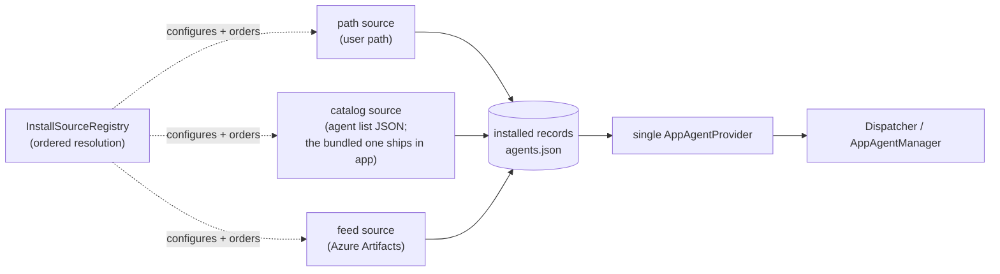
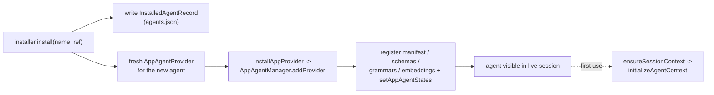
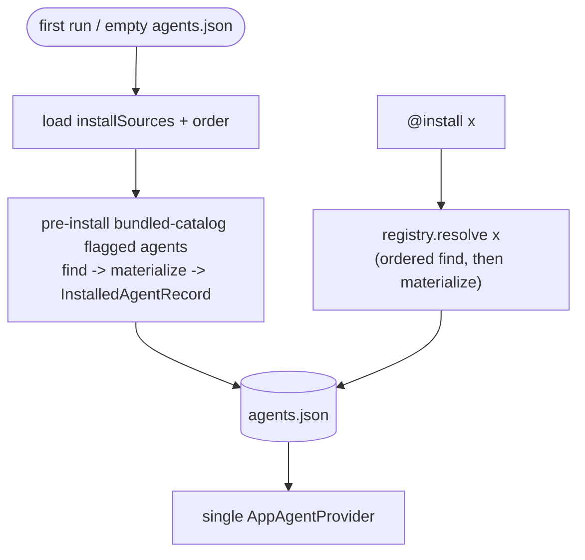
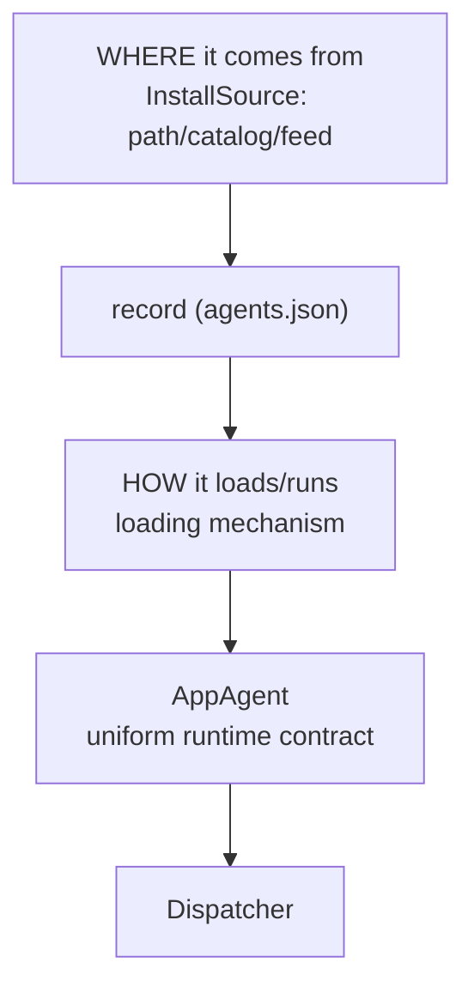

# AppAgent Install Sources - Design Doc

> Status: **Draft for review**
> Scope: `ts/packages/dispatcher` (provider + installer + registry interfaces), `ts/packages/defaultAgentProvider` (provider + installer impl, config), `@install` / `@source` command handlers.
> Framing: **clean-slate**. This design assumes we are free to change the provider/installer interfaces and the on-disk config formats without preserving backward compatibility. A one-time migration is described in §8.

## 1. Problem

Today an AppAgent reaches the dispatcher through three hard-wired ingress paths, fronted by two different providers:

1. **Bundled default** - every agent listed in [defaultAgentProvider/data/config.json](../../../packages/defaultAgentProvider/data/config.json) is loaded by `getDefaultNpmAppAgentProvider()`. Always present, compiled into the app.
2. **External path/tar install** - `AppAgentInstaller.install(name, moduleName, packagePath)` writes a `{ name, path }` entry into `externalAgentsConfig.json` and a second provider (`getExternalAppAgentProvider`) loads it.
3. **External npm install** - `AppAgentInstaller.installNpm(name, spec)` shells out to `npm install` against a single hard-coded Azure Artifacts feed (`TYPEAGENT_FEED_REGISTRY`) and writes a `{ name }` entry, also loaded by the external provider.

Problems:

- **The install source is implicit.** `@install foo @scope/foo@1.2.3` resolves against whatever the single `TYPEAGENT_FEED_REGISTRY` env var points at. No way to name, register, or choose among sources, and no record of where an installed agent came from.
- **Default agents are not installable.** Everything in `config.json` is always on. We want to move some of them out of the always-on bundle and install them on demand - from a local repo during development, from the Azure DevOps feed in shipped builds.
- **Two providers and three code paths** for what is conceptually one thing: "load an agent the dispatcher knows about." Bundled vs external is a distinction without a runtime difference (both end in `createNpmAppAgentProvider`).

## 2. The core idea

**Everything an agent can come from is an _install source_. Every agent the dispatcher runs is an _installed record_ loaded by a single provider.**



Consequences of this framing:

- **The bundled `config.json` becomes a bundled `catalog` source.** Its flagged agents are _pre-installed_ at first run, not special-cased by a separate provider or a separate source kind.
- **`getDefaultNpmAppAgentProvider` + `getExternalAppAgentProvider` collapse into one provider** that loads installed records regardless of origin.
- **"Demoting a default agent" stops being a migration step.** It is simply _not pre-installing_ that agent from the bundled catalog. Same machinery, one flag.
- **Source selection is a user-configurable order, not a hard-coded heuristic.** An unqualified `@install` walks the order and the first source that can resolve the `ref` wins (§4.1).
- **Sources and providers are orthogonal and stay that way.** A source _acquires + records_ an agent (one-shot). The provider _loads + runs_ it (session lifetime). No source kind ever loads an agent.

> Note: MCP agents keep their own provider (`createMcpAppAgentProvider`). This unification covers npm/path-style AppAgents only. MCP servers are configured, not installed, and are out of scope here.

## 3. Source kinds

Three kinds. All three resolve an agent into the same `InstalledAgentRecord` (§4.2); they differ only in how they acquire it and how cheaply they can answer "can I resolve this `ref`?".

| Kind      | Acquires by                                                  | `ref` means          | `find` cost          | Enumerable  |
| --------- | ------------------------------------------------------------ | -------------------- | -------------------- | ----------- |
| `path`    | validating a filesystem path the user supplies               | filesystem path      | stat (instant)       | no          |
| `catalog` | looking up a JSON list of available agents, recording a path | agent short name     | map lookup (instant) | yes         |
| `feed`    | `npm install` against an Azure Artifacts registry            | npm specifier / name | registry metadata    | cached list |

> **There is no separate `builtin` kind.** The agents the app ships with are just a `catalog` source whose JSON is bundled into the app (`catalog: "<bundled>"`). What makes them "default" is a per-entry `preinstall` flag (§4.2 pre-install), not a distinct source type.

`path` is now a **first-class ordered source**, not a special case. Because resolution is an ordered walk (§4.1) where each source is asked `find(ref)` before any work happens, a `path` source placed early simply claims `ref`s that exist on disk. There is no separate heuristic.

```ts
// dispatcher/src/agentProvider/installSource.ts
// Two layers, deliberately distinct:
//   *SourceConfig  - plain declarative data (what's in config.json)
//   InstallSource  - the live runtime object the registry builds from a config
export type InstallSourceKind = "path" | "catalog" | "feed";

export interface PathSourceConfig {
  kind: "path";
  name: string; // conventionally "path"
  baseDir?: string; // base for relative refs; default cwd / instance dir
}

export interface FeedSourceConfig {
  kind: "feed";
  name: string; // e.g. "typeagent"
  registry: string; // Azure Artifacts npm registry URL
  scopes: string[]; // e.g. ["@typeagent", "@secretagents"]
  // Auth: a short-lived bearer token minted by the Azure CLI
  // (`az account get-access-token`), injected into a transient npm auth
  // config - no persistent .npmrc creds / vsts-npm-auth / azureauth state.
}

export interface CatalogSourceConfig {
  kind: "catalog";
  name: string; // e.g. "builtin", "workspace"
  // A JSON file listing available agents, name -> full NpmAppAgentInfo
  // (module, path, execMode, ...) plus an optional `preinstall` flag (§4.2).
  // Not tied to a repo - it can live anywhere on the local filesystem; the
  // bundled "<bundled>" catalog is what ships with the app. In practice only
  // the bundled catalog sets `preinstall`. Relative package paths resolve
  // against the catalog's dir.
  catalog: string; // local filesystem path to the catalog JSON, or "<bundled>" (no remote URLs)
}

export type InstallSourceConfig =
  | PathSourceConfig
  | FeedSourceConfig
  | CatalogSourceConfig;
```

A `catalog` source points at a JSON file that lists the available agents. It can live in a repo, ship in the app, or sit anywhere on disk - it is just a name-to-package map, with an optional `preinstall` flag per entry:

```jsonc
// e.g. agents.catalog.json (preinstall entries are auto-installed at first run)
{
  "agents": {
    "montage": { "module": "montage-agent", "path": "montage" },
    "player": { "module": "music", "path": "player", "preinstall": true },
    "markdown": {
      "module": "markdown-agent",
      "path": "markdown",
      "execMode": "dispatcher",
    },
  },
}
```

## 4. Interfaces

### 4.1 Registry, sources, and ordered resolution

Source listing, **ordering**, and configuration live on the registry, not the installer. `@source` talks to the registry; the installer just _uses_ it.

Each source implements a two-phase contract so the registry can probe cheaply before doing any real work:

```ts
export interface ResolvedCandidate {
  source: string; // which source matched
  module?: string; // package name (npm-resolved; omitted when path-resolved)
  ref?: string; // feed specifier/version
  path?: string; // catalog / path result
  execMode?: ExecutionMode;
}

export interface InstallSource {
  readonly name: string;
  readonly kind: InstallSourceKind;
  // CHEAP + side-effect free: can this source resolve `ref`? A match is a
  // commitment - if find() returns a candidate, materialize() must succeed.
  find(ref: string): Promise<ResolvedCandidate | undefined>;
  // Does the actual work (npm install / copy / record).
  materialize(c: ResolvedCandidate): Promise<InstalledAgentRecord>;
  // Enumerable sources (path is not) advertise their agents.
  listAgents?(): Promise<string[]>;
}

export interface InstallSourceRegistry {
  list(): InstallSourceConfig[];
  get(name: string): InstallSource | undefined;

  // user-configurable resolution ORDER (replaces a single default).
  order(): InstallSource[];
  setOrder(names: string[]): void;

  // runtime configuration, persisted to instance config
  add(config: InstallSourceConfig): void;
  remove(name: string): void;

  // resolve a ref: explicit source, else walk the configured order.
  resolve(ref: string, sourceName?: string): Promise<InstalledAgentRecord>;
  // dry-run: report which source would win without materializing.
  where(ref: string): Promise<ResolvedCandidate | undefined>;
}
```

**Ordered resolution.** With no explicit `--source`, the registry walks `order()` and the first source whose `find` returns a candidate wins. A `find` that returns `undefined` is just a **non-match**, so the walk continues to the next source. The commitment is narrower and applies only _after_ a match: once a source's `find` returns a candidate, that source's `materialize` must succeed or hard-error - we do **not** silently fall through to the next source on a materialize failure (that keeps failures legible). With an explicit `--source`, a non-match is itself a hard error, since you named the source.

```ts
async resolve(ref, sourceName?) {
  if (sourceName) {
    const s = this.get(sourceName) ?? fail(`unknown source '${sourceName}'`);
    const c = (await s.find(ref)) ?? fail(`'${ref}' not found in '${sourceName}'`);
    return s.materialize(c);
  }
  // probe the ordered sources; cheap local sources resolve synchronously,
  // feed probes run against a cached list (see below).
  const order = this.order();
  const candidates = await Promise.all(order.map((s) => s.find(ref)));
  const i = candidates.findIndex((c) => c !== undefined);
  if (i < 0) fail(`no source could resolve '${ref}'. order: ${order.map(s=>s.name)}`);
  return order[i].materialize(candidates[i]!);
}
```

The **order is user-configurable and changeable at runtime** via `@source order ...` (§5), persisted to instance config. First-match-wins gives the override semantics dev wants: putting `workspace` (or `path`) ahead of `typeagent` makes a local agent shadow the feed automatically.

**Feed probe cost.** A `feed.find` must not run `npm install`. It checks the package against a **locally cached package list** for that feed (refreshed on a **~1h TTL** from the feed's package-list API - see _Feed enumeration_ below), so the common case is a cache hit with no network. **Offline**, the cache is served as-is and the feed is **skipped in the walk** rather than failing the install. Probes across the ordered sources also run **in parallel** (`Promise.all` above), so the slowest source (a cold feed cache) bounds latency rather than the sum. Cheap local sources (`path`, `catalog`) almost always answer first anyway; feeds are typically last in the order.

**Feed auth.** Both the metadata query and `materialize`'s `npm install` authenticate with a **short-lived bearer token minted by the Azure CLI** - `az account get-access-token --resource 499b84ac-1321-427f-aa17-267ca6975798` (the Azure DevOps resource GUID) - injected into a transient per-install npm auth config scoped to the feed `registry`. No persistent `.npmrc` credentials and no `vsts-npm-auth` / `azureauth` state. The token is cached in memory for its lifetime and re-minted on expiry. If `az` is not installed or not logged in, the install fails fast with an actionable `az login` hint (§5).

```ts
// sketch: mint a token and write a throwaway .npmrc next to the install
const { accessToken } = JSON.parse(
  await execFile("az", [
    "account",
    "get-access-token",
    "--resource",
    "499b84ac-1321-427f-aa17-267ca6975798", // Azure DevOps
    "--output",
    "json",
  ]),
);
// registry "https://pkgs.dev.azure.com/org/proj/_packaging/feed/npm/registry/"
// -> auth key is the registry path without scheme, trailing slash kept
const authKey = registry.replace(/^https:/, "");
const npmrc =
  `${registry.replace(/registry\/?$/, "")}:_authToken=${accessToken}\n` +
  `${authKey}:_authToken=${accessToken}\n` +
  `${authKey}:always-auth=true\n`;
// pass via a temp userconfig so nothing persists:
//   npm install <spec> --userconfig <tmp.npmrc> --registry <registry>
```

**Feed enumeration (which packages are app agents).** Azure Artifacts npm feeds do **not** support `npm search`, so we enumerate with the **Azure DevOps Artifacts Packaging REST API** (same bearer token as above), then narrow to actual agents in two steps:

1. **List packages in the feed**, filtered to the source's configured `scopes`:
   ```
   GET https://feeds.dev.azure.com/{org}/{project}/_apis/packaging/feeds/{feed}/packages
       ?protocolType=Npm&packageNameQuery=@typeagent&$top=...&api-version=7.1-preview.1
   ```
   For the sample registry `.../msctoproj/AI_Systems/_packaging/typeagent/...` that is org `msctoproj`, project `AI_Systems`, feed `typeagent`. Returns package names + versions, but **not** whether each is an agent. The packages endpoint is **paged** (`$top`/`$skip` with a continuation token); enumeration walks the pages to completion, and on any REST error it falls back to the last cached list (same offline behavior as §12 Q3) rather than failing the walk.
2. **Keep only packages marked as agents.** Scope membership is not sufficient - support libraries (e.g. `@typeagent/agent-sdk`) live in the same scope. An app agent declares a sentinel **keyword** in its `package.json` (e.g. `"keywords": ["typeagent-agent"]`); we read it from the package's npm metadata (the packument `GET {registry}/{packageName}`, parallelized across candidates) and drop anything without it.

How the marker is populated: `keywords` is author-controlled `package.json` metadata that `npm publish` copies verbatim into the registry. Agent authors **add the keyword manually** (one line in the agent's `package.json`), and a **new rule added to the repo's check-policy script** (`npm run check:policy` -> `tools/scripts/repo-policy-check.mjs`, an existing PR build gate - but the keyword rule itself is **new work**, §8) **validates** it - failing the build if a package that looks like an agent (an `AppAgentManifest` export / `@typeagent/agent-sdk` dependency) is missing `typeagent-agent` from `keywords`. This keeps the source of truth in the package itself, with policy enforcement catching omissions rather than build-time magic injecting state. (The same packument also carries the full per-version `package.json`, so a structured field like `"typeagent": { "agent": true }` could replace the keyword; the keyword is just the conventional, search-visible choice.)

The result is the cached package list: `listAgents()` returns it (for `@install` discovery and "no source matched" errors), and `feed.find` is a membership check against it. The list is refreshed on the ~1h TTL and served stale when offline.

> Alternative considered: treat every scoped package as an agent (skip the keyword check). Rejected because it surfaces shared libraries as installable agents. The keyword marker also future-proofs adding non-agent packages to the same feed.

**Feed install execMode.** A feed-installed agent has no catalog entry to carry `execMode`, so `materialize` defaults it to `separate` (SeparateProcess) unless the package's own manifest specifies otherwise. `path`/`catalog` installs continue to take `execMode` from their catalog entry (§3, Q6).

### 4.2 Installed record (single shape the provider loads)

```ts
export interface InstalledAgentRecord {
  name: string; // dispatcher agent name
  kind: string; // loading mechanism; "npm" today (reserved seam, see §10)
  module?: string; // package name; present only for npm-resolved records (see below)
  path?: string; // present for catalog / path installs
  source: string; // provenance, required
  ref?: string; // feed specifier/version
  execMode?: ExecutionMode;
}
```

Persisted as the single `agents.json` (replacing both the bundled `agents` map at runtime and `externalAgentsConfig.json`):

```jsonc
// instanceDir/agents.json
{
  "agents": {
    "player": { "name": "player", "module": "music", "source": "builtin" },
    "spelunker": {
      "name": "spelunker",
      "module": "@typeagent/spelunker-agent",
      "source": "typeagent",
      "ref": "@typeagent/spelunker-agent@1.4.0",
    },
    "montage": {
      "name": "montage",
      "path": "/repo/ts/packages/agents/montage",
      "source": "workspace",
    },
    "myagent": {
      "name": "myagent",
      "path": "/home/me/dev/my-agent",
      "source": "path", // path source (§3)
    },
  },
}
```

A record carries **exactly one resolution handle**: `module` (package name, npm-resolved) **or** `path` (filesystem-resolved). A `feed` install and the bundled `<bundled>` catalog's entries resolve by package name out of a shared `node_modules`, so they carry `module` and no `path`. A `path`/`workspace` catalog and a `path` install resolve from the filesystem, so they carry `path` and **omit `module`** - the package name is unused at load time (today's loader already ignores `NpmAppAgentInfo.name` in its `info.path` branch) and is derivable from `path/package.json` if ever needed for display. The presence of `path` is the discriminator at load time (§12 Q17).

### 4.3 Installer (single entry point)

```ts
export interface AppAgentInstaller {
  // Install `ref`. With no sourceName, the registry walks the configured
  // order (4.1) and the first matching source wins.
  install(
    name: string,
    ref: string, // interpreted by the matching source
    sourceName?: string, // explicit source bypasses the order
  ): Promise<AppAgentProvider>;

  uninstall(name: string): Promise<void>;
}
```

The installer is a thin wrapper over `registry.resolve(ref, sourceName)` plus writing the resulting `InstalledAgentRecord` to `agents.json`. No `installNpm` / `installPath` / `installFrom` variants: a path is just the `path` source, a feed install is just the `feed` source. `install` returns a freshly built provider for the just-installed agent so the dispatcher can register it into the live session without a restart (the registration + lazy-initialization path is detailed in §4.6). (The installer also carries an optional `sources()` accessor for the `@source` command - see §4.5.)

### 4.4 Provider (unchanged contract)

The runtime `AppAgentProvider` contract (`getAppAgentNames` / `getAppAgentManifest` / `loadAppAgent` / `unloadAppAgent`) is unchanged. There is now exactly **one** instance of it for installed agents, backed by `createNpmAppAgentProvider` reading `agents.json`. Sources feed it; they do not replace it.

### 4.5 Library / host embedding boundary (unchanged)

**The dispatcher-as-a-library contract does not change.** Sources, the registry, and ordered resolution live entirely in `defaultAgentProvider`, not in the dispatcher core. The dispatcher still depends only on the `AppAgentProvider` runtime contract (§4.4) and the optional `AppAgentInstaller`, both injected via `DispatcherOptions`:

```ts
// commandHandlerContext.ts (today, unchanged shape)
appAgentProviders?: AppAgentProvider[]; // host supplies its providers
agentInstaller?: AppAgentInstaller;     // optional; enables @install / @source
```

The "single installed-agent provider" (§4.4) is just **one `AppAgentProvider` that the default host assembles** via `getDefaultAppAgentProviders()`. It is a change to how `defaultAgentProvider` builds its providers, not to what the dispatcher accepts. Three host shapes coexist unchanged:

| Host                                       | Injects                                                           | Gets                                                       |
| ------------------------------------------ | ----------------------------------------------------------------- | ---------------------------------------------------------- |
| Custom / test (e.g. `onboarding/runTests`) | its own `appAgentProviders`, no installer                         | runs those agents; no `@install` / `@source`. Zero impact. |
| Default (shell, CLI, agentServer)          | `getDefaultAppAgentProviders()` + `getDefaultAppAgentInstaller()` | same call sites; sources + registry built internally.      |
| Embedder wanting sources                   | a host-built installer that owns a registry                       | full install/source surface.                               |

The only thing that must reach the dispatcher core is the new `@source` command, the same way `@install` reaches `agentInstaller` today. To avoid a second optional injection, **the registry hangs off the installer** rather than becoming a new `DispatcherOptions` field:

```ts
export interface AppAgentInstaller {
  install(
    name: string,
    ref: string,
    sourceName?: string,
  ): Promise<AppAgentProvider>;
  uninstall(name: string): Promise<void>;
  // host-owned registry powering @source; absent -> @source unavailable
  sources?(): InstallSourceRegistry;
}
```

So the rule stays coherent: **inject an installer and you get both `@install` and `@source`; inject none and you get neither** - matching today's "no installer, no `@install`" behavior. A host that brings its own `appAgentProviders` and no installer never sees a source.

### 4.6 Post-install: making the agent live (no restart)

Installing writes an `InstalledAgentRecord` to `agents.json`, but that record is inert until the running dispatcher is told about it. This reuses the **existing** registration path - no new mechanism:

1. **`install` returns a fresh `AppAgentProvider`** scoped to the just-installed agent (today `getDefaultAppAgentInstaller.install` already returns a `createNpmAppAgentProvider` for the new entry).
2. The dispatcher registers it via **`installAppProvider(context, provider)` -> `AppAgentManager.addProvider(provider, ...)`**, which discovers the agent name, parses its manifest/schemas, builds grammars + action embeddings, then runs `setAppAgentStates` and re-runs static collision detection against the live session (degraded to a warning so an install can never crash an active session).
3. **Initialization is lazy, not at register time.** The agent's `SessionContext` is created the first time it is enabled/used, through the normal `ensureSessionContext` -> `ensureAppAgent` (`provider.loadAppAgent`) -> `initializeAgentContext` lifecycle. So "signal that a new agent needs to be initialized" = _register the provider_ (eager) + _the existing lazy session-context lifecycle_ (on first use).



The only change from today is that `install` is the single entry point (no `installNpm`/`installPath` variants) and the provider it returns is the unified installed-agent provider; the `addProvider` + lazy-init path is untouched. For pre-installed builtins (§7), the same `addProvider` runs at startup as part of normal provider wiring, so first run and post-install share one code path.

### 4.7 Uninstall / update: removing a live agent (no restart)

`uninstall` (and the uninstall half of `@update`) is the symmetric inverse of §4.6 and reuses the **existing** teardown path - no new mechanism:

1. **Drop the record** from `agents.json`, under the same async lock as writes (§12 Q5).
2. **Unregister from the live session** via the existing `agents.removeAgent(name, grammarStore)` (today's `@uninstall` path), which calls the owning provider's `unloadAppAgent`, tears down the agent's `SessionContext` if one was created, and removes its schemas / grammars / action embeddings from the live caches.
3. **Re-scan collisions.** Removing schemas can only relax collisions, so this is a warning-level refresh, never a hard failure.

`@update` chains this with §4.6 (`removeAgent` then `addProvider` for the freshly materialized record). Ordering matters: the old record is dropped **only after** the new one materializes, so a failed `@update` is a no-op (the old agent stays) rather than a half-removed agent. If the agent had an active `SessionContext`, it is torn down on remove and lazily re-created on next use against the new version - no restart.

## 5. Command surfaces

### `@install`

```
@install <name> <ref> [--source <sourceName>] [--where]
```

Resolution:

1. `--source <s>` given -> `registry.resolve(ref, s)`; bypasses the order, `ref` interpreted by that source. Errors if `s` cannot resolve `ref`.
2. Otherwise -> `registry.resolve(ref)` walks the configured order (§4.1); first matching source wins.
3. `--where` -> runs `registry.where(ref)` and reports which source _would_ win (and the candidate) without installing.
4. No source matches -> error listing the order and (for enumerable sources) their advertised agents.

There is no path/specifier heuristic: the ordered walk plus each source's `find` replaces it. A `ref` that exists on disk is claimed by the `path` source; a short name is claimed by a `catalog`; a specifier by `feed` - purely by their position in the order.

**Name validation.** `<name>` must be a legal dispatcher agent identifier and must not already be in use by **any** provider (installed records, inline/system agents, or MCP) - not just an existing `agents.json` entry. Both checks run before `materialize`, so a bad or colliding name fails fast without touching disk or the feed (§12 Q18).

A feed auth failure surfaces an actionable hint with the exact `az login` command to run, not a raw error.

### `@update`

```
@update <name>            # bump an installed agent to a newer version
```

`@install` over an **existing** name is an error, not a silent reinstall. `@update <name>` looks up the record and re-resolves it against its **recorded source**, using the record's original ref for that source kind:

- **feed** - re-resolve the _unpinned_ module against the feed, picking up a newer published version.
- **path** - re-materialize from the recorded `path` (picks up a moved/rebuilt local agent); a refresh.
- **catalog** - re-look-up the agent's short name in the catalog (picks up an entry that now points elsewhere).

It then rewrites the record and re-registers the refreshed provider (§4.6). Mechanically it is the remove-then-add of §4.7 with re-resolution through the recorded source, so the installer interface stays at just `install` / `uninstall`. For `path`/`catalog` with no upstream change, `@update` is a harmless refresh rather than an error.

### `@source`

```
@source list                 # shows sources AND the current resolution order
@source order <name>...       # set the resolution order (subset allowed; rest appended)
@source add feed <name> --registry <url> [--scope <scope>]...
@source add catalog <name> --catalog <path>
@source add path <name> [--baseDir <path>]
@source remove <name>
```

Validation on `add`: unique name, well-formed registry URL (`feed`), readable catalog JSON (`catalog`). `@source order` and `add`/`remove` persist to the instance `installSources` block. `order` entries that name an unknown or removed source are **ignored with a warning** (not a hard error), and configured sources missing from `order` are still usable via `--source` but are not auto-probed (§6).

## 6. Configuration

Sources and their resolution **order** are seeded from app config and extended at runtime; both persist to instance config.

```jsonc
// app seed (shipped) and/or instance config.json (runtime edits land here)
{
  "installSources": {
    // user-configurable resolution order (first match wins). Names not listed
    // here are still usable via --source but are not auto-probed.
    "order": ["path", "workspace", "builtin", "typeagent"],
    "sources": [
      { "kind": "path", "name": "path" },
      { "kind": "catalog", "name": "builtin", "catalog": "<bundled>" },
      {
        "kind": "catalog",
        "name": "workspace",
        "catalog": "${TYPEAGENT_REPO_ROOT}/ts/packages/agents/agents.catalog.json",
      },
      {
        "kind": "feed",
        "name": "typeagent",
        "registry": "https://pkgs.dev.azure.com/msctoproj/AI_Systems/_packaging/typeagent/npm/registry/",
        "scopes": ["@secretagents", "@typeagent"],
      },
    ],
  },
}
```

A shipped build might ship `order: ["path", "builtin", "typeagent"]`; a dev checkout prepends `workspace`. Changing dev-vs-shipped behavior is one `@source order` command or one config line, with no code or env-var changes (`TYPEAGENT_FEED_REGISTRY` is just the seed value for the shipped `feed` source).

## 7. Pre-installing builtins (first run)

On first run with an empty `agents.json`, the dispatcher pre-installs the bundled catalog's flagged agents (initially today's full default set, so launch behavior is unchanged; demotion to installable-on-demand is later curation - §12) by resolving each into an `InstalledAgentRecord`. Everything else in the bundled catalog - and everything in the other `catalog`/`feed` sources - is installable on demand. "Demote agent X" = drop its `preinstall` flag in the bundled catalog; it stays installable, nothing else changes.

**Partial failure is non-fatal.** If a flagged builtin fails to materialize at first run, it is logged as a warning and skipped; launch continues and the agent can be `@install`ed later. Pre-install never aborts startup (§12 Q15).



## 8. Affected components and migration

### Components

- **dispatcher**: `installSource.ts` (3 source kinds + `InstallSourceRegistry` with ordered `find`/`materialize` resolution), slimmed `AppAgentInstaller` (`install` / `uninstall`), single installed-agent provider, bundled-catalog pre-install step, `@install` rewrite (ordered walk + `--where`), new `@update` command, new `@source` command group (incl. `order`).
- **defaultAgentProvider**: implement the registry + installer; `feed` source `find` checks a cached package list (~1h TTL, offline = serve cache + skip feed) and `materialize` wraps `npm install` (was `npmInstallAgent`); feed auth uses an Azure CLI access token (`az account get-access-token`) injected into a transient npm auth config, with an actionable `az login` hint on failure; `catalog` `find` does a catalog lookup (the bundled catalog is just one such source); `path` `find` stats the filesystem; serialize the **whole install op** (incl. `npm install` into the shared install dir) and the `agents.json` read/write behind one in-process async lock; persist `installSources` (sources + order).
- **repo**: the bundled catalog JSON (was `data/config.json` `agents`); mark which entries are `preinstall`; add the `typeagent-agent`-keyword rule to `repo-policy-check.mjs` (§4.1) and add the keyword to existing agent packages' `package.json`.
- **callers**: `getDefaultAppAgentProviders` returns `[ installedProvider, mcpProvider ]` instead of `[ defaultNpm, mcp, external ]`. Update `shell/instance.ts`, `agentServer`, collisions runners, onboarding tests.

### One-time migration (the cost of clean-slate)

- **`externalAgentsConfig.json` -> `agents.json`.** A startup shim reads any legacy `externalAgentsConfig.json` and migrates **only `path` entries** into `InstalledAgentRecord` form (`source: "path"`), then renames the old file. Legacy npm/feed entries (installed via `TYPEAGENT_FEED_REGISTRY`) are **dropped** rather than guessed into a `feed` source - the user re-installs them from the configured feed (§12 Q14). One release of shim code, then delete.
- **`data/config.json` `agents` map -> bundled catalog JSON** with `preinstall` flags. Mechanical.
- Dev instances can simply be reset instead of migrated.

## 9. What we gain vs. the back-compat design

- One provider, not two. One installed-record shape, not "bundled map" + "external config" + "npm entry".
- Installer drops from ~7 (mostly optional) methods to 2 required ones; routing logic moves into the registry's ordered `find`/`materialize` walk.
- No env-var shim, no "legacy entry without source" branch, no §4.7-style migration concept - demotion is a flag.
- No path/specifier heuristic: resolution is **data** (a user-configurable order), not branching code. `path` is a normal source again.

## 10. Future: loading-mechanism extensibility (not building now)

> Forward-looking note, captured so the on-disk format does not foreclose it. We are **not** building a loader registry now (npm is the only installable mechanism). We only **reserve the seam** (the `kind` field on `InstalledAgentRecord`, §4.2).

There are three orthogonal concerns; today acquisition and mechanism are partly conflated:



`AppAgentProvider` encodes _enumeration + lifecycle_, but the **loading mechanism** lives in the _implementation_, not the interface: `createNpmAppAgentProvider` is the npm mechanism, `createMcpAppAgentProvider` is the MCP mechanism. `AppAgent` is the stable narrow waist; everything above it is swappable. So there are two extension seams at two granularities:

- **Seam A - add a provider (coarse).** A world with its **own acquisition + configuration lifecycle that is not installed** gets its own `AppAgentProvider` in `appAgentProviders[]`. MCP is the canonical example (servers are _configured_, not installed). No dispatcher change.
- **Seam B - add a loader (fine).** A mechanism that is **installed/recorded like any other agent and only _runs_ differently** registers an `AppAgentLoader` keyed by `record.kind` under the unified provider, inheriting sources, ordered resolution, `agents.json`, and pre-install for free.

```ts
export interface AppAgentLoader {
  readonly kind: string; // matches InstalledAgentRecord.kind
  getManifest(rec: InstalledAgentRecord): Promise<AppAgentManifest>;
  load(rec: InstalledAgentRecord): Promise<AppAgent>;
  unload(rec: InstalledAgentRecord): Promise<void>;
}
```

The unified provider would become a router holding a `kind -> AppAgentLoader` registry (a registry of one - `"npm"` - until a second mechanism exists). `find`/`materialize` set `kind`, so a single source could even deliver mixed kinds.

**Canonical rule:** `AppAgent` is the stable contract; pick the seam by where the mechanism's lifecycle lives. Never push mechanism knowledge below the waist (into the dispatcher or the `AppAgent` contract).

**MCP reframed:** it sits on Seam A today, which is legitimate. The day `@install <some-mcp-server>` should work, MCP moves to Seam B as `kind: "mcp"`. Reserving `kind` now (default `"npm"`) makes that a loader registration rather than an on-disk-format retrofit.

## 11. Open questions (deferred)

1. **Supply-chain hardening.** A `feed` install runs arbitrary `npm` lifecycle scripts. Today the trust boundary is **who can publish to the Azure Artifacts feed** (internal, access-controlled), so we ship without an extra gate. Revisit if self-serve install ever opens to less-trusted feeds; options then include npm provenance / signature verification (Sigstore attestations proving a package was built from a known repo + CI and not tampered with in the registry) or a trust prompt for unknown scopes.
2. **Pre-install curation.** The exact list of default agents to later demote from `preinstall` to installable-on-demand. §12 decides to start with the full current set; trimming it is a follow-up.
3. **Uninstall leaves `node_modules` cruft.** Dropping a feed agent's record and unloading it does not `npm uninstall`/prune the package from the shared `instanceDir/externalagents/node_modules` (disk-only cruft, no runtime effect). An uninstall-time or periodic prune is a follow-up.

## 12. Decision log

1. **Pre-install set (Q1).** First run pre-installs today's full default agent set, so launch behavior is unchanged. Demotion to installable-on-demand is follow-up curation, done per agent by dropping the `preinstall` flag.
2. **Shadowing (Q2).** Resolution stays first-match-wins and silent. `@install --where` and `@source list` (which show the order) are the inspection tools; no ambiguity warning or error.
3. **Feed cache (Q3).** The cached feed package list has a ~1h TTL. Offline, the cache is served as-is and the feed is skipped in the walk rather than failing the install.
4. **find / materialize commitment (Q4).** `find` returning `undefined` is a non-match and the ordered walk continues. The commitment applies only after a match: a source whose `find` matched must `materialize` or hard-error - no silent fall-through. With an explicit `--source`, a non-match is itself a hard error.
5. **agents.json writes + install serialization (Q5).** The instanceDir is already single-owner per session, so an in-process async mutex is sufficient (no cross-process file lock). The mutex wraps the **whole install op** - `resolve` -> `materialize` -> record write - not just the JSON write, so concurrent installs can't interleave `npm install` into the shared `instanceDir/externalagents/node_modules` (§4.1) or race the read-modify-write of `agents.json`. Atomic temp+rename is a cheap optional safeguard.
6. **Catalog fields (Q6).** Catalog entries carry full `NpmAppAgentInfo` (`execMode`, etc.) plus the optional `preinstall` flag.
7. **Update (Q7).** Version bumps use an explicit `@update <name>` (re-resolve the unpinned module against the recorded source). `@install` over an existing name is an error. Implemented as `uninstall` + `install`, so the installer interface stays at two methods.
8. **Auth UX (Q8).** Feed auth uses a short-lived bearer token from the **Azure CLI** (`az account get-access-token --resource 499b84ac-1321-427f-aa17-267ca6975798`) injected into a transient npm auth config - no persistent `.npmrc` / `vsts-npm-auth` / `azureauth` state. Failures (missing or logged-out `az`) surface an actionable `az login` hint.
9. **Supply-chain (Q9).** Deferred / out of scope: the feed's publish access is the trust boundary today. Tracked in §11.
10. **Naming (Q10).** Keep `catalog` for the source kind and `ref` for the install argument.
11. **Uninstall/update teardown (Q11).** `uninstall` reuses the existing `agents.removeAgent` path (`unloadAppAgent` + schema/grammar/embedding teardown + warning-level collision re-scan). `@update` chains remove + add and drops the old record **only after** the new one materializes, so a failed update is a no-op (§4.7).
12. **Agent keyword policy (Q12).** The `typeagent-agent` keyword marker is enforced by a **new** rule added to the existing `repo-policy-check.mjs` (not a pre-existing gate); it fails the build when a package that looks like an agent (`AppAgentManifest` export / `@typeagent/agent-sdk` dependency) lacks the keyword (§4.1).
13. **@update across kinds (Q13).** `@update` re-resolves against the recorded source per kind: feed picks up a newer version; path re-materializes the recorded path; catalog re-looks-up the short name. No upstream change is a harmless refresh, not an error (§5).
14. **Migration drops feed entries (Q14).** The `externalAgentsConfig.json -> agents.json` shim migrates only `path` entries. Legacy npm/feed entries (via `TYPEAGENT_FEED_REGISTRY`) are dropped and re-installed from the configured `feed` source, avoiding a guess about which feed a legacy entry came from (§8).
15. **First-run partial failure (Q15).** If a flagged builtin fails to materialize at first run, it is logged as a warning and skipped; launch continues and the agent can be `@install`ed later. Pre-install never aborts startup (§7).
16. **Feed execMode default (Q16).** A feed-installed agent (no catalog entry to carry `execMode`) defaults to `separate` (SeparateProcess) unless its package manifest specifies otherwise (§4.1).
17. **`module` is optional, present only for npm-resolved records (Q17).** A record carries exactly one resolution handle: `module` (package name - `feed` installs and the `<bundled>` catalog's module-only entries) **or** `path` (`path`/`workspace` catalogs and `path` installs). Path-resolved records omit `module`; it is unused at load time and derivable from `path/package.json`. This matches today's loader, which already ignores `NpmAppAgentInfo.name` in its `info.path` branch. The only field change is that today's `NpmAppAgentInfo.name` (package name) maps to the record's `module`, while the agent name (today the config map key) becomes the record's `name`.
18. **Install name validation + uniqueness (Q18).** `@install <name>` validates that `<name>` is a legal dispatcher identifier and is not already used by **any** provider (installed records, inline/system, or MCP), before `materialize` - so a bad or colliding name fails fast without touching disk or the feed (§5).
19. **Catalog sources are local-only (Q19).** A `catalog` points at a local filesystem path (or `<bundled>`); remote catalog URLs are not supported (they would need feed-style fetch/cache/auth). Remote distribution is the `feed` source's job (§3).
