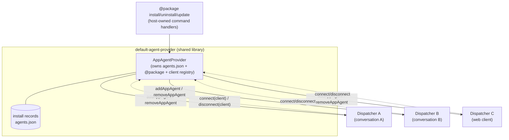

# Connected AppAgent Provider — Design Doc

> Status: **Proposal / for iteration**
> Scope: `ts/packages/dispatcher` (provider interface, the dispatcher-side
> "client" callback that registers/unregisters live agents, removal of the
> `AppAgentInstaller` interface and the four core `@package` handlers),
> `ts/packages/defaultAgentProvider` (host-owned `@package` command surface,
> install-record store, source taxonomy, fan-out), and the host wiring in
> `ts/packages/agentServer` / `ts/packages/api`.
> Framing: **clean-slate**. Assumes we may change the provider interface and the
> dispatcher↔provider relationship without preserving backward compatibility.
> Builds directly on the [AppAgent Install Sources](../agentInstallSource/DESIGN.md)
> design; read that first for the source/record/registry model, which is unchanged.

## 1. Problem

The install-sources design ([agentInstallSource/DESIGN.md](../agentInstallSource/DESIGN.md))
split "the set of agents the dispatcher can run" across **two** interfaces:

- `AppAgentProvider` — the **read** side: enumerate / load / unload agents.
- `AppAgentInstaller` — the **write** side: `install` / `uninstall` / `update`
  plus the accessors that back the `@package` command (`listInstalled`,
  `listSources`, `listAvailable`, `sourceCommands`).

The dispatcher **core** owns the `@package install|uninstall|update|list`
handlers, calls `installer.install()`, and then wires the returned provider into
the live session via `installAppProvider(context, provider)`. The host
contributes only the `@package source` sub-table via `sourceCommands()`.

Two problems motivate this revision:

1. **A live install only reaches the dispatcher that issued it.**
   `installer.install()` returns a _fresh single-agent provider_, and
   `installAppProvider` registers it into **one** `CommandHandlerContext`'s
   `AppAgentManager`. In the agent server, a **single** provider + installer
   instance is shared across **N** per-conversation dispatchers (every
   per-conversation `createSharedDispatcher` spreads the same `baseOptions` —
   see [conversationManager.ts](../../../packages/agentServer/server/src/conversationManager.ts)).
   The shared base provider is never mutated, so `@package install` in
   conversation A **never reaches conversation B live** — B only sees the new
   agent after a full process restart. The current architecture has no fan-out
   mechanism; this is a correctness gap, not just an ergonomic one.

2. **Two interfaces describe one thing.** A read-provider and a write-installer
   that refer to the same set of agents are redundant. Install/uninstall state
   (the `agents.json` record store) lives on the installer; the agents it
   produces are read through the provider. Collocating both — plus the
   `@package` grammar that mutates them — in one object is simpler and puts the
   command surface where the state it mutates lives.

> Out of scope: the source taxonomy (path / catalog / feed), the registry, feed
> auth, `npm install`, record shapes, and `@package source`. All of that is
> unchanged from the install-sources design and stays in `default-agent-provider`.

## 2. The core idea

**A provider is not a passive table the dispatcher reads. It is a service that
multiple dispatchers _connect_ to. The provider owns the set of agents and the
operations that mutate it; each connected dispatcher exposes a narrow callback
the provider uses to register/unregister agents into that dispatcher's live
state.**



Consequences of this framing:

- **`AppAgentInstaller` is removed.** Its `install` / `uninstall` / `update` move
  into host-owned `@package` command handlers; its `listInstalled` /
  `listSources` / `listAvailable` / `sourceCommands` accessors are already
  host-rendered and simply stay in the host.
- **The four core `@package` handlers are removed** from the dispatcher. The host
  contributes the **entire** `@package` table (today it contributes only
  `@package source`), built in the shared `default-agent-provider` library so
  every host composes/extends one implementation rather than re-implementing it.
- **The dispatcher exposes a small client interface** (`AppAgentHost`, §3) with
  exactly the two operations the provider needs: register a now-available agent,
  and unregister a now-gone one. These are the existing `installAppProvider` /
  `AppAgentManager.removeAgent` bodies, surfaced as a supported callback.
- **Install fans out.** A `@package install` resolves + writes the record once,
  then the provider calls `addAppAgent(name)` on **every** connected dispatcher.
  The multi-dispatcher gap (§1.1) closes by construction.
- **Each dispatcher decides enable-state locally** (§5). The provider says "this
  agent now exists"; whether it is on or off in a given session is the
  dispatcher's policy, driven by session config.

## 3. Interfaces

### 3.1 `AppAgentHost` — the dispatcher-side client callback

The dispatcher passes one of these to the provider when it connects. It is the
_only_ surface the provider uses to mutate live dispatcher state; the provider
never reaches into grammars, collision detection, or the embedding cache.

```ts
// Implemented by the dispatcher (one per CommandHandlerContext).
export interface AppAgentHost {
  // Register a newly-available agent into this dispatcher's live state.
  // Body is today's installAppProvider(): addProvider -> setAppAgentStates ->
  // collision detection (degraded to warning) -> embedding-cache save.
  // `enable` carries the per-session default-enable policy (§5).
  addAppAgent(name: string, enable: AgentEnablePolicy): Promise<void>;

  // Tear down a now-gone agent. Body is today's AppAgentManager.removeAgent():
  // drop schemas/grammars, close any live SessionContext, unload from provider.
  removeAppAgent(name: string): Promise<void>;
}
```

> Note: `addAppAgent`/`removeAppAgent` already exist as the function bodies
> `installAppProvider` ([commandHandlerContext.ts](../../../packages/dispatcher/dispatcher/src/context/commandHandlerContext.ts))
> and `AppAgentManager.removeAgent`
> ([appAgentManager.ts](../../../packages/dispatcher/dispatcher/src/context/appAgentManager.ts)).
> This design promotes them from an internal one-shot call into a named,
> awaitable client API. No new heavy machinery is introduced.

### 3.2 `AppAgentProvider` — gains a connection lifecycle

```ts
export interface AppAgentProvider {
  // --- unchanged read surface ---
  getAppAgentNames(): string[];
  getAppAgentManifest(appAgentName: string): Promise<AppAgentManifest>;
  loadAppAgent(appAgentName: string): Promise<AppAgent>;
  unloadAppAgent(appAgentName: string): Promise<void>;
  setTraceNamespaces?(namespaces: string): void;
  onSchemaReady?: (cb: (name: string, m: AppAgentManifest) => void) => void;
  getLoadingAgentNames?(): string[];

  // --- new: connection lifecycle (optional; static providers omit it) ---
  // The dispatcher registers itself as a client at context init and
  // deregisters at teardown. A provider with no connect() is a plain static
  // table (today's behavior) and never fans out.
  connect?(host: AppAgentHost): AppAgentConnection;
}

// Returned by connect(); the dispatcher calls dispose() on teardown so the
// provider stops fanning out to a dead dispatcher (§6).
export interface AppAgentConnection {
  dispose(): void;
}
```

### 3.3 What the host owns

`default-agent-provider` already owns the record store and `@package source`.
It now also owns:

- The full `@package` command table (`install` / `uninstall` / `update` /
  `list` / `source`), exported from the shared library so each host composes it.
- The **fan-out**: after a successful record-store mutation, iterate the
  connected clients and call `addAppAgent` / `removeAppAgent`.
- The client **registry**: the set of currently-connected `AppAgentHost`s.

The dispatcher core keeps **none** of the `@package` grammar and **no** install
interface — only `AppAgentHost` (which it implements) and the `connect?` hook it
calls on each provider.

## 4. Install / uninstall / update flow

```mermaid
sequenceDiagram
    participant U as User (conversation A)
    participant H as @package handler (host lib)
    participant P as Provider (host)
    participant A as Dispatcher A (issuing)
    participant B as Dispatcher B (sibling)

    U->>H: @package install foo <ref>
    H->>P: resolve(ref) + materialize + write record<br/>(serialized by limiter; name-uniqueness<br/>enforced at agents.json write)
    Note over P: record store is the source of truth
    P->>A: addAppAgent("foo", policy=issuing)
    A-->>P: ok (awaited; errors reported to U)
    P-)B: addAppAgent("foo", policy=existing-session)
    Note over B: best-effort; disabled by default (§5)
    H-->>U: "Agent 'foo' installed from source 's'."
```

Key points, contrasted with today:

- **Validation locus moves to the record store.** Name uniqueness is a property
  of `agents.json`, not of any one dispatcher's live set. The write path already
  enforces `current.agents[name] !== undefined`. The legal-name regex check
  stays in the host handler, before materialize (design §5/§12 Q18 unchanged).
- **The issuing dispatcher's `addAppAgent` is awaited**, so registration errors
  (e.g. a collision) surface synchronously to the user who ran the command.
- **Sibling dispatchers are notified best-effort** and asynchronously; a failure
  there is logged per-client, never failing the install (the record already
  committed). Collision detection is already degraded-to-warning on add.
- **Uninstall / update** are symmetric: mutate the record store, then fan out
  `removeAppAgent` (and, for update, a subsequent `addAppAgent` for the freshly
  materialized record — the existing remove-then-add ordering, now per client).

## 5. Enable-state policy across sessions

A freshly added agent's on/off state derives from its manifest `defaultEnabled`
combined with the session config via `computeStateChange`
([appAgentManager.ts](../../../packages/dispatcher/dispatcher/src/context/appAgentManager.ts)).
The connected-client model makes the policy explicit per dispatcher:

| Context                          | Default enable on add                                                 |
| -------------------------------- | --------------------------------------------------------------------- |
| Issuing session (ran `@install`) | enabled (user intent)                                                 |
| Other **existing** live sessions | **disabled** (no surprise)                                            |
| **New** sessions created later   | host-configurable (manifest `defaultEnabled` or an install-time flag) |

`AgentEnablePolicy` (passed to `addAppAgent`) encodes which of these applies, so
the dispatcher applies the right per-session settings rather than the provider
deciding. "Disabled on existing sessions, configurable for new" is satisfied by:

- fan-out to existing clients passes an **explicit disable** override for that
  session, and
- a new session's normal `setAppAgentStates` at init reads the agent's recorded
  default (manifest or a stored install flag).

> Open question Q1: where is the "default for new sessions" stored — manifest
> `defaultEnabled` only, or a per-install override persisted next to the record?
> Leaning toward: manifest default, with an optional `--enabled/--disabled`
> install flag persisted in the record's `loaderConfig`.

## 6. Connection lifecycle

Dispatchers are created and torn down dynamically (per conversation, with grace
timers — see [sharedDispatcher.ts](../../../packages/agentServer/server/src/sharedDispatcher.ts)).
The provider must not fan out to a disposed dispatcher.

- **Connect** at `initializeCommandHandlerContext`: the dispatcher calls
  `provider.connect?(host)` for each provider that supports it and keeps the
  returned `AppAgentConnection`.
- **Disconnect** at context teardown: the dispatcher calls `connection.dispose()`,
  which removes the `AppAgentHost` from the provider's registry.
- **Idempotency / races:** `dispose()` must be safe to call once; a fan-out that
  began before `dispose()` but lands after must no-op (the host can mark itself
  closed and have `addAppAgent`/`removeAppAgent` reject/skip).
- **Web vs server asymmetry:** the web API builds a fresh provider per
  `createWebDispatcher` (one client), while the agent server shares one provider
  across conversations (N clients). The registry degrades cleanly to a single
  client; no host-specific branching.

> Open question Q2: should `connect()` replay the current agent set to the new
> client, or does the dispatcher still enumerate `getAppAgentNames()` at init and
> use `connect()` only for _subsequent_ deltas? Leaning toward the latter: init
> stays a pull (`getAppAgentNames` + `addProvider`), and `connect()` only
> subscribes to future add/remove — keeping first-run identical to today.

## 7. Failure semantics

- **Record write is the commit point.** Once `agents.json` is updated, the
  install/uninstall is durable; fan-out is best-effort notification.
- **Issuing client:** awaited; failure is reported to the user. The record is
  still committed (the agent exists on next restart), matching today's behavior
  where a post-write registration error is logged but the record persists
  (design DECISIONS_LOG, post-write re-registration).
- **Sibling clients:** each `addAppAgent` is independent; a throw is caught and
  logged per client. Collision detection already degrades to a warning.
- **Update:** materialize-first, then per-client remove-then-add. A failed
  materialize is a no-op (the old record/agents stay) — unchanged from design §4.7.

## 8. What changes, file by file

| Area                                     | Change                                                                                                                                                                        |
| ---------------------------------------- | ----------------------------------------------------------------------------------------------------------------------------------------------------------------------------- |
| `agentProvider.ts` (dispatcher)          | Remove `AppAgentInstaller`. Add `AppAgentHost`, `AppAgentConnection`, and `AppAgentProvider.connect?`.                                                                        |
| `installCommandHandlers.ts` (dispatcher) | **Deleted** from core. Logic moves to host lib.                                                                                                                               |
| `systemAgent.ts` `getSystemHandlers`     | Stop building the `@package` umbrella from a core+source mix. The whole `@package` table arrives from the host (as `sourceCommands()` does today).                            |
| `commandHandlerContext.ts`               | `installAppProvider` body becomes the `AppAgentHost.addAppAgent` implementation; wire `connect()`/`dispose()` into init/teardown. Drop `agentInstaller` from options/context. |
| `appAgentManager.ts`                     | `removeAgent` becomes `AppAgentHost.removeAppAgent`. No behavior change.                                                                                                      |
| `default-agent-provider`                 | Add the `@package install/uninstall/update/list` handlers + the client registry + fan-out to the provider. Keep record store, registry, `@package source` as-is.              |
| `agentServer` / `api` host wiring        | Pass the provider (which now carries `@package`); drop the separate `agentInstaller` option.                                                                                  |

## 9. Pros / cons (carried from the analysis)

**Pros**

1. Fixes live propagation across dispatchers in the server (the §1.1 defect).
2. Single source of truth: provider owns agents + mutation + client registry.
3. Name-uniqueness validated at the shared record store, not per dispatcher.
4. Per-session enable policy is explicit and hookable (§5).
5. Smaller dispatcher core; `@package` lives in the shared host lib, composed
   (not duplicated) by each host.
6. Generalizes to other dynamic providers (e.g. MCP hot-reload) via one mechanism.

**Cons / new work**

1. The provider gains a client connect/disconnect **lifecycle** — the main new
   cost; must guard against fan-out to a disposed dispatcher (§6).
2. **Fan-out partial-failure** semantics must be specified, not inherited (§7).
3. `AppAgentHost` becomes a **supported dispatcher API** with await/error
   contract (small but public).
4. Web vs server **asymmetry** in client-set size must degrade cleanly (§6).
5. Capability gating / completions for `@package` move to the host lib (§3.3).

## 10. Open questions

- **Q1 (§5):** Storage of the "default for new sessions" enable state — manifest
  only, or a persisted per-install override?
- **Q2 (§6):** Does `connect()` replay current agents, or only subscribe to
  future deltas (init stays a pull)?
- **Q3:** Should `connect()` be on `AppAgentProvider` or on a separate
  `ConnectableAppAgentProvider` sub-interface, so static providers (MCP today)
  are statically known not to fan out?
- **Q4:** Cross-process hosts — the web API builds providers per dispatcher, so
  fan-out is in-process only. Do we ever need cross-process fan-out (one install
  reaching separate API worker processes), or is shared `agents.json` + restart
  acceptable there (as today)?
- **Q5:** Ordering guarantee — must sibling fan-out complete before the issuing
  handler returns its result, or is "eventually, best-effort" sufficient for the
  UX (status summary / agent list refresh on siblings)?
