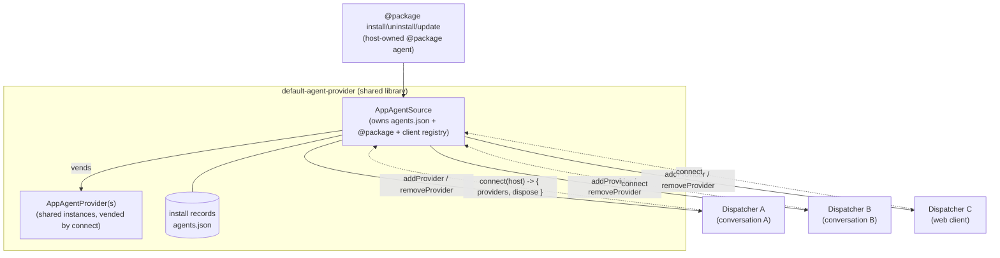

# Connected AppAgent Provider — Design Doc

> Status: **Implemented** (Milestones 1–5). See the _Implementation reference_ appendix below
> for the file map and test coverage (migrated from the retired execution plan).
> Scope: `ts/packages/dispatcher` (a new `AppAgentSource` connection interface
> whose `connect()` vends shared `AppAgentProvider`s, the dispatcher-side
> `AppAgentHost` callback that registers/unregisters live agents, removal of the
> `AppAgentInstaller` interface and the four core `@package` handlers),
> `ts/packages/defaultAgentProvider` (host-owned `@package` command surface,
> install-record store, source taxonomy, fan-out), and the host wiring in
> `ts/packages/agentServer` / `ts/packages/api`.
> Framing: **clean-slate**. Assumes we may change the provider interface and the
> dispatcher↔provider relationship without preserving backward compatibility.
> Builds directly on the [AppAgent Install Sources](../agentInstallSource/DESIGN.md)
> design; read that first for the source/record/registry model, which is unchanged.

## 1. Problem

The install-sources design ([agentInstallSource/DESIGN.md](../agentInstallSource/DESIGN.md))
split "the set of agents the dispatcher can run" across **two** interfaces:

- `AppAgentProvider` — the **read** side: enumerate / load / unload agents.
- `AppAgentInstaller` — the **write** side: `install` / `uninstall` / `update`
  plus the accessors that back the `@package` command (`listInstalled`,
  `listSources`, `listAvailable`, `sourceCommands`).

The dispatcher **core** owns the `@package install|uninstall|update|list`
handlers, calls `installer.install()`, and then wires the returned provider into
the live session via `installAppProvider(context, provider)`. The host
contributes only the `@package source` sub-table via `sourceCommands()`.

Two problems motivate this revision:

1. **A live install only reaches the dispatcher that issued it.**
   `installer.install()` returns a _fresh single-agent provider_, and
   `installAppProvider` registers it into **one** `CommandHandlerContext`'s
   `AppAgentManager`. In the agent server, a **single** provider + installer
   instance is shared across **N** per-conversation dispatchers (every
   per-conversation `createSharedDispatcher` spreads the same `baseOptions` —
   see [conversationManager.ts](../../../packages/agentServer/server/src/conversationManager.ts)).
   The shared base provider is never mutated, so `@package install` in
   conversation A **never reaches conversation B live** — B only sees the new
   agent after a full process restart. The current architecture has no fan-out
   mechanism; this is a correctness gap, not just an ergonomic one.

2. **Two interfaces describe one thing.** A read-provider and a write-installer
   that refer to the same set of agents are redundant. Install/uninstall state
   (the `agents.json` record store) lives on the installer; the agents it
   produces are read through the provider. The fix is a single _owner_ — the
   record store, the `@package` grammar that mutates it, and the connection
   lifecycle live together — that **vends** the read `AppAgentProvider` rather
   than sitting beside it as a second, independently-injected interface. This is
   _vend-not-merge_: the read contract stays a separate, pure interface (§2).

> Out of scope: the source taxonomy (path / catalog / feed), the registry, feed
> auth, `npm install`, record shapes, and `@package source`. All of that is
> unchanged from the install-sources design and stays in `default-agent-provider`.

## 2. The core idea

**The dynamic agent set is owned by a host-side `AppAgentSource`, not injected
as a passive provider. A dispatcher _connects_ to the source; `connect()` vends
the (shared) `AppAgentProvider` instances the dispatcher registers, and hands the
source a narrow callback (`AppAgentHost`) it uses to register/unregister agents
into that dispatcher's live state as the set changes. Static providers (bundled,
MCP) stay plain `AppAgentProvider`s, injected exactly as today.**



Consequences of this framing:

- **`AppAgentInstaller` is replaced by `AppAgentSource`.** The dispatcher-facing
  surface is just `connect()`; `install` / `uninstall` / `update` are **not**
  dispatcher-driven — they move into the host's `@package` command handlers and
  run against the source directly. `listInstalled` / `listSources` /
  `listAvailable` / `sourceCommands` are already host-rendered and stay in the
  host.
- **Static vs dynamic is a _type_ distinction.** Plain read providers implement
  `AppAgentProvider` (unchanged, no `connect`); the dynamic set is an
  `AppAgentSource`. The dispatcher statically knows which fans out, so a static
  provider can never be asked to (this closes old Q3).
- **The provider instances are SHARED across sessions.** `connect()` returns the
  _same_ provider instance(s) to every dispatcher, so the loaded `AppAgent`
  instance is shared (refcounted in the provider) across all connected
  sessions — exactly how the base providers are shared today. `connect` adds a
  fan-out subscriber; it does not clone agents per session.
- **The four core `@package` handlers are removed** from the dispatcher. The host
  contributes the **entire** `@package` table as its **own app agent** (§3.4),
  built in the shared `default-agent-provider` library.
- **Install/uninstall move agents by `AppAgentProvider`** (Option B). Each
  installed agent is its **own single-agent provider**, resolved to one
  module-root at install time - so there is no multi-root facade, and the
  dispatcher's `AppAgentManager` routes across them exactly as it already does
  for `[bundled, MCP]`.
- **The dispatcher exposes a small callback** (`AppAgentHost`, §3.1) with two
  operations the source needs: `addProvider` (register a provider - the
  `installAppProvider` wrapper body) and `removeProvider` (drop it - **new work**:
  today's `removeAgent` is name-based and does not track/drop a provider, so
  `removeProvider` derives the name(s) via `getAppAgentNames()`, calls
  `removeAgent` per name, and drops the provider's records). `AppAgentProvider`
  is already public host API; `AppAgentHost` is its dual. The callback is
  **provider-only** (not name+provider): under Option B name↔provider is 1:1 and
  the name is already held by both sides (source: the §7.2 tracker key;
  dispatcher: `getAppAgentNames()`), so threading a redundant `name` would create
  a second source of truth. The dispatcher instead **asserts the single-agent
  invariant** (`getAppAgentNames().length === 1`) at `addProvider`.
- **Install fans out.** A `@package install` resolves + writes the record once,
  then the source calls `addProvider(P)` on **every** connected dispatcher.
  The multi-dispatcher gap (§1.1) closes by construction.
- **Disruptive / no coexistence.** Agent state (SessionContext, storage) is keyed
  by agent name, so only one agent per name runs at a time. install / uninstall /
  update never overlap two versions of a name; a name is fully torn down before
  it is reused, coordinated by the lifecycle tracker (§7).
- **Each dispatcher decides enable-state locally** (§5). The source says "this
  agent now exists"; whether it is on or off in a given session is the
  dispatcher's policy, driven by session config.

## Phasing: settle the layering (P2) before the semantics (P1)

This is delivered in two phases so the ownership boundary is right _before_ the
multi-dispatcher behavior is added. (P1/P2 name the two problems in §1: P1 = the
propagation defect, P2 = the two-interfaces redundancy.)

**Phase 1 - layering.** Move the entire `@package` surface into the host, remove
`AppAgentInstaller`, and stand up the seams that let host code mutate a
dispatcher's live session in a _supported_ way:

- `AppAgentHost` (§3.1) plus the `connect()` handoff (§3.2), and
- command-handler **context isolation** (§3.4) so host handlers never receive the
  dispatcher's `CommandHandlerContext`.

In Phase 1, install/uninstall/update call `addProvider`/`removeProvider` on the
**issuing** session only - today's live behavior, just relocated out of core. No
sibling fan-out (§4), no cross-session enable policy (§5), no fan-out failure
semantics (§7).

Because one provider instance is shared across N dispatchers (§1.1), the client
**registry** of connected `AppAgentHost`s is _layering_, not fan-out: each
dispatcher must register its own handle for the provider to reach the right
session at all. Phase 1 builds `connect()` and the registry, but the issuing
session is reached through the package agent's own `agentContext` (§3.4), so no
registry lookup sits on the issuing path.

**Phase 2 - propagation.** Flip "issuing session only" to "iterate the registry"
(§4 fan-out) and add the cross-session enable policy (§5), the connection
lifecycle edge cases (§6), and the fan-out failure semantics (§7). This is where
the §1.1 defect is actually closed; it is a localized change to the single call
site Phase 1 leaves pointed at one session.

## 3. Interfaces

### 3.1 `AppAgentHost` — the dispatcher-side client callback

The dispatcher passes one of these to the provider when it connects. It is the
_only_ surface the provider uses to mutate live dispatcher state; the provider
never reaches into grammars, collision detection, or the embedding cache.

```ts
// Implemented by the dispatcher (one per CommandHandlerContext). The source
// holds one per connected session and calls it to fan out install/uninstall.
export interface AppAgentHost {
  // Register a provider's agent into this dispatcher's live state. Body is the
  // installAppProvider() wrapper (commandHandlerContext.ts): appAgentManager
  // .addProvider -> collision detection (degraded to warning) -> embedding-cache
  // save. State is derived from session config via setAppAgentStates/
  // computeStateChange with the agent's MANIFEST DEFAULT as the fallback
  // (`config[name] ?? manifestDefault`; Model B, §5) - an installed agent honors
  // its manifest default just like a bundled agent, and a user's per-session
  // `@config agent` override still wins. Asserts the single-agent invariant
  // (provider.getAppAgentNames().length === 1). Resolves when APPLIED (the ack
  // the lifecycle tracker waits on, §7) - may be deferred until the session is
  // idle. `notify` (default false): when true, this is a cross-session fan-out
  // to a SIBLING, so surface a system message naming the agent and its resulting
  // state (§5). The issuing session passes false and reports inline.
  addProvider(provider: AppAgentProvider, notify?: boolean): Promise<void>;

  // Remove a previously-added provider from this dispatcher: unload its agent,
  // drop schemas/grammars/embeddings, close any live SessionContext, and drop
  // the provider's records. By provider IDENTITY - the source passes back the
  // exact instance it added, so there is no name lookup at the boundary and no
  // empty-provider cruft. Internally derives the name(s) via getAppAgentNames()
  // and calls the existing name-based removeAgent per name (NEW work: removeAgent
  // today neither tracks nor drops the provider).
  removeProvider(provider: AppAgentProvider): Promise<void>;
}
```

> Note: install/uninstall move agents **by `AppAgentProvider`** (Option B) - the
> dispatcher's existing hosting API. `installAppProvider` already registers a
> provider; this promotes it, plus a symmetric `removeProvider`, into a supported
> awaitable callback. Chosen over a name-based `addAgent(name)`/`removeAgent(name)`
> variant (Option A - see §9) because it reuses the proven registration path and
> lets each installed agent be its **own single-root provider**, dissolving the
> module-resolution-root facade. `AppAgentProvider` is already public host API;
> `AppAgentHost` is its dual - what the dispatcher hands the source.
>
> Why not `addProvider(name, provider)` (both)? Rejected as redundant: with the
> single-agent invariant the name is `getAppAgentNames()[0]` and is already held
> on both sides (source tracker key + dispatcher-derived), so a second copy only
> invites divergence. A name-carrying callback only earns its keep for future
> **multi-agent dynamic providers** (§9 pro 11 / MCP hot-reload), where one
> provider maps to N names; that is out of scope here.

### 3.2 `AppAgentProvider` (unchanged) and the new `AppAgentSource`

`AppAgentProvider` stays a **pure read contract** — no `connect`, no lifecycle.
Bundled and MCP providers implement only this, exactly as today:

```ts
export interface AppAgentProvider {
  getAppAgentNames(): string[];
  getAppAgentManifest(appAgentName: string): Promise<AppAgentManifest>;
  loadAppAgent(appAgentName: string): Promise<AppAgent>;
  unloadAppAgent(appAgentName: string): Promise<void>;
  setTraceNamespaces?(namespaces: string): void;
  onSchemaReady?: (cb: (name: string, m: AppAgentManifest) => void) => void;
  getLoadingAgentNames?(): string[];
}
```

The **dynamic** set (installed agents) is a separate `AppAgentSource`. The
dispatcher-facing surface is just `connect()`; the concrete host object also
carries the write/command surface (`install` / `uninstall` / `update` /
`packageCommands`), but the dispatcher is handed only the narrow `connect` view,
so it can never drive an install. (`packageCommands` is the whole `@package`
table and supersedes the old `AppAgentInstaller.sourceCommands()`, which returned
only the `@source` subtable; that subtable is now nested under `@package source`,
§3.3.)

```ts
// Dispatcher-facing: a source of app agents that participates in a session's
// lifecycle. Injected (as `appAgentSources`) alongside the static
// `appAgentProviders`.
export interface AppAgentSource {
  // Called once per dispatcher at context init. Returns the provider(s) this
  // source contributes to THIS session, plus a teardown handle. The source
  // records `host` for fan-out (§4).
  connect(host: AppAgentHost): AppAgentConnection;
}

export interface AppAgentConnection {
  // The provider instance(s) to register into the connecting dispatcher via the
  // normal addProvider path. These are SHARED singletons owned by the source:
  // every connect() returns the same instance(s), so a loaded AppAgent is shared
  // (refcounted) across all connected sessions rather than cloned per session.
  readonly providers: AppAgentProvider[];
  // Deregisters THIS host from the source's fan-out registry. It does NOT tear
  // down the shared providers (other sessions still use them); the dispatcher
  // unregisters them from its own AppAgentManager as part of context teardown.
  dispose(): void;
}
```

**Why shared, not per-session:** a single agent process/module should back all
conversations, not spin up one copy per session. The provider already refcounts
loaded agents (`createNpmAppAgentProvider`), so sharing the provider instance
across connections yields one `AppAgent` instance loaded on first use and
unloaded when the last session releases it — the base-provider behavior today,
now the rule for the installed source too.

### 3.3 What the host owns

`default-agent-provider` already owns the record store and `@package source`.
The `AppAgentSource` now also owns:

- The **installed providers** it vends from `connect()`: one single-agent
  `AppAgentProvider` per installed agent, each resolved to a single module-root
  at install time (no facade). Shared instances - the same object is vended to
  every session, refcounted. NOTE: this is a change from today's startup path,
  which builds a _single multi-root_ `createInstalledAppAgentProvider(records)`
  over all `agents.json` records (only `install()` already returns a per-agent
  provider). The source must vend per-agent providers on connect, not the
  multi-root one.
- The full `@package` command table (`install` / `uninstall` / `update` /
  `list` / `source`), contributed as its own app agent (§3.4), so each host
  composes one implementation.
- The **fan-out**: after a successful record-store mutation, iterate the
  connected clients and call `addProvider` / `removeProvider`.
- The client **registry** and the per-name **lifecycle tracker** (§7) that
  coordinates idle-gated fan-out and gates name reuse during teardown.

The dispatcher core keeps **none** of the `@package` grammar and **no** install
interface — only `AppAgentHost` (which it implements) and the `connect()` call it
makes on each injected `AppAgentSource`.

### 3.4 Command-handler context isolation (host commands run as their own agent)

Host-contributed command handlers must **not** receive the dispatcher's
`CommandHandlerContext`. Today they do, in practice: `getSystemHandlers()` merges
the host's `@package source` table into the **system agent's** command table, so
at execution time a handler's `ActionContext.sessionContext.agentContext` _is_
the dispatcher's `CommandHandlerContext` — only _typed_ `unknown`
(`ActionContext<unknown>`). A host handler can cast it back and reach dispatcher
internals (the `AppAgentManager`, grammars, embedding caches). That is a layering
leak, and it widens as the host owns more of `@package`.

The fix uses isolation the dispatcher **already enforces per agent**. Command
routing binds every command to its owning agent's context: `resolveCommand`
picks `actualAppAgentName` from the leading token, and `executeCommand` builds
the `ActionContext` from `agents.getSessionContext(actualAppAgentName)` — so
`@browser …` runs with the browser agent's `agentContext` and never sees
another agent's. `@package` leaks only because it is grafted onto the **system**
agent instead of being an agent of its own.

So: **the host contributes its `@package` surface as its own app agent, not as a
subtree of the system agent.** Consequences:

- `@package …` resolves to the package agent, and its
  `ActionContext.sessionContext.agentContext` is the **host's own** context
  object, created by the host. The dispatcher never hands it
  `CommandHandlerContext`. No new gate is required — the existing "an agent only
  sees its own `agentContext`" invariant does the enforcement, and the leak
  closes _structurally_ rather than by an `unknown` type the host could cast
  through.
- Everything a host handler legitimately needs is already reachable without
  `CommandHandlerContext`: user I/O via `ActionContext.actionIO`
  (display/status), and the record store / registry via the host's own closures
  (the `AppAgentSource` is host code).
- The **one** dispatcher capability these handlers need — mutating the live
  session (`addProvider` / `removeProvider`) — is the narrow `AppAgentHost`
  (§3.1), not `CommandHandlerContext`. It lives in the **package agent's own
  `agentContext`**, placed there when the dispatcher connects that agent
  (§3.2 / §6).

This also answers **"how does an executing handler reach _its_ session's
`AppAgentHost`?"** — it reads it off its own `agentContext`, which is
per-dispatcher by construction, so it is automatically the right session with no
lookup and no ambient dispatcher reference. The client **registry** (§3.3) is
needed only to reach the _other_ sessions for fan-out (Phase 2); the issuing
session is just "this agent's own `AppAgentHost`."

> Net: `AppAgentHost` is the _only_ dispatcher-side surface a host command
> handler touches, and it arrives through the host agent's own `agentContext`.
> `CommandHandlerContext` never crosses the host boundary — not as a real
> object, not as a castable `unknown`.

The package agent registers under the name **`package`** and its manifest is
**command-only** (no schema): it declares `commandDefaultEnabled: true` (normally
enabled) but is deliberately **not** in `alwaysEnabledAgents`, so — unlike the
`system` agent — it can be toggled off via `@config`.

## 4. Install / uninstall / update flow

```mermaid
sequenceDiagram
    participant U as User (conversation A)
    participant H as @package agent (host lib)
    participant S as AppAgentSource (host)
    participant A as Dispatcher A (issuing)
    participant B as Dispatcher B (sibling)

    U->>H: @package install foo <ref>
    H->>S: resolve(ref) + materialize + write record<br/>(serialized by limiter; name-uniqueness<br/>enforced at agents.json write)
    Note over S: record store is the source of truth
    S->>A: addProvider(P_foo, notify=false)
    A-->>S: ok (awaited; errors reported to U)
    S-)B: addProvider(P_foo, notify=true)
    Note over B: best-effort; config/manifest-derived state + system message (§5)
    H-->>U: "Agent 'foo' installed from source 's'."
```

Key points, contrasted with today:

- **Validation locus moves to the record store.** Name uniqueness is a property
  of `agents.json`, not of any one dispatcher's live set. The write path already
  enforces `current.agents[name] !== undefined`. The legal-name regex check
  stays in the host handler, before materialize (design §5/§12 Q18 unchanged).
- **The issuing dispatcher's `addProvider` is awaited**, so registration errors
  (e.g. a collision) surface synchronously to the user who ran the command.
- **Sibling dispatchers are notified best-effort** and asynchronously (applied at
  each session's next idle, §7.1); a failure is logged per-client, never failing
  the install (the record already committed). Collision detection is already
  degraded-to-warning on add. Each sibling surfaces a **system message** naming
  the new agent and its enabled/disabled state (§5).
- **Uninstall / update** mutate the record store, then fan out `removeProvider`
  (and, for update, a subsequent `addProvider` for the freshly materialized
  record - remove-then-add, per client, after a full drain since there is no
  coexistence, §7.2).

## 5. Enable-state policy across sessions (Model B)

An installed agent **honors its manifest default** just like a bundled agent.
Each session derives the agent's enabled state from its own config with the
manifest default as the fallback — `config[name] ?? manifestDefault` — via the
existing `setAppAgentStates` / `computeStateChange` path. There is no
`enable`-forcing and no `withDisabledByDefault` wrapper: an agent whose manifest
ships enabled is on everywhere (unless a user turned it off in that session),
and a user's per-session `@config agent` override always wins. `addProvider`
therefore takes only a `notify` flag; the state is config-derived, not dictated
by the source.

**"No surprise" is delivered by _notification_, not by forcing agents off.** The
change is always made visible; it is never silently applied:

| Recipient                                     | State on add                 | How the change surfaces                                    |
| --------------------------------------------- | ---------------------------- | ---------------------------------------------------------- |
| **Issuing** conversation (ran `@install`)     | `config ?? manifest default` | inline command result (e.g. _"installed from source 's'"_) |
| **Sibling** conversation open now             | `config ?? manifest default` | system message: _"Agent 'foo' was added — enabled."_       |
| **Offline** conversation (reconciles on open) | `config ?? manifest default` | system message on load (see reconciliation below)          |
| **Brand-new** conversation                    | `config ?? manifest default` | silent (it is part of the baseline)                        |

If the agent's resulting state is **disabled** (its manifest default is off, or
config turned it off), the add/reconcile message says so and how to enable:
_"Agent 'foo' was added — disabled (`@config agent foo` to enable)."_

**Load-time reconciliation.** Each session persists the set of app agent names
it has already seen (`knownAgents`, static + dynamic; `Session`). On load — and
on session switch — it reconciles that set against what is actually available
now:

- **available & not known ⇒ added**: adopt the manifest default and notify
  (_"added — enabled"_ / _"added — disabled (…)"_).
- **known & not available ⇒ removed**: notify (_"removed"_).

Both deltas are summarized in a single system message when several change at
once — e.g. _"Agent set changed: browser added — enabled; email removed."_ This
covers an agent that was installed while the conversation was closed **and** a
new build that added/removed **static** (bundled/mcp) agents. The first time a
session has no recorded baseline (brand-new session, or the first load after
upgrading to a build that tracks this) it records a **silent** baseline. The
known set is then persisted so the next load reconciles accurately; live
add/remove fan-outs update it too.

**Removal disposition (sub-decision).**

- **Reconciliation-removal** (the agent is simply no longer vended) leaves the
  session's persisted enable preference **dormant** — the `config[name]` entry
  stays but has no effect while the agent is absent, so if the agent returns the
  user's prior choice is honored.
- **Explicit `@uninstall`** **drops** the config entry (schemas/actions/commands
  for the agent), so a fresh reinstall starts clean from the manifest default.

**Worked table** (`I`=issuing, `S`=sibling open now, `O`=offline/reconciles on
load, `N`=brand-new):

| #   | Event                                            | Recipient  | Result                                                                        |
| --- | ------------------------------------------------ | ---------- | ----------------------------------------------------------------------------- |
| 1   | `@install foo` (manifest on)                     | I          | enabled, persisted; inline _"installed from source s"_                        |
| 2   | ″                                                | S          | enabled, persisted; system _"foo added — enabled"_                            |
| 3   | ″                                                | O          | enabled on load; system on load _"foo added — enabled"_                       |
| 4   | ″                                                | N          | enabled baseline; silent                                                      |
| 5   | `@install foo` (manifest off)                    | any        | disabled, persisted; _"foo added — disabled (`@config agent foo` to enable)"_ |
| 6   | `@config agent foo off`, then restart / other op | —          | disabled; config `foo=false` persisted; stays off                             |
| 7   | `@uninstall foo`                                 | I          | removed; config entry dropped; inline _"uninstalled"_                         |
| 8   | ″                                                | S          | removed; config entry dropped; system _"foo removed"_                         |
| 9   | ″                                                | O          | absent on load; config entry dropped; system on load _"foo removed"_          |
| 10  | New build adds `browser`, removes `email`        | existing   | reconciled on open; _"browser added — enabled; email removed"_                |
| 11  | ″                                                | N          | baseline; silent                                                              |
| 12  | `@update foo` (name unchanged)                   | I / others | I inline _"updated"_; others may see _"foo … "_ per fan-out                   |

## 6. Connection lifecycle

Dispatchers are created and torn down dynamically (per conversation, with grace
timers — see [sharedDispatcher.ts](../../../packages/agentServer/server/src/sharedDispatcher.ts)).
The provider must not fan out to a disposed dispatcher.

- **Connect** at `initializeCommandHandlerContext`: the dispatcher calls
  `source.connect(host)` for each injected `AppAgentSource`, registers the
  returned `connection.providers` into its `AppAgentManager`, and keeps the
  `AppAgentConnection`.
- **Disconnect** at context teardown: the dispatcher unregisters those providers
  from its own manager and calls `connection.dispose()`, which removes this
  `AppAgentHost` from the source's registry. `dispose()` does NOT tear down the
  shared provider instances — other sessions still hold them.
- **Idempotency / races:** `dispose()` must be safe to call once; a fan-out that
  began before `dispose()` but lands after must no-op (the host can mark the
  connection closed and have `addProvider`/`removeProvider` reject/skip).
- **Web vs server asymmetry:** the web API builds a fresh source per
  `createWebDispatcher` (one client), while the agent server shares one source
  across conversations (N clients). The registry degrades cleanly to a single
  client; no host-specific branching.
- **In-process only — no cross-process fan-out.** An `instanceDir` (and its
  `agents.json`) is held by a **single process at a time** via the instance-dir
  process lock, so every connected session sharing that record store lives in
  one process. In-process fan-out over the connected sessions is therefore
  complete; there is no second process to notify. (A different process can only
  own the `instanceDir` after this one releases the lock, at which point it reads
  the current `agents.json` at startup.)

> Note: the initial set comes from the vended `connection.providers` (register +
> `getAppAgentNames`, the normal pull); `connect()`'s fan-out then delivers only
> _subsequent_ add/remove deltas — keeping first-run identical to today. No
> separate "replay" path is needed.

## 7. Agent lifecycle, fan-out coordination & failure semantics

Because agent state is keyed by name (disruptive / no coexistence, §2), a name
must be **fully torn down everywhere before it is reused**. But teardown is
**asynchronous and idle-gated per session** - a session processing a user
command defers `removeProvider` until it is idle - so a name has a transient
**draining** window. The source coordinates this with a per-name lifecycle
entry; the dispatcher applies changes through an idle-gated queue.

### 7.1 Dispatcher side - `AppAgentHost` is an idle-gated FIFO applicator

`addProvider` / `removeProvider` enqueue and apply at the session's next idle
(between user commands), in FIFO order (so `update`'s remove-then-add lands in
order). "Next idle" reuses the dispatcher's existing single-slot command limiter
(`context.commandLock`, a `createLimiter(1)`): each op is enqueued onto that same
limiter, so it runs only when the slot is free (between user commands) and never
interleaves with an in-flight command - no second idle-detector. Each returns a
Promise that resolves when **applied** - the ack. On `dispose()`, queued ops are
abandoned and pending removals auto-ack (a gone session has removed everything).

### 7.2 Source side - per-name `DynamicAgentEntry`

> **Historical shape.** The type block and `update (disruptive)` mechanism below
> describe the ORIGINAL drain-then-add design. The shipped implementation replaced
> the `pending`/`then` drain bookkeeping with a source-coordinated `replaceProvider`
> barrier — see [UPDATE_COORDINATION.md](./UPDATE_COORDINATION.md) (Implemented) for
> the current shape.

```ts
type DynamicAgentEntry =
  | { status: "active"; provider: AppAgentProvider } // installed, fanned out
  | {
      status: "removing";
      pending: Set<AppAgentHost>; // draining across sessions
      then?: () => Promise<void>;
    }; // queued follow-up (update's add)
// AppAgentSource owns: Map<agentName, DynamicAgentEntry>
```

- **install:** `absent -> active`; fan out `addProvider(P)`. The name is usable
  as soon as the record is written; per-session registration is best-effort.
- **uninstall:** `active -> removing`; remove record; `pending = all connected
hosts`; fan out `removeProvider(P)`. Each host's ack drops it from `pending`;
  when empty -> `absent` (name free), then run any `then`.
- **update (disruptive):** materialize the new version first (§4.7). Then
  `active(P1) -> removing -> (drained) -> active(P2)` with the add as `then`. No
  two versions ever coexist — **required** because an agent's persisted storage
  is keyed by agent name and cannot be shared between versions, so two versions
  loaded at once would collide on that storage.
  > **Known gap (resolved):** the disruptive swap described above had a
  > request-slip window — a request to the name mid-swap could miss or misroute.
  > This has been **superseded**: update (and uninstall) now run through a single
  > `commandLock`-held critical section per dispatcher, coordinated by a
  > source-side barrier and made time-bounded with rollback to `v1` on a quiesce
  > timeout (user-facing cancel is a deferred extension — see §5.3).
  > See [UPDATE_COORDINATION.md](./UPDATE_COORDINATION.md) (Implemented) and the
  > resolved item in DEFERRED_REVIEW_LOG.md.
- **name reuse during `removing`:** a new user `@package install` **or**
  `@package update` on a name that is still `removing` is **rejected** with a
  clear "still being removed, retry shortly" error. `then` is used only for the
  in-flight `update`'s own post-drain add - never to queue a new user op.

### 7.3 Edge cases the entry must cover

- **Connect during `removing`:** a new session registers only from `active`
  entries -> never picks up a draining name, and is not in `pending`.
- **Disconnect while in `pending`:** `dispose()` auto-acks -> the source drops
  that host from every entry's `pending`.
- **Load during `removing`:** the provider refuses to load a `removing` name
  even if a draining session still has an instance cached (tombstone) - nothing
  resurrects it.
- **`@package list` during drain:** reads `active` entries, so a draining agent
  is not shown as installed.
- **Concurrent ops on one name:** the record-write limiter serializes writes, but
  the async drain outlives it - so per-name serialization lives in the entry
  (`removing` blocks/queues the next op), not only in the global limiter.

### 7.4 Failure semantics

- **Record write is the commit point.** Once `agents.json` is updated, the
  install/uninstall is durable; fan-out is best-effort notification.
- **Issuing client:** awaited; failure reported to the user. The record is still
  committed (agent exists on next restart), matching today's post-write
  re-registration behavior (install-sources DECISIONS_LOG).
- **Sibling clients:** each `addProvider`/`removeProvider` is independent; a throw
  is caught and logged per client. Collision detection degrades to a warning.
- **Update:** materialize-first, then per-client remove-then-add; a failed
  materialize is a no-op (old record/agents stay) - unchanged from design §4.7.

## 8. What changes, file by file

| Area                                     | Change                                                                                                                                                                                                                                                                                                                                                                                                                                                                                                                                                                                                     |
| ---------------------------------------- | ---------------------------------------------------------------------------------------------------------------------------------------------------------------------------------------------------------------------------------------------------------------------------------------------------------------------------------------------------------------------------------------------------------------------------------------------------------------------------------------------------------------------------------------------------------------------------------------------------------- |
| `agentProvider.ts` (dispatcher)          | `AppAgentProvider` unchanged (pure read). Remove `AppAgentInstaller`. Add `AppAgentHost`, `AppAgentSource` (`connect`), and `AppAgentConnection` (`{ providers, dispose }`).                                                                                                                                                                                                                                                                                                                                                                                                                               |
| `installCommandHandlers.ts` (dispatcher) | **Deleted** from core. Logic moves to the host's `@package` agent.                                                                                                                                                                                                                                                                                                                                                                                                                                                                                                                                         |
| `systemAgent.ts` `getSystemHandlers`     | Stop grafting `@package` onto the **system** agent's table entirely. The host contributes `@package` as its **own app agent** with its own `agentContext`, so its handlers never receive `CommandHandlerContext` (§3.4). The system agent keeps only the truly-core `@` commands.                                                                                                                                                                                                                                                                                                                          |
| `commandHandlerContext.ts`               | Accept `appAgentSources`; at init call `source.connect(host)` and register `connection.providers`; at teardown unregister them + `dispose()`. The `AppAgentHost.addProvider` wrapper lives **here** (today's `installAppProvider`), deriving state from session config with the manifest default as fallback (Model B, §5) and recording/notifying the change; load-time reconciliation (`reconcileKnownAgents`, §5) and the idle-gated FIFO applicator + ack (§7.1) also live at this host level. Place the per-dispatcher `AppAgentHost` into the package agent's `agentContext`. Drop `agentInstaller`. |
| `appAgentManager.ts`                     | Reuse the existing low-level `addProvider` primitive (the wrapper above calls it — they are **not** the same as `AppAgentHost.addProvider`). Add a new `removeProvider(provider)` primitive: derive names via `getAppAgentNames()`, call the existing name-based `removeAgent` per name, and drop the provider's records/refs (today's `removeAgent` is name-only and does neither).                                                                                                                                                                                                                       |
| `default-agent-provider`                 | Implement `AppAgentSource`: own the record store + registry + per-name lifecycle tracker (§7.2); represent each installed agent as its own single-agent provider (single module-root, no facade); contribute `@package` as its own app agent. **Phase 1:** `addProvider`/`removeProvider` on the **issuing** session only. **Phase 2:** fan-out over the registry (§4) + enable policy (§5). Keep source registry / `@package source` as-is.                                                                                                                                                               |
| `agentServer` / `api` host wiring        | Inject the static providers as `appAgentProviders` and the installed source as `appAgentSources`; drop the separate `agentInstaller` option.                                                                                                                                                                                                                                                                                                                                                                                                                                                               |

## 9. Pros / cons (carried from the analysis)

**Pros**

1. Fixes live propagation across dispatchers in the server (the §1.1 defect).
2. Clean layering: the `AppAgentSource` **owns** the record store + mutation +
   registry and **vends** the read providers — one owner, not two independent
   interfaces, and not a read/write god-object (vend-not-merge).
3. `AppAgentProvider` stays a **pure read contract** — no `connect`/lifecycle
   creep, so static providers (bundled, MCP) are untouched.
4. Static vs dynamic is a **type** (`AppAgentProvider` vs `AppAgentSource`), so a
   static provider can never be asked to fan out — resolves old Q3.
5. The dispatcher **cannot drive install**: it is handed only `connect()`.
6. **Reuses the existing hosting path** (`installAppProvider`/`addProvider`), and
   each installed agent being its own single-root provider **dissolves the
   module-resolution-root facade** (Option B vs A, below).
7. **Shared provider instances** across sessions → one `AppAgent` instance backs
   all conversations (refcounted), not one copy per session.
8. Name-uniqueness validated at the shared record store, not per dispatcher.
9. Per-session enable policy is explicit and hookable (§5).
10. Smaller dispatcher core; `@package` lives in the shared host lib as one
    composed app agent.
11. Generalizes to other dynamic sources (e.g. MCP hot-reload) via one mechanism.

**Cons / new work**

1. The source gains a client connect/disconnect **lifecycle** + a per-name
   **lifecycle tracker** (§7) — the main new cost; must guard against fan-out to a
   disposed dispatcher (§6) and gate name reuse during teardown.
2. **Two injection points** (`appAgentProviders` + `appAgentSources`), and the
   dispatcher must register/teardown provider(s) obtained from `connect()`.
3. **O(N) provider objects** (one per installed agent) tracked by the source and
   registered per session (vs one combined provider).
4. **Fan-out partial-failure** semantics must be specified, not inherited (§7.4).
5. `AppAgentHost` becomes a **supported dispatcher API** with await/error
   contract (small but public).
6. Web vs server **asymmetry** in client-set size must degrade cleanly (§6).
7. Capability gating / completions for `@package` move to the host lib (§3.3).

### Option A vs B (why provider-based)

**Option A** was a single _live_ installed provider with a name-based
`addAgent(name)`/`removeAgent(name)` callback; **Option B** (chosen) is one
single-agent `AppAgentProvider` per install with a provider-based
`addProvider`/`removeProvider` callback. Once **coexistence was ruled out**
(disruptive; agent state keyed by name), A's edge (per-generation separation) and
weakness (name-collision on reinstall-while-loaded) both vanished, leaving B
ahead: it **reuses** the proven `installAppProvider`/`addProvider` path and
**dissolves** the multi-root facade (each agent is single-root), whereas A would
build a new live provider that **reabsorbs** that routing. A's only remaining
edge was a narrower, symmetric name-only callback; B's provider-based callback is
symmetric too (`addProvider`/`removeProvider` by identity) and matches today's
hosting API. Cost accepted: O(N) provider objects + a `removeProvider` path.

**Not a hybrid `add/remove(name, provider)`.** A third option — passing _both_
the name and the provider — was considered and rejected. Under Option B the
name↔provider mapping is 1:1 (`getAppAgentNames()[0]`), and the name is already
available on both sides without threading it through the callback: the source
holds it as its per-name lifecycle-tracker key (§7.2) and the dispatcher derives
it via `getAppAgentNames()` (removal already loops these into the name-based
`removeAgent`). A redundant `name` param would add a second source of truth that
can diverge from `getAppAgentNames()`. Instead the dispatcher **asserts** the
single-agent invariant (`getAppAgentNames().length === 1`) at `addProvider`, so a
facade regression fails loudly rather than desyncing the tracker. The hybrid only
pays off for **multi-agent dynamic providers** (§9 pro 11 / MCP hot-reload), where
one provider maps to N names and lifecycle events are per-name while add/remove
are per-provider — a generalization deferred out of this design.

---

## Implementation reference

> Migrated from the retired `EXECUTION_PLAN.md` after the work shipped. A point-in-time map of the
> implementation and its test coverage; the code is the source of truth.

### Source-of-truth file map

| Concern                                                                             | File                                                                                                 |
| ----------------------------------------------------------------------------------- | ---------------------------------------------------------------------------------------------------- |
| Provider + installer interfaces                                                     | `packages/dispatcher/dispatcher/src/agentProvider/agentProvider.ts`                                  |
| `DispatcherOptions`, `installAppProvider`, `setAppAgentStates`, init/teardown       | `packages/dispatcher/dispatcher/src/context/commandHandlerContext.ts`                                |
| `AppAgentManager` (`addProvider` / `removeAgent` / lazy init / `getSessionContext`) | `packages/dispatcher/dispatcher/src/context/appAgentManager.ts`                                      |
| `@package` handlers (install/uninstall/update/list)                                 | `packages/dispatcher/dispatcher/src/context/system/handlers/installCommandHandlers.ts`               |
| System agent + `getSystemHandlers` (`@package`/`@source` grafting)                  | `packages/dispatcher/dispatcher/src/context/system/systemAgent.ts`                                   |
| Command routing (`resolveCommand` → `actualAppAgentName` → `getSessionContext`)     | `packages/dispatcher/dispatcher/src/command/command.ts`, `.../execute/actionContext.ts`              |
| Default providers + installer + source registry wiring                              | `packages/defaultAgentProvider/src/defaultAgentProviders.ts`                                         |
| Installed-agent provider + `combineAppAgentProviders` facade                        | `packages/defaultAgentProvider/src/installSources/installedAgents.ts`                                |
| `@source` command table                                                             | `packages/defaultAgentProvider/src/installSources/sourceCommands.ts`                                 |
| Source registry impl                                                                | `packages/defaultAgentProvider/src/installSources/registry.ts`                                       |
| Host wiring (N-client server)                                                       | `packages/agentServer/server/src/server.ts`, `.../conversationManager.ts`, `.../sharedDispatcher.ts` |
| Host wiring (1-client web)                                                          | `packages/api/src/webDispatcher.ts`                                                                  |
| Standalone host                                                                     | `packages/shell/src/main/instance.ts`                                                                |

#### Package layering (dependency direction — must stay acyclic)

The **interfaces** (`AppAgentHost`, `AppAgentSource`, `AppAgentConnection`) land in `agent-dispatcher`
core; the `AppAgentSource` **implementation** (record store, registry, `@package` app agent, client
registry, per-name lifecycle tracker) lands in `default-agent-provider` (§3.3). The dispatcher core
never gains a dependency on the record store or the source taxonomy.

| Package (npm name)       | Role                         | What it adds                                                                                                                                                                                                                                               |
| ------------------------ | ---------------------------- | ---------------------------------------------------------------------------------------------------------------------------------------------------------------------------------------------------------------------------------------------------------- |
| `agent-dispatcher`       | dispatcher core; hosting API | `AppAgentHost` / `AppAgentSource` / `AppAgentConnection` **interfaces**; `AppAgentHost` impl (applicator + `removeProvider`); `connect()`/`dispose()` lifecycle; `appAgentSources` option. **Removes** `AppAgentInstaller` + the four `@package` handlers. |
| `default-agent-provider` | reference host wiring        | `AppAgentSource` **impl**: per-agent providers, `@package` app agent, client registry, fan-out, per-name lifecycle tracker (§7.2).                                                                                                                         |
| `agentServer` / `api`    | host wiring                  | inject `appAgentSources`; drop `agentInstaller`.                                                                                                                                                                                                           |

### Test coverage map (by milestone)

| Scenario                                                                          | Milestone |
| --------------------------------------------------------------------------------- | --------- |
| Applicator FIFO ordering (incl. update remove-then-add)                           | 1         |
| Applicator ack resolves only when applied; idle-gating defers during busy session | 1         |
| `dispose()` auto-acks pending removals; late op no-ops                            | 1         |
| `removeProvider` teardown (single-agent) vs unknown provider no-op                | 1         |
| Single-agent invariant assertion fires on a multi-name provider                   | 1         |
| `@package` handler runs with host `agentContext` (no `CommandHandlerContext`)     | 2         |
| Install registers into the **issuing** session live (no restart)                  | 2         |
| Uninstall tears down a live `SessionContext` in the issuing session               | 2         |
| Each installed agent vended as its own single-root provider                       | 2         |
| `AppAgentInstaller` fully removed; all hosts smoke-boot                           | 2         |
| Fan-out: install in A appears (disabled) in B live                                | 3         |
| Enable policy: issuing `true`, siblings `false`, late-connect disabled            | 3         |
| Sibling notification system message on add/remove                                 | 3         |
| Sibling `addProvider` throw isolated (install still succeeds)                     | 3         |
| Fan-out after `dispose()` no-ops; double `dispose()` safe                         | 3         |
| Web (1 client) vs server (N clients) fan-out both work                            | 3         |
| Uninstall drains all sessions before name reuse                                   | 4         |
| Name reuse during `removing` rejected                                             | 4         |
| Connect during `removing` skips draining name                                     | 4         |
| Disconnect while `pending` auto-acks and drops from `pending`                     | 4         |
| Load during `removing` refused (tombstone)                                        | 4         |
| `@package list` hides a draining agent                                            | 4         |
| Failed update = old agent intact everywhere (no-op)                               | 4         |
| Sibling fan-out failure doesn't roll back committed record                        | 4         |
| No dangling references to removed symbols; help matches `@package`                | 5         |
