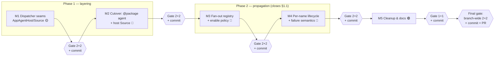

# Connected AppAgent Provider — Execution Plan

> Companion to [DESIGN.md](./DESIGN.md) (the design). This plan sequences the design into
> **milestones** — each a self-contained unit of work that is independently reviewable and testable —
> built from smaller work items with concrete files, symbols, and design references.
> Framing matches the design: **clean-slate** (we may change the provider/installer interfaces and the
> dispatcher↔provider relationship without preserving backward compatibility).
>
> **Builds on** the [AppAgent Install Sources](../agentInstallSource/DESIGN.md) work
> ([its execution plan](../agentInstallSource/EXECUTION_PLAN.md)). This plan assumes that model has
> landed: the `agents.json` record store, the source taxonomy (path / catalog / feed), the registry,
> feed auth, and the `@package source` surface are **unchanged** and stay in `default-agent-provider`.
> This plan changes only *who owns the dynamic agent set and how a live install reaches every session* —
> it replaces `AppAgentInstaller` with a connected `AppAgentSource`, moves `@package` into the host, and
> adds cross-session fan-out.

## The two design phases this plan implements

The design delivers in two phases so the ownership boundary is right **before** the multi-dispatcher
behavior is added (design _Phasing_ §):

- **Phase 1 — layering (P2 in the design):** move the entire `@package` surface into the host, remove
  `AppAgentInstaller`, and stand up the seams (`AppAgentHost`, `connect()`, command-handler context
  isolation). Install/uninstall/update act on the **issuing session only** — today's live behavior,
  relocated out of core. → **Milestones 1–2.**
- **Phase 2 — propagation (P1 in the design):** flip "issuing session only" to "iterate the registry"
  (fan-out §4), add the cross-session enable policy (§5), the connection lifecycle edge cases (§6), the
  per-name lifecycle tracker and fan-out failure semantics (§7). This is where the §1.1 multi-dispatcher
  defect is actually closed. → **Milestones 3–4.**

Milestone 5 is cleanup/docs. A final branch-wide gate closes the branch.

## Conventions

- **Paths** are repo-relative under `ts/`.
- Work is grouped into **milestones**. Each milestone is a coherent slice that builds, passes its tests,
  and leaves the product in a consistent state (no half-broken commands across a milestone boundary).
- Each milestone ends with a **Milestone Gate** (defined once below) — two subagent review rounds and two
  subagent test-gap rounds — before it is considered _done_.
- Within a milestone, each work item ends with a **Checkpoint**: it must build (`npm run build`), lint, and
  keep existing tests green before the next item starts.
- "Behavior-preserving" items ship without any user-visible change; "behavior-changing" items are called
  out explicitly.
- Estimated risk: 🟢 low / 🟡 medium / 🔴 high.
- **Working logs (update as you go):**
  - [DECISIONS_LOG.md](./DECISIONS_LOG.md) — every decision **not specified in** or **changed from** the
    design. Append the moment you make the call. _(Create at the start of Milestone 1.)_
  - [DEFERRED_REVIEW_LOG.md](./DEFERRED_REVIEW_LOG.md) — every gate **review finding** or **test gap** you
    deliberately **did not address**, with a rationale. _(Create at the start of Milestone 1.)_

## Source-of-truth file map (from current code)

| Concern                                                              | File                                                                                                    |
| ------------------------------------------------------------------- | ------------------------------------------------------------------------------------------------------- |
| Provider + installer interfaces                                     | `packages/dispatcher/dispatcher/src/agentProvider/agentProvider.ts`                                     |
| `DispatcherOptions`, `installAppProvider`, `setAppAgentStates`, init/teardown | `packages/dispatcher/dispatcher/src/context/commandHandlerContext.ts`                         |
| `AppAgentManager` (`addProvider` / `removeAgent` / lazy init / `getSessionContext`) | `packages/dispatcher/dispatcher/src/context/appAgentManager.ts`                    |
| `@package` handlers (install/uninstall/update/list)                | `packages/dispatcher/dispatcher/src/context/system/handlers/installCommandHandlers.ts`                  |
| System agent + `getSystemHandlers` (`@package`/`@source` grafting)  | `packages/dispatcher/dispatcher/src/context/system/systemAgent.ts`                                      |
| Command routing (`resolveCommand` → `actualAppAgentName` → `getSessionContext`) | `packages/dispatcher/dispatcher/src/command/command.ts`, `.../execute/actionContext.ts`    |
| Default providers + installer + source registry wiring              | `packages/defaultAgentProvider/src/defaultAgentProviders.ts`                                            |
| Installed-agent provider + `combineAppAgentProviders` facade        | `packages/defaultAgentProvider/src/installSources/installedAgents.ts`                                   |
| `@source` command table                                             | `packages/defaultAgentProvider/src/installSources/sourceCommands.ts`                                    |
| Source registry impl                                                | `packages/defaultAgentProvider/src/installSources/registry.ts`                                          |
| Host wiring (N-client server)                                       | `packages/agentServer/server/src/server.ts`, `.../conversationManager.ts`, `.../sharedDispatcher.ts`   |
| Host wiring (1-client web)                                          | `packages/api/src/webDispatcher.ts`                                                                     |
| Standalone host                                                     | `packages/shell/src/main/instance.ts`                                                                   |

### Package layering (dependency direction — must stay acyclic)

The **interfaces** (`AppAgentHost`, `AppAgentSource`, `AppAgentConnection`) land in `agent-dispatcher`
core; the `AppAgentSource` **implementation** (record store, registry, `@package` app agent, client
registry, per-name lifecycle tracker) lands in `default-agent-provider` (design §3.3). The dispatcher core
never gains a dependency on the record store or the source taxonomy.

| Package (npm name)          | Role                              | What this plan adds                                                                                     |
| --------------------------- | --------------------------------- | ------------------------------------------------------------------------------------------------------- |
| `agent-dispatcher`          | dispatcher core; hosting API      | `AppAgentHost` / `AppAgentSource` / `AppAgentConnection` **interfaces**; `AppAgentHost` impl (applicator + `removeProvider`); `connect()`/`dispose()` lifecycle; `appAgentSources` option. **Removes** `AppAgentInstaller` + the four `@package` handlers. |
| `default-agent-provider`    | reference host wiring             | `AppAgentSource` **impl**: per-agent providers, `@package` app agent, client registry, fan-out, per-name lifecycle tracker (§7.2). |
| `agentServer` / `api`       | host wiring                       | inject `appAgentSources`; drop `agentInstaller`.                                                         |

Rule for every milestone: nothing in `agent-dispatcher` may `import` from `default-agent-provider`. The
record store, registry, `@package` agent, client registry, and lifecycle tracker live only in
`default-agent-provider`.

---

## Milestone Gate (run at the end of every milestone)

A milestone is not _done_ when the code is written — it is done when it has passed this gate. Each step
dispatches a **fresh subagent** (use the `Explore` agent for read-only audits; write fixes in the main
session) scoped to **the milestone's diff and its design references**. Always run the build + full test
suite green _before_ starting the gate so the subagents review a working tree.

1. **Review round 1 — correctness & design fidelity.** Subagent audits the milestone diff against the
   cited design sections + the per-milestone _Review focus_. It returns a numbered list of findings
   (correctness, architecture/layering, security, error handling, style). The main session **addresses
   every finding** — fix it, or **log it in [DEFERRED_REVIEW_LOG.md](./DEFERRED_REVIEW_LOG.md)** with an
   explicit rationale for declining.
2. **Review round 2 — verification + fresh eyes.** A new subagent confirms round-1 findings are resolved
   and looks for anything introduced by the fixes or missed the first time. Address (or log) all findings.
3. **Test-gap round 1 — coverage audit.** Subagent enumerates untested behaviors and edge cases for the
   milestone's scope, cross-referencing the [test matrix](#cross-cutting-test-matrix) and the
   per-milestone _Test focus_. It returns a prioritized gap list. The main session **adds the missing
   tests** — or logs the gap in [DEFERRED_REVIEW_LOG.md](./DEFERRED_REVIEW_LOG.md) — and makes the suite pass.
4. **Test-gap round 2 — re-audit after fills.** A new subagent re-checks coverage against the now-larger
   test suite and reports remaining gaps. Fill them (or log them).
5. **Green gate.** `npm run build`, lint, and the full test suite pass; record any durable lessons in repo
   memory. Confirm [DECISIONS_LOG.md](./DECISIONS_LOG.md) and
   [DEFERRED_REVIEW_LOG.md](./DEFERRED_REVIEW_LOG.md) are up to date for this milestone.
6. **Commit.** Make a single milestone commit with a descriptive message (see _Commit convention_ below);
   include the milestone's working-log updates in the commit. Only then start the next milestone.

> Why two rounds each: round 1 finds the obvious issues; round 2 (fresh subagent, post-fix tree) catches
> regressions from the fixes and anything the first pass anchored past. The same logic applies to tests.

**Gate weight.** The _full gate_ is **2 review + 2 test-gap** rounds (Milestones 1–4, and the final
branch-wide gate). A _light gate_ is **1 review + 1 test-gap** round, used only for the low-risk hygiene
Milestone 5. Every gate still ends with the green gate + commit.

### Commit convention

After each milestone's gate is green, make **one commit** (squash the milestone's work-in-progress as
needed) with a clear message:

```
<area>: <milestone title> (Milestone N)

- what changed and why, in terms of the design (cite §sections)
- notable decisions / deviations and their rationale (see DECISIONS_LOG.md)
- review + test-gap rounds completed; tests added
- anything deliberately deferred (see DEFERRED_REVIEW_LOG.md)
- migration / behavior-change notes for reviewers
```

Use an `agents:` or `dispatcher:` area prefix to match the touched packages. Keep the milestone history
linear (one commit per milestone) so the branch reads as five reviewable steps plus a final review commit.

---

## Milestone 1 — Dispatcher seams: `AppAgentHost`, `AppAgentSource`, `connect()` 🟡 (behavior-preserving)

**Goal.** Land the new host-facing contracts and the dispatcher-side machinery — the `AppAgentHost`
applicator (add/remove + idle-gated FIFO), the `AppAgentManager.removeProvider` primitive, and the
`connect()`/`dispose()` lifecycle — **without** yet moving `@package` or changing propagation. `AppAgentSource`
is a defined-but-unwired seam; the old `AppAgentInstaller` path still drives runtime.

**Why it's a self-contained unit.** It is reviewable as "the new dispatcher↔source contract + applicator"
in isolation, and unit-testable (queue ordering, ack, dispose auto-ack, `removeProvider` teardown) with no
live source injected, so it cannot regress the running product.

### 1.1 — Interfaces & scaffolding (design §3.1, §3.2)

1. **In** `agentProvider.ts`: add `AppAgentHost` (`addProvider(provider, enable): Promise<void>`,
   `removeProvider(provider): Promise<void>`), `AppAgentSource` (`connect(host): AppAgentConnection`), and
   `AppAgentConnection` (`{ readonly providers: AppAgentProvider[]; dispose(): void }`). `AppAgentProvider`
   is **unchanged** (pure read contract).
2. **Keep** `AppAgentInstaller` for now (removed in M2) so nothing breaks; export the new types from the
   `agent-dispatcher` barrel.
3. Add `appAgentSources?: AppAgentSource[]` to `DispatcherOptions` (alongside the existing
   `appAgentProviders` and — temporarily — `agentInstaller`).

**Checkpoint:** new types compile and are exported; zero runtime change.

### 1.2 — `AppAgentManager.removeProvider` primitive (design §3.1, §8) 🟡

1. Add `removeProvider(provider)` to `appAgentManager.ts`: derive names via `provider.getAppAgentNames()`,
   call the existing name-based `removeAgent(name, grammarStore)` per name, then drop the provider's
   records/refs. (Today's `removeAgent` is name-only and neither tracks nor drops a provider — this is new
   work.)
2. **Assert the single-agent invariant** at the boundary that will feed it (`getAppAgentNames().length === 1`
   for source-vended providers), so a facade regression fails loudly (design §9 _Option A vs B_).

**Checkpoint:** `removeProvider` unloads a single-agent provider (schemas/grammars/embeddings dropped,
`SessionContext` closed) and is a no-op on an unknown provider.

### 1.3 — `AppAgentHost` applicator + `connect()`/`dispose()` lifecycle (design §3.1, §3.2, §6, §7.1) 🔴

1. In `commandHandlerContext.ts`, implement the per-dispatcher `AppAgentHost`:
   - `addProvider` wrapper = today's `installAppProvider` body (`appAgentManager.addProvider` → collision
     detection degraded-to-warn → embedding-cache save) **reworked to apply an explicit `enable`** instead
     of deriving state via `setAppAgentStates`/`computeStateChange`.
   - `removeProvider` wrapper over the §1.2 primitive.
   - Wrap both in an **idle-gated FIFO applicator** (§7.1): enqueue, apply at the session's next idle in
     FIFO order, resolve the returned Promise when **applied** (the ack). On `dispose()`, abandon queued
     ops and auto-ack pending removals.
2. At `initializeCommandHandlerContext`: for each injected `AppAgentSource`, call `source.connect(host)`,
   register `connection.providers` into the `AppAgentManager`, and retain the `AppAgentConnection`.
3. At context teardown: unregister those providers and call `connection.dispose()`. Make `dispose()`
   idempotent and safe against a fan-out that lands after close (mark closed → applicator rejects/skips)
   (§6).
4. **Unit tests:** FIFO ordering (update's remove-then-add lands in order); ack resolves on apply;
   idle-gating defers during a busy session; `dispose()` auto-acks pending removals and makes late ops
   no-op.

**Checkpoint:** a test `AppAgentSource` can be injected, `connect()` registers its providers, and add/remove
apply through the idle-gated queue; no production source is wired yet.

### Milestone 1 Gate

- **Review focus:** interface fidelity to §3.1/§3.2; **layering** (interfaces in `agent-dispatcher` only);
  `removeProvider` teardown completeness (schemas, grammars, embeddings, `SessionContext`, provider ref);
  applicator correctness (FIFO, ack-on-apply, idle-gating, dispose auto-ack, late-op no-op); explicit
  `enable` replaces `setAppAgentStates` derivation without dropping collision-warn/embedding-save steps.
- **Test focus:** queue ordering incl. remove-then-add; ack timing (resolves only when applied); dispose
  during a pending op auto-acks; `removeProvider` on single-agent provider vs unknown provider;
  single-agent invariant assertion fires on a multi-name provider.

---

## Milestone 2 — Cutover: `@package` as its own agent, host `AppAgentSource` 🔴 (behavior-changing)

**Goal.** Flip the ownership boundary: `@package` becomes the host's **own app agent** (context isolation,
§3.4), the install/uninstall/update/list handlers move into `default-agent-provider`, `AppAgentInstaller`
is removed, and the installed set is vended by an `AppAgentSource` that registers per-agent single-root
providers. **Phase-1 semantics:** mutations act on the **issuing session only** (the registry exists but
fan-out is deferred to M3).

**Why it's a self-contained unit.** It is the coherent "the layering is live" slice: at its end `@package`
runs as its own agent (never receiving `CommandHandlerContext`), the dispatcher core holds no `@package`
grammar and no installer interface, and installs still behave exactly as today (issuing session only). The
handler move and the installer-contract removal ship together, so `@package` is never left broken across a
boundary.

### 2.1 — Command-handler context isolation (design §3.4) 🔴

1. Support **host-contributed app agents** whose `agentContext` is host-owned: command routing already
   binds every command to `agents.getSessionContext(actualAppAgentName)` (`command.ts`), so a host agent
   automatically sees only its own `agentContext`. No new gate — the existing per-agent isolation does the
   enforcement.
2. In `systemAgent.ts` `getSystemHandlers`: **stop grafting `@package` (and the nested `@source`) onto the
   system agent's table**. The system agent keeps only the truly-core `@` commands.

**Checkpoint:** `@package` no longer resolves through the system agent; the dispatcher has a supported way
to register a host app agent with its own `agentContext`.

### 2.2 — `@package` app agent in the host (design §3.3, §3.4) 🟡

1. In `default-agent-provider`, build the full `@package` table (`install` / `uninstall` / `update` /
   `list` / `source`) as its **own app agent** (`packageCommands`), superseding
   `AppAgentInstaller.sourceCommands()` (the `@source` subtable now nests under `@package source`).
2. Port the handler bodies from the deleted core `installCommandHandlers.ts`; they reach the record store /
   registry via host closures and user I/O via `ActionContext.actionIO`. The one dispatcher capability they
   need — `addProvider`/`removeProvider` — is the `AppAgentHost` placed in the **package agent's own
   `agentContext`** at connect (§3.2/§6).

**Checkpoint:** `@package …` executes with the host's own context object; casting to `CommandHandlerContext`
is structurally impossible.

### 2.3 — `AppAgentSource` implementation, issuing-session-only (design §3.2, §3.3) 🔴

1. Implement `AppAgentSource` in `default-agent-provider`: own the `agents.json` record store + the source
   registry (from the install-sources work). `connect(host)` vends **one single-agent, single-root
   `AppAgentProvider` per installed record** (shared instances, refcounted) — not the multi-root
   `combineAppAgentProviders` facade used at startup today — plus a `dispose()` handle. Register the
   connecting `host` in a **client registry** (built now; used for fan-out in M3).
2. Wire install/uninstall/update to mutate the record store, then call `host.addProvider` /
   `host.removeProvider` on the **issuing session only** (reached via the package agent's own
   `agentContext`, no registry lookup on the issuing path).

**Checkpoint:** installed provider vends per-agent providers; `@install`/`@uninstall`/`@update` mutate
`agents.json` and register/teardown in the issuing session — matching today's live behavior.

### 2.4 — Remove `AppAgentInstaller` + core `@package` handlers (design §2, §8) 🟡

1. Delete `AppAgentInstaller` from `agentProvider.ts` and `agentInstaller` from `DispatcherOptions` /
   `CommandHandlerContext`.
2. Delete `installCommandHandlers.ts` from core and the `@package`/`@source` merge in
   `getSystemHandlers`.

**Checkpoint:** core compiles with no installer interface and no `@package` grammar.

### 2.5 — Host wiring (design §8) 🟢

Update every host to inject `appAgentSources` (the installed source) alongside `appAgentProviders` (bundled,
MCP) and drop `agentInstaller`: `agentServer/server/src/server.ts` (N-client),
`api/src/webDispatcher.ts` (1-client), and `shell/src/main/instance.ts` / standalone hosts.

**Checkpoint:** all hosts boot on the new model; `@install`/`@uninstall`/`@update` work end-to-end in the
issuing session.

### Milestone 2 Gate

- **Review focus:** `@package` never receives `CommandHandlerContext` (not as a real object, not as a
  castable `unknown`); handler bodies faithfully ported; per-agent single-root vend replaces the multi-root
  facade on connect; `AppAgentInstaller` fully removed with no dangling references; issuing-session path
  uses the package agent's own `AppAgentHost` (no registry lookup); layering (no core→host import).
- **Test focus:** `@package` handler runs with host `agentContext`; install registers into the issuing
  session live (no restart); uninstall tears down a live `SessionContext`; update remove-then-add in the
  issuing session; each installed agent is its own provider (`getAppAgentNames().length === 1`); all hosts
  smoke-boot; no cross-session propagation yet (siblings unchanged until next restart — documents the gap
  M3 closes).

---

## Milestone 3 — Fan-out registry & cross-session enable policy (Phase 2a) 🔴 (behavior-changing)

**Goal.** Close the §1.1 multi-dispatcher defect: after a record mutation the source **iterates its client
registry** and fans out to every connected session, with an explicit per-session enable policy and sibling
notifications. Plus the connection-lifecycle edge cases so fan-out never hits a disposed dispatcher.

**Why it's a self-contained unit.** It is a localized change to the single call site M2 leaves pointed at
one session — the registry and `connect()` already exist; this turns "issuing session only" into "iterate
the registry." Reviewable as fan-out + enable policy + lifecycle races.

### 3.1 — Fan-out over the registry (design §4) 🔴

1. After a successful record-store mutation, iterate the connected `AppAgentHost`s: **issuing session
   awaited** (errors surface to the user), **siblings best-effort async** (applied at each session's next
   idle; a throw is caught and logged per client, never failing the committed install).
2. Uninstall fans out `removeProvider`; update fans out remove-then-add per client (§4, drain semantics
   detailed in M4).

**Checkpoint:** `@install` in conversation A registers the agent into conversation B live (no restart).

### 3.2 — Enable-state policy across sessions (design §5) 🟡

1. `addProvider(provider, enable)`: **issuing session `true`**, **every other session `false`** (no
   surprise). A session that connects **later** registers from `connection.providers` **disabled** by
   default (the record exists; the user enables per session via `@config agent`).
2. **Sibling notification:** when a sibling applies a fan-out `addProvider`/`removeProvider`, surface a
   **system message** naming the agent and its resulting state (e.g. *"Agent 'foo' was installed (disabled
   here; `@config agent foo` to enable)"* / *"Agent 'foo' was uninstalled."*). The issuing session reports
   inline as today.

**Checkpoint:** a fanned-out install is on in the issuing conversation and off (with a system message)
everywhere else; late-connecting sessions pick it up disabled.

### 3.3 — Connection lifecycle edge cases (design §6) 🟡

1. `dispose()` deregisters the host from the registry; it does **not** tear down the shared providers
   (other sessions still hold them) — the dispatcher unregisters them from its own manager at teardown.
2. **Idempotency / races:** `dispose()` safe to call once; a fan-out begun before `dispose()` but landing
   after must no-op (connection marked closed → applicator rejects/skips).
3. **Web vs server asymmetry:** registry degrades cleanly to a single client (web builds one source per
   `createWebDispatcher`; server shares one across N conversations) with no host-specific branching.

**Checkpoint:** disposing a conversation mid-fan-out is safe; the shared provider survives for other
sessions; single-client (web) and N-client (server) both behave.

### Milestone 3 Gate

- **Review focus:** issuing awaited vs siblings best-effort/async; per-client error isolation (a sibling
  throw is logged, never fails the committed install); enable policy exactly matches §5 table incl.
  late-connect; system-message wording/visibility; `dispose()` idempotency + fan-out-after-dispose no-op;
  shared providers not torn down on a single session's dispose; single-client degrade.
- **Test focus:** install in A appears (disabled + system message) in B; sibling `addProvider` throw is
  isolated (install still succeeds; other siblings unaffected); late-connecting session registers disabled;
  fan-out that lands after `dispose()` no-ops; double `dispose()` safe; web (1 client) and server (N
  clients) fan-out paths.

---

## Milestone 4 — Per-name lifecycle tracker & failure semantics (Phase 2b) 🔴

**Goal.** Coordinate the **disruptive / no-coexistence** rule across asynchronous, idle-gated per-session
teardown: a name must be fully torn down everywhere before it is reused. Add the per-name lifecycle entry,
the draining window, name-reuse gating, the load-during-removing tombstone, and the fan-out failure
semantics.

**Why it's a self-contained unit.** It hardens the async coordination the M3 fan-out introduces (the
transient `draining` window), keyed per agent name; reviewable as the source-side lifecycle state machine
plus its edge cases.

### 4.1 — Per-name `DynamicAgentEntry` (design §7.2) 🔴

1. In `default-agent-provider`, own a `Map<agentName, DynamicAgentEntry>` with
   `active { provider }` / `removing { pending: Set<AppAgentHost>; then? }` states.
2. Transitions: **install** `absent → active` (fan out add); **uninstall** `active → removing`
   (`pending = all connected hosts`; fan out remove; each ack drops from `pending`; empty → `absent`, then
   run `then`); **update** `active(P1) → removing → (drained) → active(P2)` with the add as `then`
   (materialize-first, §4.7). No two versions ever coexist.

**Checkpoint:** uninstall drains across all sessions before the name frees; update never overlaps two
versions.

### 4.2 — Edge cases & serialization (design §7.3) 🟡

1. **Name reuse during `removing`:** a new user `@install`/`@update` on a still-`removing` name is
   **rejected** with a "still being removed, retry shortly" error; `then` is used only for the in-flight
   update's own post-drain add.
2. **Connect during `removing`:** a new session registers only from `active` entries (never a draining
   name; not added to `pending`).
3. **Disconnect while in `pending`:** `dispose()` auto-acks → source drops that host from every entry's
   `pending`.
4. **Load during `removing`:** the provider refuses to load a `removing` name even if a draining session
   still has an instance cached (tombstone).
5. **`@package list` during drain:** reads `active` entries only.
6. **Per-name serialization:** the record-write limiter serializes writes, but the async drain outlives it,
   so per-name serialization lives in the entry (`removing` blocks/queues the next op), not only in the
   global limiter.

**Checkpoint:** all §7.3 edge cases behave; no resurrection of a draining name; concurrent ops on one name
serialize.

### 4.3 — Failure semantics (design §7.4) 🟡

1. **Record write is the commit point:** once `agents.json` is updated, the op is durable; fan-out is
   best-effort.
2. **Issuing client** awaited, failure reported (record still committed → agent exists on next restart).
3. **Sibling clients:** each add/remove independent; a throw caught and logged per client; collision
   detection degrades to warning.
4. **Update:** materialize-first, then per-client remove-then-add after a full drain; a failed materialize
   is a no-op (old record/agents stay).

**Checkpoint:** a committed install survives sibling-fan-out failures; a failed update leaves the old agent
intact everywhere.

### Milestone 4 Gate

- **Review focus:** entry state machine correctness (active/removing, `pending` drain, `then`); no-coexistence
  invariant holds under concurrent install/uninstall/update on one name; tombstone prevents resurrection;
  commit-point/best-effort split matches §7.4; per-name serialization outlives the global limiter.
- **Test focus:** uninstall drains all sessions before name reuse; reuse-during-removing rejected; connect
  during removing skips the draining name; disconnect-while-pending auto-acks and drops from `pending`;
  load during removing refused (tombstone); `@package list` hides a draining agent; failed update = old
  intact everywhere; sibling fan-out failure doesn't roll back the committed record.

---

## Milestone 5 — Cleanup, docs & hygiene 🟢 (behavior-preserving)

**Goal.** Retire the old machinery and align docs.

**Why it's a self-contained unit.** Dead-code removal + docs are orthogonal to the runtime behavior shipped
in Milestones 1–4; reviewable as a hygiene pass.

### 5.1 — Cleanup ✅

1. Delete dead code: any remaining `AppAgentInstaller` remnants, the old core `installAppProvider` install
   path if fully superseded by the `AppAgentHost` applicator, and the `@package`/`@source` merge helpers in
   the system agent.
2. Verify no dangling references to removed symbols (grep gate).

**Checkpoint:** no references to removed symbols; core carries only `AppAgentHost` + `connect()`.

### 5.2 — Docs ✅

1. Update user-facing docs/help for `@package` now that it is a host-owned agent (surface unchanged to the
   user; note the ownership move where relevant).
2. Flip the design doc status from **Proposal / for iteration** to **Implemented**.

**Checkpoint:** docs match shipped behavior.

### Milestone 5 Gate (light — 1 review + 1 test-gap round)

Low-risk hygiene milestone, so a single round each (then green gate + commit).

- **Review focus:** no dangling references to removed symbols; docs/help accuracy; no accidental behavior
  change.
- **Test focus:** grep gate for removed symbols; help text matches the `@package` surface; smoke boot on
  all hosts.

---

## Final Gate — Branch-wide review ✅ (full 2 + 2)

After Milestone 5 is committed, run the **full gate one more time over the entire branch diff**
(`git diff <base>...HEAD`), not just a single milestone. This catches issues that only emerge from the
whole change set: cross-milestone seams, an interface that drifted between milestones, dead code missed by
the incremental passes, and end-to-end behavior across the unified flow.

- **Scope:** the complete branch diff vs. the base branch, read against the whole design (§§1–9).
- **Review round 1 / round 2:** same procedure as the Milestone Gate, but the subagent reviews the
  _aggregate_ diff — architecture coherence, layering held across all packages (`agent-dispatcher` never
  imports `default-agent-provider`), no leftover installer/`@package`-in-core paths, the `@package`
  context-isolation guarantee as finally wired, and that every design decision (Phase 1/2 split, §5 enable
  policy, §7 lifecycle) is reflected.
- **Test-gap round 1 / round 2:** audit total coverage across all milestones — every row of the
  [test matrix](#cross-cutting-test-matrix) is exercised, plus end-to-end paths that span milestones
  (e.g. two live conversations → `@install` in A → agent appears disabled in B → `@config agent` enables
  it in B → `@uninstall` in A drains both → name reusable).
- **Green gate + final commit:** full build/lint/test green; make a final review commit
  (`dispatcher: branch-wide review fixes (final gate)`) and open the PR.

---

## Cross-cutting test matrix

| Scenario                                                                          | Milestone |
| --------------------------------------------------------------------------------- | --------- |
| Applicator FIFO ordering (incl. update remove-then-add)                           | 1         |
| Applicator ack resolves only when applied; idle-gating defers during busy session | 1         |
| `dispose()` auto-acks pending removals; late op no-ops                            | 1         |
| `removeProvider` teardown (single-agent) vs unknown provider no-op                | 1         |
| Single-agent invariant assertion fires on a multi-name provider                   | 1         |
| `@package` handler runs with host `agentContext` (no `CommandHandlerContext`)     | 2         |
| Install registers into the **issuing** session live (no restart)                  | 2         |
| Uninstall tears down a live `SessionContext` in the issuing session               | 2         |
| Each installed agent vended as its own single-root provider                       | 2         |
| `AppAgentInstaller` fully removed; all hosts smoke-boot                           | 2         |
| Fan-out: install in A appears (disabled) in B live                                | 3         |
| Enable policy: issuing `true`, siblings `false`, late-connect disabled            | 3         |
| Sibling notification system message on add/remove                                 | 3         |
| Sibling `addProvider` throw isolated (install still succeeds)                     | 3         |
| Fan-out after `dispose()` no-ops; double `dispose()` safe                         | 3         |
| Web (1 client) vs server (N clients) fan-out both work                            | 3         |
| Uninstall drains all sessions before name reuse                                   | 4         |
| Name reuse during `removing` rejected                                             | 4         |
| Connect during `removing` skips draining name                                     | 4         |
| Disconnect while `pending` auto-acks and drops from `pending`                     | 4         |
| Load during `removing` refused (tombstone)                                        | 4         |
| `@package list` hides a draining agent                                            | 4         |
| Failed update = old agent intact everywhere (no-op)                               | 4         |
| Sibling fan-out failure doesn't roll back committed record                        | 4         |
| No dangling references to removed symbols; help matches `@package`                | 5         |

## Deferred — not in this plan

- **Cross-process fan-out.** In-process only: an `instanceDir`/`agents.json` is held by a single process at
  a time (instance-dir lock), so in-process fan-out over connected sessions is complete (design §6). A
  different process reads the current `agents.json` at startup after acquiring the lock.
- **Multi-agent dynamic providers.** Add/remove stay **provider-only** with the single-agent invariant
  asserted; a name-carrying (`name + provider`) callback is deferred until a source needs one provider to
  contribute N agents (e.g. MCP hot-reload; design §9).
- **The install-sources model itself** — source taxonomy, registry, feed auth, `npm install`, record
  shapes, `@package source` — is unchanged from the [install-sources design](../agentInstallSource/DESIGN.md)
  and out of scope here.

## Milestone sequencing

Each gate ends with a **commit** (one per milestone); the branch reads as five milestone commits plus a
final review commit. Milestones 1–2 deliver **Phase 1 (layering)**; Milestones 3–4 deliver **Phase 2
(propagation)** — where the §1.1 defect is actually closed.



Milestones 1–2 settle the ownership boundary (behavior-preserving install propagation: issuing session
only). Milestone 2 is the layering cutover (highest structural risk; gate it hardest). Milestones 3–4 add
the multi-dispatcher semantics and are where the §1.1 defect is closed (highest behavioral risk). Milestone
5 is hygiene (light gate). The **final branch-wide gate** re-runs the full 2+2 over the aggregate diff
before the PR. Each gate must be green and committed before the next milestone starts.
