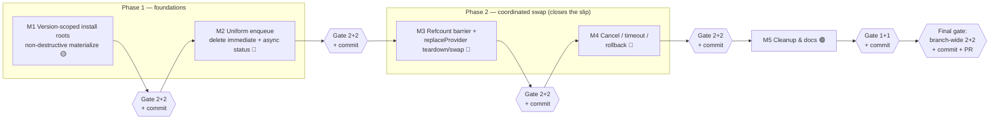

# Update Coordination — Execution Plan

> Companion to [UPDATE_COORDINATION.md](./UPDATE_COORDINATION.md) (the design). This plan sequences that
> rework into **milestones** — each a self-contained unit of work that is independently reviewable and
> testable — built from smaller work items with concrete files, symbols, and design references.
>
> **Builds on** the shipped [Connected AppAgent Provider](./DESIGN.md) work
> ([its execution plan](./EXECUTION_PLAN.md)). This plan assumes that model has landed: the
> `AppAgentHost` idle-gated FIFO applicator (§7.1), the per-name `DynamicAgentEntry` lifecycle tracker
> (§7.2), the `AppAgentSource` / `AppAgentConnection` seams, the `@package` host agent, and the
> cross-session fan-out (§4) are **in place and unchanged except where called out**.
>
> **Scope.** This plan replaces the disruptive **global drain-then-add** update (design §7.2) — which has
> a request-slip / misroute window (see [DEFERRED_REVIEW_LOG.md](./DEFERRED_REVIEW_LOG.md), _Open —
> request-slip in the update absence window_) — with a **single `commandLock`-held critical section per
> dispatcher** (`remove v1 → await v2 ready → add v2`) coordinated by a **source-side barrier**, made
> **cancelable + time-bounded**, on top of **non-destructive per-agent install roots**. The request-slip
> is an **update-only** defect, but the coordinated teardown barrier is a **single primitive**
> (`replaceProvider(old, new?)`): uninstall (`old → ∅`) and update (`old → new`) share it, so this plan
> **collapses uninstall's separate `startDrain`/`drainDrop`/`pending` drain into the same barrier** and,
> as a bonus, gives uninstall the same **verify-0** guarantee (the shared process is confirmed down before
> the name is reusable — no coexistence on reinstall-while-loaded). Plain install stays on the barrier-less
> fan-out; only the teardown/swap path is unified.

## The design phases this plan implements

The design closes the slip in two conceptual phases, so the foundations are right **before** the
coordinated swap is wired:

- **Phase 1 — foundations (non-destructive materialize + uniform enqueue).** Make an update's
  materialize non-destructive (per-agent version-scoped install roots, §5.5) and collapse the issuing
  session onto the same idle-gated path as siblings (delete `immediate`, §5.4). Neither changes the
  update slip yet; both are prerequisites for the coordinated swap and its rollback. → **Milestones 1–2.**
- **Phase 2 — the coordinated swap (closes the slip).** Add the refcount barrier (§5.6) and the single
  command-lock-held `replaceProvider` op + source barrier (§5.1, §5.7) — the **one teardown/swap primitive**
  for both uninstall and update — so request-vs-update is mutually exclusive on every dispatcher, then make
  it cancelable + time-bounded with rollback to v1 (§5.3). This is where the request-slip becomes
  **structurally impossible**, and where `startDrain`/`drainDrop`/`then` collapse into the barrier. →
  **Milestones 3–4.**

Milestone 5 is cleanup/docs. A final branch-wide gate closes the branch.

## Conventions

- **Paths** are repo-relative under `ts/`.
- Work is grouped into **milestones**. Each milestone is a coherent slice that builds, passes its tests,
  and leaves the product in a consistent state (no half-broken update path across a milestone boundary).
- Each milestone ends with a **Milestone Gate** (defined once below) — two subagent review rounds and two
  subagent test-gap rounds — before it is considered _done_.
- Within a milestone, each work item ends with a **Checkpoint**: it must build (`npm run build`), lint, and
  keep existing tests green before the next item starts.
- "Behavior-preserving" items ship without any user-visible change; "behavior-changing" items are called
  out explicitly.
- Estimated risk: 🟢 low / 🟡 medium / 🔴 high.
- **Working logs (update as you go):**
  - [UPDATE_COORDINATION_DEFERRED_LOG.md](./UPDATE_COORDINATION_DEFERRED_LOG.md) — every gate **review
    finding** or **test gap** you deliberately **did not address**, with a rationale. _(Created at the
    start of Milestone 1.)_ Kept separate from the connected-provider
    [DEFERRED_REVIEW_LOG.md](./DEFERRED_REVIEW_LOG.md) so this follow-up's logs read on their own.
    Implementation decisions that go beyond or deviate from the design are folded directly into
    [UPDATE_COORDINATION.md](./UPDATE_COORDINATION.md).

## Source-of-truth file map (from current code)

| Concern                                                                                                                                                                       | File                                                                      |
| ----------------------------------------------------------------------------------------------------------------------------------------------------------------------------- | ------------------------------------------------------------------------- |
| `AppAgentHost` / `AppAgentSource` / `AppAgentConnection` **interfaces**                                                                                                       | `packages/dispatcher/dispatcher/src/agentProvider/agentProvider.ts`       |
| `AppAgentHostApplicator` (idle-gated FIFO applicator, `immediate` flag, `applyImmediate`)                                                                                     | `packages/dispatcher/dispatcher/src/context/appAgentHost.ts`              |
| Applicator wiring, `AppAgentHostApplyFns` (`applyAdd`/`applyRemove`), `commandLock`                                                                                           | `packages/dispatcher/dispatcher/src/context/commandHandlerContext.ts`     |
| `AppAgentManager.addProvider` / `removeProvider` / lazy load / `getSessionContext`                                                                                            | `packages/dispatcher/dispatcher/src/context/appAgentManager.ts`           |
| npm provider refcount (`createNpmAppAgentProvider`, `moduleAgents`, `AgentProcess.count`, `unloadAppAgent` → `close()`)                                                       | `packages/dispatcher/nodeProviders/src/agentProvider/npmAgentProvider.ts` |
| Per-name lifecycle tracker (`DynamicAgentEntry`, `entries`, `startDrain`, `drainDrop`, `fanOutAdd`, `withTombstone`, `busy`) + `install`/`uninstall`/`update`                 | `packages/defaultAgentProvider/src/defaultAgentProviders.ts`              |
| `@package` app agent handlers + `InstalledAgentSourceApi`                                                                                                                     | `packages/defaultAgentProvider/src/installSources/packageAgent.ts`        |
| Installed-agent provider building + per-record require-root (`createInstalledAppAgentProvider`, `recordToNpmInfo`) + `agents.json` store (`readAgentsJson`/`writeAgentsJson`) | `packages/defaultAgentProvider/src/installSources/installedAgents.ts`     |
| Record shapes (`InstalledAgentRecord`, `MaterializedInstallRecord`)                                                                                                           | `packages/defaultAgentProvider/src/installSources/config.ts`              |
| Feed source (`npm install` into `installDir`)                                                                                                                                 | `packages/defaultAgentProvider/src/installSources/feedSource.ts`          |
| Install-source registry (`installDir`, `resolve`, `reresolve`, `materialize`)                                                                                                 | `packages/defaultAgentProvider/src/installSources/registry.ts`            |

### Package layering (dependency direction — must stay acyclic)

The connected-provider layering rule is unchanged and **must hold in every milestone**: nothing in
`agent-dispatcher` may `import` from `default-agent-provider`. The **coordination interfaces**
(`AppAgentHost.replaceProvider`, refcount-visibility on the provider contract) land in `agent-dispatcher`
core; the **barrier coordination** (verify-0, `whenReady`, timeout/rollback policy) lands in
`default-agent-provider` as part of the source.

| Package (npm name)          | Role                         | What this plan adds                                                                                                                                                                                                                                   |
| --------------------------- | ---------------------------- | ----------------------------------------------------------------------------------------------------------------------------------------------------------------------------------------------------------------------------------------------------- |
| `agent-dispatcher`          | dispatcher core; hosting API | `AppAgentHost.replaceProvider(old, new?)` (single lock-held teardown/swap — `new` omitted = uninstall); refcount visibility on the host apply path; **removes** the `immediate` param + `applyImmediate` inline path.                                 |
| `dispatcher-node-providers` | npm agent provider           | expose loaded/refcount state (`isLoaded` / `getRefCount`) on `createNpmAppAgentProvider`.                                                                                                                                                             |
| `default-agent-provider`    | reference host wiring        | per-agent version-scoped install roots + GC; source-side barrier (verify-0, `whenReady`, timeout/rollback); rewire **both `uninstall` and `update`** off `startDrain`/`drainDrop`/`then` onto the one `replaceProvider` barrier; async update status. |

---

## Milestone Gate (run at the end of every milestone)

A milestone is not _done_ when the code is written — it is done when it has passed this gate. Each step
dispatches a **fresh subagent** (use the `Explore` agent for read-only audits; write fixes in the main
session) scoped to **the milestone's diff and its design references**. Always run the build + full test
suite green _before_ starting the gate so the subagents review a working tree.

1. **Review round 1 — correctness & design fidelity.** Subagent audits the milestone diff against the
   cited design sections + the per-milestone _Review focus_. It returns a numbered list of findings
   (correctness, architecture/layering, security, error handling, style). The main session **addresses
   every finding** — fix it, or **log it in
   [UPDATE_COORDINATION_DEFERRED_LOG.md](./UPDATE_COORDINATION_DEFERRED_LOG.md)** with an explicit
   rationale for declining.
2. **Review round 2 — verification + fresh eyes.** A new subagent confirms round-1 findings are resolved
   and looks for anything introduced by the fixes or missed the first time. Address (or log) all findings.
3. **Test-gap round 1 — coverage audit.** Subagent enumerates untested behaviors and edge cases for the
   milestone's scope, cross-referencing the [test matrix](#cross-cutting-test-matrix) and the
   per-milestone _Test focus_. It returns a prioritized gap list. The main session **adds the missing
   tests** — or logs the gap — and makes the suite pass.
4. **Test-gap round 2 — re-audit after fills.** A new subagent re-checks coverage against the now-larger
   test suite and reports remaining gaps. Fill them (or log them).
5. **Green gate.** `npm run build`, lint, and the full test suite pass; record any durable lessons in repo
   memory. Confirm the [deferred log](./UPDATE_COORDINATION_DEFERRED_LOG.md) is up to date for this
   milestone (implementation decisions are folded directly into the design).
6. **Commit.** Make a single milestone commit with a descriptive message (see _Commit convention_ below);
   include the milestone's working-log updates in the commit. Only then start the next milestone.

> Why two rounds each: round 1 finds the obvious issues; round 2 (fresh subagent, post-fix tree) catches
> regressions from the fixes and anything the first pass anchored past. The same logic applies to tests.

**Gate weight.** The _full gate_ is **2 review + 2 test-gap** rounds (Milestones 1–4, and the final
branch-wide gate). A _light gate_ is **1 review + 1 test-gap** round, used only for the low-risk hygiene
Milestone 5. Every gate still ends with the green gate + commit.

### Commit convention

After each milestone's gate is green, make **one commit** (squash the milestone's work-in-progress as
needed) with a clear message:

```
<area>: <milestone title> (Update Coordination — Milestone N)

- what changed and why, in terms of the design (cite §sections of UPDATE_COORDINATION.md)
- notable decisions / deviations and their rationale (folded into UPDATE_COORDINATION.md)
- review + test-gap rounds completed; tests added
- anything deliberately deferred (see UPDATE_COORDINATION_DEFERRED_LOG.md)
- migration / behavior-change notes for reviewers
```

Use an `agents:` or `dispatcher:` area prefix to match the touched packages. Keep the milestone history
linear (one commit per milestone) so the branch reads as five reviewable steps plus a final review commit.

---

## Milestone 1 — Per-agent version-scoped install roots + non-destructive materialize (§5.5) 🟡 (behavior-changing)

**Goal.** Give every feed agent its **own** install root and let an update materialize `v2` into a
**version-scoped** root alongside the still-running `v1`, so materialize is non-destructive, a failed
install is a clean abort, and §5.3's cancel/rollback (Milestone 4) falls out for free. `path` and
`catalog` sources are already non-destructive (§5.5); this changes only `feed` and the per-record provider
require-root, plus record shape and GC.

**Why it's a self-contained unit.** It is a localized, mostly-independent change to the install layout and
the provider require-root — reviewable and testable (install into a version-scoped root; two roots coexist
during an update; orphan sweep) with **no** change to the routing/quiesce coordination yet. Today's
disruptive update still runs; it just materializes non-destructively.

### 1.1 — Version-scoped install root layout (§5.5) 🟡

1. In `feedSource.ts`, `npm install` into a **per-agent, version-scoped** root
   (`installDir/<name>@<version>/node_modules/...`) instead of the single shared `installDir/node_modules`.
   Key the dir by the dispatcher agent name (`agents.json` key) + concrete resolved version (from the
   installed `package.json`); an install-id suffix is the fallback if version-parsing is awkward (§5.5
   _Naming_).
2. In `installedAgents.ts`, derive the per-agent require-root from the record in
   `createInstalledAppAgentProvider` / `recordToNpmInfo` (today it points at the shared
   `path.join(installDir, "package.json")`). A `path` record is unaffected (absolute path); a `module`
   record resolves from its own version-scoped root.

**Checkpoint:** a feed install lands in its own version-scoped root; the vended provider resolves the agent
from that root; `path`/`catalog` installs unchanged.

### 1.2 — Record carries the resolved version / install-id (§5.5) 🟢

1. Extend `InstalledAgentRecord` (`config.ts`) to carry the resolved version (or install-id) so the
   provider builder derives the per-agent require-root from the record, not the shared `installDir`.
2. Thread the version through `materialize` (feed) → `MaterializedInstallRecord` → the record written to
   `agents.json`; keep it optional/back-compat for existing `module`/`path` records.

**Checkpoint:** a written `agents.json` record carries the version/install-id; the provider builder uses it
to locate the root.

### 1.3 — GC: prune-on-swap + startup orphan sweep (§5.5) 🟡

1. On a **successful** swap, prune `v1`'s dir (only after `v1` is confirmed down — the confirm lands in
   Milestone 3's §5.6 barrier; until then prune after the existing drain completes).
2. At source construction (`createDefaultInstalledAgentSource` in `defaultAgentProviders.ts`), add a
   **startup orphan sweep** that keeps only each agent's recorded-current root and removes stray dirs (a
   `v2` dir from a crashed update, or a `v1` dir that should have been pruned).

**Checkpoint:** a stale/orphan install dir is swept at startup; a normal install/uninstall leaves exactly
one root per agent.

### Milestone 1 Gate

- **Review focus:** feed installs into a version-scoped root (never the shared `node_modules`); require-root
  derived per-record; `path`/`catalog` untouched; two roots coexist during an update at the **file** level
  only (still one running process — §5.5 _File-level only_); record version/install-id threaded end to end;
  orphan sweep keeps exactly the recorded-current roots; layering (no core→host import).
- **Test focus:** install lands in `installDir/<name>@<version>/...`; provider resolves from that root;
  update materializes `v2` alongside a still-present `v1` dir (both on disk); failed materialize leaves
  `v1` dir intact; orphan sweep removes a crashed-update `v2` dir and an un-pruned `v1` dir but keeps the
  current root; back-compat for a record lacking a version.

---

## Milestone 2 — Uniform enqueue model: delete `immediate`, async update status (§5.4) 🔴 (behavior-changing)

**Goal.** Make the **issuing** session enqueue like a sibling and delete the `immediate` parameter + the
`applyImmediate` inline path entirely, so install, uninstall, and update apply through the **single**
idle-gated FIFO applicator on every dispatcher. Because the issuing op can no longer be awaited inline
under the command lock, `@package install`/`uninstall`/`update` **return "started"** and report the
outcome **asynchronously**.

**Why it's a self-contained unit.** It is the ownership flip that the coordinated swap (Milestone 3)
depends on — one apply path on every dispatcher — reviewable as "delete the inline path + async status"
with the update still using today's drain-then-add (now fully enqueued). It does not yet change the
quiesce/restart coordination.

### 2.1 — Enqueue the issuing op; remove the inline await under the lock (§5.4) 🔴

1. In `defaultAgentProviders.ts`, change `fanOutAdd` / `startDrain` so the **issuing** host op is
   **enqueued** on the applicator (like siblings) rather than applied inline while the `@package` command
   holds the command lock. The op is enqueued **before** `@package …` returns, so it sits ahead of any
   later user command in the FIFO (§5.4 point 2).
2. Because the op now runs at the issuing session's next idle (immediately after the command returns), the
   source op cannot `await` the issuing apply inside the handler — restructure `install`/`uninstall`/
   `update` to enqueue and return, surfacing completion via a follow-up (§2.3).

**Checkpoint:** the issuing session's install/uninstall/update apply through the idle-gated queue; no op is
applied inline under a held command lock.

### 2.2 — Delete `immediate` + `applyImmediate` (§5.4) 🔴

1. In `appAgentHost.ts`, remove the `immediate` parameter from `addProvider`/`removeProvider` and delete
   the `applyImmediate` method; both ops always `enqueue`.
2. Remove every `immediate=true` call site (the issuing legs in `fanOutAdd`/`startDrain`).

**Checkpoint:** `AppAgentHostApplicator` has one apply path (enqueue); the codebase has no `immediate`
references.

### 2.3 — Async `@package` update status (§5.3, §5.4) 🟡

1. `@package update` (and install/uninstall) return **"update started"**; the "updated" / "failed"
   outcome arrives asynchronously (follow-up message / streaming command result) when the enqueued op
   settles (`packageAgent.ts` handlers + `InstalledAgentSourceApi`).
2. Siblings continue to receive the existing fan-out system message on the outcome (design §5).

**Checkpoint:** `@package update` returns immediately with "started"; the terminal outcome is reported when
the op settles; the command lock is never held across the cross-session work.

### Milestone 2 Gate

- **Review focus:** `immediate` + `applyImmediate` fully removed (no dead callers); issuing op enqueued
  ahead of later user commands (FIFO ordering preserved); no deadlock (handler returns → lock releases →
  op runs at idle); async status wording matches §5.3 states; siblings still notified; layering intact.
- **Test focus:** issuing install/uninstall/update apply via the queue (no inline path); `@package update`
  returns "started" then reports "updated"/"failed" async; a later user command queued after an enqueued
  update runs **after** it (FIFO); no `immediate` symbol remains (grep gate); update remove-then-add still
  ordered on the issuing session.

---

## Milestone 3 — Refcount barrier + coordinated `replaceProvider` teardown/swap (§5.1, §5.6, §5.7) 🔴 (behavior-changing) — **closes the slip**

**Goal.** Introduce **one** coordinated teardown/swap primitive — `replaceProvider(old, new?)` — and route
**both uninstall and update** through it, replacing the update's global drain-then-add _and_ uninstall's
separate `startDrain`/`drainDrop`/`pending` drain. For update it is **one command-lock-held critical
section per dispatcher** — `remove v1 → await v2 ready → add v2` under a single `commandLock` acquisition;
for uninstall it is the same section with **no add** (`old → ∅`). A **source-coordinated barrier** starts
`v2` (or frees the name, for uninstall) only after the shared `v1` refcount is **verified 0**. Because the
whole op is mutually exclusive with requests on every dispatcher, the update request-slip is
**structurally impossible** (§5), and uninstall gains the same no-coexistence guarantee.

**Why it's a self-contained unit.** It is the core correctness change plus the unification win, reviewable
as "the one coordinated op + source barrier + verify-0, with `startDrain`/`drainDrop`/`then` deleted" in
isolation. Cancellation/timeout (Milestone 4) is layered on top; here the happy-path teardown/swap is
closed and slip-free.

### 3.1 — Expose refcount / loaded state on the npm provider (§5.6) 🟡

1. In `npmAgentProvider.ts`, expose the loaded/refcount state that is today private to
   `createNpmAppAgentProvider` (`moduleAgents` / `AgentProcess.count`), e.g. `isLoaded(name)` /
   `getRefCount(name)`, so the source can **verify** `v1`'s count is 0 rather than infer it from ACKs.
2. Surface the capability through the provider/host contract so the source can query it without importing
   node-provider internals (layering).

**Checkpoint:** the source can read whether a provider still has a loaded (refcounted) agent; `unloadAppAgent`
still runs `close()` only at count 0 (unchanged).

### 3.2 — `AppAgentHost.replaceProvider(old, new?)` — the single lock-held section (§5.1, §5.7) 🔴

1. Add `replaceProvider(oldProvider, newProviderThunk | undefined, { onQuiesced, whenReady })` to
   `AppAgentHost` (`agentProvider.ts`) and implement it in `AppAgentHostApplicator` (`appAgentHost.ts`) as
   **one** queued op = **one** `commandLock` acquisition. Its body (§5.7): remove `old` routing artifacts +
   `unloadAppAgent(old)` (decrement the shared refcount) → call `onQuiesced()` → `await whenReady` → if a
   `newProviderThunk` was given, build/add `new` artifacts → release the lock. **Omit the thunk for
   uninstall** (`old → ∅`): the same section, no add.
2. **Leaf-op invariant (§5.7):** teardown (`unloadAppAgent`/`close`) and startup (`load`/`init`) run under
   the held command lock and **must be leaf ops** — process teardown/launch only, never dispatching a
   command or reacquiring the command lock. Enforce + test.
3. `dispose()` mid-op: drop the host from the barrier (subsuming today's `drainDrop`), auto-ack, no-op late.

**Checkpoint:** on one dispatcher, `replaceProvider` removes `old`, signals quiesced, waits, then (for
update) adds `new`, all under a single command-lock hold; with the thunk omitted it is a lock-held
uninstall; a request cannot interleave either.

### 3.3 — Source barrier + verify-0; rewire `update` **and** `uninstall` onto `replaceProvider` (§5.1, §5.6, §5.7) 🔴

1. In `defaultAgentProviders.ts`, delete `startDrain` / `drainDrop` / the `then` callback and drive both
   ops from a **coordinated `replaceProvider`** fanned out to every connected host: each host's
   `onQuiesced` fills a **barrier slot** (reusing the `pending: Set` shape); each awaits a shared
   `whenReady` promise the **source** resolves. `update` passes a `newProviderThunk`; `uninstall` omits it.
2. The source resolves `whenReady` only once (a) every quiesce ACK is in **and** (b) §5.6's **verify-0**
   passes — the shared `old` refcount is confirmed 0 (`old` gone from `moduleAgents`, `close()` ran). If it
   is not 0, do **not** start `new` / free the name: wait for the straggler(s) (Milestone 4 adds
   abort/rollback on timeout). With Milestone 1's version-scoped roots, `v1` and `v2` are **separate
   provider instances** with **separate refcounts** — a clean handoff.
3. `update` materializes `new` first (Milestone 1 non-destructive), keeps `old` on disk until the swap
   succeeds, and prunes `old` only after success (§5.1, §5.3). `uninstall` prunes `old`'s root once
   verify-0 confirms it is down.
4. The `DynamicAgentEntry` keeps its `active` / in-flight distinction (the barrier marks the name
   teardown-in-progress so reuse is gated), but the entry sheds the `then` field and the bespoke
   `startDrain` ack bookkeeping — both live in the one barrier now.

**Checkpoint:** `@update foo` swaps `foo` to `v2` on every connected session with `v1` confirmed terminated
before `v2` starts (no session observes `foo` absent); `@uninstall foo` frees the name only after the
shared process is confirmed down everywhere; a mid-request session blocks verify-0 until it drains.

### Milestone 3 Gate

- **Review focus:** the entire per-dispatcher swap is **one** `commandLock` section (one acquisition, no
  release between remove and add); `replaceProvider` body order matches §5.7; the thunk-omitted uninstall
  path is the same section with no add; verify-0 is an **explicit** refcount check, never inferred from
  ACKs (§5.6); no-coexistence held (new never starts / name never freed while old count > 0); leaf-op
  invariant enforced; barrier is **source-coordinated** (no dispatcher-to-dispatcher wait, no cycle);
  `startDrain`/`drainDrop`/`then` fully deleted with no behavior lost for uninstall; disconnect-mid-barrier
  drops cleanly; layering (interface in core, barrier/verify in host).
- **Test focus:** single-dispatcher `replaceProvider` holds the lock across remove→wait→add (a queued
  request runs strictly before or after, never during); thunk-omitted uninstall holds the lock across
  remove→verify-0→free; verify-0 blocks `v2` start / name-free until the last host unloads; mid-`foo`-request
  host blocks verify-0 until it drains; `v1`/`v2` separate refcounts; disconnect during freeze drops from
  the barrier; uninstall + update both go through the one barrier (no `startDrain` path remains); leaf-op
  invariant (teardown/startup does not reacquire the command lock).

---

## Milestone 4 — Cancellation, timeout & rollback (§5.3) 🔴

**Goal.** Make the freeze **cancelable** (user, out-of-band) and **time-bounded** (safety), with a clean
rollback that keeps `v1` fully intact and restartable until `v2` is confirmed serving. Any stall — a
straggler that won't idle, a `v1` that won't die, a `v2` that won't start — resolves to rollback, so there
is no unavoidable deadlock (§5.7 _Liveness_).

**Why it's a self-contained unit.** It hardens the Milestone 3 swap with the timeout/cancel/rollback
envelope, reviewable as the safety layer around the coordinated op.

### 4.1 — Per-phase timeouts + auto-rollback (§5.3) 🟡

1. Add a short **quiesce** timeout (abandon a straggler fast) and a longer **v2 start/verify** timeout
   (accommodate process launch); either expiry auto-rolls-back. Config-tunable; start conservative.
2. The timeout is the **ultimate backstop** for every stall (§5.7 _Liveness_).

**Checkpoint:** a straggler that won't idle, and a `v2` that won't start, each hit their phase timeout and
roll back.

### 4.2 — Out-of-band cancel via `abortSignal` (§5.3) 🟡

1. Wire cancel through the existing interrupt/abort path (`abortSignal`), **not** the command queue — a
   typed `cancel` would queue behind the frozen op and deadlock (§5.3). The issuing dispatcher's abort maps
   to a source-coordinated rollback.
2. Initially cancel need only be **available on the API** (abort-driven); the user-facing cancel UX is
   deferred (TODO in `packageAgent.ts`, §5.3).

**Checkpoint:** an abort during the freeze triggers rollback without deadlocking on the held command lock.

### 4.3 — Rollback keeps v1 until v2 succeeds (§5.1, §5.3) 🔴

1. On cancel/timeout **before** `v2` is serving: restart `v1` (still on disk), swap `v1` artifacts back in,
   release the lock, discard `v2` → `active(v1)`, as if the update never happened.
2. Prune `v1`'s dir (and any `v2` dir on rollback) only per the Milestone 1 GC rules; a crashed rollback is
   swept at next startup.

**Checkpoint:** a canceled/timed-out update leaves `foo` on `v1` and serving in every session; `v2` is
discarded.

### 4.4 — Status surfacing for the async outcome (§5.3, §5.4) 🟢

1. The issuing conversation gets async status: **updating → updated / cancelled-reverted / failed-reverted**
   (built on Milestone 2's async status).
2. Siblings experience the brief freeze and get a **system message** on the outcome (design §5).

**Checkpoint:** the issuing user sees the correct terminal status for success, cancel, and failure;
siblings are notified.

### Milestone 4 Gate

- **Review focus:** cancel rides `abortSignal` (never the command queue) — no deadlock on the held lock;
  per-phase timeouts both present and independently roll back; rollback restores `v1` exactly (artifacts +
  running process) and discards `v2`; `v1` never pruned before `v2` is confirmed serving; every
  fire-and-forget has a `.catch`; liveness — no stall path lacks a timeout backstop.
- **Test focus:** straggler-times-out → rollback; `v2`-won't-start times-out → rollback; abort mid-freeze →
  rollback (no deadlock); rollback leaves `v1` active + serving everywhere and discards `v2`; issuing
  status = updating/updated/cancelled-reverted/failed-reverted; sibling system message on each outcome;
  disconnect-during-rollback is safe.

---

## Milestone 5 — Cleanup, docs & hygiene (§6) 🟢 (behavior-preserving)

**Goal.** Retire the update-specific machinery the single-hold model supersedes and align docs.

**Why it's a self-contained unit.** Dead-code removal + docs are orthogonal to the runtime behavior shipped
in Milestones 1–4; reviewable as a hygiene pass.

### 5.1 — Remove superseded teardown machinery (§6) 🟢

1. Delete the now-unused `startDrain`, `drainDrop`, and the `removing` entry's post-drain `then` callback
   — both uninstall and update run through the one `replaceProvider` barrier (Milestone 3), so the separate
   drain/ack bookkeeping is dead. The `DynamicAgentEntry` keeps only its `active` / in-flight (barrier)
   distinction.
2. **Evaluate removing the load tombstone (`withTombstone`).** Under the single lock-held model each host's
   remove + `unloadAppAgent` are atomic leaf ops, so the per-host "removed-but-still-loadable" race the
   tombstone guarded is closed. Remove it **if** the Milestone 3 review confirms no cross-host window
   survives; otherwise keep it and log the reason in
   [UPDATE_COORDINATION_DEFERRED_LOG.md](./UPDATE_COORDINATION_DEFERRED_LOG.md).
3. Grep-gate for dangling references to removed symbols (`startDrain`, `drainDrop`, `immediate`,
   `applyImmediate`, and — if removed — `withTombstone`).

**Checkpoint:** no references to removed symbols; uninstall + update run through the one barrier; core
carries the `replaceProvider` teardown/swap only.

### 5.2 — Docs (§6, §7) 🟢

1. Flip [UPDATE_COORDINATION.md](./UPDATE_COORDINATION.md) status from **Proposed / not implemented** to
   **Implemented**.
2. Update DESIGN.md §7.2's _Known gap_ note (the update request-slip) to point at the shipped rework;
   resolve the _Open — request-slip in the update absence window_ item in
   [DEFERRED_REVIEW_LOG.md](./DEFERRED_REVIEW_LOG.md).
3. Update the code comments in `packageAgent.ts` / `defaultAgentProviders.ts` that documented the old
   disruptive drain-then-add + "briefly reloads in each session" behavior.

**Checkpoint:** docs match shipped behavior; the deferred-log open item is resolved.

### Milestone 5 Gate (light — 1 review + 1 test-gap round)

Low-risk hygiene milestone, so a single round each (then green gate + commit).

- **Review focus:** `startDrain`/`drainDrop`/`then` fully removed with no behavior lost (uninstall + update
  both covered by the barrier); the tombstone removal (if taken) leaves no load-during-teardown gap, else
  its retention is logged; docs/comment accuracy; no accidental behavior change.
- **Test focus:** grep gate for removed symbols; uninstall-via-barrier + verify-0 still covered (from M3);
  help/status text matches the async update surface; smoke boot on all hosts.

---

## Final Gate — Branch-wide review ✅ (full 2 + 2)

After Milestone 5 is committed, run the **full gate one more time over the entire branch diff**
(`git diff <base>...HEAD`), not just a single milestone. This catches issues that only emerge from the
whole change set: cross-milestone seams, an interface that drifted between milestones, dead code missed by
the incremental passes, and end-to-end behavior across the unified flow.

- **Scope:** the complete branch diff vs. the base branch, read against the whole design (§§1–7 of
  UPDATE_COORDINATION.md) and the connected-provider DESIGN §7.
- **Review round 1 / round 2:** same procedure as the Milestone Gate, but the subagent reviews the
  _aggregate_ diff — the single-hold invariant (one `commandLock` section per dispatcher across the swap),
  no-coexistence held under verify-0, the timeout/cancel/rollback envelope, layering held across all
  packages (`agent-dispatcher` never imports `default-agent-provider`), version-scoped roots + GC, no
  leftover `immediate` or `startDrain`/`drainDrop`/`then` paths (uninstall + update on the one barrier).
- **Test-gap round 1 / round 2:** audit total coverage — every row of the
  [test matrix](#cross-cutting-test-matrix), plus the end-to-end path that spans milestones (two live
  conversations → `@update foo` in A → both sessions freeze under their command locks → `v1` verified
  down → `v2` starts → both swap with no observed absence → cancel/timeout on a third run rolls both back
  to `v1`).
- **Green gate + final commit:** full build/lint/test green; make a final review commit
  (`dispatcher: update-coordination branch-wide review fixes (final gate)`) and open the PR.

---

## Cross-cutting test matrix

| Scenario                                                                           | Milestone |
| ---------------------------------------------------------------------------------- | --------- |
| Feed install lands in `installDir/<name>@<version>/...`; provider resolves from it | 1         |
| Update materializes `v2` alongside a still-present `v1` dir (both on disk)         | 1         |
| Failed materialize leaves the `v1` dir intact (clean abort)                        | 1         |
| Startup orphan sweep removes crashed-update `v2` / un-pruned `v1`, keeps current   | 1         |
| Record carries version/install-id; back-compat for a record lacking one            | 1         |
| Issuing install/uninstall/update apply via the queue (no inline path)              | 2         |
| `@package update` returns "started" then reports "updated"/"failed" async          | 2         |
| Later user command queued after an update runs strictly after it (FIFO)            | 2         |
| No `immediate` / `applyImmediate` symbol remains (grep gate)                       | 2         |
| npm provider exposes loaded/refcount state (`isLoaded`/`getRefCount`)              | 3         |
| `replaceProvider` holds one command-lock section across remove→wait→add            | 3         |
| Thunk-omitted `replaceProvider` is a lock-held uninstall (remove→verify-0→free)    | 3         |
| A request never interleaves the swap (runs strictly before or after)               | 3         |
| verify-0 blocks `v2` start / uninstall name-free until the last host unloads       | 3         |
| Mid-`foo`-request host blocks verify-0 until it drains                             | 3         |
| `v1`/`v2` are separate provider instances with separate refcounts                  | 3         |
| Uninstall + update both go through the one barrier (no `startDrain` path)          | 3         |
| Leaf-op invariant: teardown/startup does not reacquire the command lock            | 3         |
| Disconnect during the freeze drops the host from the barrier                       | 3, 4      |
| Straggler-won't-idle → quiesce timeout → rollback                                  | 4         |
| `v2`-won't-start → start/verify timeout → rollback                                 | 4         |
| Abort mid-freeze → rollback (no deadlock on the held lock)                         | 4         |
| Rollback leaves `v1` active + serving everywhere; `v2` discarded                   | 4         |
| Issuing status: updating / updated / cancelled-reverted / failed-reverted          | 4         |
| Sibling system message on update outcome                                           | 4         |
| `startDrain`/`drainDrop`/`then` removed; no behavior lost for uninstall            | 5         |
| No dangling references to removed symbols (incl. tombstone, if removed)            | 5         |

## Deferred — not in this plan

- **Code-only fast path.** Every update is treated as potentially schema-changing and always uses the
  coordinated freeze; the "skip the lockstep when `v1 ≡ v2` schemas" fast path is **rejected for
  simplicity** (§5) and out of scope. Revisit only if the freeze proves too disruptive.
- **Per-name `held` routing gate.** A lighter "block only requests for `foo`" gate is rejected in favor of
  the command lock (§5) — under the always-schema-changing model it cannot spare NL traffic. Not pursued.
- **User-facing cancel UX.** Cancel is delivered **abort-driven on the API** only (§5.3); the interactive
  cancel command/affordance is a follow-up TODO.
- **Cross-agent dependency dedup/hoisting.** Per-agent install roots (§5.5) deliberately trade npm's
  cross-agent dedup for isolation; restoring shared hoisting is out of scope.
- **Sharing per-dispatcher routing artifacts across dispatchers.** The `AppAgentManager` rebuilds grammars/
  schemas/embeddings per dispatcher on every connect/update (noted in `appAgentManager.ts`); building once
  per agent version is a separate optimization, not part of this correctness rework.

## Milestone sequencing

Each gate ends with a **commit** (one per milestone); the branch reads as five milestone commits plus a
final review commit. Milestones 1–2 deliver **Phase 1 (foundations)**; Milestones 3–4 deliver **Phase 2
(the coordinated swap)** — where the request-slip is actually closed.



Milestones 1–2 lay the non-destructive-materialize and single-apply-path foundations (no slip change yet).
Milestone 3 is the correctness core — the one command-lock-held `replaceProvider` teardown/swap + verify-0
barrier (shared by uninstall + update) that makes the request-slip structurally impossible (highest risk;
gate it hardest). Milestone 4 wraps it in the cancel/timeout/rollback envelope. Milestone 5 is hygiene (light gate). The **final branch-wide gate**
re-runs the full 2+2 over the aggregate diff before the PR. Each gate must be green and committed before
the next milestone starts.
