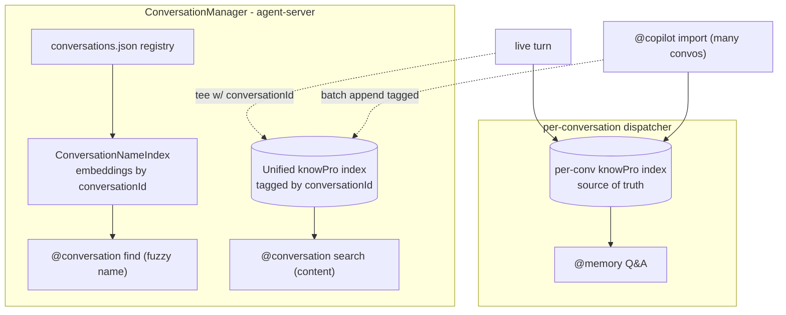

# Conversation Search — Design & Plan

Status: **in progress** — slice 1 complete (backend + in-chat surface across
Shell, VS Code shell, and CLI; find-then-switch). Next: slice 2 (unified index).
Last updated: 2026-07-29.

## Goal

Let a user find conversations two ways:

1. **Fuzzy lookup by name** — "switch to the conversation named _blah_", where
   _blah_ is imprecise (typo'd, partial, or semantically close: "gym music" →
   "workout playlist setup").
2. **Content search** — "find the conversation where we were talking about /
   doing X", answered from conversation memory (knowPro), returning _which_
   conversation(s) discussed X.

Scope for now: **connected / agent-server mode only.** Standalone Shell is
deferred (decision #4).

## Current architecture (verified)

- UI-level conversations are owned by the agent-server
  [`ConversationManager`](../../../packages/agentServer/server/src/conversationManager.ts).
  Registry = `instanceDir/conversations/conversations.json`
  (`{ conversationId (UUIDv4), name, createdAt, source?, readOnly?, copilot? }`).
  Each conversation has its own `persistDir = conversations/<conversationId>/`
  and its own lazily-created `SharedDispatcher`, evicted after 5 min idle.
- `listConversations(name?)` today is a **case-insensitive substring** filter
  ([conversationManager.ts](../../../packages/agentServer/server/src/conversationManager.ts)).
- The dispatcher builds **one `conversationMemory` per session dir** in
  [`initializeMemory()`](../../../packages/dispatcher/dispatcher/src/context/memory.ts)
  (`baseFileName: "conversationMemory"`). So in connected mode there is already
  one knowPro index per conversation under its `persistDir` — but it is **siloed
  and lazy** (only present while that conversation's dispatcher is live), so
  nothing can search across conversations.
- Live turns are queued to memory via `addRequestToMemory` /
  `addResultToMemory` ([memory.ts](../../../packages/dispatcher/dispatcher/src/context/memory.ts)).
  This is the tee point for a unified index.

### Key constraint: knowPro is append-only

`ICollection` / `IMessageCollection`
([interfaces.ts](../../../packages/knowPro/src/interfaces.ts)) are **append-only**
(`append()`, no per-message remove). Message ordinals are positional and semantic
refs point at them, so **you cannot remove one conversation's messages from a
shared index without rebuilding it**. This shapes the deletion story below.

Tag scoping IS supported: `createTagSearchTermGroup(tags)` →
`PropertyNames.Tag` ([searchLib.ts](../../../packages/knowPro/src/searchLib.ts)),
`ConversationMessage` accepts `tags?: kp.MessageTag[]`, and
`MemorySettings.useScopedSearch` (experimental) uses structured tags.

## Design decisions

| # | Decision | Rationale |
|---|----------|-----------|
| 1 | Fuzzy name = **hybrid lexical + embedding** | Lexical nails exact/typo; embeddings catch semantic. Embedding pattern already exists in repo. |
| 2 | Content search = **one unified knowPro index across all conversations**, messages tagged by `conversationId` | Cross-conversation search without spinning up N dispatchers. Accept double-indexing (per-conversation **and** unified); storage is cheap. |
| 3 | **Split** the surface: `@conversation find <name>` (fuzzy) + `@conversation search <query>` (content), separate actions | Distinct intents; can unify later. |
| 4 | **Connected mode only** for now | Standalone unification is a bigger, separate effort. |
| 5 | Per-conversation index = **source of truth**; unified index = **derived/rebuildable** | Append-only means hard delete must drop the per-conversation dir; unified index is compacted by rebuild. |
| 6 | Unified-index compaction (reclaim tombstones) triggered **on idle-conversation timeout** + a startup safety check | The idle-eviction moment is contention-free; startup covers the "never idle again" case. |

## Target architecture

### Search #1 — fuzzy name

Reuse the established name-index pattern from
[tabTitleIndex.mts](../../../packages/agents/browser/src/agent/tabTitleIndex.mts)
and [programNameIndex.ts](../../../packages/agents/desktop/src/programNameIndex.ts):

- `isEmbeddingAvailable()` + `openai.createEmbeddingModel(openai.apiSettingsFromEnv(openai.ModelType.Embedding))`.
- Cache `Record<conversationId, NormalizedEmbedding>`; embed on create, re-embed
  on rename, drop on delete, rebuild from `conversations.json` at startup.
- `generateEmbedding(model, query)` + `indexesOfNearest(embeddings, q, k, SimilarityType.Dot)`.
- **Hybrid**: lexical (substring + edit-distance) results first, then embedding
  nearest neighbors merged in. No embedding provider ⇒ lexical-only (graceful).

### Search #2 — content (unified index)

- A single `ConversationMemory` instance owned by `ConversationManager` at an
  instance-level path (e.g. `conversations/_unified/`), loaded once and kept warm.
- Every message appended with a `conversationId` structured tag (+ store enough
  to resolve display name at query time from the registry; never bake stale
  names into the index).
- Cross-conversation search runs unscoped, groups/ranks hits by `conversationId`.
- **Delete** ⇒ append-only, so **tombstone** the `conversationId` (filter out at
  query time) + **compact** (rebuild from surviving per-conversation indexes) on
  idle timeout / startup threshold.
- **Rename** ⇒ no index change.
- **Population**: `ConversationManager` injects a unified-memory sink +
  `conversationId` into each per-conversation dispatcher so
  `addRequestToMemory` / `addResultToMemory` tee to the unified index; standalone
  leaves the sink undefined (no-op). `@copilot import` batch-appends imported
  turns (tagged), incremental via the existing `lastSyncedTurnIndex` watermark.

## Surface (split)

- `@conversation find <query>` → `findConversation` action → new RPC
  `findConversations(query, maxMatches?)` returning scored `ConversationInfo[]`
  (new method; leaves `listConversations` substring semantics untouched).
- `@conversation search <query>` → `searchConversation` action → queries the
  unified index, returns matching conversations + snippets.
- CLI: `agent-cli conversations find <query>` and `... search <query>`.
- `.agr` grammar patterns for both ("which conversation was about X", etc.).

## Slices

- **Slice 1 — fuzzy name (`@conversation find`).** `ConversationNameIndex` in
  `ConversationManager`; `findConversations` RPC (protocol + client + server);
  `@conversation find` command + `findConversation` action + `.agr`; CLI
  `conversations find`. Self-contained, no memory-model changes.
  - **Done:** `conversationNameIndex.ts` (hybrid lexical + embedding, unit
    tested); `ConversationManager.findConversations` + create/import/rename/
    delete/seed lifecycle wiring; `findConversations` RPC across protocol,
    client, server handler (+ browser-extension adapter and client test stub);
    CLI `conversations find`. All packages build; 8/8 unit tests pass.
  - **Remaining (slice 1b):** in-chat surface — `@conversation find` command +
    `findConversation` action + `.agr` grammar, and client rendering of the
    result (the `manage-conversation` payload path, per client). Open question:
    whether "switch to the conversation about X" should find-then-switch.
  - **Slice 1b: DONE.** Extended the shared client `manage.ts` with a `find`
    subcommand + `matches` result kind + `manageFind`, and made `manageSwitch`
    fall back to a fuzzy find-then-switch (score >= 0.6) when there is no exact
    name. Rendered `matches` in the shared `render.ts` (Shell + VS Code shell)
    and the CLI + browser-extension renderers. Dispatcher: `findConversation`
    action + `@conversation find` command + `.agr` grammar (plus an "about X"
    switch phrasing). Tests: manageFind, fuzzy switch, matches render, and
    findConversation grammar (all passing). Note: "switch ... about X" =
    find-then-switch, `@conversation find` = list ranked matches.
- **Slice 2 — unified index scaffolding.** Create/open the
  `ConversationManager`-owned unified `ConversationMemory`; tagged `append`;
  tombstone-on-delete; compaction hook on idle timeout + startup.
- **Slice 3 — population.** Tee live turns (inject sink + conversationId into the
  per-conversation dispatcher); batch-append on `@copilot import` (incremental).
- **Slice 4 — content search surface.** `@conversation search` command +
  `searchConversation` action + `.agr`; CLI; group/rank by conversation.
- **Later** — unify the two commands if desired; standalone Shell support.

## Open items / risks

- Compaction cost when many conversations exist (`@copilot import`): rebuild is
  O(all messages). Mitigate with threshold trigger; consider a per-conversation
  summary index for routing if fan-out/rebuild ever hurts.
- Name resolution for tombstoned/renamed conversations in unified results must
  come from the live registry, not the index.
- Privacy: tombstoned (deleted) content physically remains in the unified index
  until compaction — ensure it is filtered from both search results and answer
  generation immediately on delete.
