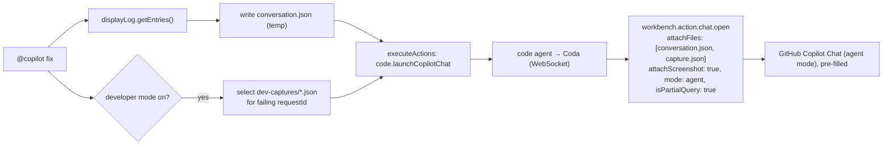

# `@copilot fix` — Hand a TypeAgent failure to VS Code Copilot

Status: Draft. This document is the single source of truth for the
"`@copilot fix` hands the current TypeAgent conversation + a screenshot to
GitHub Copilot Chat so it can fix the underlying problem" effort. Progress
tracking lives in [STATUS.md](./STATUS.md).

## Motivation

When a request fails in TypeAgent (a bad translation, a broken action, an
agent error), the user has the full context in front of them — the
conversation, the error bubble, the on-screen state — but no fast path to
turn that into a fix. Today they must manually switch to VS Code, re-describe
the problem to Copilot, and hope they reproduce enough context.

`@copilot fix` closes that loop with a single command. It gathers the
**entire raw conversation**, the developer-mode **translation captures** (when
available), and a **screenshot of the VS Code window**, then opens **GitHub
Copilot Chat in agent mode** pre-filled with a "diagnose and fix this" prompt
and all of that context attached. Copilot can then edit the workspace to fix
the actual bug.

The heavy lifting reuses infrastructure that already exists: the raw display
log the chat UI replays on reload, developer-mode `dev-captures`, and the
"vscode agent" (the `code` agent + the Coda extension) that already bridges the
dispatcher to VS Code commands.

## TL;DR

Add a manual `@copilot fix [instructions]` subcommand to the system `@copilot`
command table. The handler (running in the dispatcher, where the conversation
lives):

1. Reads the **entire raw conversation** from `systemContext.displayLog.getEntries()`
   — the same source `dispatcher.getDisplayHistory()` feeds to the chat UI on
   reload — and writes it to a temp `conversation.json`.
2. When **developer mode** is on and the session is persistent, also collects the
   relevant `<sessionDir>/dev-captures/translate-*.json` capture(s) (request,
   history context, resolved actions, full model prompts) for the failing
   request.
3. Opens **native GitHub Copilot Chat** (agent mode) via the `code` agent → Coda
   bridge, calling `workbench.action.chat.open` with the conversation + capture
   JSON files as `attachFiles`, a native window screenshot via
   `attachScreenshot: true`, and a "diagnose & fix in this workspace" `query`
   (pre-filled, not auto-submitted).

Conversation and captures ride as **JSON file attachments** — "the agent can
decide how to parse." The screenshot is attached as a real image with no temp
file and no file-permission prompt.

This is deliberately routed through the **code agent + Coda** (not the
vscode-shell extension directly) so the same feature works from both the VS Code
shell and the Electron shell later, matching the user's "leverage the vscode
agent" intent.

## Aligned decisions

| Topic               | Decision                                                                                                                                                 |
| ------------------- | -------------------------------------------------------------------------------------------------------------------------------------------------------- |
| Where it runs       | Start with the VS Code shell (`packages/vscode-shell`); design is frontend-agnostic so the Electron shell (`packages/shell`) works later for free.       |
| Execution surface   | **Option A** — dispatcher orchestrates; VS Code automation runs through the `code` agent → Coda WebSocket bridge.                                        |
| Target Copilot      | Default **native GitHub Copilot Chat** in **agent** mode. `--target typeagent` (route to the TypeAgent `vscode-chat` participant) is reserved for later. |
| Conversation source | The **raw display log** (`displayLog.getEntries()`), delivered as a JSON file attachment. **Not** `conversationMemory` (that is indexed, not raw).       |
| Developer-mode data | When developer mode is on, also attach the `dev-captures` JSON for the failing request(s) — richer "why did it fail" context.                            |
| Screenshot          | Native `attachScreenshot: true` (VS Code captures the focused window and attaches it as an image). Avoids a temp file and the file-permission prompt.    |
| Submit behavior     | `isPartialQuery: true` — pre-fill the prompt, let the user review the large context before sending.                                                      |
| Trigger             | Manual `@copilot fix` only (no automatic on-failure affordance in v1).                                                                                   |

## Conversation data sources

| Source                                                                   | Contents                                                                                      | Availability                           | Role                                                          |
| ------------------------------------------------------------------------ | --------------------------------------------------------------------------------------------- | -------------------------------------- | ------------------------------------------------------------- |
| `systemContext.displayLog.getEntries()` → `DisplayLogEntry[]`            | Raw human-visible conversation: user requests, agent display bubbles, errors, command results | Always                                 | **Primary** → `conversation.json`                             |
| `<sessionDir>/dev-captures/translate-<ts>-<requestId>.json` (`DevTrace`) | Per-translation: request, history context, resolved actions, **full model prompt(s)**         | Developer mode ON + persistent session | **Supplementary** → attach capture(s) for the failing request |
| `systemContext.conversationMemory`                                       | Indexed / knowledge-extracted messages                                                        | Persistent sessions                    | ❌ Not used (not the raw log)                                 |

`DisplayLogEntry` union (`packages/dispatcher/types/src/displayLogEntry.ts`):
`SetDisplayEntry | AppendDisplayEntry | SetDisplayInfoEntry | NotifyEntry |
UserRequestEntry | PendingInteractionEntry | InteractionResolvedEntry |
InteractionCancelledEntry | CommandResultEntry | UserFeedbackEntry |
UserMessageHiddenEntry`.

## Key mechanics (verified against the codebase)

- **Existing `@copilot` command table.** `getCopilotCommandHandlers()` in
  `packages/dispatcher/dispatcher/src/context/system/handlers/copilotCommandHandlers.ts`
  already registers `import`; add `fix` alongside it. Wired into `systemHandlers`
  in `.../context/system/systemAgent.ts`.
- **Raw conversation.** `commandHandlerContext.ts` exposes non-optional
  `displayLog: DisplayLog`; `DisplayLog.getEntries(afterSeq?)` returns
  `DisplayLogEntry[]` (`.../src/displayLog.ts`). `dispatcher.getDisplayHistory()`
  is literally `context.displayLog.getEntries(afterSeq)` (`.../src/dispatcher.ts`).
  Precedent for a system handler reading it: `feedbackCommandHandlers.ts`.
- **Developer-mode captures.** `DevTrace` (`.../src/context/devTrace.ts`) writes
  `<sessionDir>/dev-captures/translate-<ts>-<requestId>.json` when
  `systemContext.developerMode` is on and the session has a directory. Capture
  files are named by `requestId`, which also appears on the display-log entries —
  so the failing request's capture can be correlated.
- **Running an agent action from a command handler.** Use
  `executeActions(toExecutableActions([{ schemaName, actionName, parameters }]), undefined, context)`
  — the exact pattern in `actionCommandHandler.ts`. (`executeActions` is exported
  from `.../execute/actionHandlers.ts`.) Command-handler results do **not**
  auto-run `additionalActions`, so the orchestration is explicit.
- **code agent → Coda forwarding.** `executeCodeAction`
  (`packages/agents/code/src/codeActionHandler.ts`) forwards any action whose
  `schemaName !== "code.code-vscode-shell"` to Coda as
  `{ id, method: "code/<actionName>", params }` over the WebSocket bridge (5s
  pending-call timeout). A new editor-schema action therefore needs **no**
  code-agent handler change — only the schema entry plus a Coda handler.
- **Coda routing.** `packages/coda/src/wsConnect.ts` dispatches to
  `handleVSCodeActions({ actionName, parameters })` →
  `handleEditorCodeActions` / etc. Coda already has `isCopilotEnabled()` in
  `helpers.ts`.
- **VS Code chat open API.** `workbench.action.chat.open` accepts
  `IChatViewOpenOptions` (verified in
  `src/vs/workbench/contrib/chat/browser/actions/chatActions.ts` on `main`):
  - `query: string`, `isPartialQuery?: boolean` (true → pre-fill, don't submit)
  - `mode?: ChatModeKind | string` (`"agent"` so Copilot can edit/fix)
  - `attachScreenshot?: boolean` → `hostService.getScreenshot()` of the focused
    window, attached as an image (no file, no prompt)
  - `attachFiles?: (URI | { uri; range })[]` → `attachmentModel.addFile(uri)`
  - `previousRequests?: { request; response }[]` (not used — conversation rides as
    a JSON attachment instead)

## Architecture / data flow

## Implementation phases

### Phase 1 — Command + conversation assembly (dispatcher)

- Add `FixWithCopilotCommandHandler` to `copilotCommandHandlers.ts` and register it
  as the `fix` subcommand of the `@copilot` table.
- Flags: `--mode agent|ask` (default `agent`), `--no-screenshot`,
  `--dev-captures auto|on|off` (default `auto` = include when developer mode is
  on), `--target` reserved (native Copilot only in v1). Optional trailing
  `instructions` argument appended to the prompt.
- Serialize `systemContext.displayLog.getEntries()` to
  `<tmp>/typeagent-copilot-fix/conversation-<ts>.json`.
- When developer mode is on and the session is persistent, resolve
  `<sessionDir>/dev-captures/` and pick the capture(s) for the most-recent /
  failing request (correlate by `requestId`; fall back to most recent by mtime).
- Compose the `query`: user instructions + a note describing the attachments and
  asking Copilot to diagnose and fix in this workspace.

### Phase 2 — Copilot-launch action (code agent + Coda)

- Add `EditorActionLaunchCopilotChat` to
  `packages/agents/code/src/vscode/editorCodeActionsSchema.ts`:
  `{ query: string; mode?: "agent" | "ask"; isPartialQuery?: boolean; attachScreenshot?: boolean; attachFiles?: string[] }`.
  Rebuild regenerates the compiled `dist/editorSchema.pas.json`.
- Add the `launchCopilotChat` handler in
  `packages/coda/src/handleEditorCodeActions.ts` (helper in `helpers.ts`):
  `isCopilotEnabled()` guard, then
  `vscode.commands.executeCommand("workbench.action.chat.open", { query, mode, isPartialQuery: true, attachScreenshot, attachFiles: paths.map(p => vscode.Uri.file(p)) })`.
  Return `{ handled, message }`.
- Guard for older VS Code builds: if `attachScreenshot` / `attachFiles` are
  unsupported, fall back to embedding the JSON file paths (and/or a text
  transcript) in the `query`.

### Phase 3 — Orchestrate + confirm

- In the handler, confirm via `askYesNoWithContext` (show entry count and which
  attachments will be sent), then run `code.launchCopilotChat` via
  `executeActions(toExecutableActions([...]), undefined, context)`.
- Surface a helpful message when the `code` agent / Coda is not connected
  ("open VS Code with the TypeAgent/Coda extension in the same window").

### Phase 4 — Verify

- Build affected packages; `pnpm run prettier:fix`.
- Unit tests: `pnpm --filter agent-dispatcher test:local` and
  `pnpm --filter coda test` (as applicable).
- Manual end-to-end: VS Code shell + `code` agent + Coda in one window → cause a
  failing request → `@copilot fix` → confirm native Copilot Chat opens in agent
  mode, pre-filled, with `conversation.json` (+ dev-capture) and the screenshot
  attached.

## Files touched

| File                                                                                                  | Change                                                          |
| ----------------------------------------------------------------------------------------------------- | --------------------------------------------------------------- |
| `packages/dispatcher/dispatcher/src/context/system/handlers/copilotCommandHandlers.ts`                | New `FixWithCopilotCommandHandler`; register `fix` subcommand.  |
| `packages/agents/code/src/vscode/editorCodeActionsSchema.ts` (+ rebuilt `dist/editorSchema.pas.json`) | New `EditorActionLaunchCopilotChat` action type.                |
| `packages/coda/src/handleEditorCodeActions.ts`, `packages/coda/src/helpers.ts`                        | New `launchCopilotChat` handler → `workbench.action.chat.open`. |

No changes to the `screencapture` agent (screenshot is native), and no use of
`conversationMemory` / `previousRequests`.

## Risks and considerations

1. **VS Code version.** `attachScreenshot` / `attachFiles` are recent
   `IChatViewOpenOptions` fields. If a target build lacks them, the Coda handler
   falls back to embedding the JSON paths / transcript in the `query`. Worth a
   capability guard.
2. **Screenshot = focused window.** `attachScreenshot` captures whatever window is
   focused when `chat.open` runs (VS Code, in the normal flow). If focus moved
   elsewhere it captures that instead. A deterministic alternative is to capture
   with the `screencapture` agent and pass a PNG via `attachFiles` — kept as a
   documented fallback, not built in v1.
3. **Same-window / same-machine assumption (v1).** The `code` agent + Coda must be
   connected in the same VS Code window as the shell, and the dispatcher and Coda
   share the machine so temp JSON paths are readable by both.
4. **Large conversations** are attached in full (per "include the entire
   conversation"); Copilot handles truncation. Cost is not a constraint here.

## Future / not in v1

- `--target typeagent`: route the handoff to the TypeAgent `vscode-chat`
  participant instead of native Copilot.
- Electron-shell parity (works via the same code agent + Coda path; needs a
  focused-window screenshot story when VS Code is not the front window).
- An automatic "Fix with Copilot" affordance rendered on failure bubbles.
- A `clientIO.takeAction` path so the `vscode-shell` extension can execute
  `chat.open` directly (removes the Coda dependency for the VS Code-shell case).
