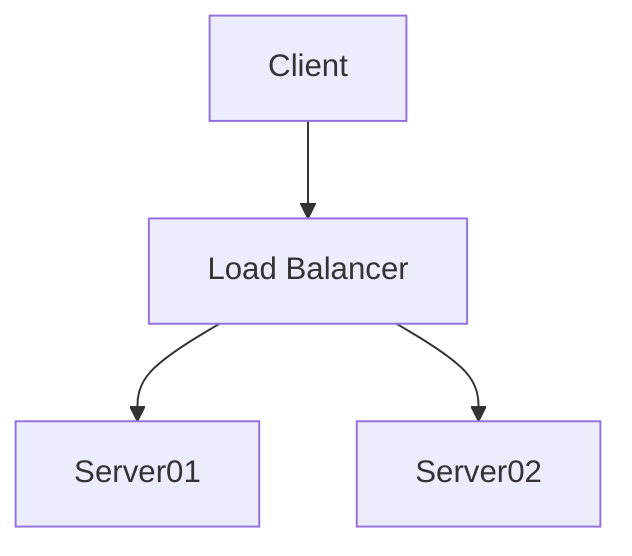
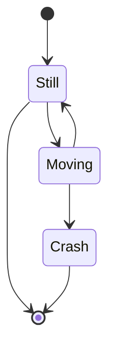
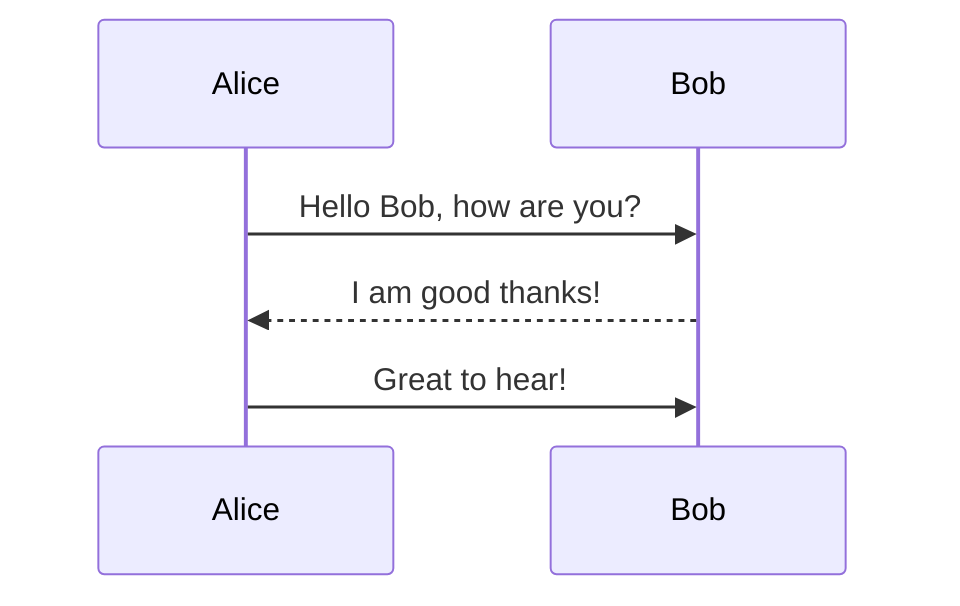
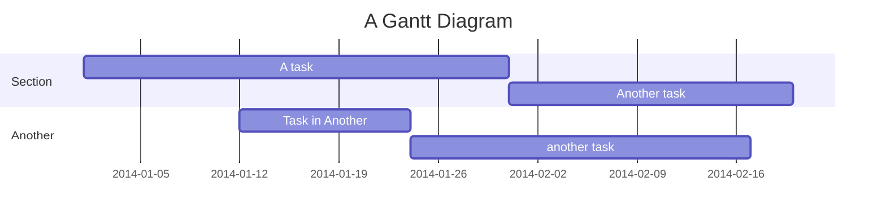
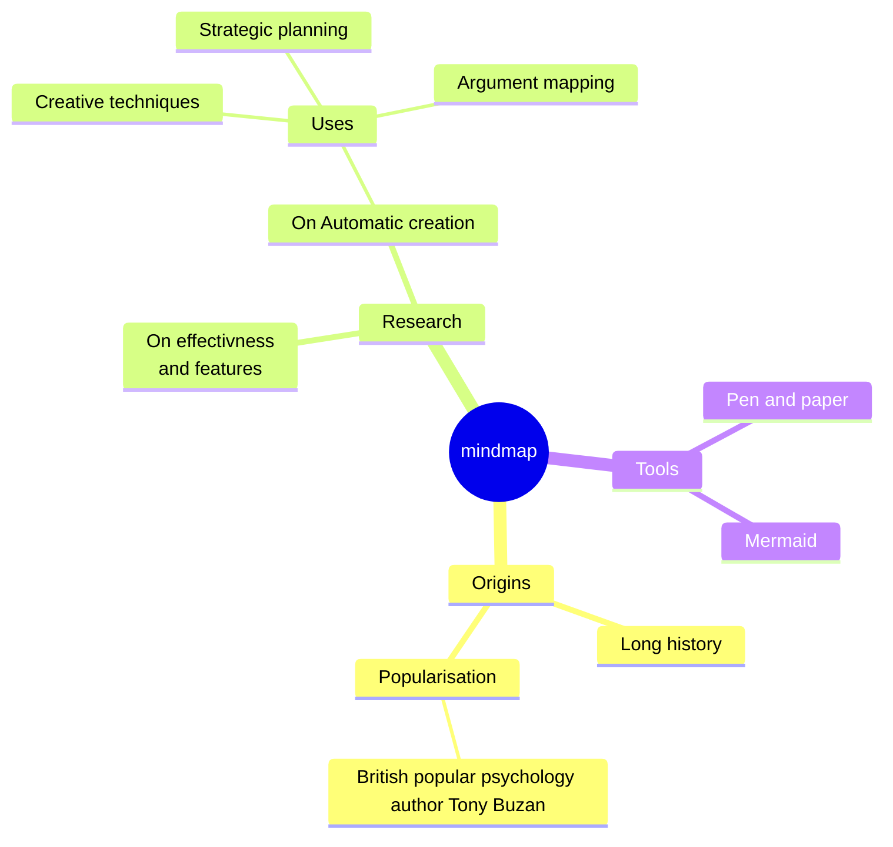

# Title

Lorem ipsum dolor sit amet, consectetur adipiscing elit. Fusce et erat eget mauris semper aliquam in non nulla. Quisque a velit semper, varius lacus at, egestas ante. Morbi aliquam viverra elit eu volutpat.

## Section 1

Aliquam in rhoncus massa. Quisque euismod interdum urna in viverra. Morbi molestie euismod purus mattis ultricies.

### Section 1.2

In quis lobortis massa, eu imperdiet dolor.

### Section 1.3

Sed ultricies odio at dui varius, vitae bibendum sapien vestibulum. Duis accumsan, justo malesuada ullamcorper vestibulum, lorem metus fringilla quam, quis adipiscing purus quam non metus.

## Quotes

> Ut posuere tincidunt tellus, non volutpat mi sagittis eget.

Sed nisi justo, placerat nec condimentum sed, malesuada id lectus. Proin at nibh elit.

## Images

Vestibulum ante ipsum primis in faucibus orci luctus et ultrices posuere cubilia Curae; Etiam in vulputate orci. Proin sit amet urna augue. Cras nisl arcu, ullamcorper sollicitudin dui a, imperdiet lobortis libero. Donec feugiat fringilla nulla, vitae egestas enim iaculis at. Nulla nec tincidunt justo. Donec condimentum dolor est, ut molestie urna luctus in.

<center> 
Like links, Images also have a footnote style syntax

![Alt text][id]

With a reference later in the document defining the URL location:

[id]: https://octodex.github.com/images/dojocat.jpg "The Dojocat"

</center>

## Tables

Vestibulum ante ipsum primis in faucibus orci luctus et ultrices posuere cubilia Curae; Etiam in vulputate orci. Proin sit amet urna augue. Cras nisl arcu, ullamcorper sollicitudin dui a, imperdiet lobortis libero. Donec feugiat fringilla nulla, vitae egestas enim iaculis at. Nulla nec tincidunt justo. Donec condimentum dolor est, ut molestie urna luctus in.

| Tables        |      Are      |  Cool |
| ------------- | :-----------: | ----: |
| col 3 is      | right-aligned | $1600 |
| col 2 is      |   centered    |   $12 |
| zebra stripes |   are neat    |    $1 |

## Definition lists

**Fact 1**
: Vestibulum ante ipsum primis in faucibus orci luctus et ultrices posuere cubilia Curae;

**Fact 2**
: Etiam in vulputate orci. Proin sit amet urna augue. Cras nisl arcu, ullamcorper sollicitudin dui a, imperdiet lobortis libero.

## Lists

### Ordered lists

1. numbered list entry 1
2. numbered list entry 2
   1. numbered list entry 1
   2. numbered list entry 2
   - mixture
3. numbered list entry 3

### Unordered lists

- unordered list entry 1
- unordered list entry 2
  - unordered list entry 1
  - unordered list entry 2
  1. mixture
  2. mixture
- unordered list entry 3

### Check/ToDo-lists

- [ ] task 1
- [ ] task 2
- [x] task 3

## Math Equations

The classic Runge–Kutta method from [en.wikipedia.org](https://en.wikipedia.org/wiki/Runge–Kutta_methods)

Let an initial value problem be specified as follows:

$$ \frac{dy}{dt}=f(t,y),\quad y(t*{0})=y*{0}.$$

Euler\'s identity $e^{i\pi}+1=0$ is a beautiful formula in $\RR^2$.

Maxwell's Equations

```math
\nabla \times \vec{\mathbf{B}} -\, \frac1c\, \frac{\partial\vec{\mathbf{E}}}{\partial t}
= \frac{4\pi}{c}\vec{\mathbf{j}}    \nabla \cdot \vec{\mathbf{E}} = 4 \pi \rho
```

```math
\nabla \times \vec{\mathbf{E}}\, +\, \frac1c\, \frac{\partial\vec{\mathbf{B}}}{\partial t}  = \vec{\mathbf{0}}
```

```math
\nabla \cdot \vec{\mathbf{B}}  = 0
```

**The Cauchy-Schwarz Inequality**

```math
\left( \sum_{k=1}^n a_k b_k \right)^2 \leq \left( \sum_{k=1}^n a_k^2 \right) \left( \sum_{k=1}^n b_k^2 \right)
```

## Syntax Highlighting (Fenced code blocks)

Python:

```python
import numpy as np
a=np.arange(5)
print(a+a)
```

Javascript:

```java
function fancyAlert(arg) {
  if(arg) {
    $.facebox({div:'#foo'})
  }
}
```

## Diagrams











## Maps

```geojson
{
  "type": "FeatureCollection",
  "features": [
    {
      "type": "Feature",
      "properties": {},
      "geometry": {
        "type": "Point",
        "coordinates": [
          102,
          0.5
        ]
      }
    },
    {
      "type": "Feature",
      "properties": {},
      "geometry": {
        "type": "Point",
        "coordinates": [
          103,
          1.5
        ]
      }
    }
  ]
}
```

## Footnotes

Donec[^1] feugiat fringilla nulla, vitae egestas enim[^1][^2] iaculis at.

[^1]: Nulla nec tincidunt justo.
[^2]: Donec condimentum dolor est, ut molestie urna luctus in.
