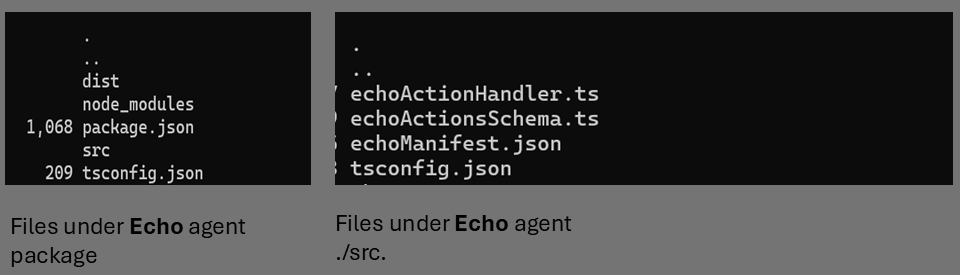
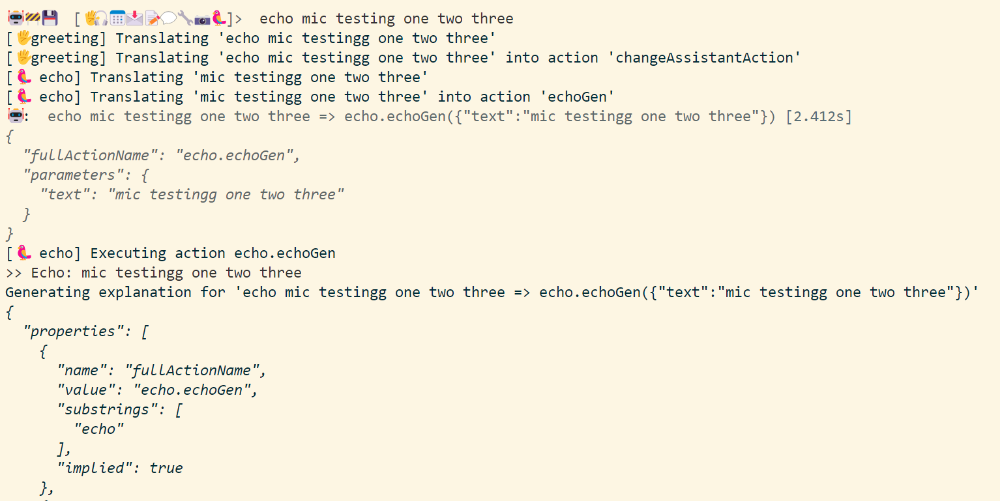
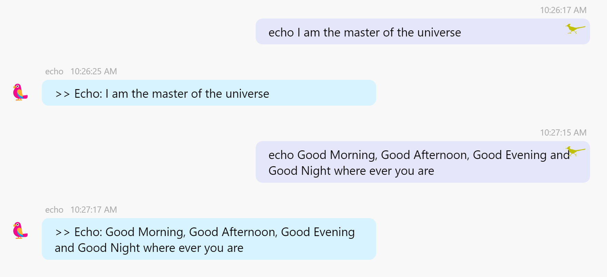

# External Agents

The TypeAgent repo includes several example [agents](../../packages/agents/). You can also build **your own application agents** **_outside_** the TypeAgent repo by using the [agent-sdk](./README.md). You can package these **_external_** agents as npm packages and surface them in the [TypeAgent Shell](../shell) and [TypeAgent CLI](../cli).

This document describes how you can build your own external application agents.

## Prerequisites

Begin by exploring the following:

- **Agent-Sdk**: Read about the architecture of the [**agent-sdk**](./README.md).
- **Example Agents**:
  - Review agents under the [agents](../agents) directory. The [List](../agents/list/) agent provides a good example and template for building an agent.
  - The [Echo](../../examples/agentExamples/echo/) agent illustrates the basics of building your own external application agents.

## Steps to build an `Echo` agent:

For the rest of the documentation, we will assume that the external agent is named **echo**. The echo agent performs a single action: echos any input back to the user.

### Step 1: Create a new package for the agent

**package.json** : Run `npm init -y` to create a new package.

The example [package.json](../../examples//agentExamples//echo/package.json) contains references to **handler**, **schema** and **manifest** files. **Step 2** explains what they are.

```json
{
  "name": "echo",
  "version": "0.0.1",
  "description": "Echo example for TypeAgent",
  "license": "MIT",
  "author": "Microsoft",
  "type": "module",
  "exports": {
    "./agent/manifest": "./dist/echoManifest.json",
    "./agent/handlers": "./dist/echoActionHandler.js"
  },
  "scripts": {
    "build": "npm run tsc  && npm run copy:manifest",
    "postbuild": "copyfiles -u 1 \"src/**/*Schema*.ts\" \"src/**/*Manifest*.json\" dist",
    "clean": "rimraf --glob dist *.tsbuildinfo *.done.build.log",
    "prettier": "prettier --check . --ignore-path ../../../.prettierignore",
    "prettier:fix": "prettier --write . --ignore-path ../../../.prettierignore",
    "tsc": "tsc -b"
  },
  "keywords": [],
  "dependencies": {
    "@typeagent/agent-sdk": "0.0.1"
  },
  "devDependencies": {
    "copyfiles": "^2.4.1",
    "prettier": "^3.2.5",
    "rimraf": "^5.0.5",
    "typescript": "^5.4.2"
  }
}
```

#### Agent SDK dependency

Add `agent-sdk` as a dependency in the package.json file.

- If you are developing your agent in the TypeAgent repo or workspace, reference the SDK directly

```
  "dependencies": {
    "@typeagent/agent-sdk": "workspace:*"
  }
```

- If your agent uses an external **npm** registry for agent-sdk, create a `.npmrc` file in the [externalagents](#scaffolding) (see section on [Scaffolding](#scaffolding)) directory with the following contents:

```

@typeagent:registry=https://<path_npm_registry_for_agentsdk>
always-auth=true

```

### Step 2: Author your agent

Every application agent requires the following files to be present in the agent's [**source**](../../examples/agentExamples/echo/src/) directory.

- **Agent Manifest File**: The manifest file is used to register the agent with the TypeAgent ecosystem.
- **Action Schema File**: The action schema file is used to define the actions that the agent can perform.
- **Agent Action Handler**: Your code that perform's the agent's actions.

**Agent Manifest File** : [`echoManifest.json`](../../examples/agentExamples/echo/src/echoManifest.json)

```json
{
  "emojiChar": "🦜",
  "schema": {
    "description": "A basic echo agent.",
    "schemaFile": "echoActionsSchema.ts",
    "schemaType": "EchoAction"
  }
}
```

**Agent Action Schema File** : [`echoActionsSchema.ts`](../../examples//agentExamples/echo/src/echoActionsSchema.ts)

```ts
export type EchoAction = GenEchoAction;

// If the user asks to echo a message back, the system will return a GenEchoAction. The text parameter is the message to be echoed back.
// will contain the text to be echoed back to the user.
export type GenEchoAction = {
  actionName: "echoGen";
  parameters: {
    text?: string;
    // Generate an alternate response based on the request
    altResponse?: string;
  };
};
```

**Agent action handler** : [`echoActionHandler.ts`](../../examples//agentExamples/echo/src/echoActionHandler.ts)

```ts
// Below is sample code for a simple echo agent.

import {
  ActionContext,
  AppAction,
  AppAgent,
  SessionContext,
  ActionResult,
} from "@typeagent/agent-sdk";
import {
  createActionResultFromTextDisplay,
  createActionResultFromError,
} from "@typeagent/agent-sdk/helpers/action";
import { EchoAction } from "./echoActionsSchema.js";

export function instantiate(): AppAgent {
  return {
    initializeAgentContext: initializeEchoContext,
    updateAgentContext: updateEchoContext,
    executeAction: executeEchoAction,
  };
}

type EchoActionContext = {
  echoCount: number;
  echoRequests: Set<string> | undefined;
};

async function initializeEchoContext() {
  return {
    echoCount: 0,
    echoRequests: undefined,
  };
}

async function updateEchoContext(
  enable: boolean,
  context: SessionContext<EchoActionContext>,
): Promise<void> {
  if (enable) {
    context.agentContext.echoRequests = new Set<string>();
    context.agentContext.echoCount = 0;
  }
  context.agentContext.echoCount++;
}

async function executeEchoAction(
  action: AppAction,
  context: ActionContext<EchoActionContext>,
) {
  let result = await handleEchoAction(
    action as EchoAction,
    context.sessionContext.agentContext,
  );
  return result;
}

async function handleEchoAction(
  action: EchoAction,
  echoContext: EchoActionContext,
) {
  let result: ActionResult | undefined = undefined;
  let displayText: string | undefined = undefined;
  switch (action.actionName) {
    case "echoGen":
      displayText = `>> Echo: ${action.parameters.text}`;
      result = createActionResultFromTextDisplay(displayText, displayText);
      break;
    default:
      result = createActionResultFromError("Unable to process the action");
      break;
  }
  return result;
}
```

#### Folder structure for **Echo** agent:



<a id="install_agent"></a>

### Step 3: Install your Agent

<a id="profiles"></a>

- Go to the **TypeAgent Profiles** directory:

  - Use the **@session info** command in either the TypeAgent CLI or Shell to get the **path to the current profile directory**.
  - The profile directory is typically located here:

    - bash: `cd ~.typeagent\profiles\dev`
    - Windows: `cd %USERPROFILE%\.typeagent\profiles\dev`

- Create an **externalAgentsConfig.json** file in this directory. This file contains references to all external agents.

  ```json
  {
    "agents": {
      "echo": {
        "type": "module",
        "name": "echo",
        "path": <Optional path to agent 'dist' folder>
      }
    }
  }
  ```

- If you are working in the TypeAgent repo or workspace, **add a path to your agent** in externalAgentsConfig.json.
  - The path should point to the folder where your build places output files. E.g. the path to the example **Echo** agent is `<srcRoot>\ts\examples\agentExamples\echo\dist`
  - Ensure that schema and manifest files are placed in the same folder using a post-build step, as shown in the sample [package.json](../../examples//agentExamples//echo/package.json).
- **Else** follow the **_steps below_** to **build a package** for your agent and register it.

#### Step 3.1: Build `Echo` agent package

Run `npm pack` from the echo agent's directory to create a tarball of the agent package. This tarball(echo-0.0.1.tgz) can be used to install the agent in the TypeAgent ecosystem.

#### Step 3.2: Install the `Echo` agent

Copy the tar file to the [TypeAgent profiles directory](#profiles).

<a id="scaffolding"></a>

#### Step 3.3: Scaffolding for external agents

TypeAgent links external agents using a **scaffold**. Run the following command to scaffold the external agent:

- Go to the [TypeAgent Profiles](#profiles) directory
- Create an **externalagents** directory
  - bash:
  ```bash
  mkdir externalagents && cd externalagents
  npm init -y
  ```
  - Windows:
  ```
  md externalagents && cd externalagents
  npm init -y
  ```

If your external agent depends on the an external artifact registry for agent-sdk, create a `.npmrc` file in the externalagents directory with the following contents:

```
@typeagent:registry=https://<path_npm_registry_for_agentsdk>
always-auth=true
```

Now add dependency to the echo agent using the following command:

```bash
npm i ..\echo-0.0.1.tgz
```

The above command will install the echo agent in the externalagents node package.

```json
{
  "name": "externalagents",
  "version": "1.0.0",
  "description": "External agents package contianing references to TypeAgent application agents.",
  "main": "index.js",
  "scripts": {
    "test": "echo \"Error: no test specified\" && exit 1"
  },
  "author": "",
  "license": "MIT License",
  "dependencies": {
    "echo": "file:../echo-0.0.1.tgz"
  }
}
```

### Step 4: Run the TypeAgent cli or shell to see the `Echo` agent in action.

```bash
# you can run these commands from the `ts` folder
# in the TypeAgent root.

pnpm run cli interactive

or

pnpm run shell
```

If the above steps are followed correctly, you should see the `Echo` agent in the TypeAgent ecosystem.

When to run the cli this is how interaction with the `Echo` agent will look like:


When to run the shell this is how interaction with the `Echo` agent will look like:


## Trademarks

This project may contain trademarks or logos for projects, products, or services. Authorized use of Microsoft
trademarks or logos is subject to and must follow
[Microsoft's Trademark & Brand Guidelines](https://www.microsoft.com/en-us/legal/intellectualproperty/trademarks/usage/general).
Use of Microsoft trademarks or logos in modified versions of this project must not cause confusion or imply Microsoft sponsorship.
Any use of third-party trademarks or logos are subject to those third-party's policies.

```

```
