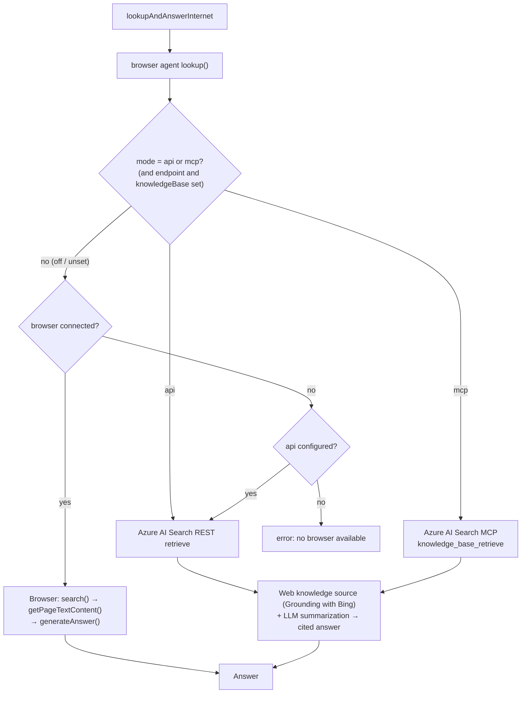

# Browser TypeAgent (core agent)

`browser-typeagent` is the core browser **agent** (`AppAgent`): it handles
browser-related actions, knowledge extraction/indexing, search and answer
generation, WebFlows, and the PDF viewer. It runs inside the dispatcher /
agent-server process and controls a browser through the shared
`BrowserControl` interface, implemented by either the Chrome/Edge extension
(`@typeagent/browser-extension`) or the Electron shell's inline browser.

Related packages:

- **`@typeagent/browser-control-rpc`** (`../browserControlRpc`) — shared
  browser types + content-script RPC client this agent depends on.
- **`@typeagent/browser-extension`** (`../browserExtension`) — the
  Chrome/Electron extension. See that package's README to build, install, and
  run the extension.

## Build

Run `pnpm run build` in this folder (builds the agent, PDF views, and
puppeteer helpers).

## Architecture

### Agent WebSocket Server

The browser agent exposes a WebSocket server (`AgentWebSocketServer`) on a
port assigned dynamically by the OS at bind time. The actual port is
published to the host's `PortRegistrar` under `(browser, default)` and
discovered by external clients via the discovery channel hosted at
`ws://localhost:8999/` (default). Both supported hosts publish this
channel: the standalone `agentServer` process and the standalone
Electron `shell` (which hosts an in-process discovery WS so the same
extension config works against either host). To pin the port for
debugging, set `BROWSER_WEBSOCKET_PORT=<n>` before launching the host.

Two types of clients connect to the browser agent:

- **Chrome extension** (`src/extension/serviceWorker/websocket.ts`) — connects from the browser's service worker using `chrome.runtime.id` as its client ID. Calls `discoverPort("browser", "default")` to look up the live port before connecting.
- **Inline browser** (`packages/shell/src/main/browserIpc.ts`) — connects from the Electron shell using `inlineBrowser` as its client ID.

#### Connection URL format

Every client embeds its identity in the WebSocket connection URL as query parameters:

```
ws://localhost:<port>?channel=browser&role=client&clientId=<id>&sessionId=<sessionId>
```

| Parameter   | Description                                                                                              |
| ----------- | -------------------------------------------------------------------------------------------------------- |
| `clientId`  | Unique identifier for this client (`inlineBrowser` for the shell, `chrome.runtime.id` for the extension) |
| `sessionId` | The TypeAgent session this client belongs to (see below)                                                 |

#### Session routing

`AgentWebSocketServer` is a **process-level singleton** shared across all TypeAgent sessions. To support multiple concurrent sessions without their traffic interfering with each other, each session registers its own handler set under a unique `sessionId` key:

- The shell and extension both use `sessionId = "default"` (single-session use case).
- Extension users running multiple independent TypeAgent sessions can configure a different `sessionId` in the extension settings (`sessionId` field, defaults to `"default"`).

When a browser agent session starts (`updateAgentContext(enable=true)`), it calls `agentWebSocketServer.registerSession(sessionId, handlers)` to bind its invoke handlers and connection callbacks. When the session closes, `unregisterSession(sessionId)` removes the handlers and closes any connected clients for that session.

The `sessionId` for each agent session is stored in `BrowserActionContext.sessionId`. It is set once at context initialization:

- `"default"` — when running with an inline browser control (Electron shell).
- A random UUID — when running without one (extension-only mode).

#### Client type detection

The server infers whether a connected client is an `extension` or `electron` client from its `clientId`: any client whose ID is `inlineBrowser` is treated as `electron`; all others are `extension`.

When both client types are connected for the same session, the active client is selected by `preferredClientType` (set to `"extension"` for extension-only sessions, `"electron"` for shell sessions). Browser control commands are routed only to the active client.

#### Channel multiplexing

Each client connection is multiplexed into two logical channels using `@typeagent/agent-rpc`:

- **`agentService`** — RPC from the client to invoke browser agent actions (e.g. `openWebPage`, `indexPage`). The RPC channel label is `agent:service:<sessionId>:<clientId>`.
- **`browserControl`** — RPC from the agent to control the browser (e.g. `clickOn`, `captureScreenshot`, `getHtmlFragments`). The RPC channel label is `browser:control:<sessionId>:<clientId>`.

Both channels share a single WebSocket connection per client. The `sessionId` prefix in each channel label keeps them unique across concurrent sessions.

#### Client storage model

Internally, the server stores connected clients in a nested `Map<sessionId, Map<clientId, BrowserClient>>`. This means the same `clientId` (e.g. `inlineBrowser`, or a shared extension ID) can exist simultaneously in multiple sessions without collision. Duplicate-connection detection and forced-disconnect logic are scoped to `(sessionId, clientId)` pairs, so a reconnect in one session never affects clients in other sessions.

## Internet lookup (`lookupAndAnswerInternet`)

The `browser.lookupAndAnswer.lookupAndAnswerInternet` action answers general
"look it up on the web" questions (stock prices, sports scores, news, etc.).
There are two ways to satisfy a query, selected by a single **global** setting
that the browser agent reads server-side in `lookup()`:

- **Browser** — drive a real browser (the shell's inline browser or a
  connected Chrome/Edge extension): run a search, read the results page text
  (`getPageTextContent()`), and synthesize an answer. Requires a connected
  browser.
- **Azure AI Search (Foundry IQ)** — call a knowledge base backed by a **web
  knowledge source**, which does the web search + fetch + LLM summarization
  server-side and returns a cited answer. Needs **no browser**, so it works in
  browser-less clients (vscode-shell, CLI, headless).

### Which path runs

The path is chosen by `azureAISearch.mode` (env `AZURE_AI_SEARCH_LOOKUP_MODE`):

| `mode`                  | Path                                               | Needs a browser? |
| ----------------------- | -------------------------------------------------- | ---------------- |
| `off` / unset (default) | Browser search → read page → generate answer       | Yes              |
| `api`                   | Azure AI Search REST `retrieve`                    | No               |
| `mcp`                   | Azure AI Search MCP `knowledge_base_retrieve` tool | No               |

The **code default is `off`** (browser); the shipped `config.sample.yaml` sets
`api` as the recommended value once you've provisioned a knowledge base.
`api`/`mcp` additionally require `azureAISearch.endpoint` and `knowledgeBase` —
if either is missing the agent falls back to the browser path. The switch is
**global** (one setting for the browser agent, shared by every client) and is
read at agent-server startup. Auth defaults to identity
(`DefaultAzureCredential`); see the `azureAISearch` section in
`config.sample.yaml`.

When the effective mode is the browser but **no browser is connected**, the
agent automatically falls back to the `api` path if Azure AI Search is
configured — so a browser-less client (e.g. vscode-shell without the extension)
still gets an answer.



### Change the mode at runtime

`@browser lookup` switches the backend on the fly (no restart), overriding
`azureAISearch.mode` for the running agent-server:

- `@browser lookup status` — show the configured mode, any runtime override, and the effective path.
- `@browser lookup mode <off|api|mcp>` — set the backend (`off` = browser); the value tab-completes.

The override is in-memory only; it reverts to the configured `azureAISearch.mode`
when the agent-server restarts. Implemented in
`src/agent/lookup/lookupCommandHandlers.mts`.

To provision the Azure AI Search web knowledge source + knowledge base, run
`pnpm --filter browser-typeagent setup:aisearch` (see
`src/agent/lookup/aiSearchSetup.mts`). The runtime client is in
`src/agent/lookup/aiSearchLookup.mts`.

## Trademarks

This project may contain trademarks or logos for projects, products, or services. Authorized use of Microsoft
trademarks or logos is subject to and must follow
[Microsoft's Trademark & Brand Guidelines](https://www.microsoft.com/en-us/legal/intellectualproperty/trademarks/usage/general).
Use of Microsoft trademarks or logos in modified versions of this project must not cause confusion or imply Microsoft sponsorship.
Any use of third-party trademarks or logos are subject to those third-party's policies.
