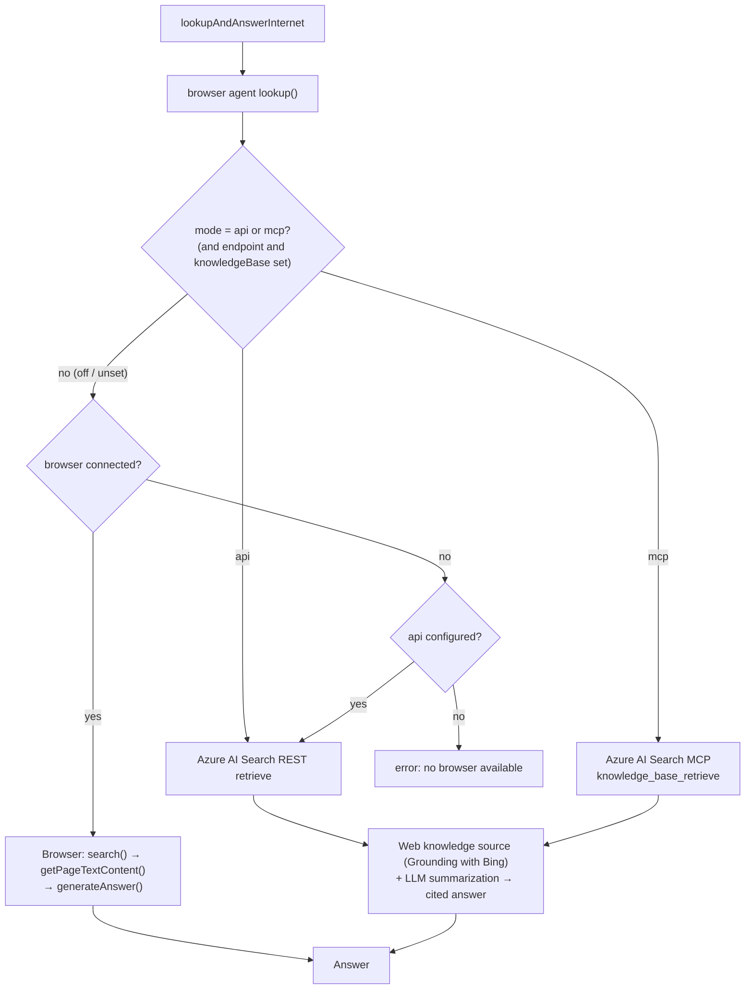

# Browser TypeAgent (core agent)

`browser-typeagent` is the core browser **agent** (`AppAgent`): it handles
browser-related actions, knowledge extraction/indexing, search and answer
generation, WebFlows, and the PDF viewer. It runs inside the dispatcher /
agent-server process and controls a browser through the shared
`BrowserControl` interface, implemented by either the Chrome/Edge extension
(`@typeagent/browser-extension`) or the Electron shell's inline browser.

Related packages:

- **`@typeagent/browser-control-rpc`** (`../browserControlRpc`) — shared
  browser types + content-script RPC client this agent depends on.
- **`@typeagent/browser-extension`** (`../browserExtension`) — the
  Chrome/Electron extension. See that package's README to build, install, and
  run the extension.

## Build

Run `pnpm run build` in this folder (builds the agent, PDF views, and
puppeteer helpers).

## Architecture

### PDF Understanding Worktree

The PDF viewer supports local open/drop, selected-page semantic inspection,
sanitized Markdown preview, Markdown/JSON export, and pause/cancel. Extraction
uses the viewer-owned PDF.js document without destroying it. Semantic results
are cached only in memory; persistent extraction checkpoints and block/crop
inspection controls are removed. Preview/export does not implicitly save bytes
to memory.

Corpus PDF import submits extracted Markdown through `memoryImportDocument` to
the shared memory service in `content` mode, with title, optional canonical URI
and tags. Memory owns source revisions and ingestion jobs. The browser agent
does not retain original PDF bytes, extraction artifacts, capture manifests or
location maps, and does not expose PDF-specific storage or capability RPC.
Removing this functionality does not delete previously saved user data.

The converter reuses pinned Papero extraction and Markdown/math algorithms in
`browserControlRpc/src/converters/pdfToMarkdown`. Tests live in the parent
package's `test/pdfToMarkdown`; regeneration and qualification tools live in
`ts/tools/scripts/converters/pdfToMarkdown`. The parent package owns dependencies
and compilation, with no nested converter package. Full-book upstream/adapted/
production Markdown parity is verified; general semantic correctness of tables,
math, figures/captions and difficult reading order is not. Local viewer opening allows 50 MiB. Performance
reports do not qualify browser memory, image rendering or annotation interaction.

Retained-PDF capture/status/read/query/open actions are removed. Imported
Markdown uses ordinary memory source content, search, job and forget operations.
See [PDF Markdown import boundaries](docs/pdf-markdown-import.md) for the
remaining WebSocket and native renderer routing boundaries.

The [implementation status and remaining WP0-WP5 gates](../../../../../codeDocs/TypeAgent/forAgent/projects/inProgress/2026-10-01_pdf-document-understanding-proposal/implementation-status.md)
in the sibling codeDocs checkout records the offline checks separately from
mandatory live acceptance, scoped authorization, staged transfer and code gates.

### Memory imports and page capture

Browser history, bookmark, HTML-folder imports, and saved pages use the shared
model-driven `content` memory pipeline. No processing presets or metadata-only
indexing modes are exposed. Existing supported `maxCharsPerChunk` options still
tune chunk sizing within that pipeline. Unsupported pre-release import modes
are reported as errors instead of mapped or migrated. Browser metadata
enumeration is not indexing: imported URLs are fetched and their original
content is submitted to durable memory. Save-page capture and procedure
candidate discovery/review remain separate from processing-mode selection.

### Memory Hub

The **Memory** view is available at the browser agent's discovered view host
under `/memory/hub/`. The extension's Memory menu and the browser agent's
`memoryHub` view name open it. It uses the existing loopback/same-origin HTTP
gateway, typed domain allowlist and parent-process RPC; it does not create a
separate memory store.

The migration includes Inbox, Library, Runbooks for existing human how-tos,
Activity and corpus how-to Settings. Phase 2 adds corpus-neutral Search and
Ask, Explore, browser imports and durable Changes history. Standalone Memory
Center, Knowledge Library, Entity Graph and Topic Graph shells have been
retired. Source management is a reusable Hub component. Advanced entity/topic
graphs and reading analytics now live under `#/explore/web/analytics`,
`#/explore/web/entities/<selection>` and `#/explore/web/topics/<selection>`.
They remain fixed to **TypeAgent Browser Memory**, not the selected corpus.
Graph filters, layouts, exports, drilldown and original-site links are retained;
graph status/build/rebuild controls are in Settings.

Old logical names, custom-protocol links and HTTP filenames remain aliases,
including stale `/library/<old-page>.html` URLs. They redirect before static
files are served. HTTP redirects preserve the query and inherited browser
fragment; the Hub translates old sections/selections and removes its temporary
`legacyView` marker. Annotations, Automations and the PDF reader are unchanged.

Search retains List/Grid and adds Timeline/Domain grouping for actual web
evidence; mixed non-web results remain visible in List. Query topics/entities
come from at most 20 exact active returned-source revisions, never inferred
from snippets or substituted from another corpus. Historical-revision insights
and failed knowledge reads are explicitly unavailable. Browser-local view and
notification preferences reuse the existing storage key, preserve unknown
fields and protect unsaved edits. Optional completion notifications do not
suppress errors.

Inbox is derived from detected/draft candidates, stale procedures and
failed/partial ingestion jobs. The host drains every jobs page, so counts
are not limited to the first page. Dismiss/snooze preferences are local to
the browser and apply only to the exact item state/version. A changed item
needs attention again. Missing corpus operations are reported explicitly.
The Activity badge counts canonical failed jobs only, independently of
Inbox dismiss/snooze preferences; partial jobs still need Inbox attention.

The hub exposes narrowly typed domain methods:

- `memoryHubSnapshot`: complete corpus-scoped or all-memory Inbox and
  procedure summaries, with per-operation errors for incomplete results.
  Candidate/procedure service APIs currently return arrays; the migration
  view pages those derived lists locally.
- `memoryHubSources`: service-backed source pages across corpora, with
  query/type filters and scope-bound continuation tokens. Sources retain
  their corpus identity when opened or mutated from All memory. Counts
  exclude unavailable corpora and are accompanied by explicit errors.
- `memoryHubSearch`: source, saved/stale procedure and conversation retrieval
  with corpus/type/tag/date filters. Deterministic reciprocal-rank fusion
  merges ranked evidence without comparing unrelated raw scores. One optional
  model answer cites the merged evidence; unavailable synthesis retains
  evidence and reports its error. An honest no-answer is supported.
- `memoryHubEvidence`: exact retained source revision, procedure version or
  canonical conversation event/turn. Source previews are explicitly
  document-level when no original-text location resolver exists. Opaque
  `message:<ordinal>` locators are not original character offsets.
- `memoryHubExplore`: corpus-qualified source/entity/topic/procedure counts
  and bounded knowledge/provenance card previews, not a combined graph.
  Failed corpora are explicit; counts are
  not semantic entity deduplication across corpora. Conversation event graphs
  are unavailable in the current canonical corpus graph API.
- `memoryHubKnowledge`: full-scope entity, topic, relationship and contributing
  source browsing with server-side text filtering, name/mention sorting and
  bounded offset pages (maximum 100 items). Filtering precedes pagination.
  Browser-only requests resolve TypeAgent Browser Memory explicitly and reject
  a selected-corpus override; missing/ambiguous browser memory never becomes All
  memory. Source filtering uses retained source metadata, not just the preview.

- `memoryHubChanges`: service-owned committed replace/forget/suppress/restore
  receipts, retained for 90 days. These contain metadata and opaque hashed
  references, not source text, titles, URLs or navigation IDs. Forget purges
  older receipts for that source; clearing a corpus removes its history.
- `memoryHubCapturePages` and `memoryHubCapturePage`: explicit selection of an
  open page, followed by an object/document-bound browser snapshot. Capture
  does not select the active Hub tab or switch browser tabs. Chrome and
  Electron providers exclude private pages, reject stale documents and report
  omitted embedded frames. The gateway accepts a page handle and reviewed URL,
  never supplied HTML or an arbitrary navigation URL; the handler validates
  both against the snapshot before ingestion.

Explore has separate Overview, Entity graph, Topic graph and Reading analytics
views. Overview follows the selected corpus/All memory scope. The other three
views are explicitly fixed to TypeAgent Browser Memory. Entity and topic graphs
keep their separate Graphology endpoints (`getGlobalImportanceLayer` /
`getEntityNeighborhoodLayoutData` and `getTopicImportanceLayer`) and existing
Cytoscape visualizers, using server-computed preset positions. No entity/topic
node merging or client-generated ring layout is performed. Opening Overview
does not implicitly fetch browser analytics or graph layouts.
Graphology edges may omit IDs (Cytoscape assigns them); nodes still require IDs
and edges require valid endpoints. Graph zoom permits fitting the server's large
coordinate range into the embedded desktop and narrow Hub viewport.

Overview and Reading analytics share the same card browser: six preview cards
in a maximum-height section, then **View all**, filter/sort controls and
24-item pages. Preview grids are at most 20rem tall; browse grids are at most
30rem. Exact source links and entity/topic graph drilldown remain available.
Reading analytics keeps its browser-only scope and no longer displays the
Activity trends visits/bookmarks histogram. Its recent preview is not passed off
as the full collection. The view gateway bounds responses and DOM rendering;
the canonical memory API still reads the corpus graph as a whole on each
browse request, so this is not an indexed, streaming backend graph query.

Search dates mean source capture, procedure creation or conversation event
time, with unknown dates excluded when filtering. Document retrieval currently
considers at most 400 index candidates per corpus; date-filtered results explicitly warn
that eligible evidence can be omitted. Returned evidence counts are bounded
results, never full-corpus totals. Retrieval reads have 30-second deadlines;
procedure filtering shares a deadline rather than chaining unbounded reads.
Answer context is bounded to 20 excerpts of up to 800 characters and 32,000
characters overall, with a visible warning. Imported content is untrusted
evidence, not instructions.

The header query, scope and cached answer/results survive citation navigation
and Back within the Hub. Scope changes and explicit refresh invalidate
discovery caches. A missing named corpus remains unavailable: it never silently
expands to All memory.

Add reuses bookmark/history and agent-host HTML-folder import adapters with
their existing options, real progress and final results. Page capture and
those imports target **TypeAgent Browser Memory**, independently of the Hub
corpus selector; Markdown paste still requires a named corpus. Browser import
cancellation remains explicitly unavailable, and closing an import dialog
does not cancel its work. Capture cannot be cancelled once submitted.
The jobs link explicitly selects the fixed browser corpus. Adapter responses
do not contain individual import job IDs; the link is not presented as
import-specific.

Source correction, confirmation-token forget, knowledge suppress/restore,
job cancellation and version-checked procedure/settings edits call the
existing memory operations. Runbooks supports structured agent editions,
whole-version review, guarded catalog bindings, immutable skill drafts and
explicit updated-source synthesis jobs. Argument templates preserve declared
input references and require exact live host schema-fit proof; binding grants
no permission. Updated-source synthesis creates/reuses a draft job, never
overwrites the existing procedure or published skill.

MCP catalog references use the exact JSON tuple `[serverConfigId, nativeToolName]`.
Saved bindings keep the two native components separately; even a JSON-looking
tool name is opaque text, never an already encoded tuple. Native MCP identities
are nonempty, at most 4,096 characters, and cannot contain control characters.
Local step/input identifiers retain their stricter stable-identifier rules.

The visual pass checks all seven Hub pages at 390, 768, 1,024 and 1,440 pixels
using the built application, real local gateway and an isolated offline fixture.
Additional populated Search/analytics, graph details, Runbook editor, source
drawer and Add dialog states cover wrapping, 16-pixel native checkboxes,
header baselines and document overflow. Analytics source links belong to their
specific displayed rows, outside graph-navigation buttons. Search source types
retain native multiselect semantics inside an accessible disclosure; empty
Recent/result-view controls are hidden. Headless Chrome clicks and Add-dialog
Tab/Escape were exercised; native file choosers and release-wide accessibility
qualification remain separate gates.

Whole-corpus forget, retained-revision ingestion retry, dependent-skill forget
previews and PDF capture remain later capabilities. Original image inspection
is explicitly unreviewed, not a safe-pixel preview. Numeric model-quality and
live-vision acceptance are not implied by functional offline verification.

### Agent WebSocket Server

The browser agent exposes a WebSocket server (`AgentWebSocketServer`) on a
port assigned dynamically by the OS at bind time. The actual port is
published to the host's `PortRegistrar` under `(browser, default)` and
discovered by external clients via the discovery channel hosted at
`ws://localhost:8999/` (default). Both supported hosts publish this
channel: the standalone `agentServer` process and the standalone
Electron `shell` (which hosts an in-process discovery WS so the same
extension config works against either host). To pin the port for
debugging, set `BROWSER_WEBSOCKET_PORT=<n>` before launching the host.

Two types of clients connect to the browser agent:

- **Chrome extension** (`src/extension/serviceWorker/websocket.ts`) — connects from the browser's service worker using `chrome.runtime.id` as its client ID. Calls `discoverPort("browser", "default")` to look up the live port before connecting.
- **Inline browser** (`packages/shell/src/main/browserIpc.ts`) — connects from the Electron shell using `inlineBrowser` as its client ID.

#### Connection URL format

Every client embeds its identity in the WebSocket connection URL as query parameters:

```
ws://localhost:<port>?channel=browser&role=client&clientId=<id>&sessionId=<sessionId>
```

| Parameter   | Description                                                                                              |
| ----------- | -------------------------------------------------------------------------------------------------------- |
| `clientId`  | Unique identifier for this client (`inlineBrowser` for the shell, `chrome.runtime.id` for the extension) |
| `sessionId` | The TypeAgent session this client belongs to (see below)                                                 |

#### Session routing

`AgentWebSocketServer` is a **process-level singleton** shared across all TypeAgent sessions. To support multiple concurrent sessions without their traffic interfering with each other, each session registers its own handler set under a unique `sessionId` key:

- The shell and extension both use `sessionId = "default"` (single-session use case).
- Extension users running multiple independent TypeAgent sessions can configure a different `sessionId` in the extension settings (`sessionId` field, defaults to `"default"`).

When a browser agent session starts (`updateAgentContext(enable=true)`), it calls `agentWebSocketServer.registerSession(sessionId, handlers)` to bind its invoke handlers and connection callbacks. When the session closes, `unregisterSession(sessionId)` removes the handlers and closes any connected clients for that session.

The `sessionId` for each agent session is stored in `BrowserActionContext.sessionId`. It is set once at context initialization:

- `"default"` — when running with an inline browser control (Electron shell).
- A random UUID — when running without one (extension-only mode).

#### Client type detection

The server infers whether a connected client is an `extension` or `electron` client from its `clientId`: any client whose ID is `inlineBrowser` is treated as `electron`; all others are `extension`.

When both client types are connected for the same session, the active client is selected by `preferredClientType` (set to `"extension"` for extension-only sessions, `"electron"` for shell sessions). Browser control commands are routed only to the active client.

#### Channel multiplexing

Each client connection is multiplexed into two logical channels using `@typeagent/agent-rpc`:

- **`agentService`** — RPC from the client to invoke browser agent actions (e.g. `openWebPage`, `indexPage`). The RPC channel label is `agent:service:<sessionId>:<clientId>`.
- **`browserControl`** — RPC from the agent to control the browser (e.g. `clickOn`, `captureScreenshot`, `getHtmlFragments`). The RPC channel label is `browser:control:<sessionId>:<clientId>`.

Both channels share a single WebSocket connection per client. The `sessionId` prefix in each channel label keeps them unique across concurrent sessions.

#### Client storage model

Internally, the server stores connected clients in a nested `Map<sessionId, Map<clientId, BrowserClient>>`. This means the same `clientId` (e.g. `inlineBrowser`, or a shared extension ID) can exist simultaneously in multiple sessions without collision. Duplicate-connection detection and forced-disconnect logic are scoped to `(sessionId, clientId)` pairs, so a reconnect in one session never affects clients in other sessions.

## Internet lookup (`lookupAndAnswerInternet`)

The `browser.lookupAndAnswer.lookupAndAnswerInternet` action answers general
"look it up on the web" questions (stock prices, sports scores, news, etc.).
There are two ways to satisfy a query, selected by a single **global** setting
that the browser agent reads server-side in `lookup()`:

- **Browser** — drive a real browser (the shell's inline browser or a
  connected Chrome/Edge extension): run a search, read the results page text
  (`getPageTextContent()`), and synthesize an answer. Requires a connected
  browser.
- **Azure AI Search (Foundry IQ)** — call a knowledge base backed by a **web
  knowledge source**, which does the web search + fetch + LLM summarization
  server-side and returns a cited answer. Needs **no browser**, so it works in
  browser-less clients (vscode-shell, CLI, headless).

### Which path runs

The path is chosen by `azureAISearch.mode` (env `AZURE_AI_SEARCH_LOOKUP_MODE`):

| `mode`                  | Path                                               | Needs a browser? |
| ----------------------- | -------------------------------------------------- | ---------------- |
| `off` / unset (default) | Browser search → read page → generate answer       | Yes              |
| `api`                   | Azure AI Search REST `retrieve`                    | No               |
| `mcp`                   | Azure AI Search MCP `knowledge_base_retrieve` tool | No               |

The **code default is `off`** (browser); the shipped `config.sample.yaml` sets
`api` as the recommended value once you've provisioned a knowledge base.
`api`/`mcp` additionally require `azureAISearch.endpoint` and `knowledgeBase` —
if either is missing the agent falls back to the browser path. The switch is
**global** (one setting for the browser agent, shared by every client) and is
read at agent-server startup. Auth defaults to identity
(`DefaultAzureCredential`); see the `azureAISearch` section in
`config.sample.yaml`.

When the effective mode is the browser but **no browser is connected**, the
agent automatically falls back to the `api` path if Azure AI Search is
configured — so a browser-less client (e.g. vscode-shell without the extension)
still gets an answer.


```mermaid
flowchart TD
    A["lookupAndAnswerInternet"] --> B["browser agent lookup()"]
    B --> C{"mode = api or mcp?<br/>(and endpoint and knowledgeBase set)"}
    C -- "api" --> E["Azure AI Search REST retrieve"]
    C -- "mcp" --> F["Azure AI Search MCP<br/>knowledge_base_retrieve"]
    C -- "no (off / unset)" --> J{"browser connected?"}
    J -- "yes" --> D["Browser: search() → getPageTextContent()<br/>→ generateAnswer()"]
    J -- "no" --> K{"api configured?"}
    K -- "yes" --> E
    K -- "no" --> L["error: no browser available"]
    E --> G["Web knowledge source (Grounding with Bing)<br/>+ LLM summarization → cited answer"]
    F --> G
    D --> H["Answer"]
    G --> H
```

### Change the mode at runtime

`@browser lookup` switches the backend on the fly (no restart), overriding
`azureAISearch.mode` for the running agent-server:

- `@browser lookup status` — show the configured mode, any runtime override, and the effective path.
- `@browser lookup mode <off|api|mcp>` — set the backend (`off` = browser); the value tab-completes.

The override is in-memory only; it reverts to the configured `azureAISearch.mode`
when the agent-server restarts. Implemented in
`src/agent/lookup/lookupCommandHandlers.mts`.

To provision the Azure AI Search web knowledge source + knowledge base, run
`pnpm --filter browser-typeagent setup:aisearch` (see
`src/agent/lookup/aiSearchSetup.mts`). The runtime client is in
`src/agent/lookup/aiSearchLookup.mts`.

## Trademarks

This project may contain trademarks or logos for projects, products, or services. Authorized use of Microsoft
trademarks or logos is subject to and must follow
[Microsoft's Trademark & Brand Guidelines](https://www.microsoft.com/en-us/legal/intellectualproperty/trademarks/usage/general).
Use of Microsoft trademarks or logos in modified versions of this project must not cause confusion or imply Microsoft sponsorship.
Any use of third-party trademarks or logos are subject to those third-party's policies.
