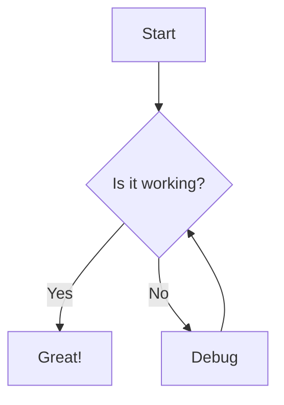

# Welcome to the Markdown Viewer

This is a test document to demonstrate the enhanced markdown viewer with editing capabilities.

## Features

### Text Formatting

You can use **bold text**, _italic text_, and `inline code`.

### Math Equations

Inline math: $E = mc^2$

Display math:

$$
\int_{-\infty}^{\infty} e^{-x^2} dx = \sqrt{\pi}
$$

### Code Blocks

```javascript
function hello() {
  console.log("Hello, world!");
}
```

### Mermaid Diagrams



### Lists

1. First item
2. Second item
   - Nested item
   - Another nested item
3. Third item

### Links and Images

[TypeAgent GitHub](https://github.com/microsoft/TypeAgent)

### Blockquotes

> This is a blockquote. It can contain multiple lines
> and will be rendered with special styling.

## Testing the Editor

Try editing this document directly in the left pane:

- Add new content
- Modify existing text
- Use the toolbar buttons
- Test the LLM integration by asking for changes

The preview should update automatically as you type!

---

_Happy editing!_ 🎉
