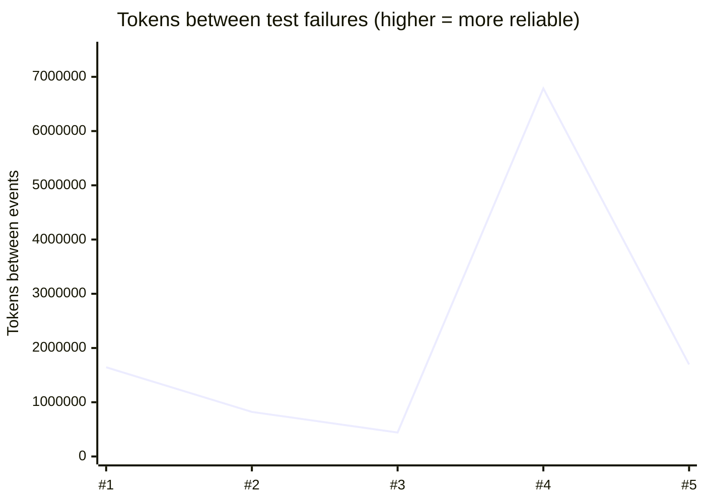
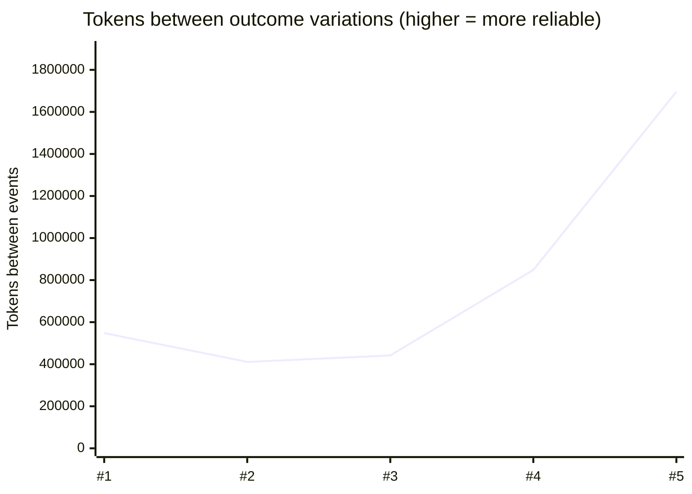

# Translation test reliability

Suite-wide reliability of the live translation-stability tests
(`packages/defaultAgentProvider/test/translate*.test.ts`), measured as the
**mean number of translation tokens between flaky failures, across all suites**
(MTTF-in-tokens; higher = more reliable).

Auto-generated by `reliability/report.ts` (compiled to
`dist/test/reliability/report.js`) - do not edit by hand.

## Latest run

- Generated: 2026-07-22T04:27:25.000Z
- Model: gpt-4.1 (repeat=5, post-fix)
- Suites: 9
- Attempts (all suites): 390
- Translation tokens (all suites): 1,696,140
- Mean tokens / attempt: 4,349

| Metric | Events | MTTF (tokens between) |
|---|--:|--:|
| Test failures (assertion red) | 0 | no events this run (≥ 1,696,140 tokens) |
| Outcome variations (model non-determinism) | 1 | 1,696,140 tokens |

## Reliability trend

Across the last 5 run(s) (of 5 recorded). Each
point is one suite run; higher MTTF-in-tokens = more reliable. GitHub renders
the charts inline; the table below carries the same data for other viewers.





| # | Generated | Model | Attempts | Failures | Variations | Tokens | MTTF failures | MTTF variations |
|--:|---|---|--:|--:|--:|--:|--:|--:|
| 1 | 2026-07-22T00:19:57.187Z | gpt-4.1 | 390 | 1 | 3 | 1,644,570 | 1,644,570 | 548,190 |
| 2 | 2026-07-22T00:27:59.609Z | gpt-4.1 | 390 | 2 | 4 | 1,643,751 | 821,876 | 410,938 |
| 3 | 2026-07-22T01:30:39.770Z | gpt-4.1 (repeat=20) | 1,560 | 15 | 15 | 6,624,856 | 441,657 | 441,657 |
| 4 | 2026-07-22T03:01:30.412Z | gpt-4.1 (repeat=20, post-fix) | 1,560 | 0 | 8 | 6,786,251 | ≥ 6,786,251 | 848,281 |
| 5 | 2026-07-22T04:27:25.000Z | gpt-4.1 (repeat=5, post-fix) | 390 | 0 | 1 | 1,696,140 | ≥ 1,696,140 | 1,696,140 |

## Per-suite (latest run)

| Suite | Attempts | Failures | Variations | Tokens |
|---|--:|--:|--:|--:|
| translate (no history) | 60 | 0 | 1 | 201,345 |
| translate (w/history) | 35 | 0 | 0 | 144,300 |
| translate (w/implicit lookup) | 50 | 0 | 0 | 275,965 |
| translate browser (w/history) | 40 | 0 | 0 | 0 |
| translate conversation | 5 | 0 | 0 | 30,790 |
| translate gate | 60 | 0 | 0 | 98,168 |
| translate image request (w/history) | 10 | 0 | 0 | 50,409 |
| translate mcp filesystem | 30 | 0 | 0 | 182,422 |
| translate player (w/history) | 100 | 0 | 0 | 712,741 |

## What the numbers mean

- **Test failures** are attempts where the assertion went red (the suite's real
  reliability - a flaky failure the CI would surface).
- **Outcome variations** are attempts whose action signature differed from the
  modal signature for the same request. This is the leading indicator of
  flakiness: it counts run-to-run model non-determinism even when the assertion
  tolerated it (e.g. an `anyof` clarify or a `duplicateOfPrevious` extra action).
- Only the LLM **translation** step's tokens are counted; grammar/cache-resolved
  attempts consume no translation tokens and are deterministic, so they neither
  add tokens nor cause flaky failures.
- When a run has zero events, MTTF is unbounded; the charts and `≥` cells use
  the run's token total as a lower bound.

## Regenerate

From `ts/`:

```powershell
$env:TRANSLATION_RELIABILITY_DIR = "$PWD/tmp/reliability"
Remove-Item $env:TRANSLATION_RELIABILITY_DIR -Recurse -Force -ErrorAction SilentlyContinue
pnpm --filter default-agent-provider build
Push-Location packages/defaultAgentProvider
pnpm run jest-esm --testPathPattern=translate --forceExit
Pop-Location
node packages/defaultAgentProvider/dist/test/reliability/report.js tmp/reliability packages/defaultAgentProvider/test/reliability/README.md <model>
Remove-Item Env:\TRANSLATION_RELIABILITY_DIR
```

Each run appends one point to `reliability/history.json` (kept in git) and
re-renders the charts above.
