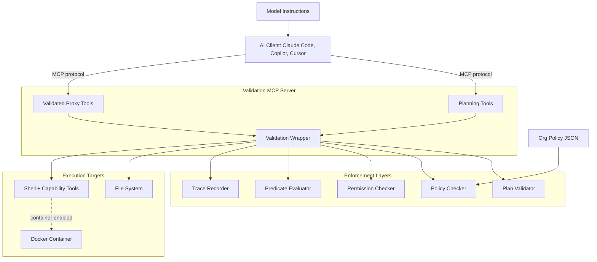
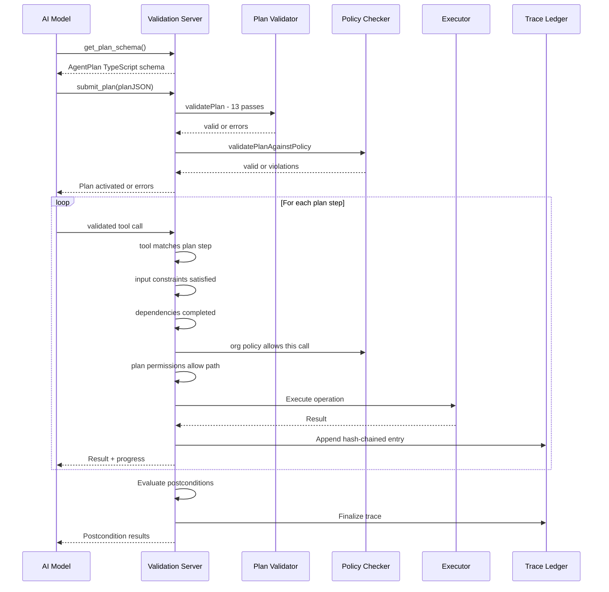
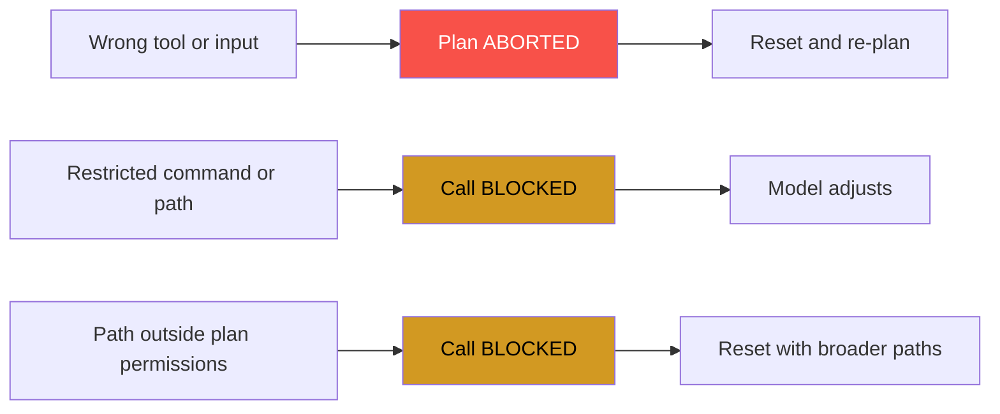
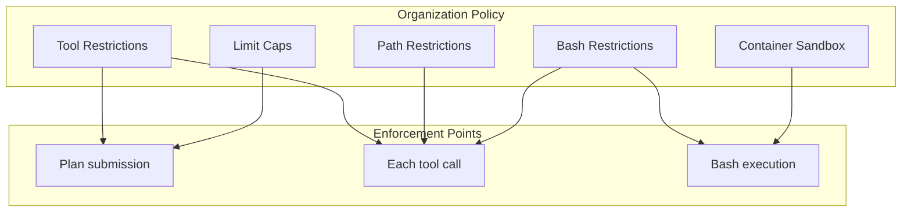
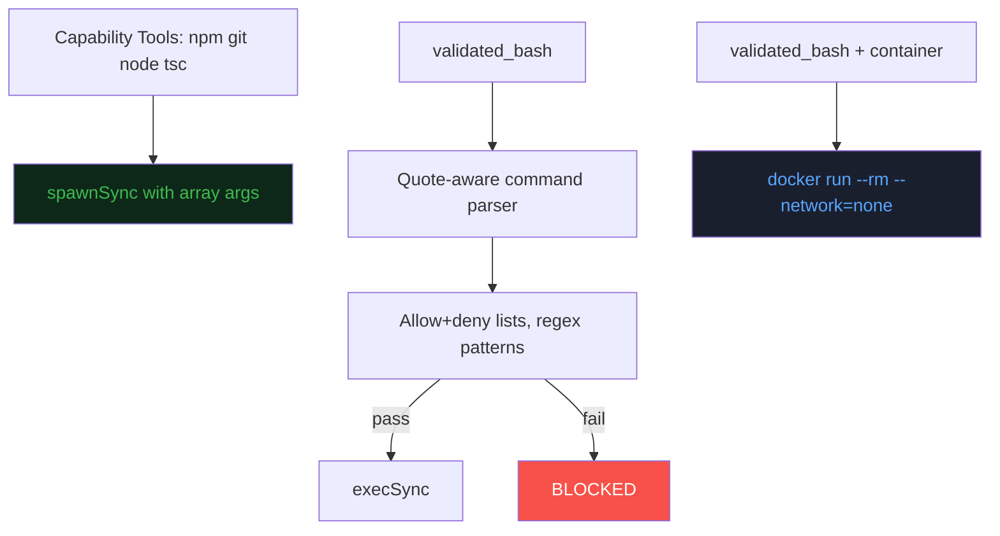
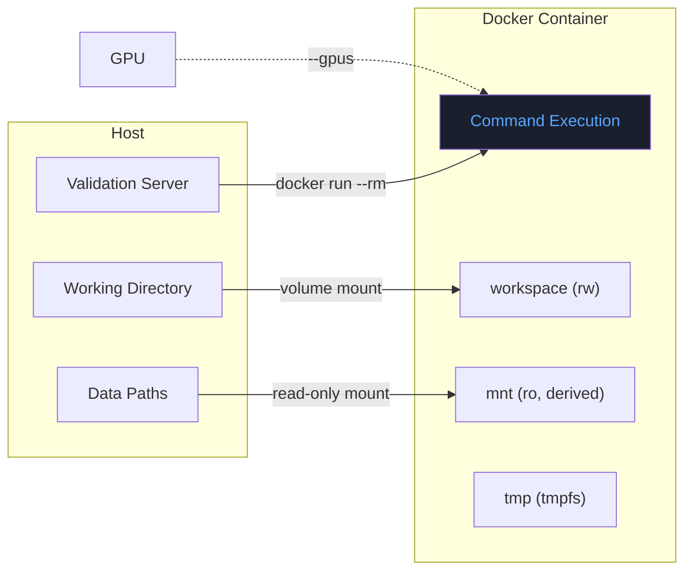
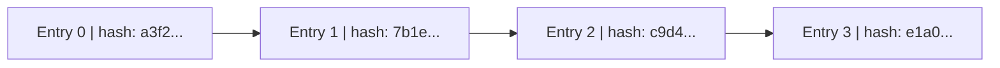
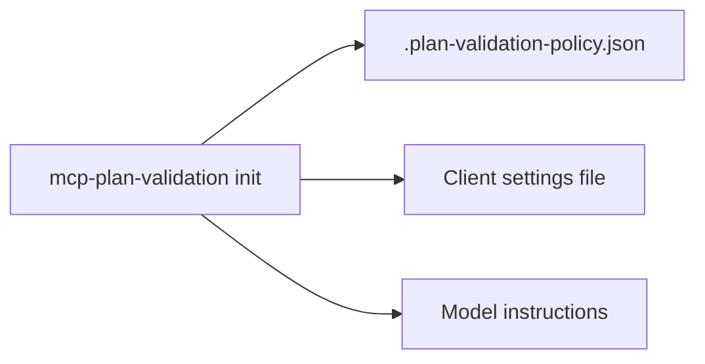

# Plan-Validated Agent Execution: Architecture Document

**Version 1.0 — April 2026**

---

## 1. Executive Summary

AI coding assistants (Claude Code, GitHub Copilot, Cursor) operate with broad, unrestricted access to codebases. Organizations need to enforce policy on what these agents can do — which files they can access, which commands they can run, and what outcomes they produce — without breaking the developer workflow.

This system introduces **plan-validated execution**: an architecture where every AI agent action passes through a validation layer that enforces both the agent's declared plan and the organization's external policy. The system is implemented as a Model Context Protocol (MCP) server that works with any MCP-capable AI client, requiring no modifications to the clients themselves.

**Key properties:**

- The AI declares intent before acting (plan)
- Every tool call is verified against the plan and org policy (enforcement)
- Outcomes are checked against declared postconditions (verification)
- A tamper-proof audit trail records everything (accountability)
- Organizations define policy externally, not the AI (separation of concerns)

---

## 2. System Architecture



The validation server sits between the AI client and the execution environment. The client communicates via the standard MCP protocol — no client modifications needed. The server intercepts every tool call, runs it through multiple enforcement layers, and only executes if all checks pass.

---

## 3. The Plan-Validate-Execute Pipeline

Every task follows a strict pipeline:



### Plan validation (13 passes)

When a plan is submitted, the validator runs these checks before any code is touched:

| Pass | What it checks                                                            |
| ---- | ------------------------------------------------------------------------- |
| 1    | Structural integrity (version, required fields)                           |
| 2    | Step index uniqueness and non-negativity                                  |
| 3    | Import resolution (for plan composition)                                  |
| 4    | Binding declarations (names, types, producer steps)                       |
| 5    | Precondition well-formedness                                              |
| 6    | Invariant well-formedness                                                 |
| 7    | Execution simulation (dependencies, input specs, effects, error handlers) |
| 8    | Postcondition well-formedness                                             |
| 9    | Cleanup step validation                                                   |
| 10   | Resource limits (declared vs. actual step count, nesting depth)           |
| 11   | Permission consistency (no overlap between allowed and denied paths)      |
| 12   | Checkpoint references                                                     |
| 13   | Metadata (all used tools listed in allowedTools)                          |

### Three failure modes

The system distinguishes between three kinds of failures, each with different severity and recovery:



**Plan violations** are the most severe — the model deviated from its own declared intent. The plan is aborted and must be rebuilt. **Policy violations** and **permission denials** are recoverable — the call is blocked but the plan continues, and the model can adjust.

---

## 4. Organization Policy Layer

The organization policy is the central mechanism for external control. It is defined in a JSON file, checked into version control, and loaded at server startup. **The AI cannot modify or override it.**



### Policy vs. plan permissions

This is a deliberate separation of concerns:

| Aspect                      | Organization Policy                    | Plan Permissions                   |
| --------------------------- | -------------------------------------- | ---------------------------------- |
| Who writes it               | Engineering leadership / security team | The AI model                       |
| When it's checked           | Plan submission + every tool call      | Every tool call                    |
| Can be overridden by model? | **No**                                 | Yes (by re-planning)               |
| Scope                       | Entire project / org                   | Single plan execution              |
| Purpose                     | "What the org allows"                  | "What this plan intends to access" |

The org policy sets the outer boundary. The plan permissions operate within that boundary.

---

## 5. Bash Sandboxing & Capability Tools

Arbitrary bash commands are the primary attack surface. The system provides three tiers of defense:



### Bash execution modes

| Mode                | validated_bash | Capability tools | Policy checks                |
| ------------------- | -------------- | ---------------- | ---------------------------- |
| `capabilities-only` | Blocked        | Available        | N/A for bash                 |
| `policy-checked`    | Allowed        | Available        | Command parsing + allow/deny |
| `unrestricted`      | Allowed        | Available        | None                         |

### The halting problem acknowledgment

Static analysis of bash commands (string matching, regex) **cannot determine what a command will do** — this is literally undecidable. `python -c "import socket; ..."` bypasses any command allowlist.

The system acknowledges this and provides **defense in depth**:

1. **Capability tools** eliminate the attack surface entirely for common operations
2. **Policy-checked bash** catches accidental/unintentional violations
3. **Container sandbox** provides kernel-level enforcement for when arbitrary bash is genuinely needed

---

## 6. Container Sandbox

When arbitrary code execution is required (ML training, data processing, script execution), the container sandbox provides OS-level isolation:



### Volume derivation from policy

Container mounts are **automatically derived** from the org policy's path restrictions:

- `allowedWritePatterns` base directories → read-write mounts
- `allowedReadPatterns` base directories → read-only mounts
- Working directory → always mounted at `/workspace`
- Subpath deduplication avoids redundant mounts

### Device and port policy

| Policy field                                             | Docker flag            | Use case             |
| -------------------------------------------------------- | ---------------------- | -------------------- |
| `devices.gpu: true`                                      | `--gpus all`           | ML training          |
| `devices.gpu: 2`                                         | `--gpus 2`             | Multi-GPU with limit |
| `devices.allowedDevices: ["/dev/video0"]`                | `--device /dev/video0` | Camera access        |
| `network.allowedPorts: [8080]` + `derivePortsFromPolicy` | `-p 8080:8080`         | Dev servers          |

---

## 7. Runtime Verification

### Postcondition evaluation

After the final plan step completes, the system evaluates declared postconditions. These are predicates expressed in a formal language:

**Supported predicate types (evaluated at runtime):**

| Category        | Predicates                                                                                  |
| --------------- | ------------------------------------------------------------------------------------------- |
| File existence  | `file_exists`, `file_not_exists`, `is_file`, `is_directory`                                 |
| File content    | `file_contains`, `file_not_contains`, `file_matches` (regex), `file_has_line`, `line_count` |
| File properties | `is_readable`, `is_writable`, `is_empty_file`, `file_size`                                  |
| State           | `binding_defined`, `step_completed`, `step_failed`                                          |
| Logic           | `and`, `or`, `not`, `implies`, `iff`                                                        |

**Reported but not evaluated (future work):**

| Category                                      | Why                                 |
| --------------------------------------------- | ----------------------------------- |
| Semantic (`function_exists`, `class_extends`) | Requires AST parsing                |
| Temporal (`always`, `eventually`)             | Requires execution history tracking |
| Comparison (`equals`, `greater_than`)         | Requires ValueExpr evaluation       |

### Path resolution

Postconditions reference paths via expressions. The evaluator resolves:

- `{ type: "literal", value: "/path/to/file" }` — direct path
- `{ type: "var", name: "cssFile" }` — resolved from runtime bindings
- `{ type: "join", parts: [...] }` — concatenated path segments
- `{ type: "parent" }`, `{ type: "basename" }`, `{ type: "extension" }` — path manipulation

Unresolvable paths (e.g., variables not in bindings) are reported as `unsupported`, not as failures.

---

## 8. Execution Trace & Audit

Every tool call produces a hash-chained trace entry:



Each entry contains:

| Field          | Description                                                                              |
| -------------- | ---------------------------------------------------------------------------------------- |
| `index`        | Sequential entry number                                                                  |
| `timestamp`    | When the step executed                                                                   |
| `previousHash` | SHA-256 hash of the previous entry (or zeros for first)                                  |
| `hash`         | SHA-256 of `{ previousHash, stepIndex, tool, input, output, durationMs, status, error }` |
| `stepIndex`    | Which plan step this corresponds to                                                      |
| `tool`         | Which tool was called                                                                    |
| `input`        | The tool's input parameters                                                              |
| `output`       | The tool's output (truncated)                                                            |
| `durationMs`   | Execution time                                                                           |
| `status`       | `success` or `failed`                                                                    |

### Integrity verification

The `plan_trace` tool re-computes every hash in the chain and reports `chainValid: true/false`. If any entry has been modified after recording, the chain breaks and the tampering is detected.

### Aggregate metrics

On trace finalization (plan completion or abort):

- `totalSteps`: number of entries
- `durationMs`: total execution time
- `successCount`: steps that succeeded
- `failedCount`: steps that failed

---

## 9. Deployment & Adoption

### One-command setup



### Client compatibility

| Client         | Settings file                 | Settings format                                 | Instructions                      |
| -------------- | ----------------------------- | ----------------------------------------------- | --------------------------------- |
| Claude Code    | `.claude/settings.local.json` | `{ mcpServers: { command, args } }`             | `CLAUDE.md`                       |
| GitHub Copilot | `.vscode/mcp.json`            | `{ servers: { type: "stdio", command, args } }` | `.github/copilot-instructions.md` |
| Cursor         | `.cursor/mcp.json`            | `{ mcpServers: { command, args } }`             | `.cursorrules`                    |

### Policy templates

| Template | Bash mode         | Network   | Container | Step limit |
| -------- | ----------------- | --------- | --------- | ---------- |
| `strict` | Capabilities only | None      | No        | 30         |
| `dev`    | Policy-checked    | Dev ports | Optional  | 50         |
| `ml`     | Policy-checked    | None      | Yes (GPU) | 100        |
| `ci`     | Policy-checked    | None      | Optional  | 20         |

### Distribution

The package bundles the `validation` library into self-contained dist files via `tsup`, eliminating the workspace dependency. After npm publish:

```bash
npx mcp-plan-validation init --client claude --policy dev
```

---

## 10. Limitations & Future Work

### Current limitations

| Limitation                                       | Impact                                                          | Mitigation                                                           |
| ------------------------------------------------ | --------------------------------------------------------------- | -------------------------------------------------------------------- |
| Bash string analysis is undecidable              | `python -c` can bypass command checks                           | Container sandbox provides kernel-level enforcement                  |
| Postconditions don't cover semantic predicates   | Can't verify "function exists" or "class extends"               | File-content predicates cover most cases; AST parsing is future work |
| No runtime invariant checking                    | Invariants are declared but not evaluated between steps         | Postconditions at the end partially address this                     |
| Container requires Docker                        | Not available in all environments                               | Capability tools work without Docker                                 |
| Policy enforcement is advisory for non-MCP tools | If model has access to raw tools alongside MCP, it could bypass | Configure client to only expose MCP tools                            |
| Trace output is truncated                        | Large file contents are cut to 500 chars                        | Sufficient for audit; full output available in bindings              |

### Planned improvements

| Item                     | Description                                                  | Priority |
| ------------------------ | ------------------------------------------------------------ | -------- |
| Effect verification      | Check that declared file creates/modifies actually happened  | High     |
| Metrics & observability  | Counters for plans, steps, violations; exportable dashboards | High     |
| WebFetch URL policy      | Allow/deny specific URLs, not just the tool as a whole       | Medium   |
| Execution trace export   | Export traces as JSON/CSV for compliance tooling             | Medium   |
| VS Code extension        | Visual plan status, violations panel, postcondition results  | Medium   |
| GitHub Action            | Run plans in CI, post results as PR comments                 | Medium   |
| Plan templates           | Reusable plans for common tasks via CallNode/imports         | Low      |
| Multi-agent coordination | ResourceLock and ConflictCheck enforcement                   | Low      |

---

## Appendix A: File Map

```
tools/
├── validation/                    # Core library (no MCP dependency)
│   └── src/
│       ├── specSchema.ts          # AgentPlan DSL: types for plans, predicates, effects
│       ├── planValidator.ts       # 13-pass static plan validator
│       ├── orgPolicy.ts           # Org policy types, bash parsing, container config
│       ├── predicateEvaluator.ts  # Runtime postcondition evaluation
│       └── index.ts               # Export barrel
│
└── mcpValidation/                 # MCP server + CLI + dashboard
    ├── src/
    │   ├── server.ts              # MCP server: 15 tools, validation wrapper
    │   ├── planState.ts           # Runtime state + hash-chained trace
    │   ├── executor.ts            # File/shell/container executors
    │   ├── init.ts                # Project scaffolding (multi-client)
    │   └── cli.ts                 # CLI dispatcher
    ├── demo/
    │   ├── dashboard.html         # Live monitoring dashboard
    │   └── run-demo.ts            # Self-contained demo scenario
    ├── policies/                  # strict, dev, ml, ci templates
    └── templates/                 # Model instruction templates
```

## Appendix B: Test Coverage

| Test                      | Type        | Assertions | What it verifies                       |
| ------------------------- | ----------- | ---------- | -------------------------------------- |
| Happy Path                | Integration | —          | Full plan-execute cycle                |
| Block Detection           | Integration | —          | Wrong tool caught                      |
| Input Constraints         | Integration | —          | Mismatched inputs caught               |
| Policy Unit               | Unit        | 39         | Bash parsing, command/path/tool policy |
| Policy Integration        | Integration | —          | Org policy blocks curl                 |
| Postconditions Unit       | Unit        | 38         | Predicate evaluation, path resolution  |
| Postcondition Integration | Integration | —          | Postconditions checked                 |
| Capability Tools          | Unit        | 9          | Capabilities-only mode, tool mapping   |
| Container Sandbox         | Unit        | 25         | Volume/port/device/arg derivation      |

**Total: 111 unit assertions + 5 integration scenarios**
